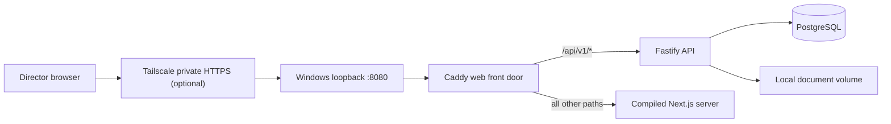
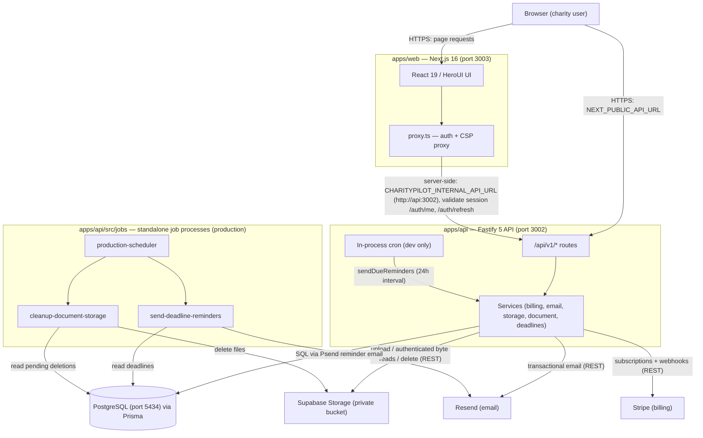

# CharityPilot Architecture Map

CharityPilot is a commercial SaaS that digitises the Irish Charities Regulator (CRA)
Governance Code Compliance Record Form and its supporting governance registers. It is a
[Turborepo](https://turbo.build/) monorepo of three workspaces — a Fastify 5 REST API
(`apps/api`), a Next.js 16 web app (`apps/web`), and a shared Zod-schema/types package
(`packages/shared`) — backed by PostgreSQL (via Prisma) and a small set of external
providers (Supabase Storage, Stripe, Resend).

This document is the **entry point** to the architecture map. Each section below is a
focused, source-grounded reference under [`docs/architecture/`](architecture/). Every
non-trivial claim in those documents carries a `file:line` citation and was
independently fact-checked; the diagrams are GitHub-renderable Mermaid.

> **Verification:** the base map was written and mechanically fact-checked against
> commit `7fcd404` on 2026-06-20. Security-remediation sections have changed since
> that snapshot; current behavior is described in the linked lifecycle, billing,
> and storage references, but old line-number citations can drift. Re-run the
> documentation checks for the final release ref before treating every citation as
> release evidence.

## Deployment profiles and the Windows web server

The repository has three deliberately separate operating paths:

| Profile | Purpose | Front door | Runtime behavior |
| --- | --- | --- | --- |
| Local development | Source editing and disposable local testing | Direct loopback development ports | `next dev`, `tsx watch`, source mounts, migrations/seeding in the local Compose flow |
| Personal server | One charity on a trusted Windows computer | **Caddy** on loopback, optionally reached through private Tailscale Serve HTTPS | Compiled Next.js and Fastify images, persistent PostgreSQL/documents, no routine migration or seed, no public providers |
| Public production | Future hosted commercial service | Production TLS/hosting boundary | Canonical public origins, managed providers, release evidence and the full launch gate |

Windows itself is not the application web server and IIS is not used. In the
personal-server profile, Docker Desktop/WSL 2 runs Caddy, Next.js, Fastify and
PostgreSQL. Caddy is the sole published front door:

For local-only use the exact browser origin may be
`http://localhost:8080`. Remote directors use one exact private HTTPS origin;
Tailscale terminates HTTPS and proxies only to Caddy's loopback port. The
fixed bridge pins Caddy's Docker gateway and API addresses: Caddy trusts
forwarded scheme/client headers only from the exact gateway, while Fastify
trusts only Caddy. The configured private origin remains authoritative for
Next.js redirects, CSP and server-side refresh requests across that HTTP hop.
The database, API and Next.js ports are not published. See
[Personal Server Deployment on Windows](personal-server-deployment.md) for the
complete operating and recovery contract.

## Component diagram

_The full narrative for this diagram — workspaces, ports, integrations and the jobs
path — is in [System Overview](architecture/01-system-overview.md)._

## The map

| # | Document | What it covers |
|---|---|---|
| 1 | [System Overview](architecture/01-system-overview.md) | Workspaces, runtime topology and ports, how the web app reaches the API, external integrations, the scheduled-jobs path, and the component diagram. |
| 2 | [Module & Dependency Graph](architecture/02-module-dependency-graph.md) | The 12 route groups → 16 services → 22 Prisma models, per-group endpoint/service/model/guard table, the `@charitypilot/shared` boundary, and cross-module coupling. |
| 3 | [Data Model Reference](architecture/03-data-model.md) | All 22 Prisma models, key fields, relations, enums, the `organisationId` tenant-isolation pattern, composite unique constraints, indexes and cascade behaviour. |
| 4 | [Request Lifecycle, Middleware & Auth](architecture/04-request-lifecycle.md) | The Fastify plugin/middleware pipeline in order, and the auth/session model (cookie JWT access token + hashed rotating refresh sessions). |
| 5 | [Billing & Subscription Flow](architecture/05-billing.md) | Stripe tiers and price IDs, checkout/portal, webhook handling and idempotency, the subscription status model, and feature gating. |
| 6 | [Document Storage Flow](architecture/06-document-storage.md) | Supabase private bucket vs local filesystem driver, authenticated proxy downloads, and the deletion-reconciliation model. |
| 7 | [Reminder Scheduler & Jobs](architecture/07-reminder-scheduler.md) | In-process cron vs standalone jobs, the reminder logic, catch-up on missed runs, dedup keying and at-least-once semantics. |
| 8 | [Governance Domain Model](architecture/08-governance-domain.md) | Principles → standards → compliance records → sign-off, plus the conflict/risk/complaint/fundraising/annual-report/financial-control registers. |
| 9 | [Frontend Architecture](architecture/09-frontend.md) | App-router route groups, the API client and same-origin proxy, auth/session handling and single-flight refresh, and client-side plan gating. |
| 10 | [Configuration, Environment & the Two-Gate Model](architecture/10-config-and-env.md) | The full env-var surface, what `validateProductionEnv` enforces, and the code-gate vs launch-gate model. |

Security-sensitive operator references:

- [Team Lifecycle and Session Security](team-lifecycle-security.md)
- [Restricted Team Ownership Recovery](team-ownership-recovery.md)
- [Restricted Billing Authority Reconciliation](billing-authority-reconciliation.md)

> **Dependency inventory:** [`docs/DEPENDENCIES.md`](DEPENDENCIES.md) lists the
> production dependencies per workspace and the rationale behind each `overrides`
> security pin.

## Running the stack and the tests

- **Local stack (one command):** `docker compose -f compose.yml -f compose.local.yml up`
  boots PostgreSQL + API + web, applies migrations, and seeds a local admin. See the
  [README](../README.md#local-development) for the seeded credentials and direct-run
  option.
- **Unit tests** (Node's built-in `node:test`, compiled first): `npx turbo test`.
- **Local Docker smoke** (boots the real stack and exercises auth + document
  upload/download): `npm run test:local-docker:smoke`.
- **End-to-end browser tests** (Playwright against a runner-owned standalone
  stack whose internal-only app/database services are exposed through one
  minimal secretless loopback TCP gateway, never the persistent development
  database): see
  [`e2e/README.md`](../e2e/README.md) and `npm run test:e2e`.

## The two-gate model

CharityPilot separates a self-contained **code gate** from an external **launch gate**:

- **Gate 1 — code gate (in this repo, fully automated):** `npm run lint`, `npx turbo test`,
  `npm run build`, `npm audit --omit=dev`, and the Docker smoke in
  [`.github/workflows/ci.yml`](../.github/workflows/ci.yml). This is what every commit on
  a branch keeps green.
- **Gate 2 — launch gate (external, not code):** real domains, provider accounts, secrets,
  hosting, legal sign-off and an external pentest. This is **out of scope for the codebase**
  and is documented — not duplicated — in [`docs/LAUNCH-GUIDE.md`](LAUNCH-GUIDE.md) and the
  [`docs/production-runbook.md`](production-runbook.md).

See [Configuration, Environment & the Two-Gate Model](architecture/10-config-and-env.md)
for the full breakdown.
