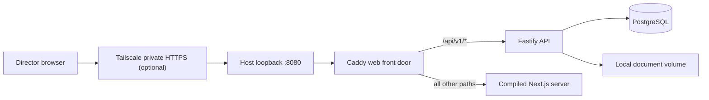
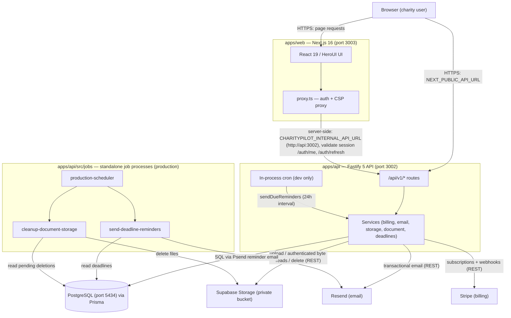

# CharityPilot Architecture Map

CharityPilot is a commercial SaaS that digitises the Irish Charities Regulator (CRA)
Governance Code Compliance Record Form and its supporting governance registers. It is a
[Turborepo](https://turbo.build/) monorepo of three workspaces — a Fastify 5 REST API
(`apps/api`), a Next.js 16 web app (`apps/web`), and a shared Zod-schema/types package
(`packages/shared`) — backed by PostgreSQL (via Prisma) and a small set of external
providers (Supabase Storage, Stripe, Resend).

This document is the **entry point** to the architecture map. Each section below is a
focused, source-grounded reference under [`docs/architecture/`](architecture/). Every
non-trivial claim in those documents carries a `file:line` citation and was
independently fact-checked; the diagrams are GitHub-renderable Mermaid.

> **Verification:** the map was rechecked for top-level topology, dependency,
> route-group, model-count and deployment-profile drift on 2026-07-12. Detailed
> source line citations originated in the 2026-06-20 architecture pass and can
> move as implementation changes; revalidate citations against the final release
> ref before treating them as release evidence.

## Deployment profiles and the web server

The repository has three deliberately separate operating paths:

| Profile | Purpose | Front door | Runtime behavior |
| --- | --- | --- | --- |
| Local development | Source editing and disposable local testing | Direct loopback development ports | `next dev`, `tsx watch`, source mounts, migrations/seeding in the local Compose flow |
| Personal server | One charity on a trusted Windows or supervised x86-64 Linux host | **Caddy** on loopback, optionally reached through private Tailscale Serve HTTPS | Compiled Next.js and Fastify images, persistent PostgreSQL/documents, no routine migration or seed, no public providers |
| Public production | Future hosted commercial service | Production TLS/hosting boundary | Canonical public origins, managed providers, release evidence and the full launch gate |

The host operating system is not the application web server: IIS, Apache and
nginx are not used. Docker Desktop/WSL 2 on Windows or native Docker Engine on
Linux runs Caddy, Next.js, Fastify and PostgreSQL. Caddy is the sole published
front door:


```mermaid
flowchart LR
    Browser["Director browser"] --> Tail["Tailscale private HTTPS (optional)"]
    Tail --> Loopback["Host loopback :8080"]
    Loopback --> Caddy["Caddy web front door"]
    Caddy -->|"/api/v1/*"| Fastify["Fastify API"]
    Caddy -->|"all other paths"| Next["Compiled Next.js server"]
    Fastify --> Postgres[("PostgreSQL")]
    Fastify --> Documents["Local document volume"]
```

For local-only use the exact browser origin may be
`http://localhost:8080`. Remote directors use one exact private HTTPS origin;
Tailscale terminates HTTPS and proxies only to Caddy's loopback port. The
two fixed bridges keep trust explicit: Caddy alone joins the non-internal edge
bridge, while Fastify remains on the internal bridge and trusts only Caddy's
exact `172.30.250.10` address. Caddy deliberately trusts no incoming
`X-Forwarded-*` values because local loopback and Tailscale Serve share the same
Docker gateway; its reverse proxy replaces those values instead of allowing a
local process to spoof a client address. Caddy's host port is still bound
only to loopback. The configured private origin remains authoritative for
Next.js redirects, CSP and server-side refresh requests across that HTTP hop.
The database, API and Next.js ports are not published. See
[Personal Server Deployment on Windows](personal-server-deployment.md) or
[Private Personal Server on Linux](personal-server-deployment-linux.md) for the
host-specific operating and recovery contract. Linux remains supervised testing
until the live gates in the readiness scorecard pass.

## Component diagram


```mermaid
flowchart TD
    Browser["Browser (charity user)"]

    subgraph web["apps/web — Next.js 16 (port 3003)"]
        WebUI["React 19 / HeroUI UI"]
        Proxy["proxy.ts — auth + CSP proxy"]
    end

    subgraph api["apps/api — Fastify 5 API (port 3002)"]
        Routes["/api/v1/* routes"]
        Services["Services (billing, email, storage, document, deadlines)"]
        Cron["In-process cron (dev only)"]
    end

    subgraph jobs["apps/api/src/jobs — standalone job processes (production)"]
        Sched["production-scheduler"]
        DeadlineJob["send-deadline-reminders"]
        CleanupJob["cleanup-document-storage"]
    end

    DB[("PostgreSQL (port 5434) via Prisma")]
    Supabase["Supabase Storage (private bucket)"]
    Stripe["Stripe (billing)"]
    Resend["Resend (email)"]

    Browser -->|"HTTPS: NEXT_PUBLIC_API_URL"| Routes
    Browser -->|"HTTPS: page requests"| WebUI
    WebUI --> Proxy
    Proxy -->|"server-side: CHARITYPILOT_INTERNAL_API_URL (http://api:3002), validate session /auth/me, /auth/refresh"| Routes

    Routes --> Services
    Services -->|"SQL via Prisma client"| DB
    Services -->|"upload / authenticated byte reads / delete (REST)"| Supabase
    Services -->|"subscriptions + webhooks (REST)"| Stripe
    Services -->|"transactional email (REST)"| Resend

    Cron -->|"sendDueReminders (24h interval)"| Services
    Sched --> DeadlineJob
    Sched --> CleanupJob
    DeadlineJob -->|"read deadlines"| DB
    DeadlineJob -->|"send reminder email"| Resend
    CleanupJob -->|"read pending deletions"| DB
    CleanupJob -->|"delete files"| Supabase
```

_The full narrative for this diagram — workspaces, ports, integrations and the jobs
path — is in [System Overview](architecture/01-system-overview.md)._

## The map

| # | Document | What it covers |
|---|---|---|
| 1 | [System Overview](architecture/01-system-overview.md) | Workspaces, runtime topology and ports, how the web app reaches the API, external integrations, the scheduled-jobs path, and the component diagram. |
| 2 | [Module & Dependency Graph](architecture/02-module-dependency-graph.md) | The 12 route groups and their service/model/guard dependencies, the `@charitypilot/shared` boundary, and cross-module coupling. |
| 3 | [Data Model Reference](architecture/03-data-model.md) | All 33 Prisma models and 39 enums, key fields, relations, the `organisationId` tenant-isolation pattern, composite unique constraints, indexes and cascade behaviour. |
| 4 | [Request Lifecycle, Middleware & Auth](architecture/04-request-lifecycle.md) | The Fastify plugin/middleware pipeline in order, and the auth/session model (cookie JWT access token + hashed rotating refresh sessions). |
| 5 | [Billing & Subscription Flow](architecture/05-billing.md) | Stripe tiers and price IDs, checkout/portal, webhook handling and idempotency, the subscription status model, and feature gating. |
| 6 | [Document Storage Flow](architecture/06-document-storage.md) | Supabase private bucket vs local filesystem driver, authenticated proxy downloads, and the deletion-reconciliation model. |
| 7 | [Reminder Scheduler & Jobs](architecture/07-reminder-scheduler.md) | In-process cron vs standalone jobs, the reminder logic, catch-up on missed runs, dedup keying and at-least-once semantics. |
| 8 | [Governance Domain Model](architecture/08-governance-domain.md) | Principles → standards → compliance records → sign-off, plus the conflict/risk/complaint/fundraising/annual-report/financial-control registers. |
| 9 | [Frontend Architecture](architecture/09-frontend.md) | App-router route groups, the API client and same-origin proxy, auth/session handling and single-flight refresh, and client-side plan gating. |
| 10 | [Configuration, Environment & the Two-Gate Model](architecture/10-config-and-env.md) | The full env-var surface, what `validateProductionEnv` enforces, and the code-gate vs launch-gate model. |

### Document storage providers

Document storage is chosen per organisation, not per process.

- `apps/api/src/services/document-storage-provider.ts` is the registry: the
  single source of truth for which providers exist and what stage each is at
  (`ga` or `alpha`).
- `apps/api/src/services/document-storage-resolution.ts` turns an organisation
  id into a provider id, falling back to `DOCUMENT_STORAGE_DRIVER` when the
  organisation has recorded no preference.
- `Organisation.documentStorageProvider` (nullable) holds the preference;
  `Organisation.documentStorageAlphaOptIn` gates alpha-stage providers.

An alpha provider can only be selected by an organisation that has explicitly
opted in, and can never be the deployment default. This is the mechanism that
keeps in-progress integrations off tenants who have not asked for them — see
`docs/superpowers/plans/2026-09-18-document-storage-providers-spec.md`.

**Changing an organisation's provider strands its existing documents.** Nothing
writes `documentStorageProvider` yet, but once something does, flipping it on an
organisation that already holds documents points every later download and delete
at the new provider while the bytes still sit in the old one — silent 404s, and
worse, deletions that report success against a store that never held the object,
in a product whose deletion pipeline exists precisely because erasure has to be
provable. The real fix is a per-document provider stamp so each object is read
and erased from wherever it was actually written; that lands in Phase 3 of
`docs/superpowers/plans/2026-09-18-document-storage-providers-spec.md`, and until
it does, a provider change on an organisation with documents is not a supported
operation.

The global health probe (`routes/health`) deliberately reports on the
deployment default only. Per-tenant integration health is a later phase. That
leaves a known gap: the probe builds `new StorageService()` with no resolver, so
it never touches the `Organisation` storage columns — a deployment that shipped
this code but skipped the migration would pass its own readiness gate while
every document path failed on the missing columns. Deciding which organisation a
readiness probe should resolve for is a Phase 6 question, so the mitigation for
now is the migration gate in the deploy pipeline, not the health endpoint.

If the resolver itself fails — for example a database error while looking up
an organisation's preference — `StorageService` surfaces that as `AppError`
500 `STORAGE_PROVIDER_RESOLUTION_FAILED` rather than leaking the raw error;
the alpha-gate and unknown-provider errors from the registry are deliberate
`AppError`s and still pass through unchanged.

**The production local-provider gate applies to writes only.**
`assertProviderPermittedByDeployment` (in `document-storage-resolution.ts`)
refuses a per-organisation `'local'` provider on a production deployment
whose own default is not `'local'` — but only when
`resolveProviderForOrganisation` is called with `{ operation: 'write' }`
(the default when no options are passed, so every unqualified call site stays
strict). `'read'` and `'delete'` skip the gate. The gate exists to stop a
production deployment writing bytes to an unvalidated, ephemeral,
un-backed-up local path; once bytes exist there, refusing to read or delete
them strands them, which is strictly worse, and for delete it breaks the
provable-erasure guarantee the document-deletion pipeline (retry,
dead-letter, recovery ledger) exists to uphold. `StorageService.providerFor`
passes the operation through: `uploadFile` → `'write'`, `downloadFile` →
`'read'`, `deleteFile` → `'delete'`.

This split matters because "production" is not decided consistently across
the codebase: `apps/api/src/jobs/cleanup-document-storage.ts` and
`apps/api/src/jobs/production-scheduler.ts` both default
`process.env.NODE_ENV ??= 'production'` at module load, while the web
process never sets `NODE_ENV` at all. On a dev or staging deployment with a
Supabase default, that mismatch used to mean an organisation pinned to
`'local'` could upload successfully through the web route and then have its
deletion refused by the cleanup job, stalling reconciliation on a document
the same deployment had just written. Gating only the write path removes the
inconsistency instead of requiring the two processes to agree on
`NODE_ENV`.

### Integration credentials: the envelope, the boundary, and rotation

Third-party credentials — today an Atlassian OAuth refresh token for a charity's
own Confluence site, later an accounting integration's — are held encrypted at
rest. Three pieces:

- `apps/api/src/services/integration-crypto.ts` — the crypto boundary: seal,
  open, key decode, key fingerprint. Pure; no Prisma, no environment reads.
- `apps/api/src/services/integration-credential.service.ts` — stores and loads a
  tenant's credentials through that boundary.
- `OrganisationIntegration`, `IntegrationCredential` and the single-row
  `IntegrationSecretControl` in `apps/api/prisma/schema.prisma`.

**A plaintext secret never leaves the crypto boundary.** It is not logged, not
interpolated into an error message, not attached as an error `cause`, and never
stored unsealed. Errors about sealed material carry a key *fingerprint* — a
domain-separated SHA-256 of the key — never the material.

#### The envelope

`sealIntegrationSecret` produces AES-256-GCM:

```
{ generation: number, iv: string, tag: string, ciphertext: string }
```

written to the `sealed` JSON column, with `generation` also denormalised into
its own column so a rotation can find stale rows without opening a single one.
`iv` is 12 fresh random bytes per seal, so the same plaintext sealed twice
yields different ciphertext. `tag` is the 16-byte GCM authentication tag, so a
tampered row fails loudly instead of decrypting to garbage.

#### Why the AAD binding exists

GCM's tag authenticates *modification*. It says nothing about *where a
ciphertext is allowed to live*. With one process-wide key and no additional
authenticated data, every envelope is portable: a ciphertext copied from one
charity's row into another's — by a bug, a bad backfill, or direct database
write access — decrypts cleanly under the thief's identity. For a table whose
rows are Irish charities' OAuth refresh tokens for their own Atlassian sites,
that is the whole risk.

So every seal and every open is bound to a `SecretContext` of
`{ organisationId, provider, kind }` plus the envelope's `generation`, passed to
GCM as AAD. Change any one of them and the open fails closed. The fields are
netstring-framed (`<byte length>:<value>`) so the encoding is injective: a naive
join on a separator character would let `("a:b", "c")` collide with
`("a", "b:c")`.

**The context is derived from the database row, never from the caller.**
`organisationId` and `provider` are read off the `OrganisationIntegration` row
the credential hangs off; only `kind` comes from the caller, and it is the same
value that addresses the credential row, so it cannot disagree with where the
envelope is stored. There is deliberately no override parameter — accepting a
caller-supplied organisation would re-create exactly the vulnerability the
binding exists to prevent.

#### The authorization boundary — read this before adding a route

**This layer binds. It does not authorize.**

The context lookup is by `integrationId` alone and is *not* scoped to a
requesting organisation. So when a caller passes another charity's
`integrationId`, the context is derived from *that charity's own row*, the
decrypt succeeds, and their refresh token is handed back. That is not a defect
in the binding; it is the consequence of deriving the context honestly rather
than from an argument.

> **A route must independently prove that the requesting organisation owns the
> `integrationId` it passes. Nothing in the credential service checks that.**

Concretely: scope the query that produced the `integrationId` to the
authenticated organisation (`where: { id, organisationId }`), or verify
ownership explicitly, before calling `storeIntegrationCredential` or
`loadIntegrationCredential`. The binding's job is to make a *stolen row*
useless. Keeping a *legitimate request* inside its own tenant is the route's
job, exactly as it is for every other `organisationId`-scoped query here.

#### Error taxonomy — what each code tells an operator

| Code | What happened | What to do |
|---|---|---|
| `INTEGRATION_NOT_FOUND` (404) | No `OrganisationIntegration` row for that id. | Caller bug, or the integration was deleted. Nothing was sealed or opened. |
| `INTEGRATION_KEY_MISSING` (500) | `INTEGRATION_ENCRYPTION_KEY` is unset. | Configuration, not data. Set it. Nothing is damaged. |
| `INTEGRATION_KEY_INVALID` (500) | The configured value does not canonically decode to exactly 32 bytes. | Configuration. Fix the value. Nothing is damaged. |
| `INTEGRATION_KEY_MISMATCH` (500) | The configured key's fingerprint disagrees with the one this installation recorded. | **The stored credentials are intact.** Restore the correct key. **Do not ask charities to reconnect** — a re-store upserts, and would overwrite recoverable envelopes irreversibly. |
| `INTEGRATION_SECRET_UNREADABLE` (500) | GCM authentication failed. | Three causes today: a wrong key on an installation that has not recorded a fingerprint yet; a context that does not match what was sealed (a row in the wrong tenant, provider or kind); or genuine corruption or tampering. Rule out a wrong key *first* — do not treat this as corruption by default. A rotation adds a fourth cause; see the trap below. |
| `INTEGRATION_SECRET_MALFORMED` (500) | The stored `sealed` column is not an envelope at all — null, a string, a half-written object. | Deliberately distinct from `UNREADABLE`: "not an envelope" rather than "an envelope that would not authenticate", and the two call for different investigations. Look at the backfill or direct write that produced the row. |
| `INTEGRATION_SECRET_CONTEXT_INVALID`, `INTEGRATION_SECRET_GENERATION_INVALID`, `INTEGRATION_SECRET_PLAINTEXT_REQUIRED` (500) | A caller passed something the boundary refuses. | Programming errors, never data problems. They exist so a bad argument cannot be misreported as a corrupt credential. |

#### Rotation, and the bootstrap fingerprint

`IntegrationSecretControl` is a single row (`id: 1`) carrying `generation`,
`activeKeyFingerprint`, `retiredKeyFingerprint` and `rotatedAt`. New envelopes
seal under the active generation; an installation that has never rotated has no
row and is generation 1 by definition. `countCredentialsAwaitingRotation` counts
rows below the active generation off the denormalised column, decrypting
nothing.

The first successful store on an installation with no recorded fingerprint
records the fingerprint of the key that just sealed — the moment that claim is
definitionally true. **That write and the credential write are one
transaction.** They describe each other, and an installation left holding a
sealed envelope with no recorded fingerprint has a permanently inert mismatch
check for precisely the installation that has just acquired something to lose:
a later store under a wrong key would record the *wrong* fingerprint and upsert
straight over the recoverable envelope.

#### The rotation trap — read this before writing the rotation job

**The moment a rotation flips `IntegrationSecretControl.generation` and records
the new key's fingerprint, every credential that has not yet been re-sealed
fails as `INTEGRATION_SECRET_UNREADABLE`.**

The fingerprint check passes — the configured key matches the newly recorded
fingerprint, so nothing objects — and *then* AES-GCM fails on every
generation-N row, because `generation` is part of the AAD and no longer matches
what those rows were sealed with. The operator sees "every credential is
corrupt", for every charity at once. That is verbatim the failure mode the
fingerprint check was added to prevent, resurfacing one phase later, carrying
the same destructive temptation: asking charities to reconnect, which upserts
over envelopes that were perfectly recoverable.

Two defences. A rotation job must carry at least the first, and should be built
on the second:

- **Cheap, and strictly a diagnostic.** Before opening, compare
  `sealed.generation` with the active generation and raise a distinct code —
  `INTEGRATION_SECRET_GENERATION_STALE` — instead of letting authentication
  fail. It does not make the credential readable. It does stop the failure
  masquerading as corruption, and it tells the operator to finish the rotation
  rather than to wipe the table.
- **Correct, and what the schema is already shaped for.** Resolve the key *by
  the envelope's own generation* rather than by "whichever one is active". Keep
  the retired key available alongside the active one (`retiredKeyFingerprint`
  exists for this), open a generation-N row with the generation-N key, and
  re-seal it under the active one. Rotation then becomes an online operation
  with no window at all, instead of a flag-flip that breaks every un-re-sealed
  row until a background job catches up.

**Documented, not implemented.** There is nothing to rotate yet and the rotation
job is a later phase. Build one of these *before* that job runs, not after.

#### `INTEGRATION_ENCRYPTION_KEY` is required on the standard production path only — deliberately

`validateProductionEnv` (`apps/api/src/utils/env.ts`) requires it: present,
canonically exactly 32 bytes as hex or unpadded base64url, and distinct from
`JWT_SECRET`, `OWNER_JWT_SECRET`, `AUTH_RECOVERY_SECRET` and
`READINESS_API_KEY`.

`validatePersonalServerEnv` (`apps/api/src/utils/personal-server-env.ts`) does
**not** require it, and `validateRuntimeEnv` returns after calling it for a
personal-server/appliance deployment, so the standard validator never runs
there. An appliance runs with `NODE_ENV=production`, so the constraint
"required in production" is enforced on one of the two production branches.

**The asymmetry is deliberate.** Adding the requirement to the appliance branch
would fail the boot of every existing appliance install on upgrade — for a key
that nothing reads yet, since no integration can be connected until the connect
flow ships. Breaking running installs of a charity's own governance server, to
enforce a constraint with no current consumer, is the worse trade.

**The obligation this creates, owed by the phase that ships the connect flow:**
the connect route must refuse to begin an OAuth flow — on *every* deployment,
appliance included — when `INTEGRATION_ENCRYPTION_KEY` is absent or does not
decode, and must say so plainly enough for an operator to act. Gating the
*feature* on the key rather than the *boot* breaks no appliance on upgrade,
while making it impossible to reach a state where a credential is about to be
sealed under a missing key. Until then, an appliance operator who wants to be
ready can set the key now (`openssl rand -hex 32`, distinct from every other
secret); nothing on the appliance consumes it yet, and once something does it
must never be regenerated — see `docs/production-runbook.md`.

**That obligation is now discharged.** `connectRefusal()` in
`apps/api/src/routes/integrations/index.ts` refuses `authorize` and `callback`
with a 503 `INTEGRATION_ENCRYPTION_KEY_MISSING` / `_INVALID` naming the variable
and the command to generate it, on every deployment profile, and decodes the key
rather than merely testing presence. `DELETE /confluence` is deliberately *not*
gated: revoking access must keep working on a server that has lost the key, and
`disconnectConfluence` deletes sealed envelopes without opening any.

#### The Atlassian OAuth client is validated when configured, never required

`ATLASSIAN_CLIENT_ID` and `ATLASSIAN_CLIENT_SECRET` are **not** required
production variables, on any deployment profile. This follows the same trade as
above, in the same direction: a CharityPilot deployment whose charities do not
use Confluence has no reason to register an Atlassian app, and making the
credentials a boot requirement would fail the boot of every running production
deployment on upgrade for a value nothing reads. **The feature is gated, not the
boot** — `connectRefusal()` returns a 503
`ATLASSIAN_OAUTH_CLIENT_NOT_CONFIGURED` naming both variables.

What `requireAtlassianOAuthClient` (`apps/api/src/utils/env.ts`) does enforce is
that a *partial* client cannot boot, because half a client is worse than none.
Its reach is the standard production path — `validateRuntimeEnv` returns after
`validatePersonalServerEnv` on the appliance branch, so an appliance never runs
it, exactly as for `INTEGRATION_ENCRYPTION_KEY` above; on an appliance the 503
is the whole of the protection. The rules:

- neither set — Confluence is not enabled here. No issue.
- exactly one set — an issue. Nobody chooses this; it is a slip.
- both set — neither may be a placeholder, and the secret must be distinct from
  the client id and from `JWT_SECRET`, `OWNER_JWT_SECRET`,
  `AUTH_RECOVERY_SECRET`, `READINESS_API_KEY` and `INTEGRATION_ENCRYPTION_KEY`.

Presence is tested on the raw value, *not* through `isConfiguredSecret`, so a
`REPLACE_ME_` value counts as **set**. If it counted as unset, a half-filled env
file would read as "Confluence is not enabled", pass the boot guard, pass the
route's presence-only gate, and fail against `auth.atlassian.com` at the last
step of a real connection — after a charity administrator had already granted
access. The same rule is mirrored in `scripts/check-production.mjs`, whose
`REQUIRED` list deliberately does **not** name either variable.

### What document erasure can and cannot prove

**Read this before answering a data subject's erasure request.** A charity's
Data Protection Officer has to say, on the record, what has been erased and
what has merely been asked to be erased. CharityPilot gives different answers
for its own store and for a charity's Confluence site, and the difference is
not a detail.

The machinery: a `DocumentStorageDeletion` row carries a `provider` and an
optional `targetRef`; `document-erasure.ts` dispatches the row to the eraser
registered for that provider; a provider with no eraser dead-letters on the
first attempt as `PROVIDER_NOT_ERASABLE` rather than retrying, because retrying
cannot acquire a backend. `document.service.ts` holds the map from error code
to terminal reason.

#### Supabase: erasure is provable

Where the authoritative copy is the object in Supabase, deletion is a delete
against a store CharityPilot controls, through a pipeline built to prove it:
claim, bounded retry, dead-letter, and a recovery ledger. Nothing about that
guarantee depends on a third party's permission model.

#### Confluence: erasure is best-effort, bounded by permissions the charity holds

`confluence-erasure.ts` runs a fixed sequence per deletion row: for each
attachment the row names, `delete` then `purge`; then the page, `delete` then
`purge`; then a read of the page, which **must** return 404. The read is the
proof. Issuing four DELETEs proves only that four requests were sent; the 404
is what is actually known. A read that returns the page fails the attempt as
`CONFLUENCE_ERASURE_UNVERIFIED`, which is transient — the page may be gone by
the next attempt, and an Atlassian blip must not become a dead-letter a human
has to clear by hand.

Three things bound that, and none of them can be engineered away from here.

**1. Purge needs a higher permission than delete, and the charity grants it.**
`DELETE /wiki/api/v2/pages/{id}` moves a page to trash; the same call with
`?purge=true` erases it permanently and requires the space *manage/content*
permission. Purging an attachment requires **administer space**, the highest of
the three. A connected site may be able to delete and unable to purge, and that
is an ordinary outcome, not an edge case. When it happens the platform raises
`CONFLUENCE_PURGE_FORBIDDEN` and dead-letters the row on the **first** attempt
as `PROVIDER_NOT_ERASABLE`, with a message naming the missing permission —
because no number of retries acquires a permission. Erasure then needs a human
with those rights: someone who reconnects with the permission, or who purges
the content in Confluence directly.

**2. Between delete and purge, and after a refused purge, the content sits in
the tenant's own trash.** It is restorable by **their** administrators, from
**their** site. CharityPilot cannot prevent that and does not pretend to. The
charity's Confluence site is the charity's, not the platform's.

**And the proof does not currently distinguish trashed from purged — say so.**
What the read-back establishes is that `GET /wiki/api/v2/pages/{id}` no longer
serves the page. Whether that endpoint answers 404 or 200 for a page sitting in
the tenant's trash has **not been verified against a real Atlassian site**; it
is recorded as an explicit unknown in the "Facts verified against Atlassian"
table of
`docs/superpowers/plans/2026-09-18-provider-aware-erasure-phase-5.md`, pending
the Atlassian app install. If a trashed page 404s, then a delete that succeeded
followed by a purge that returned success without actually purging would read
back as proven erasure, and the row would say `PROCESSED` for content still
restorable from the charity's trash. Nothing observed so far says that happens
— but nothing verified says it cannot, and a DPO should be told the proof's
scope, not a stronger version of it. The remedy, if the check comes back 404, is
in that table: have `getPage` request the status explicitly so the read
distinguishes purged from trashed.

**3. The proof covers the page, not every attachment.** The eraser erases
exactly the attachments the deletion row names. An attachment the row does not
name is never enumerated — `listAttachments` is deliberately unused on this
path — and the row still records `PROCESSED`. **The proof is therefore only as
complete as the list the publish pipeline writes.** This is a known, open gap,
recorded as item 5 of the Phase 4 note in
`docs/superpowers/plans/2026-09-18-document-storage-providers-spec.md`, and it
is open on purpose: closing it means enumerating attachments from Confluence
rather than trusting the row, and whether that is right depends on whether the
page is exclusively CharityPilot's. If a charity's own staff may attach files
to it, enumerating and purging would destroy data CharityPilot never put there
— a different and worse harm than the gap it closes. Do not read this paragraph
as a defect that has been fixed.

#### What to tell a data subject

**One document, one provider, one erasure. There is no second erasure running
alongside it.** `remove()` in `document.service.ts` is the only thing in the
codebase that enqueues a `DocumentStorageDeletion`, and it creates exactly one
row stamped with exactly one provider — the one the organisation is configured
for. `retryPendingStorageDeletions` resolves exactly one eraser from that one
provider. There is no fan-out and no second row. So a document's erasure
guarantee is the guarantee of **the provider its row names**, and nothing else.

Do not tell a data subject that a Supabase erasure also sweeps up a Confluence
copy. It does not. A row stamped `supabase` deletes the Supabase object, reaches
`PROCESSED`, and never calls the Confluence eraser — whatever else the document
may have on a Confluence site.

**Why this is not a bug that needs fixing, and what would make it one.** Erasing
both sides of one document is what the *mirror* model requires: a Supabase
object that is authoritative with a published Confluence copy on top of it. That
model is Open Question 1 in
`docs/superpowers/plans/2026-09-18-document-storage-providers-spec.md`, it is
**unresolved, and it is the owner's to rule on** — not this document's, and not
the erasure pipeline's. Under the DPO's signed-off reading (2026-09-18,
reference-not-duplicate: one document, one store), a Confluence-authoritative
document has one provider and today's one-row behaviour is already correct.
Under the spec's own Mode C it is not, and **Phase 4 must then enqueue erasure
for both sides** — a design change to the publish pipeline, recorded as item 6
of the Phase 4 note in that spec. Building dual erasure now would be picking the
answer to a question the owner has not been asked.

Today this is a documentation statement rather than a live exposure:
`documentStorageProviders` registers only `supabase` and `local`, so no
organisation can hold a Confluence storage provider, nothing publishes to
Confluence yet, and no code outside tests ever writes `targetRef`.

**Where a document is authoritative in Confluence, there is no Irish copy to
fall back on, and the guarantee for that document is only ever the best-effort
one.** Do not carry the Supabase guarantee across. For a GDPR erasure request
this is the material distinction, and it is the one a DPO has to state: either
the platform can prove the bytes are gone, or it can prove only that it issued
delete and purge and read back a 404 from a site whose trash and whose
permissions belong to the charity.

#### Residency of a Confluence-authoritative document — BLOCKED

**Not documented here, deliberately. This is not an omission for whoever reads
it next to fill in.** Whether Confluence may be authoritative at all is
unresolved and is the owner's decision, not this document's: the storage spec
is built on Confluence being a published mirror with Supabase (`eu-west-1`,
Ireland) authoritative, while the architecture the DPO signed off on 2026-09-18
has Confluence authoritative for chosen categories with CharityPilot holding
references rather than duplicate copies. The two disagree about whether a
charity's policy document is guaranteed to sit in Ireland, and a tenant's
Confluence region is chosen by the tenant's own administrators — not
configurable at all on Atlassian's Free plan.

Tracked as Open Question 1 in
`docs/superpowers/plans/2026-09-18-document-storage-providers-spec.md`. **Until
the owner rules on it, make no residency claim about a document held in
Confluence.** Publishing a residency claim that turns out to be wrong is worse
than publishing none, because a DPO would be the one relying on it.

#### Disconnecting does not provably revoke anything at Atlassian

Three statements, all true, and all three have to be said together.

1. **CharityPilot's own copy of the credentials is deleted, and that is
   provable.** `disconnectConfluence` deletes the sealed envelopes and resets
   the integration row in one transaction, and it is deliberately not
   conditional on anything Atlassian does or says.
2. **CharityPilot *attempts* to withdraw the authorisation, at an endpoint
   Atlassian does not document.** One best-effort, bounded attempt at
   `https://auth.atlassian.com/oauth/revoke` — the conventional OAuth
   revocation path, which Atlassian's identity host may or may not honour.
   Atlassian's OAuth 2.0 (3LO) documentation describes revocation as
   user-initiated and documents no revoke endpoint for an app. **Never write
   "we revoked your access."** The DELETE route logs a warning when the attempt
   is not confirmed, so an operator can see a grant that may still be standing.
3. **The two remedies that actually work are the charity's.** An unused
   rotating refresh token expires after 90 days — *Atlassian's documented
   behaviour, quoted from their documentation, not a CharityPilot guarantee;
   nothing in this repository would notice if they changed it* — and, for
   certainty sooner, the administrator removes CharityPilot in their own
   Atlassian account's connected-apps settings, which is the route Atlassian
   documents and the only one guaranteed to work.

**The charity holds the only guaranteed action.** A DPO needs to know that,
because it is theirs to take and nobody else can take it for them.

#### Where an administrator is told this, and when

Before they authorise, not after. `GET /api/v1/integrations/confluence/authorize`
returns `disclosure` alongside `authorizationUrl` —
`CONFLUENCE_CONNECT_DISCLOSURE` in
`apps/api/src/routes/integrations/index.ts` — so whatever a client does with
the URL, it was handed the limits in the same response and cannot show one
without the other. That short form and this section must not drift, and the
copy is pinned by tests in `integrations-route.test.ts` for the one reason that
justifies pinning prose: a reassuring edit here would cost a charity its answer
to a regulator.

It is deliberately **not** repeated on `GET .../confluence/status`. That
response is a keys-allow-listed connection report guarded by a substring test
forbidding the word "refresh" from ever appearing in it, because no token
material may reach a tenant-facing connection report. The disclosure names a
refresh token, so repeating it there would mean loosening a leak guard to let
prose through.

#### Confluence is alpha, and stays alpha

Confluence remains an alpha-stage provider. The exit criteria in
`docs/superpowers/plans/2026-09-18-provider-aware-erasure-phase-5.md` list what
must be true before it is promoted, and one of them — an erasure of a published
document removing the attachment and the page with a read-back that 404s —
cannot be verified against a real site until the Atlassian app install unblocks
Phase 4. Everything above is verified against fakes, and a fake cannot tell you
Atlassian changed a status code.

### Confluence OAuth: rotating refresh tokens, and why refreshes are serialised

[Atlassian issues rotating, single-use refresh
tokens.](https://developer.atlassian.com/cloud/confluence/oauth-2-3lo-apps/)
Every successful refresh invalidates the token it was called with and returns a
replacement. The entire shape of `confluence-connection.service.ts` follows from
that one fact, and each consequence can permanently disconnect a charity.

**1. Concurrent refreshes destroy each other, so refreshes hold a claim.**
CharityPilot has web routes *and* background jobs. If two of them refresh the
same integration at once, one wins and the other is holding a token Atlassian
already killed; its call comes back `invalid_grant`. So `currentAccessToken`
does not refresh on demand. It first takes a **fenced claim** on the
`OrganisationIntegration` row — a conditional update of `refreshClaimedAt` and a
fresh `refreshClaimToken`, the same idiom the storage-deletion pipeline uses over
its rows — and **never calls Atlassian without holding it**. A caller that loses
the claim waits and re-reads instead of racing: by the time it looks again, the
winner has stored a new access token and that is what it returns. The claim ages
out through a staleness window, so one leaked by a crash blocks nobody forever.

**2. A lost race must never be read as a revoked grant.** `invalid_grant` has two
completely different meanings — "the charity revoked us or the grant expired",
which should set `status: ERROR` with a `lastError` an administrator can act on,
and "you refreshed with a token another worker had already spent", which should
set nothing at all. Collapsing them marks a perfectly healthy integration broken
and tells a charity to re-authorise for no reason. **The claim is what makes the
two distinguishable:** if you did not hold the claim you never called refresh, so
an `invalid_grant` you actually saw is a real one.

**3. The replacement is written durably BEFORE the new access token is used.**
This is the sharpest edge here. The old refresh token is dead the instant
Atlassian's response leaves their side — not when we finish handling it. A crash
in the window between receiving the response and committing the replacement
leaves that charity holding a refresh token that no longer works and no record of
the one that does. Nothing can recover it: the integration is permanently
disconnected and an administrator must re-authorise by hand. So the replacement
is committed in its own write, immediately, before the new access token is
returned or used for anything, and before the claim is released. The window is
not eliminated — it cannot be, since Atlassian's state changes before ours can —
but it is reduced to the smallest thing that can go wrong, and everything on
either side of it is recoverable.

Two further rules fall out of the same behaviour:

- **Absent means unchanged.** Atlassian may omit `refresh_token` from a refresh
  response when it has *not* rotated the token, in which case the one already
  held is still valid. Writing an absent value straight through would null out a
  working token and break that charity silently, so only a replacement that
  actually came back is ever written.

  That is why `atlassian-oauth.ts` does **not** return `refreshToken: string |
  null`. A `null` cannot say *why* it is null, and the two reasons demand
  opposite responses. It returns a discriminated union instead:

  ```ts
  export type RefreshTokenOutcome =
    | { kind: 'issued'; token: string }   // a replacement — write it, now
    | { kind: 'not_rotated' }             // keep the one already stored
    | { kind: 'unavailable' };            // no refresh token exists at all
  ```

  `AtlassianTokens.refreshToken` is that union, so every caller has to name the
  case it is handling and the compiler refuses one that forgets. `not_rotated`
  is the refresh path's benign outcome; `unavailable` is what
  `connectConfluence` turns into `CONFLUENCE_OFFLINE_ACCESS_NOT_GRANTED` at
  connect time. Collapsing them back to `null` is the bug this shape exists to
  make unwritable.
- **`offline_access` is not optional.** Without that scope on the OAuth app,
  Atlassian issues no refresh token at all, the access token dies within the
  hour, and every connected charity is disconnected before lunchtime with
  nothing able to renew it. It is in `CONFLUENCE_OAUTH_SCOPES`, and
  `connectConfluence` refuses a connection whose exchange produced no refresh
  token so the failure is loud at connect time rather than quiet an hour later.

The third consequence — that **ninety days of inactivity silently expires the
grant**, with the clock reset on each use — is operational rather than
structural, and is recorded in
[`docs/production-runbook.md`](production-runbook.md#connected-confluence-integrations-go-stale-after-90-days-idle).

The callback URL registered with Atlassian must be, exactly:

```
{FRONTEND_URL}/integrations/confluence/callback
```

This is a **web-app** URL, not an API one — see the next subsection for why.
`/integrations/confluence/callback` is `CONFLUENCE_CALLBACK_PATH`, exported
from `apps/api/src/routes/integrations/index.ts` so the web page (Task 2 of
Phase 6) serves exactly this path rather than retyping it, and
`confluenceRedirectUri()` builds the `redirect_uri` the API sends from the
same constant plus `getPrimaryFrontendOrigin()` — `FRONTEND_URL`, the same
variable the CORS allow-list and every emailed link already read. If
`FRONTEND_URL` holds a comma-separated list of approved web origins, only the
**first** one becomes the `redirect_uri`, so only that origin can complete a
connection. Atlassian still matches the registered URL exactly, and a mismatch
fails at the final step of a real connection, after the charity has granted
access.

**This used to be an API URL** —
`{NEXT_PUBLIC_API_URL}/api/v1/integrations/confluence/callback` — until Phase
6 moved it, for the reason the next subsection records. That old address is
not a dead route: it still answers, deliberately, with `410 Gone` and code
`CONFLUENCE_CALLBACK_MOVED`, naming the change and carrying the exact URL to
re-register, so a deployment whose Atlassian app was never updated fails
loudly rather than repeating a silent 401.

#### The callback is cookie-authenticated, and the session can expire mid-flow

**This was an open question through Phase 5. Phase 6 decided it. Read this
before touching the connect flow — the reasoning below is the argument for
the shape that exists now, and a future change that loses it can silently
reintroduce the failure it removed.**

Three lifetimes meet at the callback:

- the access-token cookie lives **15 minutes** (`apps/api/src/utils/auth-cookies.ts`)
- the signed OAuth `state` lives **10 minutes** (`OAUTH_STATE_TTL_SECONDS`)
- the administrator spends an unbounded amount of time on Atlassian's consent
  screen — reading it, picking a site, possibly logging in to Atlassian first

**Read the first two carefully: they are not two clocks started together.** The
15 minutes runs from login or the last token refresh, *not* from the moment the
administrator clicks "Connect Confluence". By the time the flow starts, most of
it is usually already spent. The budget that actually matters is the
**remaining** cookie life at the instant the flow begins, and for an
administrator who has been working in the app for a few minutes — which is the
normal way to arrive at an integrations settings page — that is frequently well
under a minute. The 10-minute `state` window does not help: it only bounds how
long the state stays valid, it does not extend the session.

So this is not the edge case of an administrator who wanders off. **It is the
ordinary path.** Anyone who pauses to read Atlassian's consent screen, or who
has to log in to Atlassian first, will routinely exceed whatever is left.

The administrator who does returns to a callback whose cookie has already
expired. `authGuard` answers a raw JSON **401**, in a browser tab, to a person
who has just granted access — and the authorization code in that URL is
**single-use and now spent**. There is no way forward but to start the entire
flow again, and nothing on the page explains why. Retrying hits the same wall,
because the session is no fresher the second time.

This is a live failure mode and a common one, and it decided the shape built in
Phase 6: **the callback is registered against a page in the web app, which
refreshes the session *before* it spends the code**, rather than a bare 302
with the parameters in a URL fragment. Only the page-mediated form gets a
chance to renew an expired session before the code is spent; the fragment form
inherits exactly the failure above, because a fragment is still visible to the
page before anything server-side has had a chance to refresh a cookie.

**What was built, in order:**

1. Atlassian redirects to `{FRONTEND_URL}/integrations/confluence/callback` —
   a page in `apps/web`, not a route in `apps/api`. `code` and `state` arrive
   in the page's `searchParams`, never logged and never left in the URL after
   the exchange — the page replaces the history entry.
2. The page **renews the session first**, before it does anything with the
   code. `completeConfluenceCallback` takes an explicit `refresh` step ahead
   of `post`; this ordering is the entire point of the design, and is pinned
   by a test that asserts `refresh` happens before `post`.
3. Only then does it `POST` `{ code, state }` — in the request **body**, not
   the query string — to `{prefix}/confluence/callback` on the API. Secrets in
   a query string reach access logs, `Referer` headers and browser history;
   Phase 2 found Caddy's own error logger leaking a live authorization code
   that way, and moving the values into a body removes the surface rather than
   re-filtering it.
4. The outcome is reported as one of `connected`, `session-expired`,
   `state-invalid`, `code-spent`, or `failed`, because "your session expired
   while you were on Atlassian's screen, please connect again" is actionable
   and a spent code means the administrator **must** restart rather than
   retry — collapsing these to one generic failure message would erase that
   distinction. A refresh failure specifically is reported as
   `session-expired` rather than the generic case, because that is the one an
   administrator can act on immediately.

**The old API-hosted `GET` callback still exists, and answers on purpose.** A
charity whose Atlassian app is still registered against
`{NEXT_PUBLIC_API_URL}/api/v1/integrations/confluence/callback` keeps sending
administrators there. Rather than 404, it answers `410 Gone` with code
`CONFLUENCE_CALLBACK_MOVED` and a pinned message naming the change and the
exact URL to re-register — read without requiring a session, since requiring
one would reproduce the very failure this change exists to remove, for the
person who most needs to read the message. It reads nothing from the request
(no query string, no body, no user), so it is safe to answer unauthenticated.

The registered callback URL and the `redirect_uri` the API builds
(`confluenceRedirectUri()`) must remain byte-identical — Atlassian matches it
exactly — so a future change to either the path or the origin source is a
change to both, and the routes still deliberately do not redirect: the web app
alone decides when and how to send the administrator to Atlassian.

#### Why the integration routes carry no `subscriptionGuard`

`authGuard` and `requireAdmin` are applied as plugin-level hooks; `subscriptionGuard`
is deliberately **not**. That is not an oversight, and the reason is stronger
than "connecting is not a paid feature": `subscriptionGuard` returns 403 when no
`Subscription` row exists, and *no row* is the normal, permanent state on the
personal-server appliance. Adding it here would break that profile outright.

A subscription gate, if one is wanted, belongs on the **publish pipeline** in a
later phase — the point at which the integration does billable work — not on
connecting. `documents` is already gated that way, and it is the precedent to
follow.

Security-sensitive operator references:

- [Team Lifecycle and Session Security](team-lifecycle-security.md)
- [Restricted Team Ownership Recovery](team-ownership-recovery.md)
- [Restricted Billing Authority Reconciliation](billing-authority-reconciliation.md)

> **Dependency inventory:** [`docs/DEPENDENCIES.md`](DEPENDENCIES.md) lists the
> production dependencies per workspace and the rationale behind each `overrides`
> security pin.

### The Confluence API client — read this before building the publish pipeline

Three modules are the whole client, and the publish pipeline sits directly on
them:

- `apps/api/src/services/confluence-client.ts` — the HTTP core: base URL, auth,
  retry policy, error taxonomy. Nothing above it decides *what* to publish;
  everything above it depends on it never turning one write into two.
- `apps/api/src/services/confluence-pages.ts` — pages and content properties.
- `apps/api/src/services/confluence-attachments.ts` — attachments.

Their module headers carry the reasoning in full. What follows is what a caller
has to know before it writes a line, and every item below is something this
phase learned the hard way.

#### Why the client speaks two API versions

Requests go to `https://api.atlassian.com/ex/confluence/{cloudId}/` under one of
two prefixes, chosen per request by `spec.api`: `wiki/api/v2` or
`wiki/rest/api`. v2 is used for everything — pages, content properties, and
listing a page's attachments.

**v1 is used for exactly one call, and it is not tidiable away.**
`uploadAttachment` posts multipart to
`wiki/rest/api/content/{id}/child/attachment` because **Confluence v2 has no
attachment upload**: its attachment endpoints are GET and DELETE only, and
Atlassian has never shipped a v2 upload. Moving that call onto v2 does not
simplify the client — it removes a charity's ability to publish a signed policy,
and it fails at the far end, in the charity's own site, rather than here.

That request also carries `X-Atlassian-Token: nocheck`, which is equally
load-bearing: **without the header Atlassian rejects the upload as a suspected
CSRF attempt.** It is not a legacy relic and not an inconsistency somebody
forgot to finish. Anything between CharityPilot and Atlassian that strips
unknown headers — a corporate proxy, a misconfigured egress gateway — produces a
403 indistinguishable from an expired grant, which is why the upload path adds
`details.possibleCsrfHeaderStripped` to that one case (see the taxonomy below).

#### The retry policy is asymmetric, and `idempotent` is what decides it

Confluence rate-limits on a points model and answers 429 with `Retry-After`.
Atlassian's guidance is to retry up to four times — but only requests that are
safe to repeat. **Creating a page is not one of them.** A 429, a timeout or a
dropped connection *after* Confluence has committed the write turns a naive
retry into two identical governance documents in a charity's space, and for a
product whose purpose is an auditable record a silent duplicate is worse than a
failed publish.

So the core retries **only** requests whose spec says `idempotent: true` — one
attempt plus at most four retries, exponential backoff from 500 ms with added
jitter, clamped at 60 s, honouring `Retry-After` where Confluence sends one. A
non-idempotent request is never retried automatically: its ambiguity is
surfaced to the caller, who knows what it tried to create and can reconcile.
This module cannot.

> **`idempotent` is the caller's assertion, not something inferred from the HTTP
> method — and setting it wrong is the failure mode to watch for.** Marking a
> create idempotent is how a charity ends up with two copies of a policy. The
> flag is required rather than defaulted, so a new call site has to state it.

What is safe, and precisely why:

| Call | Flag | Why |
|---|---|---|
| `getPage`, `getContentPropertyRecord`, `listAttachments` | `true` | A read changes nothing. |
| `updatePage`, the content-property `PUT` | `true` | **Only because they carry the version they expect.** Confluence accepts the write only while the resource is still at that version, so a repeat of an applied update fails the version check instead of applying twice. A future edit that drops the version from the body would leave the flag true and silently make the request unsafe: the flag and the version travel together or not at all. |
| `createPage`, the content-property `POST`, `uploadAttachment` | `false` | A create cannot be repeated safely. Re-uploading the same filename does not duplicate an attachment — Confluence makes a new *version* of it — which is milder than the duplicate-page hazard but is still an unintended change to a charity's auditable record. |

A 307/308 is refused rather than followed (`redirect: 'error'`), so a write is
never silently re-sent somewhere else; that lands in the transport branch, which
for a non-idempotent request is the indeterminate path where it belongs.

#### Error taxonomy — what each code tells a caller

**Outcomes a publish pipeline must branch on.** The status in brackets is the
`AppError.statusCode`, not Atlassian's; `details.status` carries Atlassian's
where there was one.

| Code | What happened | What to do |
|---|---|---|
| `CONFLUENCE_WRITE_APPLIED_RESPONSE_UNREADABLE` (502) | A request that is **not** safe to repeat answered 2xx — so Confluence *committed* it — and then the response could not be read, was not JSON, was empty, or carried no usable id. | **The change WAS applied and only its identifier was lost. Never reissue.** Find what was created and adopt it: search the space for the title that was sent, or `listAttachments` for the filename. Reissuing here is the duplicate this phase exists to prevent, arriving through a door the retry policy does not watch. |
| `CONFLUENCE_REQUEST_INDETERMINATE` (502) | A request that is not safe to repeat hit a 5xx, a transport failure, a refused redirect, or the per-attempt deadline. Confluence saw it; whether it committed is exactly what the failure does not say. | **Reconcile, do not retry.** Look for what you tried to create, and only then decide. It was deliberately not retried. |
| `CONFLUENCE_RATE_LIMITED_UNSAFE_RETRY` (429) | Confluence rate-limited a request that is not safe to repeat, so it was not retried. A 429 is refused *before* it is processed, so **nothing was applied**. | Safe to reissue later — this is the one unsafe-request failure that is not ambiguous. `details.retryAfterSeconds` carries Confluence's own delay when it sent one. |
| `CONFLUENCE_PAGE_VERSION_CONFLICT` (409) | `updatePage` was refused under the version it supplied. **Which of two things happened is not knowable here**: the page may have moved past that version, or the `title` sent may already be held by another page in the space — Confluence answers 409 for both, and the core surfaces no response body. **Nor does it mean the change did not land**: the call is idempotent and is retried on a 5xx, so an attempt that committed before a gateway failed produces this same 409 on the retry. | Re-read the page. Its version *and* its title together say which it was, and whether your change is already there. Then decide whether to reapply. The version Confluence actually holds is deliberately **not** reported — it never reaches this module, and naming a number that was never received would have a caller key its recovery on a guess. Read the version-lag hazard below before retrying immediately. |
| `CONFLUENCE_CONTENT_PROPERTY_VERSION_CONFLICT` (409) | The same for a content property, including the case where the property has been deleted since it was read. Nothing was written. | Re-read the property and decide whether to reapply. `details.foundVersion` is present **only** when this client actually read that version; its absence is not "version 0". |
| `CONFLUENCE_RECONNECT_REQUIRED` (409) | Atlassian answered 401 or 403: the stored grant is unusable. The 409 is deliberate — `apps/web`'s interceptors treat any 401 from our API as an expired CharityPilot session and bounce the user to login. | Prompt the charity to reconnect. **On an attachment upload, check `details.possibleCsrfHeaderStripped` first**: when it is set the 403 may be a proxy stripping `X-Atlassian-Token`, and reconnecting will meet the identical 403 forever. |
| `CONFLUENCE_REFRESH_SUPERSEDED` (409) | Raised by `confluence-connection.service.ts` and reaching you *through the token provider*: the connection was re-authorised or disconnected while a refresh was in flight. **Nothing was written**, and the credentials on file belong to the newer authorisation. | **Retry. This is retryable and is not a revoked grant — it must never be presented to a charity as "reconnect".** The next attempt reads the token the newer authorisation stored. |
| `CONFLUENCE_CONFLICT` (409) | A 409 the operation layer chose not to translate — notably on `createPage`, where Confluence also uses 409 for a **duplicate title in a space**. The duplicate-title case is not confined to creates: `updatePage` sends a `title` too, so **renaming a page onto a title the space already holds can raise a 409 as well** — it simply arrives there as `CONFLUENCE_PAGE_VERSION_CONFLICT`, whose text names both causes for exactly that reason. | Do **not** treat it as a version conflict. `createPage` leaves it untranslated on purpose: a caller told "somebody edited this, re-read and retry" would re-read, find nothing in conflict, and try forever. Treat it as "this page could not be created as asked". |
| `CONFLUENCE_NOT_FOUND` (404) | Atlassian answered 404. | `getPage` already converts this to `null` — "does this page still exist" is a routine question with a routine answer. Everywhere else it means the id you hold is stale. Note that `null` from `getContentPropertyRecord` means **the property is unset on a page that exists**, and nothing else; a missing page is this 404. |
| `CONFLUENCE_RATE_LIMITED` (429) | An **idempotent** request was still rate-limited after five attempts, or the total budget ran out mid-backoff. Nothing was changed. | Back off well past `Retry-After` and try again later. Do not tighten the loop. |
| `CONFLUENCE_UNREACHABLE` (502) | An **idempotent** request could not reach Confluence at all after five attempts, or the budget ran out on a transport failure. | Retry later. Only ever raised for requests that are safe to repeat. |
| `CONFLUENCE_REQUEST_FAILED` (Atlassian's status for a 4xx, else 502) | Any other upstream failure. `details.status` carries Atlassian's status; a truncated, token-redacted fragment of the upstream message is in the text. | Read `details.status`. A 4xx is this request being wrong and will fail identically forever — fix the request, do not retry. Anything else is Atlassian failing. |
| `CONFLUENCE_RESPONSE_INVALID` (502) | An **idempotent** request's response was unusable: unreadable, not-really-JSON, or a page/property/attachment record missing a field the caller cannot proceed without (id, space id, version). | Safe to retry — nothing was written. This code is never raised where a write has landed; that case is `CONFLUENCE_WRITE_APPLIED_RESPONSE_UNREADABLE`, and the distinction is the point. |
| `CONFLUENCE_ATTACHMENT_LIST_UNBOUNDED` (502) | `listAttachments` followed 40 cursor pages — 10,000 attachments on one page — and Confluence still offered another. **The list was not read to the end.** | Never treat the partial list as complete: a caller asking "is this document already attached" would get "no" and upload a second copy. See the operator note below — this one is a 5xx on charity-controllable data. |

**Refusals raised before anything is sent.** None of these reached Confluence.

| Code | What happened | What to do |
|---|---|---|
| `CONFLUENCE_PAGE_ID_INVALID`, `CONFLUENCE_PROPERTY_ID_INVALID`, `CONFLUENCE_PROPERTY_KEY_INVALID`, `CONFLUENCE_PAGE_VERSION_INVALID`, `CONFLUENCE_CONTENT_PROPERTY_VERSION_INVALID` (400) | An identifier or version failed the operation layer's own shape check. | Caller bug or unvalidated input. **Deliberately 400, not 500**: these values arrive from request parameters and database rows, and a 500 in this codebase fires the production alert webhook — so a 500 here would let anyone page the on-call by sending a malformed id. Validate at your own boundary as well. |
| `CONFLUENCE_CONTENT_PROPERTY_TOO_LARGE` (400) | The serialised property value exceeds 32 KB. `details` carry `key`, `bytes` and `limitBytes`; the value itself is never echoed, because governance metadata can name people. | Store less in the property, or put the bulk on the page. See the ceiling below. |
| `CONFLUENCE_CONTENT_PROPERTY_INVALID` (400) | The value would not `JSON.stringify` — a cycle, a `BigInt`. | Caller bug. |
| `CONFLUENCE_ATTACHMENT_TOO_LARGE`, `CONFLUENCE_ATTACHMENT_EMPTY`, `CONFLUENCE_ATTACHMENT_INVALID`, `CONFLUENCE_ATTACHMENT_FILENAME_INVALID` (400) | Size, emptiness, type or filename failed before a byte was sent. The ceiling is `DOCUMENT_UPLOAD_MAX_FILE_SIZE` — the same 10 MB the portal upload path applies, imported rather than copied, so a document CharityPilot accepted cannot then fail only at the Confluence step. | Surface to the user. Atlassian's own rejection names neither the file nor the limit, and arrives *after* the bytes have been sent. |
| `CONFLUENCE_CLOUD_ID_INVALID` (500) | The stored Confluence site identifier is not a usable cloud id. The value is not echoed — it is untrusted upstream data. | A data or configuration problem on the integration row, not a caller bug. Nothing was sent. |
| `CONFLUENCE_REQUEST_PATH_INVALID`, `CONFLUENCE_REQUEST_SPEC_INVALID` (500) | The core refused the spec: a path with traversal, a query string, `%` or control characters; a request carrying both a JSON body and form data; or a caller-supplied `Authorization` (or a `Content-Type` alongside a body). | **Programming errors, and 500 on purpose** — nothing outside these modules should be able to reach them. A spec is refused rather than silently repaired, because dropping a header a caller believed in is worse than failing. The core writes `Authorization` from the token provider at the moment of the call and will not let a spec displace it, matched case-insensitively. |

#### Three of those are worth reading twice

They are the ones whose correct response is the opposite of the obvious one:

- **`CONFLUENCE_WRITE_APPLIED_RESPONSE_UNREADABLE` does not mean the write
  failed.** The status line was already 2xx, so Confluence *committed* the
  change; only its identifier was lost. The right action is to **find what was
  created and adopt it** — never to reissue. A pipeline that reads this as
  "nothing happened" publishes the document twice.
- **`CONFLUENCE_REQUEST_INDETERMINATE` does not mean the write failed either.**
  It means nobody can tell. **Reconcile, do not retry.**
- **`CONFLUENCE_REFRESH_SUPERSEDED` is retryable and is not a revoked grant.**
  A reconnect (or a disconnect) overtook an in-flight refresh, and the
  credentials on file are the newer ones. **It must never surface to a charity
  as "reconnect Confluence".** Doing so asks an administrator to re-authorise a
  working integration over a race that resolves itself on the next attempt.

#### Content properties cap at 32 KB, and that is where the metadata goes

`CONFLUENCE_CONTENT_PROPERTY_MAX_BYTES` is `32 * 1024` — Confluence's own
ceiling on a content property's JSON value. Governance metadata (the approving
resolution, the approval date, the next review date, the linked standard) is
what content properties are for here, so this is a limit the publish pipeline
will meet in normal use rather than an edge case.

The size is measured in **UTF-8 bytes, not characters** — one accented
character in a charity's name is two bytes — and it is checked *before* the
lookup and before anything is sent, so an oversized value costs no request at
all. Atlassian's own answer is a bare 400 that does not say which property was
too large; this one names the key and the byte count.

`setContentProperty` takes an optional `expectedVersion`, which is the
**property's** version, not the page's. Supplying it asserts that nothing has
changed the property since it was read. Whether or not it is supplied, the write
itself is still version-pinned, so a concurrent writer that slips in between the
read and the write is caught by Confluence rather than overwritten.

#### The client takes a token *provider*, not a token

`createConfluenceClient({ cloudId, getAccessToken })` takes
`() => Promise<string>`, and **`getAccessToken` is called once per attempt** —
not once per client and not once per operation.

Two reasons, and both matter to a publish pipeline:

- **Rotation stays in one place.** `confluence-connection.service.ts` owns the
  fenced claim, the serialised refresh and the rotating-refresh-token rules
  above. The HTTP core never learns what rotation is; it asks for a token when
  it needs one. A client handed a bare string would push that onto every caller,
  and getting it wrong permanently disconnects a charity.
- **A long publish cannot fail halfway on an expired token.** A backoff, a rate
  limit or a slow site can easily outlive an access token. Because the token is
  fetched per attempt, the provider refreshes underneath and the retry proceeds;
  a token captured once at construction would strand a multi-step publish
  part-finished.

The token never leaves that boundary: it is written into the `Authorization`
header at the moment of the call, stored nowhere, and replaced with
`[redacted]` in any upstream error text before it is surfaced.

#### Hazards a later phase will meet

**Atlassian's page-version counter can lag, so a version conflict can be
spurious.** Two updates in quick succession can have the second read a version
the server has not finished incrementing, producing a
`CONFLUENCE_PAGE_VERSION_CONFLICT` that describes no real concurrent edit. **A
pipeline that retries immediately on a version conflict will loop.** Re-read the
page and back off before reapplying; never treat a conflict as a signal to retry
straight away. This is observed Atlassian behaviour rather than something the
client can detect — the core surfaces no response body, so a spurious conflict
cannot be told from a genuine one at this layer.

**The total deadline is longer than the per-request timeout suggests.**
`CONFLUENCE_REQUEST_TIMEOUT_MS` is **30 s**, but it bounds *one attempt*, not
one `request()`. `CONFLUENCE_TOTAL_DEADLINE_MS` is **120 s** and bounds the
whole call, retries and backoffs included — and it is checked *before sleeping*,
never mid-attempt, because abandoning an in-flight write is precisely how an
indeterminate outcome is manufactured. **So the true worst case is the 120 s
budget plus one more attempt: about 150 s.** Budget for that, not for 30.

There is **no per-call override** for it today: `deps.timeoutMs` overrides the
per-attempt deadline only, and `CONFLUENCE_TOTAL_DEADLINE_MS` is read straight
from the module. That is fine for a background publish job and wrong for a
request-scoped caller, which cannot hold a browser connection open for two and a
half minutes. **The override should land with the first such caller rather than
after it** — retrofitting it means auditing every call site already written
against the implicit 120 s.

**`CONFLUENCE_ATTACHMENT_LIST_UNBOUNDED` is a 5xx (502) raised on a condition
that is in principle charity-controlled data.** In this codebase anything at or
above 500 fires the production alert webhook (in production, with
`ERROR_ALERT_WEBHOOK_URL` configured), so a page that somehow accumulated more
than 10,000 attachments would page the on-call rather than fail quietly. The
choice is deliberate — a silently truncated attachment list causes duplicate
uploads, which is worse — but an operator meeting this alert should know it is
far more likely to be a looping cursor upstream than an incident, and the
publish pipeline should avoid creating pages whose attachments grow without
bound.

**One known coupling to fix in the next phase.** `confluence-attachments.ts`
imports `DOCUMENT_UPLOAD_MAX_FILE_SIZE` from
`routes/documents/document-upload-validation.js` — a **service depending on the
route layer**, which is the wrong direction. It is safe today only because that
module has no imports of its own, so nothing is dragged along with it. The next
phase should invert it: move the constant somewhere both layers may depend on
and have the route import it from there. **Do that with a test asserting that
the service layer imports nothing from `routes/`, not merely a note in a file** —
a note is what let this survive review in the first place.

## Running the stack and the tests

- **Local stack (one command):** `docker compose -f compose.yml -f compose.local.yml up`
  boots PostgreSQL + API + web, applies migrations, and seeds a local admin. See the
  [README](../README.md#local-development) for the seeded credentials and direct-run
  option.
- **Unit tests** (Node's built-in `node:test`, compiled first): `npx turbo test`.
- **Local Docker smoke** (boots the real stack and exercises auth + document
  upload/download): `npm run test:local-docker:smoke`.
- **End-to-end browser tests** (Playwright against a runner-owned standalone
  stack whose internal-only app/database services are exposed through one
  minimal secretless loopback TCP gateway, never the persistent development
  database): see
  [`e2e/README.md`](../e2e/README.md) and `npm run test:e2e`.

## The two-gate model

CharityPilot separates a self-contained **code gate** from an external **launch gate**:

- **Gate 1 — code gate (in this repo, fully automated):** `npm run lint`, `npx turbo test`,
  `npm run build`, `npm audit --omit=dev`, and the Docker smoke in
  [`.github/workflows/ci.yml`](../.github/workflows/ci.yml). This is what every commit on
  a branch keeps green.
- **Gate 2 — launch gate (external, not code):** real domains, provider accounts, secrets,
  hosting, legal sign-off and an external pentest. This is **out of scope for the codebase**
  and is documented — not duplicated — in [`docs/LAUNCH-GUIDE.md`](LAUNCH-GUIDE.md) and the
  [`docs/production-runbook.md`](production-runbook.md).

See [Configuration, Environment & the Two-Gate Model](architecture/10-config-and-env.md)
for the full breakdown.
