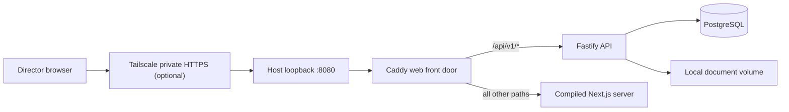
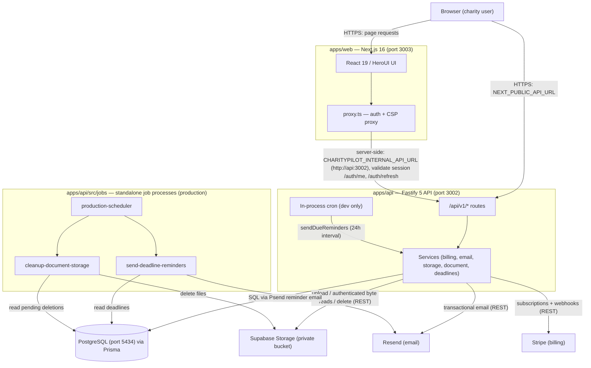

# CharityPilot Architecture Map

CharityPilot is a commercial SaaS that digitises the Irish Charities Regulator (CRA)
Governance Code Compliance Record Form and its supporting governance registers. It is a
[Turborepo](https://turbo.build/) monorepo of three workspaces — a Fastify 5 REST API
(`apps/api`), a Next.js 16 web app (`apps/web`), and a shared Zod-schema/types package
(`packages/shared`) — backed by PostgreSQL (via Prisma) and a small set of external
providers (Supabase Storage, Stripe, Resend).

This document is the **entry point** to the architecture map. Each section below is a
focused, source-grounded reference under [`docs/architecture/`](architecture/). Every
non-trivial claim in those documents carries a `file:line` citation and was
independently fact-checked; the diagrams are GitHub-renderable Mermaid.

> **Verification:** the map was rechecked for top-level topology, dependency,
> route-group, model-count and deployment-profile drift on 2026-07-12. Detailed
> source line citations originated in the 2026-06-20 architecture pass and can
> move as implementation changes; revalidate citations against the final release
> ref before treating them as release evidence.

## Deployment profiles and the web server

The repository has three deliberately separate operating paths:

| Profile | Purpose | Front door | Runtime behavior |
| --- | --- | --- | --- |
| Local development | Source editing and disposable local testing | Direct loopback development ports | `next dev`, `tsx watch`, source mounts, migrations/seeding in the local Compose flow |
| Personal server | One charity on a trusted Windows or supervised x86-64 Linux host | **Caddy** on loopback, optionally reached through private Tailscale Serve HTTPS | Compiled Next.js and Fastify images, persistent PostgreSQL/documents, no routine migration or seed, no public providers |
| Public production | Future hosted commercial service | Production TLS/hosting boundary | Canonical public origins, managed providers, release evidence and the full launch gate |

The host operating system is not the application web server: IIS, Apache and
nginx are not used. Docker Desktop/WSL 2 on Windows or native Docker Engine on
Linux runs Caddy, Next.js, Fastify and PostgreSQL. Caddy is the sole published
front door:


```mermaid
flowchart LR
    Browser["Director browser"] --> Tail["Tailscale private HTTPS (optional)"]
    Tail --> Loopback["Host loopback :8080"]
    Loopback --> Caddy["Caddy web front door"]
    Caddy -->|"/api/v1/*"| Fastify["Fastify API"]
    Caddy -->|"all other paths"| Next["Compiled Next.js server"]
    Fastify --> Postgres[("PostgreSQL")]
    Fastify --> Documents["Local document volume"]
```

For local-only use the exact browser origin may be
`http://localhost:8080`. Remote directors use one exact private HTTPS origin;
Tailscale terminates HTTPS and proxies only to Caddy's loopback port. The
two fixed bridges keep trust explicit: Caddy alone joins the non-internal edge
bridge, while Fastify remains on the internal bridge and trusts only Caddy's
exact `172.30.250.10` address. Caddy deliberately trusts no incoming
`X-Forwarded-*` values because local loopback and Tailscale Serve share the same
Docker gateway; its reverse proxy replaces those values instead of allowing a
local process to spoof a client address. Caddy's host port is still bound
only to loopback. The configured private origin remains authoritative for
Next.js redirects, CSP and server-side refresh requests across that HTTP hop.
The database, API and Next.js ports are not published. See
[Personal Server Deployment on Windows](personal-server-deployment.md) or
[Private Personal Server on Linux](personal-server-deployment-linux.md) for the
host-specific operating and recovery contract. Linux remains supervised testing
until the live gates in the readiness scorecard pass.

## Component diagram


```mermaid
flowchart TD
    Browser["Browser (charity user)"]

    subgraph web["apps/web — Next.js 16 (port 3003)"]
        WebUI["React 19 / HeroUI UI"]
        Proxy["proxy.ts — auth + CSP proxy"]
    end

    subgraph api["apps/api — Fastify 5 API (port 3002)"]
        Routes["/api/v1/* routes"]
        Services["Services (billing, email, storage, document, deadlines)"]
        Cron["In-process cron (dev only)"]
    end

    subgraph jobs["apps/api/src/jobs — standalone job processes (production)"]
        Sched["production-scheduler"]
        DeadlineJob["send-deadline-reminders"]
        CleanupJob["cleanup-document-storage"]
    end

    DB[("PostgreSQL (port 5434) via Prisma")]
    Supabase["Supabase Storage (private bucket)"]
    Stripe["Stripe (billing)"]
    Resend["Resend (email)"]

    Browser -->|"HTTPS: NEXT_PUBLIC_API_URL"| Routes
    Browser -->|"HTTPS: page requests"| WebUI
    WebUI --> Proxy
    Proxy -->|"server-side: CHARITYPILOT_INTERNAL_API_URL (http://api:3002), validate session /auth/me, /auth/refresh"| Routes

    Routes --> Services
    Services -->|"SQL via Prisma client"| DB
    Services -->|"upload / authenticated byte reads / delete (REST)"| Supabase
    Services -->|"subscriptions + webhooks (REST)"| Stripe
    Services -->|"transactional email (REST)"| Resend

    Cron -->|"sendDueReminders (24h interval)"| Services
    Sched --> DeadlineJob
    Sched --> CleanupJob
    DeadlineJob -->|"read deadlines"| DB
    DeadlineJob -->|"send reminder email"| Resend
    CleanupJob -->|"read pending deletions"| DB
    CleanupJob -->|"delete files"| Supabase
```

_The full narrative for this diagram — workspaces, ports, integrations and the jobs
path — is in [System Overview](architecture/01-system-overview.md)._

## The map

| # | Document | What it covers |
|---|---|---|
| 1 | [System Overview](architecture/01-system-overview.md) | Workspaces, runtime topology and ports, how the web app reaches the API, external integrations, the scheduled-jobs path, and the component diagram. |
| 2 | [Module & Dependency Graph](architecture/02-module-dependency-graph.md) | The 12 route groups and their service/model/guard dependencies, the `@charitypilot/shared` boundary, and cross-module coupling. |
| 3 | [Data Model Reference](architecture/03-data-model.md) | All 33 Prisma models and 39 enums, key fields, relations, the `organisationId` tenant-isolation pattern, composite unique constraints, indexes and cascade behaviour. |
| 4 | [Request Lifecycle, Middleware & Auth](architecture/04-request-lifecycle.md) | The Fastify plugin/middleware pipeline in order, and the auth/session model (cookie JWT access token + hashed rotating refresh sessions). |
| 5 | [Billing & Subscription Flow](architecture/05-billing.md) | Stripe tiers and price IDs, checkout/portal, webhook handling and idempotency, the subscription status model, and feature gating. |
| 6 | [Document Storage Flow](architecture/06-document-storage.md) | Supabase private bucket vs local filesystem driver, authenticated proxy downloads, and the deletion-reconciliation model. |
| 7 | [Reminder Scheduler & Jobs](architecture/07-reminder-scheduler.md) | In-process cron vs standalone jobs, the reminder logic, catch-up on missed runs, dedup keying and at-least-once semantics. |
| 8 | [Governance Domain Model](architecture/08-governance-domain.md) | Principles → standards → compliance records → sign-off, plus the conflict/risk/complaint/fundraising/annual-report/financial-control registers. |
| 9 | [Frontend Architecture](architecture/09-frontend.md) | App-router route groups, the API client and same-origin proxy, auth/session handling and single-flight refresh, and client-side plan gating. |
| 10 | [Configuration, Environment & the Two-Gate Model](architecture/10-config-and-env.md) | The full env-var surface, what `validateProductionEnv` enforces, and the code-gate vs launch-gate model. |

### Document storage providers

Document storage is chosen per organisation, not per process.

- `apps/api/src/services/document-storage-provider.ts` is the registry: the
  single source of truth for which providers exist and what stage each is at
  (`ga` or `alpha`).
- `apps/api/src/services/document-storage-resolution.ts` turns an organisation
  id into a provider id, falling back to `DOCUMENT_STORAGE_DRIVER` when the
  organisation has recorded no preference.
- `Organisation.documentStorageProvider` (nullable) holds the preference;
  `Organisation.documentStorageAlphaOptIn` gates alpha-stage providers.

An alpha provider can only be selected by an organisation that has explicitly
opted in, and can never be the deployment default. This is the mechanism that
keeps in-progress integrations off tenants who have not asked for them — see
`docs/superpowers/plans/2026-09-18-document-storage-providers-spec.md`.

**Changing an organisation's provider strands its existing documents.** Nothing
writes `documentStorageProvider` yet, but once something does, flipping it on an
organisation that already holds documents points every later download and delete
at the new provider while the bytes still sit in the old one — silent 404s, and
worse, deletions that report success against a store that never held the object,
in a product whose deletion pipeline exists precisely because erasure has to be
provable. The real fix is a per-document provider stamp so each object is read
and erased from wherever it was actually written; that lands in Phase 3 of
`docs/superpowers/plans/2026-09-18-document-storage-providers-spec.md`, and until
it does, a provider change on an organisation with documents is not a supported
operation.

The global health probe (`routes/health`) deliberately reports on the
deployment default only. Per-tenant integration health is a later phase. That
leaves a known gap: the probe builds `new StorageService()` with no resolver, so
it never touches the `Organisation` storage columns — a deployment that shipped
this code but skipped the migration would pass its own readiness gate while
every document path failed on the missing columns. Deciding which organisation a
readiness probe should resolve for is a Phase 6 question, so the mitigation for
now is the migration gate in the deploy pipeline, not the health endpoint.

If the resolver itself fails — for example a database error while looking up
an organisation's preference — `StorageService` surfaces that as `AppError`
500 `STORAGE_PROVIDER_RESOLUTION_FAILED` rather than leaking the raw error;
the alpha-gate and unknown-provider errors from the registry are deliberate
`AppError`s and still pass through unchanged.

**The production local-provider gate applies to writes only.**
`assertProviderPermittedByDeployment` (in `document-storage-resolution.ts`)
refuses a per-organisation `'local'` provider on a production deployment
whose own default is not `'local'` — but only when
`resolveProviderForOrganisation` is called with `{ operation: 'write' }`
(the default when no options are passed, so every unqualified call site stays
strict). `'read'` and `'delete'` skip the gate. The gate exists to stop a
production deployment writing bytes to an unvalidated, ephemeral,
un-backed-up local path; once bytes exist there, refusing to read or delete
them strands them, which is strictly worse, and for delete it breaks the
provable-erasure guarantee the document-deletion pipeline (retry,
dead-letter, recovery ledger) exists to uphold. `StorageService.providerFor`
passes the operation through: `uploadFile` → `'write'`, `downloadFile` →
`'read'`, `deleteFile` → `'delete'`.

This split matters because "production" is not decided consistently across
the codebase: `apps/api/src/jobs/cleanup-document-storage.ts` and
`apps/api/src/jobs/production-scheduler.ts` both default
`process.env.NODE_ENV ??= 'production'` at module load, while the web
process never sets `NODE_ENV` at all. On a dev or staging deployment with a
Supabase default, that mismatch used to mean an organisation pinned to
`'local'` could upload successfully through the web route and then have its
deletion refused by the cleanup job, stalling reconciliation on a document
the same deployment had just written. Gating only the write path removes the
inconsistency instead of requiring the two processes to agree on
`NODE_ENV`.

### Integration credentials: the envelope, the boundary, and rotation

Third-party credentials — today an Atlassian OAuth refresh token for a charity's
own Confluence site, later an accounting integration's — are held encrypted at
rest. Three pieces:

- `apps/api/src/services/integration-crypto.ts` — the crypto boundary: seal,
  open, key decode, key fingerprint. Pure; no Prisma, no environment reads.
- `apps/api/src/services/integration-credential.service.ts` — stores and loads a
  tenant's credentials through that boundary.
- `OrganisationIntegration`, `IntegrationCredential` and the single-row
  `IntegrationSecretControl` in `apps/api/prisma/schema.prisma`.

**A plaintext secret never leaves the crypto boundary.** It is not logged, not
interpolated into an error message, not attached as an error `cause`, and never
stored unsealed. Errors about sealed material carry a key *fingerprint* — a
domain-separated SHA-256 of the key — never the material.

#### The envelope

`sealIntegrationSecret` produces AES-256-GCM:

```
{ generation: number, iv: string, tag: string, ciphertext: string }
```

written to the `sealed` JSON column, with `generation` also denormalised into
its own column so a rotation can find stale rows without opening a single one.
`iv` is 12 fresh random bytes per seal, so the same plaintext sealed twice
yields different ciphertext. `tag` is the 16-byte GCM authentication tag, so a
tampered row fails loudly instead of decrypting to garbage.

#### Why the AAD binding exists

GCM's tag authenticates *modification*. It says nothing about *where a
ciphertext is allowed to live*. With one process-wide key and no additional
authenticated data, every envelope is portable: a ciphertext copied from one
charity's row into another's — by a bug, a bad backfill, or direct database
write access — decrypts cleanly under the thief's identity. For a table whose
rows are Irish charities' OAuth refresh tokens for their own Atlassian sites,
that is the whole risk.

So every seal and every open is bound to a `SecretContext` of
`{ organisationId, provider, kind }` plus the envelope's `generation`, passed to
GCM as AAD. Change any one of them and the open fails closed. The fields are
netstring-framed (`<byte length>:<value>`) so the encoding is injective: a naive
join on a separator character would let `("a:b", "c")` collide with
`("a", "b:c")`.

**The context is derived from the database row, never from the caller.**
`organisationId` and `provider` are read off the `OrganisationIntegration` row
the credential hangs off; only `kind` comes from the caller, and it is the same
value that addresses the credential row, so it cannot disagree with where the
envelope is stored. There is deliberately no override parameter — accepting a
caller-supplied organisation would re-create exactly the vulnerability the
binding exists to prevent.

#### The authorization boundary — read this before adding a route

**This layer binds. It does not authorize.**

The context lookup is by `integrationId` alone and is *not* scoped to a
requesting organisation. So when a caller passes another charity's
`integrationId`, the context is derived from *that charity's own row*, the
decrypt succeeds, and their refresh token is handed back. That is not a defect
in the binding; it is the consequence of deriving the context honestly rather
than from an argument.

> **A route must independently prove that the requesting organisation owns the
> `integrationId` it passes. Nothing in the credential service checks that.**

Concretely: scope the query that produced the `integrationId` to the
authenticated organisation (`where: { id, organisationId }`), or verify
ownership explicitly, before calling `storeIntegrationCredential` or
`loadIntegrationCredential`. The binding's job is to make a *stolen row*
useless. Keeping a *legitimate request* inside its own tenant is the route's
job, exactly as it is for every other `organisationId`-scoped query here.

#### Error taxonomy — what each code tells an operator

| Code | What happened | What to do |
|---|---|---|
| `INTEGRATION_NOT_FOUND` (404) | No `OrganisationIntegration` row for that id. | Caller bug, or the integration was deleted. Nothing was sealed or opened. |
| `INTEGRATION_KEY_MISSING` (500) | `INTEGRATION_ENCRYPTION_KEY` is unset. | Configuration, not data. Set it. Nothing is damaged. |
| `INTEGRATION_KEY_INVALID` (500) | The configured value does not canonically decode to exactly 32 bytes. | Configuration. Fix the value. Nothing is damaged. |
| `INTEGRATION_KEY_MISMATCH` (500) | The configured key's fingerprint disagrees with the one this installation recorded. | **The stored credentials are intact.** Restore the correct key. **Do not ask charities to reconnect** — a re-store upserts, and would overwrite recoverable envelopes irreversibly. |
| `INTEGRATION_SECRET_UNREADABLE` (500) | GCM authentication failed. | Three causes today: a wrong key on an installation that has not recorded a fingerprint yet; a context that does not match what was sealed (a row in the wrong tenant, provider or kind); or genuine corruption or tampering. Rule out a wrong key *first* — do not treat this as corruption by default. A rotation adds a fourth cause; see the trap below. |
| `INTEGRATION_SECRET_MALFORMED` (500) | The stored `sealed` column is not an envelope at all — null, a string, a half-written object. | Deliberately distinct from `UNREADABLE`: "not an envelope" rather than "an envelope that would not authenticate", and the two call for different investigations. Look at the backfill or direct write that produced the row. |
| `INTEGRATION_SECRET_CONTEXT_INVALID`, `INTEGRATION_SECRET_GENERATION_INVALID`, `INTEGRATION_SECRET_PLAINTEXT_REQUIRED` (500) | A caller passed something the boundary refuses. | Programming errors, never data problems. They exist so a bad argument cannot be misreported as a corrupt credential. |

#### Rotation, and the bootstrap fingerprint

`IntegrationSecretControl` is a single row (`id: 1`) carrying `generation`,
`activeKeyFingerprint`, `retiredKeyFingerprint` and `rotatedAt`. New envelopes
seal under the active generation; an installation that has never rotated has no
row and is generation 1 by definition. `countCredentialsAwaitingRotation` counts
rows below the active generation off the denormalised column, decrypting
nothing.

The first successful store on an installation with no recorded fingerprint
records the fingerprint of the key that just sealed — the moment that claim is
definitionally true. **That write and the credential write are one
transaction.** They describe each other, and an installation left holding a
sealed envelope with no recorded fingerprint has a permanently inert mismatch
check for precisely the installation that has just acquired something to lose:
a later store under a wrong key would record the *wrong* fingerprint and upsert
straight over the recoverable envelope.

#### The rotation trap — read this before writing the rotation job

**The moment a rotation flips `IntegrationSecretControl.generation` and records
the new key's fingerprint, every credential that has not yet been re-sealed
fails as `INTEGRATION_SECRET_UNREADABLE`.**

The fingerprint check passes — the configured key matches the newly recorded
fingerprint, so nothing objects — and *then* AES-GCM fails on every
generation-N row, because `generation` is part of the AAD and no longer matches
what those rows were sealed with. The operator sees "every credential is
corrupt", for every charity at once. That is verbatim the failure mode the
fingerprint check was added to prevent, resurfacing one phase later, carrying
the same destructive temptation: asking charities to reconnect, which upserts
over envelopes that were perfectly recoverable.

Two defences. A rotation job must carry at least the first, and should be built
on the second:

- **Cheap, and strictly a diagnostic.** Before opening, compare
  `sealed.generation` with the active generation and raise a distinct code —
  `INTEGRATION_SECRET_GENERATION_STALE` — instead of letting authentication
  fail. It does not make the credential readable. It does stop the failure
  masquerading as corruption, and it tells the operator to finish the rotation
  rather than to wipe the table.
- **Correct, and what the schema is already shaped for.** Resolve the key *by
  the envelope's own generation* rather than by "whichever one is active". Keep
  the retired key available alongside the active one (`retiredKeyFingerprint`
  exists for this), open a generation-N row with the generation-N key, and
  re-seal it under the active one. Rotation then becomes an online operation
  with no window at all, instead of a flag-flip that breaks every un-re-sealed
  row until a background job catches up.

**Documented, not implemented.** There is nothing to rotate yet and the rotation
job is a later phase. Build one of these *before* that job runs, not after.

#### `INTEGRATION_ENCRYPTION_KEY` is required on the standard production path only — deliberately

`validateProductionEnv` (`apps/api/src/utils/env.ts`) requires it: present,
canonically exactly 32 bytes as hex or unpadded base64url, and distinct from
`JWT_SECRET`, `OWNER_JWT_SECRET`, `AUTH_RECOVERY_SECRET` and
`READINESS_API_KEY`.

`validatePersonalServerEnv` (`apps/api/src/utils/personal-server-env.ts`) does
**not** require it, and `validateRuntimeEnv` returns after calling it for a
personal-server/appliance deployment, so the standard validator never runs
there. An appliance runs with `NODE_ENV=production`, so the constraint
"required in production" is enforced on one of the two production branches.

**The asymmetry is deliberate.** Adding the requirement to the appliance branch
would fail the boot of every existing appliance install on upgrade — for a key
that nothing reads yet, since no integration can be connected until the connect
flow ships. Breaking running installs of a charity's own governance server, to
enforce a constraint with no current consumer, is the worse trade.

**The obligation this creates, owed by the phase that ships the connect flow:**
the connect route must refuse to begin an OAuth flow — on *every* deployment,
appliance included — when `INTEGRATION_ENCRYPTION_KEY` is absent or does not
decode, and must say so plainly enough for an operator to act. Gating the
*feature* on the key rather than the *boot* breaks no appliance on upgrade,
while making it impossible to reach a state where a credential is about to be
sealed under a missing key. Until then, an appliance operator who wants to be
ready can set the key now (`openssl rand -hex 32`, distinct from every other
secret); nothing on the appliance consumes it yet, and once something does it
must never be regenerated — see `docs/production-runbook.md`.

Security-sensitive operator references:

- [Team Lifecycle and Session Security](team-lifecycle-security.md)
- [Restricted Team Ownership Recovery](team-ownership-recovery.md)
- [Restricted Billing Authority Reconciliation](billing-authority-reconciliation.md)

> **Dependency inventory:** [`docs/DEPENDENCIES.md`](DEPENDENCIES.md) lists the
> production dependencies per workspace and the rationale behind each `overrides`
> security pin.

## Running the stack and the tests

- **Local stack (one command):** `docker compose -f compose.yml -f compose.local.yml up`
  boots PostgreSQL + API + web, applies migrations, and seeds a local admin. See the
  [README](../README.md#local-development) for the seeded credentials and direct-run
  option.
- **Unit tests** (Node's built-in `node:test`, compiled first): `npx turbo test`.
- **Local Docker smoke** (boots the real stack and exercises auth + document
  upload/download): `npm run test:local-docker:smoke`.
- **End-to-end browser tests** (Playwright against a runner-owned standalone
  stack whose internal-only app/database services are exposed through one
  minimal secretless loopback TCP gateway, never the persistent development
  database): see
  [`e2e/README.md`](../e2e/README.md) and `npm run test:e2e`.

## The two-gate model

CharityPilot separates a self-contained **code gate** from an external **launch gate**:

- **Gate 1 — code gate (in this repo, fully automated):** `npm run lint`, `npx turbo test`,
  `npm run build`, `npm audit --omit=dev`, and the Docker smoke in
  [`.github/workflows/ci.yml`](../.github/workflows/ci.yml). This is what every commit on
  a branch keeps green.
- **Gate 2 — launch gate (external, not code):** real domains, provider accounts, secrets,
  hosting, legal sign-off and an external pentest. This is **out of scope for the codebase**
  and is documented — not duplicated — in [`docs/LAUNCH-GUIDE.md`](LAUNCH-GUIDE.md) and the
  [`docs/production-runbook.md`](production-runbook.md).

See [Configuration, Environment & the Two-Gate Model](architecture/10-config-and-env.md)
for the full breakdown.
