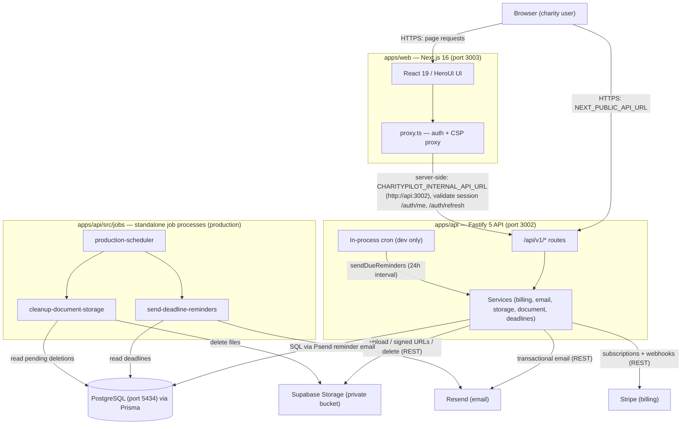

# System Overview

CharityPilot is a commercial SaaS that digitises the Irish Charities Regulator (CRA) Governance Code Compliance Record Form and its supporting governance registers, letting a charity track compliance, board members, documents, deadlines and sign-off in one place (`README.md:1-9`). It is a [Turborepo](https://turbo.build/) monorepo of three workspaces — a Fastify REST API, a Next.js web app, and a shared types/schemas package — deployed as containerised services backed by PostgreSQL and a small set of external providers (`README.md:15-26`).

## Workspaces

The repository root declares the workspace globs `packages/*` and `apps/*` (`package.json:4-7`), giving three published-internal packages:

| Workspace | Path | Package name | Responsibility | Key dependencies |
| --- | --- | --- | --- | --- |
| API | `apps/api` | `@charitypilot/api` | Fastify 5 REST API (TypeScript, ESM): routes, services, Prisma data access, in-process and standalone scheduled jobs | `fastify`, `@prisma/client`, `@supabase/supabase-js`, `stripe`, `resend`, `zod` (`apps/api/package.json:21-36`) |
| Web | `apps/web` | `@charitypilot/web` | Next.js 16 app-router web app (React 19, HeroUI, Tailwind 4): UI plus a server-side proxy/auth layer | `next`, `react`, `@heroui/react`, `axios` (`apps/web/package.json:12-22`) |
| Shared | `packages/shared` | `@charitypilot/shared` | Shared TypeScript types and Zod schemas consumed by both apps; built to `dist/` and imported as an ESM package | `zod` (`packages/shared/package.json:6-21`) |

Both apps depend on `@charitypilot/shared` via the `*` workspace version (`apps/api/package.json:22`, `apps/web/package.json:13`). The shared package is compiled first and exposed through its `exports` map pointing at `./dist/index.js` (`packages/shared/package.json:8-13`), which is why the Turborepo `build` task fans out from dependencies (`"dependsOn": ["^build"]`) before building each app (`turbo.json:26-29`).

The whole repo requires Node.js ≥ 22 and is pinned to `npm@11.11.0` (`package.json:45-48`).

## Runtime topology and default ports

The three runtime processes are the web app, the API, and PostgreSQL. Default ports (documented in the README and enforced by the compose files) are:

| Service | Default port | Source |
| --- | --- | --- |
| Fastify API | `3002` | `parsePort(process.env.PORT, 3002)` (`apps/api/src/server.ts:87`); `PORT: 3002` in compose (`compose.local.yml:51`, `compose.production.yml:36`); README (`README.md:26`) |
| Next.js web | `3003` | `next dev --webpack --port 3003` (`apps/web/package.json:6`); `PORT: 3003` in compose (`compose.local.yml:105`, `compose.production.yml:69`) |
| PostgreSQL | `5434` (host) → `5432` (container) | `127.0.0.1:5434:5432` (`compose.yml:23-24`); README (`README.md:26`) |

The API binds to `0.0.0.0` by default (`apps/api/src/server.ts:88`) and logs `CharityPilot API running on http://${host}:${port}` once listening (`apps/api/src/server.ts:91-92`). It installs `SIGINT`/`SIGTERM` handlers for a guarded graceful shutdown via `app.close()` (`apps/api/src/server.ts:102-120`).

### API process startup

The production entrypoint `apps/api/src/start.ts` defaults `NODE_ENV` to `production` and then dynamically imports `./server.js` (`apps/api/src/start.ts:1-3`); the `start` script runs `node dist/start.js` (`apps/api/package.json:10`). In development the API runs directly under `tsx --watch` against `src/server.ts` (`apps/api/package.json:7`). On boot, `server.ts` calls `validateProductionEnv()` (`apps/api/src/server.ts:42`), then registers plugins (error handler, security headers, cookies, browser-origin protection, a 100-requests-per-minute rate limit, multipart uploads, and the Prisma plugin) (`apps/api/src/server.ts:51-66`).

### API route surface

All routes are versioned under `/api/v1/*`, registered with per-domain prefixes (`apps/api/src/server.ts:70-81`): `auth`, `organisation`, `compliance`, `board-members`, `documents`, `deadlines`, `billing`, `export`, `dashboard`, `governance-registers`, `team`, and `health`. The container health checks probe `/api/v1/health` locally (`compose.local.yml:86`) and the authenticated `/api/v1/health/readiness` endpoint (with an `x-charitypilot-readiness-key` header) in production (`compose.production.yml:50-59`).

## How the web app reaches the API

The Next.js layer resolves the API base URL through two distinct paths in `apps/web/src/lib/api-config.ts`:

- **Browser-facing requests** use `getApiBaseUrl()`, driven by `NEXT_PUBLIC_API_URL` (`apps/web/src/lib/api-config.ts:10-28`). In production this must be an `https://` origin-only URL on the approved `charitypilot.ie` host (`apps/web/src/lib/api-config.ts:42-63`); in local Docker it is `http://localhost:3002` (`compose.local.yml:106`).
- **Server-side requests inside the web container** use `getServerApiBaseUrl()`, which prefers `CHARITYPILOT_INTERNAL_API_URL` and otherwise falls back to the public URL (`apps/web/src/lib/api-config.ts:30-40`). Locally this is set to the in-network service address `http://api:3002` (`compose.local.yml:107`), so the proxy reaches the API container directly over the Docker bridge network rather than via the host-published port.

The server-side caller is the web proxy in `apps/web/src/proxy.ts`. For protected app paths it forwards the auth cookies to the API's `/api/v1/auth/me` endpoint to validate the session, and on a stale access token attempts `/api/v1/auth/refresh`, propagating any rotated `Set-Cookie` headers back to the browser (`apps/web/src/proxy.ts:48-90`, `apps/web/src/proxy.ts:194-204`). The proxy also injects a per-request nonce and Content-Security-Policy and redirects unauthenticated users to `/login` (`apps/web/src/proxy.ts:176-205`). Its matcher excludes `api`, `_next` and static assets (`apps/web/src/proxy.ts:207-211`).

## External integrations

The API talks to four external systems. Each client is constructed lazily inside the relevant service, guarded by configured-secret checks so the API still boots when a provider is unconfigured (e.g. local development):

| Integration | Purpose | Where wired | Configuration |
| --- | --- | --- | --- |
| PostgreSQL (via Prisma) | Primary data store; all domain data | Prisma plugin registered on the Fastify instance (`apps/api/src/server.ts:66`); schema at `apps/api/prisma/schema.prisma` (`README.md:23`) | `DATABASE_URL` (`compose.local.yml:55`) |
| Supabase Storage | Private document bucket with signed URLs (production); local filesystem driver in dev | `createClient(url, serviceRoleKey)` in `StorageService` (`apps/api/src/services/storage.service.ts:54-62`); driver selected by `DOCUMENT_STORAGE_DRIVER` (`apps/api/src/services/storage.service.ts:18`) | `SUPABASE_URL`, `SUPABASE_SERVICE_ROLE_KEY`, `SUPABASE_STORAGE_BUCKET`; or `local` + `LOCAL_FILE_STORAGE_DIR` (`compose.local.yml:61-73`) |
| Stripe | Subscription billing (Essentials/Complete tiers) and webhooks | `new Stripe(secretKey)` in `BillingService.getStripe()` (`apps/api/src/services/billing.service.ts:90-97`) | `STRIPE_SECRET_KEY`, `STRIPE_WEBHOOK_SECRET`, four `STRIPE_*_PRICE_ID` values (`compose.local.yml:63-68`) |
| Resend | Transactional/notification email (e.g. deadline reminders) | `new Resend(process.env.RESEND_API_KEY)` in `EmailService` (`apps/api/src/services/email.service.ts:95`) | `RESEND_API_KEY`, `EMAIL_FROM` (`compose.local.yml:69-70`) |

When a secret is missing, the storage and billing services throw a `503` `AppError` (`STORAGE_NOT_CONFIGURED` / `BILLING_NOT_CONFIGURED`) rather than failing at startup (`apps/api/src/services/storage.service.ts:58-59`, `apps/api/src/services/billing.service.ts:93-94`). The full set of provider environment variables is also declared in Turborepo's `globalEnv` so caching is keyed on them (`turbo.json:3-24`).

## Scheduled jobs

CharityPilot runs scheduled work two ways depending on environment.

### In-process cron (development)

`server.ts` constructs a `DeadlineRemindersService` from the Fastify Prisma client and calls `startCronJobs()` after the server is listening (`apps/api/src/server.ts:94-96`). `startCronJobs` short-circuits in production unless `ENABLE_IN_PROCESS_JOBS === 'true'`, otherwise it schedules `sendDueReminders()` on a 24-hour `setInterval` (`apps/api/src/utils/cron.ts:3-18`). Production compose explicitly sets `ENABLE_IN_PROCESS_JOBS: "false"` on the API service (`compose.production.yml:38`), so the API never runs jobs in production.

### Standalone job processes (production)

The standalone jobs live in `apps/api/src/jobs` and are exposed both as npm `jobs:*` scripts (`apps/api/package.json:17-19`) and as compose services running the compiled `dist/jobs/*.js`:

| Job entrypoint | npm script | Compose service | What it does |
| --- | --- | --- | --- |
| `production-scheduler.ts` | `jobs:production-scheduler` | `production-scheduler` (long-running) | Runs both jobs on independent recurring timers; deadline reminders default 24h, document cleanup default 1h (`apps/api/src/jobs/production-scheduler.ts:14-15`, `apps/api/src/jobs/production-scheduler.ts:248-264`); `compose.production.yml:96-124` |
| `send-deadline-reminders.ts` | `jobs:deadline-reminders` | `deadline-reminders` (one-shot, `jobs` profile) | Builds a `DeadlineRemindersService` and calls `sendDueReminders()` once, exiting non-zero on failure (`apps/api/src/jobs/send-deadline-reminders.ts:9-26`); `compose.production.yml:126-150` |
| `cleanup-document-storage.ts` | `jobs:document-storage-cleanup` | `document-storage-cleanup` (one-shot, `jobs` profile) | Retries pending storage deletions via `DocumentService.retryPendingStorageDeletions()` using `StorageService.deleteFile()` (`apps/api/src/jobs/cleanup-document-storage.ts:18-23`); `compose.production.yml:152-177` |

The deadline-reminders path reads/writes the database and sends email via Resend (its compose service requires `DATABASE_URL`, `RESEND_API_KEY`, `EMAIL_FROM` — `compose.production.yml:135-141`). The document-storage-cleanup path reads the database and deletes from Supabase storage (it requires `DATABASE_URL` and the `SUPABASE_*` variables — `compose.production.yml:161-168`). Both report failures through `sendJobFailureAlert`, which posts to `ERROR_ALERT_WEBHOOK_URL` (`apps/api/src/jobs/production-scheduler.ts:167-186`). The `production-scheduler` service is the always-on production scheduler, while the two one-shot services sit behind the `jobs` Compose profile for ad-hoc/external-cron invocation (`compose.production.yml:128-129`, `compose.production.yml:154-155`).

## Component diagram

## Cross-references

- [Module & Dependency Graph](02-module-dependency-graph.md) — how the route groups map to services and Prisma models.
- [Request Lifecycle, Middleware & Auth](04-request-lifecycle.md) — the Fastify plugin pipeline and session model.
- [Data Model Reference](03-data-model.md) — the Prisma/PostgreSQL schema behind the data store.
- [Frontend Architecture](09-frontend.md) — the Next.js app and its server-side proxy/auth layer.
- [Reminder Scheduler & Jobs](07-reminder-scheduler.md) — the in-process cron and standalone job processes in depth.
- [Configuration, Environment & the Two-Gate Model](10-config-and-env.md) — the env surface and the code-vs-launch gates.
