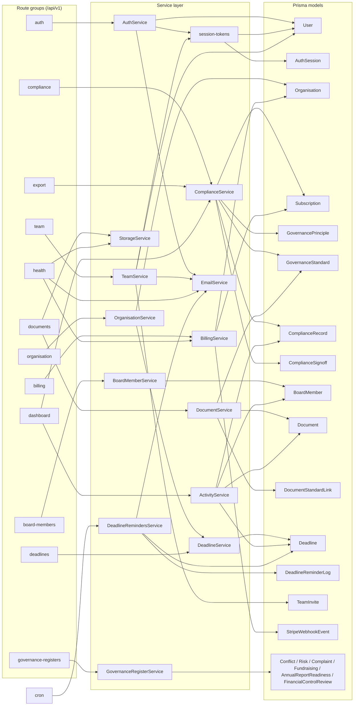

# Module & Dependency Graph

This document maps the CharityPilot API's internal module structure: how the twelve route groups registered in `apps/api/src/server.ts:70-81` delegate to the sixteen service classes in `apps/api/src/services/`, which Prisma models those services touch, and which middleware guards gate each group. It also describes the `@charitypilot/shared` package boundary and the cross-module coupling between shared services and utilities.

## Route group registration

All route groups are registered under a common `/api/v1/...` prefix in the Fastify bootstrap (`apps/api/src/server.ts:70-81`). The exact prefix per group is shown below; note that the `organisations` group is mounted at the singular prefix `/organisation` (`apps/api/src/server.ts:71`).

Each route group is a single module exporting an async plugin function from `apps/api/src/routes/<group>/index.ts`. Most groups instantiate their service(s) with the request-decorated Prisma client (`app.prisma`) at registration time, e.g. `const service = new OrganisationService(app.prisma);` (`apps/api/src/routes/organisations/index.ts:12`).

## Dependency flowchart

The graph below renders the dominant edges only — route group to primary service, and service to the Prisma models it most prominently reads/writes. Lower-traffic edges (for example the export group reading several governance-register models directly via `app.prisma`) are summarised in the per-group table rather than drawn here.

## Per-group reference table

Prisma models are attributed to a group via the services it invokes (model usage confirmed by grepping `prisma.<model>.` in each service file). The middleware guards live in `apps/api/src/middleware/`.

| Route group | Prefix | Key endpoints | Services used | Prisma models touched | Guards |
|---|---|---|---|---|---|
| **auth** | `/api/v1/auth` | `POST /register`, `POST /login`, `POST /refresh`, `POST /logout`, `GET /me`, `POST /forgot-password`, `POST /resend-verification`, `POST /reset-password`, `POST /verify-email` | `AuthService` (`apps/api/src/routes/auth/index.ts:33`) | `User` (`apps/api/src/services/auth.service.ts:69`); `AuthSession`, `User` via `session-tokens` (`apps/api/src/services/session-tokens.ts:52,97`) | Public or partial-auth by design: registration, login, forgot/reset/verify, refresh and logout do not require an existing organisation session; `/me` and `/resend-verification` use `authIdentityGuard`. Sensitive endpoints use identifier-aware `rateLimit` buckets for email, reset/verify token, refresh token, or bearer/access-cookie credentials. |
| **organisation** | `/api/v1/organisation` | `GET /`, `PATCH /` | `OrganisationService` (`apps/api/src/routes/organisations/index.ts:12`), which composes `DeadlineService` (`apps/api/src/services/organisation.service.ts:4`) | `Organisation` (`apps/api/src/services/organisation.service.ts:11,24`) | `authGuard` + `subscriptionGuard` (onRequest hooks, `:14-15`); `requireAdmin` on `PATCH /` (`:26`) |
| **compliance** | `/api/v1/compliance` | principles/records/summary/readiness/signoff reads; revision-checked record and signoff writes | `ComplianceService`; canonical snapshot hashing | `Organisation`, `Subscription`, `GovernanceStandard`, `GovernancePrinciple`, `ComplianceRecord`, `ComplianceSignoff`, `ComplianceApprovalSnapshot`, `ComplianceAuditEvent` | `authGuard` + `subscriptionGuard`; `requireAdmin` on record/signoff writes; writes serialize on the organisation row |
| **board-members** | `/api/v1/board-members` | `GET /`, `POST /`, `PATCH /:id`, `DELETE /:id` | `BoardMemberService` (`apps/api/src/routes/board-members/index.ts:12`) | `BoardMember` (`apps/api/src/services/board-member.service.ts:11-69`) | `authGuard` + `subscriptionGuard` (`:14-15`); `requireAdmin` on POST/PATCH/DELETE (`:30,43,55`) |
| **documents** | `/api/v1/documents` | `GET /`, `GET /_local-download`, `GET /:id`, `GET /:id/download`, `POST /` (multipart upload), `DELETE /:id`, `POST /:id/link-standard` (+ alias `POST /:id/standards`), `DELETE /:id/unlink-standard` (+ alias `DELETE /:id/standards/:standardId`) | `DocumentService` + `StorageService` (`apps/api/src/routes/documents/index.ts:93-94`) | `Document`, `DocumentStandardLink`, `GovernanceStandard`, `Organisation`, `Subscription` (`apps/api/src/services/document.service.ts:134-461`) | `authGuard` + `subscriptionGuard` (`:96-97`); `requireAdmin` on POST/DELETE/link/unlink (`:151,300,327,355`) |
| **deadlines** | `/api/v1/deadlines` | `GET /`, `POST /`, `PATCH /:id`, `DELETE /:id` | `DeadlineService` (`apps/api/src/routes/deadlines/index.ts:12`) | `Deadline`, `Organisation` (`apps/api/src/services/deadline.service.ts:11-133`) | `authGuard` + `subscriptionGuard` (`:14-15`); `requireAdmin` on POST/PATCH/DELETE (`:30,43,55`) |
| **billing** | `/api/v1/billing` | `POST /webhooks` (raw-body Stripe), `POST /checkout` (+ `/create-checkout`), `POST /portal` (+ `/create-portal`), `GET /status` | `BillingService` (`apps/api/src/routes/billing/index.ts:10`) | `StripeWebhookEvent`, `Organisation`, `Subscription` (`apps/api/src/services/billing.service.ts:164-380`) | Webhook scope: no auth (signature verified in service, `apps/api/src/routes/billing/index.ts:30`). Authed scope: `authGuard` (`:47`); `requireOwner` on checkout/portal (`:74-77`). Note: **no** `subscriptionGuard` here. |
| **export** | `/api/v1/export` | `GET /compliance-record`, `GET /compliance-report`; `version=current`, `version=approved`, or tenant-scoped `snapshotId` | `ComplianceService`; snapshot integrity parser/renderer | Current reports read live compliance plus Complete-only register appendices. Approved reports read only `ComplianceApprovalSnapshot` after tenant/year/hash verification. | `authGuard` + `subscriptionGuard`; approved snapshot IDs are looked up with the caller organisation and reporting year in the same query |
| **dashboard** | `/api/v1/dashboard` | `GET /` (combined dashboard) | `ComplianceService` + `ActivityService`, instantiated per-request (`apps/api/src/routes/dashboard/index.ts:19-20`); reads `Deadline` and `BoardMember` directly via `app.prisma` (`:31,41`) | via ActivityService: `Organisation`, `Subscription`, `ComplianceRecord`, `Document`, `BoardMember`, `Deadline` (`apps/api/src/services/activity.service.ts:18-54`); plus `Deadline`/`BoardMember` directly | `authGuard` + `subscriptionGuard` (`:10-11`) |
| **governance-registers** | `/api/v1/governance-registers` | `GET /summary`; CRUD for `/conflicts`, `/risks`, `/complaints`, `/fundraising`; `GET`+`PUT /annual-report`; `GET`+`PUT /financial-controls` | `GovernanceRegisterService` (`apps/api/src/routes/governance-registers/index.ts:39`) | `ConflictRecord`, `RiskRecord`, `ComplaintRecord`, `FundraisingRecord`, `AnnualReportReadiness`, `FinancialControlReview`, `BoardMember` (`apps/api/src/services/governance-register.service.ts:25-447`) | `authGuard` + `subscriptionGuard` (onRequest, `:41-42`); **`requireCompletePlan`** as a group-wide `preHandler` hook (`:43`); `requireAdmin` on all writes (e.g. `:63,100,213`) |
| **team** | `/api/v1/team` | `POST /accept-invite` (public); authed sub-scope: `GET /`, `POST /invites`, `DELETE /invites/:id`, `PATCH /members/:id/role` | `TeamService` (`apps/api/src/routes/team/index.ts:27`); composes `EmailService` and `session-tokens` | `User`, `TeamInvite` (`apps/api/src/services/team.service.ts:207-420`); `AuthSession`/`User` via `session-tokens` | `/accept-invite` is public with `rateLimit` (`:31`). Authed sub-scope applies `authGuard` + `subscriptionGuard` (`:52-53`). Role checks are performed inside `TeamService` (it receives `request.user.role`, `:68`), not via the `roles.ts` guards. |
| **health** | `/api/v1/health` | `GET /` (liveness), `GET /readiness` | `BillingService`, `EmailService`, `StorageService` (instantiated for readiness checks, `apps/api/src/routes/health/index.ts:42,54,59`) | `Subscription` not touched here; `/readiness` runs `SELECT 1` raw query against the DB (`:46`) | No `authGuard`. `/readiness` is gated by a constant-time `x-charitypilot-readiness-key` header check (`apps/api/src/routes/health/index.ts:18-24,35`) |

### Guard summary

| Guard | File | Effect |
|---|---|---|
| `authGuard` | `apps/api/src/middleware/auth.ts:75` | Verifies access token, loads `AuthSession` + `User`, rejects unverified emails, populates `request.user` (`apps/api/src/middleware/auth.ts:33-72`) |
| `authIdentityGuard` | `apps/api/src/middleware/auth.ts:79` | Same as `authGuard` but `allowUnverified: true` — used for `/me` and `/resend-verification` |
| `subscriptionGuard` | `apps/api/src/middleware/subscription.ts:8` | Loads the org `Subscription`; allows active/trial via `hasSubscriptionAccess`, else 403 with a status-specific code (`apps/api/src/middleware/subscription.ts:25-50`) |
| `requireAdmin` | `apps/api/src/middleware/roles.ts:17` | `requireRole('OWNER', 'ADMIN')` |
| `requireOwner` | `apps/api/src/middleware/roles.ts:18` | `requireRole('OWNER')` — billing checkout/portal only |
| `requireCompletePlan` | `apps/api/src/middleware/plan.ts:4` | Loads `Subscription`, requires `plan === COMPLETE`, else 403 `PLAN_FEATURE_UNAVAILABLE` — governance-registers group only |

## Shared-package boundary

`packages/shared` is the single source of truth for cross-cutting contracts. Its barrel re-exports three sub-trees (`packages/shared/src/index.ts:1-3`):

| Export sub-tree | Source | Contents |
|---|---|---|
| Types | `packages/shared/src/types/index.ts` | API request/response types (`types/api.ts`) and enums (`types/enums.ts`, e.g. `SubscriptionPlan`) |
| Schemas | `packages/shared/src/schemas/index.ts` | Zod validators per domain: `auth.ts`, `organisation.ts`, `compliance.ts`, `board-member.ts`, `document.ts`, `deadline.ts`, `billing.ts`, `governance-registers.ts`, `team.ts` |
| Constants | `packages/shared/src/constants/index.ts` | Governance-code definitions (`constants/governance-code.ts`) |

The package is published as ESM with compiled output under `dist/` (`packages/shared/package.json:5-13`); its only runtime dependency is `zod` (`:20-22`).

**How the apps consume it.** Both apps declare it as a workspace dependency — `"@charitypilot/shared": "*"` in `apps/api/package.json:22` and `apps/web/package.json:13`.

- **apps/api** imports schemas and enums directly into route handlers for body validation, e.g. `registerSchema`, `loginSchema` etc. (`apps/api/src/routes/auth/index.ts:5-12`), `updateOrganisationSchema` (`apps/api/src/routes/organisations/index.ts:6`), and `SubscriptionPlan` is consumed both in routes (`apps/api/src/routes/export/index.ts:5`) and middleware (`apps/api/src/middleware/plan.ts:2`, `apps/api/src/middleware/subscription.ts` via the util).
- **apps/web** imports the same schemas/types in its dashboard pages — every `(dashboard)/*/page.tsx` references `@charitypilot/shared` (confirmed across `registers`, `organisation`, `documents`, `deadlines`, `dashboard`, `board`, `team`, `export`, `compliance` pages).

**Build dependency.** Turbo's `build` task declares `"dependsOn": ["^build"]` (`turbo.json:26-29`), so `@charitypilot/shared` is compiled before any package that depends on it. Because both apps import from the package's `dist/` entry point (`packages/shared/package.json:6`), the shared package must build first; the `^build` topological dependency enforces this ordering. The `lint` and `test` tasks likewise declare `^build` (`turbo.json:34-39`).

## Cross-module coupling

### Services consumed by multiple route groups

| Service | Consuming route groups | Citations |
|---|---|---|
| `ComplianceService` | compliance, export, dashboard | `apps/api/src/routes/compliance/index.ts:18`, `apps/api/src/routes/export/index.ts:10`, `apps/api/src/routes/dashboard/index.ts:19` |
| `BillingService` | billing, health (readiness probe) | `apps/api/src/routes/billing/index.ts:10`, `apps/api/src/routes/health/index.ts:42` |
| `EmailService` | health (readiness); plus consumed transitively by AuthService, TeamService, DeadlineRemindersService | `apps/api/src/routes/health/index.ts:54`, `apps/api/src/services/auth.service.ts:5`, `apps/api/src/services/team.service.ts:5`, `apps/api/src/services/deadline-reminders.service.ts:2` |
| `StorageService` | documents, health (readiness) | `apps/api/src/routes/documents/index.ts:94`, `apps/api/src/routes/health/index.ts:59` |

### Services that call other services

- **`AuthService`** composes `EmailService` (`apps/api/src/services/auth.service.ts:5`) and `session-tokens` helpers — it calls `issueSessionTokens(this.prisma, user)` to mint access/refresh tokens (`apps/api/src/services/auth.service.ts:8-11,170`).
- **`TeamService`** composes `EmailService` (`apps/api/src/services/team.service.ts:5`) and `session-tokens` (`hashOpaqueToken`, `issueSessionTokens`, `apps/api/src/services/team.service.ts:6`); it also reuses `publicOrganisationSelect` from the shared DTO util (`:7`).
- **`OrganisationService`** composes `DeadlineService` (`apps/api/src/services/organisation.service.ts:4`) — the only service-to-service call outside the auth/email cluster.
- **`DeadlineRemindersService`** (driven by cron, started in `apps/api/src/server.ts:95-96`) composes `EmailService` (`apps/api/src/services/deadline-reminders.service.ts:2`) and the `subscription-access` util (`hasSubscriptionAccess`, `pastDueGraceCutoff`, `:3`).

### Shared service-layer utilities

- **`session-tokens`** (`apps/api/src/services/session-tokens.ts`) is the common token-issuance module, touching `AuthSession` and `User` (`:52,97`) and importing `signAccessToken` from `utils/jwt.js` (`:3`). It is shared by `AuthService` and `TeamService`.
- **`subscription-access`** util (`utils/subscription-access.js`) centralises the active/trial/grace logic used by both the `subscriptionGuard` middleware (`apps/api/src/middleware/subscription.ts:2`) and `BillingService` (`apps/api/src/services/billing.service.ts:7`) and `DeadlineRemindersService` (`apps/api/src/services/deadline-reminders.service.ts:3`).
- **`EmailService`** depends only on environment utilities — `isConfiguredSecret` and `getPrimaryFrontendOrigin` (`apps/api/src/services/email.service.ts:2-3`); it makes no Prisma calls, which is why it can be instantiated standalone in the health probe.

## Cross-references

- [System Overview](01-system-overview.md) — the high-level component diagram these modules sit inside.
- [Data Model Reference](03-data-model.md) — the Prisma models each service touches.
- [Request Lifecycle, Middleware & Auth](04-request-lifecycle.md) — the guards (authGuard, subscriptionGuard, requireAdmin/Owner, requireCompletePlan) referenced above.
- [Billing & Subscription Flow](05-billing.md) — BillingService and the subscription/plan gating.
- [Governance Domain Model](08-governance-domain.md) — ComplianceService and GovernanceRegisterService in domain terms.
