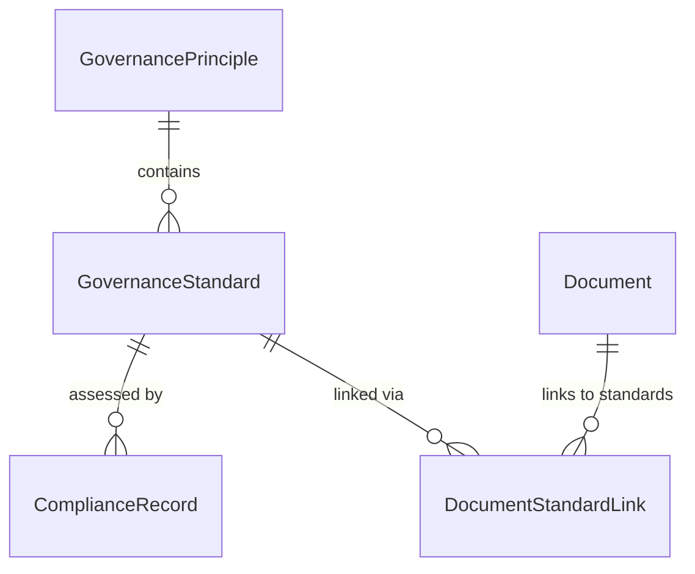

# Data Model Reference

CharityPilot persists its domain in PostgreSQL via Prisma. The schema (`apps/api/prisma/schema.prisma`) defines 33 models and 39 enums. The data model is multi-tenant: almost every business table carries an `organisationId` foreign key back to `Organisation`, which acts as the tenant root. This reference documents each model, its fields and relations, the enum set, the tenant-isolation pattern, composite unique constraints and indexes, and the important referential and immutability behaviours.

## Migration history

The schema was built up across 21 migrations under `apps/api/prisma/migrations/`, listed here for context (chronological by timestamp prefix):

| Migration directory | Purpose (inferred from name) |
| --- | --- |
| `20260402114212_init` | Initial schema |
| `20260403120000_add_auth_tokens` | Password reset / email verification tokens on `User` |
| `20260507162000_add_compliance_signoffs` | `ComplianceSignoff` model |
| `20260507173000_add_governance_registers` | Conflict / risk / complaint / fundraising / financial registers |
| `20260507190000_add_team_invites_and_reminder_logs` | `TeamInvite` and `DeadlineReminderLog` |
| `20260507203000_add_auth_sessions` | `AuthSession` refresh-token model |
| `20260606193000_add_stripe_webhook_events` | `StripeWebhookEvent` idempotency table |
| `20260607120000_add_document_storage_deletions` | `DocumentStorageDeletion` deletion queue |
| `20260607173000_add_document_storage_deletion_claims` | Claim columns/indexes for deletion worker |
| `20260608053000_add_active_team_invite_unique_index` | Partial unique index for active invites |
| `20260608072000_seed_governance_reference_data` | Seed governance principles/standards |
| `20260703214500_add_conditional_obligation_profile` | Conditional-obligation profile on `Organisation` |
| `20260710064500_add_billing_checkout_attempts` | Stripe subscription facts and one active Checkout-attempt lease per organisation |
| `20260710123000_add_compliance_revision_snapshots` | Compliance revisions, immutable approval snapshots, append-only audit history, and truthful legacy-approval invalidation |
| `20260710190000_add_deadline_calendar_lifecycle` | Exact civil-date calendar facts, confirmed legal evidence, versioned generated deadlines, and concurrent reminder-attempt lifecycle |
| `20260711030000_add_team_lifecycle_security` | Organisation/member lifecycle versions, rotating-session families and revocation reasons, exactly-one-owner constraints, and append-only security audit events |
| `20260711120000_add_billing_authority_grants` | Session/version-bound Checkout and Portal authority, immutable provider evidence, and ownership/lifecycle interlocks |
| `20260711180000_add_security_audit_subject_label_snapshot` | Immutable bounded subject-label snapshots with safe historical backfill |
| `20260711213000_add_document_storage_deletion_retry_lifecycle` | Bounded storage-deletion retry, dead-letter and recovery evidence lifecycle |
| `20260711230000_add_domain_invariants_referential_safety` | Governance chronology/evidence checks and tenant-safe board-member conflict references |
| `20260712013000_add_password_recovery_integrity` | Durable password-recovery requests/rate budgets, security-email outbox, reset audit event, and legacy-token expand compatibility |

A `seed.ts` script also lives at `apps/api/prisma/seed.ts`.

## Enums

All enums are declared at the top of the schema.

| Enum | Values | Used by |
| --- | --- | --- |
| `OrganisationComplexity` | `SIMPLE`, `COMPLEX` | `Organisation.complexity` |
| `LegalForm` | `CLG`, `TRUST`, `UNINCORPORATED_ASSOCIATION`, `OTHER` | `Organisation.legalForm` |
| `CharitablePurpose` | `POVERTY_RELIEF`, `EDUCATION`, `RELIGION`, `COMMUNITY_BENEFIT` | `Organisation.charitablePurpose` (array) |
| `ComplianceStatus` | `COMPLIANT`, `WORKING_TOWARDS`, `NOT_STARTED`, `NOT_APPLICABLE`, `EXPLAIN` | `ComplianceRecord.status` |
| `ComplianceSignoffStatus` | `DRAFT`, `BOARD_REVIEW`, `APPROVED` | `ComplianceSignoff.status` |
| `ComplianceAuditEventType` | baseline import, record/signoff change, approval grant/invalidation, legacy invalidation | `ComplianceAuditEvent.type` |
| `ComplianceApprovalInvalidationReason` | `RECORD_CHANGED`, `MANUAL_STATUS_CHANGE`, `LEGACY_APPROVAL_UNBOUND` | `ComplianceSignoff`, `ComplianceAuditEvent` |
| `SubscriptionPlan` | `ESSENTIALS`, `COMPLETE` | `Subscription.plan` |
| `SubscriptionStatus` | `TRIALING`, `ACTIVE`, `PAST_DUE`, `CANCELLED`, `EXPIRED` | `Subscription.status` |
| `BillingCheckoutAttemptStatus` | `PENDING`, `SESSION_CREATED`, `COMPLETED` | `BillingCheckoutAttempt.status` |
| `BillingAuthorityGrantKind` | `CHECKOUT`, `PORTAL` | `BillingAuthorityGrant.kind` |
| `BillingAuthorityGrantState` | `CLAIMED`, `PROVIDER_STARTED`, `CAPABILITY_ISSUED`, `RELEASED` | `BillingAuthorityGrant.state` |
| `BillingAuthorityGrantReleaseReason` | provider not-issued/revoked/terminal, elapsed Checkout safe-release time, restricted operator attestation | `BillingAuthorityGrant.releaseReason` |
| `DocumentCategory` | `CONSTITUTION`, `POLICY`, `BOARD_MINUTES`, `FINANCIAL_STATEMENT`, `INSURANCE`, `ANNUAL_REPORT`, `RISK_REGISTER`, `CODE_OF_CONDUCT`, `STRATEGIC_PLAN`, `OTHER` | `Document.category` |
| `DocumentStorageDeletionState` | `PENDING`, `DEAD_LETTER`, `PROCESSED` | `DocumentStorageDeletion.state` |
| `DocumentStorageDeletionTerminalReason` | `MAX_ATTEMPTS_EXHAUSTED`, `PERMANENT_STORAGE_PATH_REJECTED` | `DocumentStorageDeletion.terminalReason` |
| `DocumentStorageDeletionRecoveryActorType` | `TENANT_USER`, `PLATFORM_OPERATOR` | `DocumentStorageDeletionRecovery.actorType` |
| `DocumentStorageDeletionRecoveryDisposition` | unchanged/corrected-path requeue or externally evidenced completion | `DocumentStorageDeletionRecovery.disposition` |
| `RegisterStatus` | `OPEN`, `MONITORING`, `CLOSED` | `RiskRecord`, `ComplaintRecord`, `FundraisingRecord` |
| `ConflictStatus` | `DECLARED`, `MANAGED`, `CLOSED` | `ConflictRecord.status` |
| `RiskCategory` | `GOVERNANCE`, `FINANCIAL`, `OPERATIONAL`, `LEGAL`, `SAFEGUARDING`, `REPUTATIONAL`, `FUNDRAISING`, `DATA_PROTECTION`, `OTHER` | `RiskRecord.category` |
| `AnnualReportFilingStatus` | `NOT_STARTED`, `IN_PROGRESS`, `BOARD_APPROVED`, `FILED` | `AnnualReportReadiness.filingStatus` |
| `UserRole` | `OWNER`, `ADMIN`, `MEMBER` | `User.role`, `TeamInvite.role` |
| `OrganisationLifecycleStatus` | `ACTIVE`, `SUSPENDED`, `CLOSED` | `Organisation.lifecycleStatus` |
| `UserLifecycleStatus` | `ACTIVE`, `SUSPENDED`, `REMOVED` | `User.lifecycleStatus` |
| `AuthSessionRevocationReason` | logout, rotation/reuse/expiry, password/member/ownership/admin/user revocation reasons | `AuthSession.revocationReason` |
| `SecurityAuditActorKind` | `USER`, `SUPPORT`, `SYSTEM` | `SecurityAuditEvent.actorKind` |
| `SecurityAuditEventType` | unchanged member/invite/role/ownership/session transitions | `SecurityAuditEvent.type`; reset completion is stored compatibly as truthful `ALL_SESSIONS_REVOKED` plus trusted immutable context and projected as the virtual API label `PASSWORD_RESET_COMPLETED` |
| `PasswordRecoverySource` | `SELF_SERVICE_EMAIL`, `LEGACY_USER_SLOT`, `PERSONAL_SERVER_OPERATOR` | `PasswordRecoveryRequest.source` |
| `PasswordRecoveryDeliveryState` | `SUPPRESSED`, `PENDING`, `SENDING`, `ACCEPTED`, `REJECTED`, `UNCERTAIN` | `PasswordRecoveryRequest.deliveryState` |
| `PasswordRecoverySuppressionReason` | no eligible account, durable rate limit, outstanding-link limit | `PasswordRecoveryRequest.suppressionReason` |
| `PasswordRecoveryTerminationReason` | reset completed, delivery rejected, key unavailable/rotated, account inactive, expired | `PasswordRecoveryRequest.terminationReason` |
| `AuthRecoveryRateLimitScope` | identifier/network 15-minute and 24-hour forgot/reset windows | `AuthRecoveryRateLimitBucket.scope` |
| `AuthSecurityEmailKind` | `PASSWORD_RESET_COMPLETED_NOTICE` | `AuthSecurityEmailOutbox.kind` |
| `AuthSecurityEmailDeliveryState` | `PENDING`, `SENDING`, `ACCEPTED`, `REJECTED`, `UNCERTAIN` | `AuthSecurityEmailOutbox.deliveryState` |
| `DeadlineReminderStatus` | `RESERVED`, `SENDING`, `SENT`, `SKIPPED`, `FAILED`, `UNCERTAIN` | `DeadlineReminderLog.status` |
| `DeadlineReminderReconciliationOutcome` | `ACCEPTED_CONFIRMED`, `NOT_ACCEPTED_CONFIRMED`, `UNKNOWN_ACKNOWLEDGED` | Immutable restricted-operator resolution of an `UNCERTAIN` attempt |
| `GeneratedDeadlineKind` | `CHARITY_ANNUAL_REPORT`, `COMPANY_FINANCIAL_STATEMENTS`, `COMPANY_ANNUAL_MEMBER_ACTION`, `CRO_ANNUAL_RETURN`, `LEGACY_UNVERIFIED` | `Deadline.generatedKind` |
| `DeadlineSupersessionReason` | `INPUT_CHANGED`, `INPUT_REMOVED`, `RULE_CHANGED`, `RECURRENCE_ADVANCED`, `LEGACY_MIGRATION` | `Deadline.supersessionReason` |

## Tenant-isolation pattern

`Organisation` (`apps/api/prisma/schema.prisma:118-156`) is the tenant root. Records are partitioned into three categories by how they relate to a tenant:

| Category | Models | Isolation key |
| --- | --- | --- |
| **Org-scoped** (carry `organisationId` FK to `Organisation`) | `User`, `ComplianceRecord`, `ComplianceSignoff`, `ComplianceApprovalSnapshot`, `BoardMember`, `Document`, `ConflictRecord`, `RiskRecord`, `ComplaintRecord`, `FundraisingRecord`, `AnnualReportReadiness`, `FinancialControlReview`, `Deadline`, `TeamInvite`, `DeadlineReminderLog`, `Subscription`, `BillingCheckoutAttempt`, `BillingAuthorityGrant`, `SecurityAuditEvent`, targeted `PasswordRecoveryRequest`, `AuthSecurityEmailOutbox` | `organisationId` |
| **Global reference data** (shared across all tenants, no `organisationId`) | `GovernancePrinciple`, `GovernanceStandard` | none — read-only catalogue |
| **Keyed differently** | `AuthSession` (by `userId`), suppressed `PasswordRecoveryRequest` and `AuthRecoveryRateLimitBucket` (keyed-HMAC subjects only), singleton `AuthRecoveryControl`, append-only `AuthRecoveryRetiredSecret`, `DocumentStandardLink` (by `documentId`/`standardId`), `DocumentStorageDeletion` and `ComplianceAuditEvent` (retain tenant identifiers as scalar history), `StripeWebhookEvent` (global, by Stripe event `id`) | see notes |

Notes on the differently-keyed models:

- **`AuthSession`** (`apps/api/prisma/schema.prisma:178-191`) belongs to a `User`, not directly to an `Organisation`; tenancy is reached transitively through `User.organisationId`.
- **`DocumentStandardLink`** (`apps/api/prisma/schema.prisma:315-323`) is a join table between an (org-scoped) `Document` and a (global) `GovernanceStandard`; it inherits tenancy from its `Document`.
- **`DocumentStorageDeletion`** (`apps/api/prisma/schema.prisma:325-339`) stores `organisationId` as a plain string column with no relation back to `Organisation` — it is a background deletion queue keyed by `storagePath`, so the row can outlive the parent organisation row.
- **`ComplianceAuditEvent`** stores organisation, actor and entity identifiers as scalar historical facts rather than cascading relations. Removing a user must not erase who changed governance evidence. Retention and eventual erasure policy still require external privacy/legal approval before production use.
- **`StripeWebhookEvent`** (`apps/api/prisma/schema.prisma:581-588`) is entirely global; its `id` is the Stripe event ID and the row exists purely for webhook idempotency.
- **`BillingAuthorityGrant`** uses composite tenant/actor and actor/session foreign
  keys. It is append-only after release and has a partial unique index allowing
  at most one unresolved provider capability per organisation.
- **`SecurityAuditEvent`** is organisation-scoped and append-only. Actor and
  subject relations use composite tenant keys with restrictive deletion so
  lifecycle history cannot be erased by a later membership action.
- **Suppressed `PasswordRecoveryRequest` rows** intentionally have no user or
  organisation relation. They retain only keyed digests and bounded suppression
  evidence so unknown-account requests consume the same durable budgets without
  storing the submitted identity.
- **`AuthRecoveryRateLimitBucket`** contains no tenant or user fact; its
  domain-separated keyed digest is the complete subject identity for one
  bounded window.

## Models

### Organisation
The tenant root in `apps/api/prisma/schema.prisma`.

| Field | Type | Notes |
| --- | --- | --- |
| `id` | `String` | `@id @default(cuid())` |
| `name` | `String` | |
| `rcnNumber`, `croNumber` | `String?` | Registered Charity Number / Companies Registration Office number |
| `legalForm` | `LegalForm?` | No default: CharityPilot must not infer CLG status |
| `legalFormConfirmedAt` | `DateTime?` | Evidence that the retained legal-form value was explicitly checked; may be cleared without deleting `legalForm` |
| `complexity` | `OrganisationComplexity` | `@default(SIMPLE)` |
| `charitablePurpose` | `CharitablePurpose[]` | enum array |
| `financialYearEnd`, `dateRegistered`, `incorporationDate` | `DateTime? @db.Date` | Exact civil dates; API representation is `YYYY-MM-DD`, not an instant |
| `croAnnualReturnDate` | `DateTime? @db.Date` | Exact ARD copied from CRO CORE |
| `croAnnualReturnDateConfirmedAt` | `DateTime?` | Evidence that the retained ARD was explicitly checked; may be cleared without deleting the ARD |
| `lastActualAgmDate` | `DateTime? @db.Date` | An AGM that actually occurred; the migration renames the legacy ambiguous AGM column |
| `lastUnanimousAnnualMemberResolutionDate` | `DateTime? @db.Date` | Kept separate from the actual AGM fact |
| `memberCount` | `Int?` | Database check permits null or an integer of at least 1 |
| `registeredAddress`, `contactEmail`, `contactPhone`, `website` | `String?` | |
| `stripeCustomerId` | `String? @unique` | links to the organisation's metadata-verified Stripe customer |
| `lifecycleStatus` | `OrganisationLifecycleStatus` | active by default; suspended/closed organisations cannot authenticate or accept invitations |
| `lifecycleChangedAt`, `lifecycleVersion` | `DateTime`, `Int` | database-managed optimistic lifecycle evidence |
| `createdAt` / `updatedAt` | `DateTime` | |

Has-many relations to nearly every org-scoped model, including immutable
`complianceApprovalSnapshots`, plus one-to-one optional
`subscription` (`Subscription?`) and `billingCheckoutAttempt`
(`BillingCheckoutAttempt?`) relations, plus billing-authority grants and
append-only security events. Deleting an organisation cascades its
Checkout-attempt lease; the subscription relation retains Prisma's default
referential action.

Database checks prevent a confirmation timestamp without its corresponding
value. Organisation calendar updates are validated and reconciled with
generated deadlines inside one serializable transaction protected by an
organisation-row lock. Clearing a confirmation retains the recorded fact but
causes dependent current generated deadlines to be superseded.

### User
`apps/api/prisma/schema.prisma:150-176`

| Field | Type | Notes |
| --- | --- | --- |
| `id` | `String` | `@id @default(cuid())` |
| `email` | `String @unique` | |
| `name`, `passwordHash` | `String` | |
| `role` | `UserRole` | `@default(MEMBER)` |
| `organisationId` | `String` | FK → `Organisation` (no explicit `onDelete`, defaults to restrict) |
| `emailVerified` | `Boolean` | `@default(false)` |
| `lifecycleStatus` | `UserLifecycleStatus` | `ACTIVE` by default; suspension/removal denies every session-backed request |
| `membershipChangedAt`, `membershipVersion` | `DateTime`, `Int` | database-managed version for role/lifecycle/tenant changes |
| `resetToken`, `verifyToken` | `String? @unique` | password reset / email verification tokens |
| `resetTokenExpiry`, `verifyTokenExpiry` | `DateTime?` | |

Relations: named back-relations `complianceUpdates`, `signoffUpdates`, `documentUploads`, `sentInvites`, plus `reminderLogs`, `authSessions`, password-recovery requests, security-email outbox rows, billing-authority grants, and security-audit actor/subject links. Composite uniqueness on `(id, organisationId)` constrains tenant-bound relations. A partial unique index plus deferred continuity trigger enforce exactly one active owner per organisation, and membership triggers increment the version and reject hard deletion. The legacy `resetToken` pair remains only for the expand-compatibility window; new requests use `PasswordRecoveryRequest`.

### AuthSession
`apps/api/prisma/schema.prisma:178-191` — refresh-token store for rotating JWT sessions.

| Field | Type | Notes |
| --- | --- | --- |
| `id` | `String` | `@id @default(cuid())` |
| `userId` | `String` | FK → `User`, `onDelete: Cascade` |
| `refreshTokenHash` | `String @unique` | hashed refresh token |
| `familyId`, `familyCreatedAt` | `UUID`, `DateTime` | one rotating refresh-token family, retained across successors |
| `deviceLabel` | `String?` | bounded display hint for session management; never trusted as identity |
| `expiresAt` | `DateTime` | |
| `revokedAt` | `DateTime?` | |
| `revocationReason` | `AuthSessionRevocationReason?` | immutable reason paired with revocation time |

Composite uniqueness on `(id, userId)` lets billing authority prove that its session belongs to its actor. Indexes support active-session, expiry, and family lookups. Database triggers require an active principal at insert time and make session identity and revocation evidence one-way and immutable.

### BillingAuthorityGrant

An append-only authority ledger for provider-hosted Checkout and Billing Portal
capabilities.

| Field | Type | Notes |
| --- | --- | --- |
| `id` | `UUID` | primary key generated by PostgreSQL |
| `organisationId` | `String` | restrictive FK to the tenant |
| `kind`, `state` | `BillingAuthorityGrantKind`, `BillingAuthorityGrantState` | one unresolved grant per organisation |
| `actorUserId`, `actorSessionId`, `actorMembershipVersion` | `String`, `String`, `Int` | composite tenant/session binding to the exact active owner principal |
| `providerResourceId` | `String? @unique` | immutable Checkout/Portal provider resource once known |
| `safeReleaseAfter` | `DateTime?` | Checkout only; never used to time-release Portal authority |
| `claimedAt`, `providerStartedAt`, `capabilityIssuedAt` | `DateTime` / nullable | monotonic provider timeline evidence |
| `releasedAt`, `releaseReason`, `releaseActor`, `releaseEvidence` | nullable terminal tuple | required together in `RELEASED`; immutable after release |

Database checks constrain every state/evidence combination and transition.
Triggers validate that a new grant belongs to the current active owner and live
session, reject deletion or evidence rewrites, and interlock owner membership
and organisation lifecycle changes while a grant is unresolved.

### SecurityAuditEvent

Immutable team-security and governance evidence.

| Field | Type | Notes |
| --- | --- | --- |
| `organisationId` | `String` | tenant root; included in composite actor/subject relations |
| `type` | `SecurityAuditEventType` | invite, member, role, ownership, or session event |
| `actorKind` | `SecurityAuditActorKind` | user, restricted support operator, or system |
| `actorUserId`, `actorLabel` | nullable id plus bounded label | support/system events do not fabricate a user |
| `subjectUserId`, `subjectSessionId` | nullable identifiers | affected membership or session family where applicable |
| `subjectLabel` | bounded non-empty string | immutable human-readable subject snapshot retained even if a user or invitation later changes |
| `reason`, `context`, `requestId`, `occurredAt` | evidence fields | bounded human reason and structured immutable context |

Insert checks enforce actor-kind consistency and tenant-safe actor/subject
relations. Update and delete triggers always reject; UI responses use a
privacy-minimised projection rather than exposing raw evidence identifiers.

### PasswordRecoveryRequest

A bounded ledger for self-service, legacy-expand, and personal-server recovery
links. It stores only the token hash plus the nonce/key version required to
derive a self-service token; plaintext tokens never enter PostgreSQL.

Targeted rows carry composite user/organisation relations, bounded recipient
and frontend-origin snapshots, a one-hour expiry, delivery claim/evidence, and
an optional terminal tuple. Suppressed dummy rows contain only
domain-separated keyed identifier/IP/network digests and a suppression reason,
so unknown account input is not retained. Checks constrain every source,
delivery, claim, timeline and termination shape. Immutable identity/evidence
columns cannot be rewritten after insert, while the delivery worker may make
only the enumerated monotonic state transitions. Key rotation may perform the
single permitted destructive privacy transition: clear all retained keyed
identifier/IP/network evidence together and set `requestEvidenceRedactedAt`.
Review-worthy terminal outcomes use separate durable alert claim and
acknowledgement timestamps, so cleanup cannot erase pending operator action. A
trigger-maintained evidence anchor advances on delivery finalization, request
termination, or alert acknowledgement; ordinary retention is measured from that
latest durable event rather than initial row creation.

### AuthRecoveryRateLimitBucket

Durable multi-instance abuse budgets keyed by `(scope, keyVersion,
subjectDigest, windowStartedAt)`. Only domain-separated HMAC digests and bounded
window counts are stored. Expiry indexes support cleanup after no more than 48
hours; no raw email, IP or network value is present.

### AuthRecoveryControl

One singleton row is the transaction-ordering root for recovery. It binds the
active secret fingerprint to a positive generation. Every request, reset,
delivery, cleanup and review-alert transaction locks it before other recovery
state. Rotation changes it atomically to blocked, records the old fingerprint
in append-only `AuthRecoveryRetiredSecret` history, and advances the generation.
Exact-generation activation accepts only a fingerprint that has never appeared
in that history after all zero postconditions hold. A database trigger permits
only initial binding, active-to-blocked rotation, and blocked-to-active
replacement activation; direct key swaps and control deletion fail closed.

### AuthRecoveryRetiredSecret

Append-only history of every fingerprint retired by a successful recovery-key
rotation. Database triggers accept an insert only when its fingerprint and
generation match the current active control row, reject update/deletion/
truncation, and require that exact history row before the control can advance to
blocked. Replacement activation fails if the candidate fingerprint appears
anywhere in this history, not only if it matches the most recent key.

### AuthSecurityEmailOutbox

A tenant/user/audit-bound outbox for the registered-address
`PASSWORD_RESET_COMPLETED_NOTICE`. It is created in the same transaction as the
password change, recovery termination, session revocation and immutable audit
event. The stored audit type remains the predecessor-compatible and truthful
`ALL_SESSIONS_REVOKED`; trusted append-only context identifies reset completion,
and the current audit API projects that exact marker as
`PASSWORD_RESET_COMPLETED`. Provider claim/evidence follows the same bounded
pending/sending/accepted/rejected/uncertain lifecycle without mutating the audit
row. Rejected and uncertain rows use the same durable review-alert claim/ack
lifecycle. Its trigger-maintained evidence anchor advances on terminal delivery
or alert acknowledgement. Ordinary retention is seven days from that latest
durable event, while an unacknowledged review row is retained until the alert
succeeds.

### GovernancePrinciple
`apps/api/prisma/schema.prisma:193-201` — global reference data (the governance code's principles).

| Field | Type | Notes |
| --- | --- | --- |
| `id` | `String` | `@id @default(cuid())` |
| `number` | `Int @unique` | principle number |
| `title`, `description` | `String` | |
| `sortOrder` | `Int` | display ordering |

Has-many `standards` (`GovernanceStandard[]`).

### GovernanceStandard
`apps/api/prisma/schema.prisma:203-217` — global reference data; the individual standards under each principle.

| Field | Type | Notes |
| --- | --- | --- |
| `id` | `String` | `@id @default(cuid())` |
| `principleId` | `String` | FK → `GovernancePrinciple` |
| `code` | `String @unique` | standard code |
| `title` | `String` | |
| `isCore`, `isAdditional` | `Boolean` | classification flags |
| `sortOrder` | `Int` | |

Relations: `complianceRecords`, `documentLinks`. Index `@@index([principleId])` (`apps/api/prisma/schema.prisma:216`).

### ComplianceRecord
`apps/api/prisma/schema.prisma:219-241` — one organisation's status against one standard for one reporting year.

| Field | Type | Notes |
| --- | --- | --- |
| `id` | `String` | `@id @default(cuid())` |
| `organisationId` | `String` | FK → `Organisation` |
| `standardId` | `String` | FK → `GovernanceStandard` |
| `reportingYear` | `Int` | |
| `status` | `ComplianceStatus` | `@default(NOT_STARTED)` |
| `actionTaken`, `evidence`, `notes`, `explanationIfNA` | `String?` | |
| `revision` | `Int` | Optimistic-concurrency version, starting at 1 |
| `updatedById` | `String?` | FK → `User` (`UpdatedBy` relation) |

Constraint `@@unique([organisationId, standardId, reportingYear])` (`apps/api/prisma/schema.prisma:239`) enforces a single record per (tenant, standard, year). Index `@@index([organisationId, reportingYear])` (`apps/api/prisma/schema.prisma:240`) supports per-year compliance dashboards.

### ComplianceSignoff
`apps/api/prisma/schema.prisma:243-264` — board sign-off of a reporting year's compliance.

| Field | Type | Notes |
| --- | --- | --- |
| `id` | `String` | `@id @default(cuid())` |
| `organisationId` | `String` | FK → `Organisation` |
| `reportingYear` | `Int` | |
| `status` | `ComplianceSignoffStatus` | `@default(DRAFT)` |
| `boardMeetingDate`, `approvedAt` | `DateTime?` | |
| `minuteReference`, `approvedByName`, `approvedByRole`, `approvalNotes` | `String?` | |
| `revision` | `Int` | Optimistic-concurrency version, starting at 1 |
| `approvalSequence` | `Int` | Monotonic immutable-snapshot sequence for the year |
| `currentApprovalSnapshotId` | `String? @unique` | Current approved snapshot; cleared on invalidation |
| `invalidatedAt`, `invalidationReason`, `invalidatedById` | nullable | Why and when a current approval stopped applying |
| `updatedById` | `String?` | FK → `User` (`SignoffUpdatedBy` relation) |

Constraint `@@unique([organisationId, reportingYear])` (`apps/api/prisma/schema.prisma:262`) — one sign-off per tenant per year. Index `@@index([organisationId, reportingYear])` (`apps/api/prisma/schema.prisma:263`).

The migration adds a database check that an `APPROVED` signoff must have both
`approvedAt` and a current snapshot, while every non-approved signoff has
neither. Existing pre-migration approvals are downgraded to `DRAFT` with
`LEGACY_APPROVAL_UNBOUND`; the migration does not fabricate a historical
snapshot from whatever mutable records happen to exist during deployment.

### ComplianceApprovalSnapshot

An append-only, tenant/year-scoped JSON evidence envelope created only inside
the serializable approval transaction. It stores a per-year sequence,
`formatVersion`, lowercase SHA-256 `evidenceHash` and `snapshotHash`, the
canonical payload, approval timestamp, and recording-user identity snapshot.
The unique `(organisationId, reportingYear, approvalSequence)` key preserves
every reapproval version. The hash is an integrity check, not an electronic
signature or proof that the recorded meeting occurred.

PostgreSQL `BEFORE UPDATE OR DELETE` triggers reject mutation of snapshot rows.
Approved exports re-validate tenant, year, sequence, approval time, payload and
both hashes before rendering. Deletion/retention policy for this personal and
governance data remains a named external privacy/legal decision.

### ComplianceAuditEvent

Append-only history for record baselines, creates/updates, signoff baselines,
approval grants, approval invalidations, and unbound legacy approvals. Events
retain before/after revision snapshots, actor identity, relevant entity IDs,
reason and occurrence time. Unique record/signoff revision keys prevent two
events from claiming the same entity revision, and a database trigger rejects
`UPDATE` and `DELETE`.

### BoardMember
`apps/api/prisma/schema.prisma:266-286`

| Field | Type | Notes |
| --- | --- | --- |
| `id` | `String` | `@id @default(cuid())` |
| `organisationId` | `String` | FK → `Organisation` |
| `name`, `role` | `String` | |
| `email` | `String?` | |
| `appointedDate` | `DateTime` | |
| `termEndDate` | `DateTime?` | |
| `isActive` | `Boolean` | `@default(true)` |
| `conductSigned`, `inductionCompleted` | `Boolean` | `@default(false)` |
| `conductSignedDate`, `inductionDate` | `DateTime?` | |

Has-many `conflictRecords`. Index `@@index([organisationId])` (`apps/api/prisma/schema.prisma:285`).

### Document
`apps/api/prisma/schema.prisma:288-313`

| Field | Type | Notes |
| --- | --- | --- |
| `id` | `String` | `@id @default(cuid())` |
| `organisationId` | `String` | FK → `Organisation` |
| `name` | `String` | |
| `description` | `String?` | |
| `category` | `DocumentCategory` | |
| `fileUrl`, `mimeType` | `String` | |
| `fileSize` | `Int` | |
| `version` | `Int` | `@default(1)` |
| `owner`, `boardMinuteReference` | `String?` | |
| `approvedDate`, `nextReviewDate` | `DateTime?` | |
| `uploadedById` | `String?` | FK → `User` (`UploadedBy` relation) |

Has-many `standardLinks`. Index `@@index([organisationId])` (`apps/api/prisma/schema.prisma:312`).

### DocumentStandardLink
`apps/api/prisma/schema.prisma:315-323` — many-to-many join between `Document` and `GovernanceStandard`.

| Field | Type | Notes |
| --- | --- | --- |
| `id` | `String` | `@id @default(cuid())` |
| `documentId` | `String` | FK → `Document`, `onDelete: Cascade` |
| `standardId` | `String` | FK → `GovernanceStandard` |

Constraint `@@unique([documentId, standardId])` (`apps/api/prisma/schema.prisma:322`) prevents duplicate links. Deleting a `Document` cascades its links.

### DocumentStorageDeletion
`apps/api/prisma/schema.prisma:325-339` — background queue for deleting orphaned storage objects.

| Field | Type | Notes |
| --- | --- | --- |
| `id` | `String` | `@id @default(cuid())` |
| `organisationId` | `String` | plain column (no relation) |
| `storagePath` | `String` | object key to delete |
| `attempts` | `Int` | `@default(0)` |
| `lastError` | `String?` | |
| `claimedAt`, `processedAt` | `DateTime?` | worker claim / completion markers |

Indexes: `@@index([organisationId])`, `@@index([processedAt, createdAt])`, `@@index([processedAt, claimedAt, createdAt])` (`apps/api/prisma/schema.prisma:336-338`). The composite indexes support the deletion worker scanning for unprocessed / unclaimed jobs in order.

### ConflictRecord
`apps/api/prisma/schema.prisma:341-363` — conflict-of-interest register.

| Field | Type | Notes |
| --- | --- | --- |
| `id` | `String` | `@id @default(cuid())` |
| `organisationId` | `String` | FK → `Organisation` |
| `boardMemberId` | `String?` | FK → `BoardMember`, `onDelete: SetNull` |
| `trusteeName`, `matter`, `nature`, `actionTaken` | `String` | |
| `dateDeclared` | `DateTime` | |
| `meetingDate`, `nextReviewDate` | `DateTime?` | |
| `decision`, `minuteReference` | `String?` | |
| `status` | `ConflictStatus` | `@default(DECLARED)` |

Indexes: `@@index([organisationId])`, `@@index([boardMemberId])` (`apps/api/prisma/schema.prisma:361-362`). When a `BoardMember` is deleted the `boardMemberId` is nulled (`onDelete: SetNull`), preserving the conflict record (the `trusteeName` string retains identity).

### RiskRecord
`apps/api/prisma/schema.prisma:365-384` — risk register.

| Field | Type | Notes |
| --- | --- | --- |
| `id` | `String` | `@id @default(cuid())` |
| `organisationId` | `String` | FK → `Organisation` |
| `title`, `description`, `mitigation` | `String` | |
| `category` | `RiskCategory` | |
| `likelihood`, `impact` | `Int` | scoring inputs |
| `owner`, `boardMinuteReference` | `String?` | |
| `reviewDate` | `DateTime?` | |
| `status` | `RegisterStatus` | `@default(OPEN)` |

Index `@@index([organisationId])` (`apps/api/prisma/schema.prisma:383`).

### ComplaintRecord
`apps/api/prisma/schema.prisma:386-403` — complaints register.

| Field | Type | Notes |
| --- | --- | --- |
| `id` | `String` | `@id @default(cuid())` |
| `organisationId` | `String` | FK → `Organisation` |
| `receivedDate` | `DateTime` | |
| `source`, `actionTaken`, `outcome`, `boardMinuteReference` | `String?` | |
| `summary` | `String` | |
| `status` | `RegisterStatus` | `@default(OPEN)` |
| `reviewedByBoard` | `Boolean` | `@default(false)` |

Index `@@index([organisationId])` (`apps/api/prisma/schema.prisma:402`).

### FundraisingRecord
`apps/api/prisma/schema.prisma:405-425` — fundraising activity register.

| Field | Type | Notes |
| --- | --- | --- |
| `id` | `String` | `@id @default(cuid())` |
| `organisationId` | `String` | FK → `Organisation` |
| `name`, `activityType` | `String` | |
| `startDate`, `endDate` | `DateTime?` | |
| `publicFacing` | `Boolean` | `@default(true)` |
| `thirdPartyFundraiser`, `controls`, `reviewOutcome`, `boardMinuteReference` | `String?` | |
| `complaintsReceived` | `Boolean` | `@default(false)` |
| `status` | `RegisterStatus` | `@default(OPEN)` |

Index `@@index([organisationId])` (`apps/api/prisma/schema.prisma:424`).

### AnnualReportReadiness
`apps/api/prisma/schema.prisma:427-450` — annual report preparation checklist per reporting year.

| Field | Type | Notes |
| --- | --- | --- |
| `id` | `String` | `@id @default(cuid())` |
| `organisationId` | `String` | FK → `Organisation` |
| `reportingYear` | `Int` | |
| `activitiesNarrative`, `publicBenefitStatement`, `beneficiariesSummary`, `notes` | `String?` | |
| `financialStatementsApproved`, `annualReportUploaded`, `trusteeDetailsReviewed`, `fundraisingReviewed`, `complaintsReviewed` | `Boolean` | `@default(false)` |
| `boardApprovalDate`, `filedDate` | `DateTime?` | |
| `filingStatus` | `AnnualReportFilingStatus` | `@default(NOT_STARTED)` |

Constraint `@@unique([organisationId, reportingYear])` (`apps/api/prisma/schema.prisma:448`) — one readiness record per tenant per year. Index `@@index([organisationId, reportingYear])` (`apps/api/prisma/schema.prisma:449`).

### FinancialControlReview
`apps/api/prisma/schema.prisma:452-476` — annual financial-controls self-assessment.

| Field | Type | Notes |
| --- | --- | --- |
| `id` | `String` | `@id @default(cuid())` |
| `organisationId` | `String` | FK → `Organisation` |
| `reportingYear` | `Int` | |
| `bankReconciliationsReviewed`, `dualAuthorisation`, `budgetApproved`, `managementAccountsReviewed`, `reservesReviewed`, `restrictedFundsReviewed`, `assetsInsuranceReviewed`, `payrollControlsReviewed`, `fundraisingControlsReviewed` | `Boolean` | `@default(false)` |
| `reviewedBy`, `minuteReference`, `actions` | `String?` | |
| `reviewDate` | `DateTime?` | |

Constraint `@@unique([organisationId, reportingYear])` (`apps/api/prisma/schema.prisma:474`) — one review per tenant per year. Index `@@index([organisationId, reportingYear])` (`apps/api/prisma/schema.prisma:475`).

### Deadline
Current and historical calendar occurrences in `apps/api/prisma/schema.prisma`.

| Field | Type | Notes |
| --- | --- | --- |
| `id` | `String` | `@id @default(cuid())` |
| `organisationId` | `String` | FK → `Organisation` |
| `title` | `String` | |
| `description` | `String?` | |
| `dueDate` | `DateTime @db.Date` | Exact civil date returned by the API as `YYYY-MM-DD` |
| `scheduleVersion` | `Int` | `@default(1)`; incremented when a manual occurrence is rescheduled or reopened so reminder identity cannot leak across schedules |
| `isAutoGenerated` | `Boolean` | `@default(false)` |
| `generatedKind`, `generatedKey` | nullable enum / string | Stable rule identity for generated occurrences |
| `generationVersion`, `generationRuleVersion` | `Int?` | Occurrence version and implemented rule version |
| `generationFingerprint` | `String? @db.Char(64)` | Deterministic SHA-256 of rule, sources, inputs and output |
| `generationSource`, `generationInputs` | `Json?` | Frozen provenance, warnings and exact calculation inputs |
| `profileRuleKey` | `String?` | Stable identity for a manual conditional-profile review deadline |
| `isComplete` | `Boolean` | `@default(false)` |
| `completedDate` | `DateTime?` | Completion instant when known |
| `completionDateKnown` | `Boolean` | `false` only for a retained completed legacy row whose completion instant was not recorded |
| `reminderDays` | `Int[]` | `@default([30, 14, 7])` — days-before-due to send reminders |
| `supersededAt`, `supersededById`, `supersessionReason` | nullable | Append-only generated lifecycle; the old occurrence points to its successor when one exists |
| `archivedAt` | `DateTime?` | Soft deletion for manual deadlines |

Generated rows are immutable apart from a one-way atomic completion. A changed
rule or verified input supersedes the current row and creates a new
`generationVersion`; removed or unconfirmed inputs supersede without inventing
a successor. Legacy generated rows are retained as `LEGACY_UNVERIFIED`,
superseded history rather than treated as current guidance.

The schema has composite tenant-safe identity, successor, and generated-version
keys. Migration-level partial unique indexes allow only one current generated
row per `(organisationId, generatedKey)` and only one incomplete current manual
profile review per `(organisationId, profileRuleKey)`. Checks enforce coherent
generation metadata, a positive schedule version, a lowercase 64-character
fingerprint, object-shaped JSON provenance, truthful completion state,
consistent supersession state, allowed profile keys, and exclusion of
`profileRuleKey` from generated rows. Current-list indexes cover
tenant/lifecycle/due-date and tenant/completion/due-date access.

### TeamInvite
`apps/api/prisma/schema.prisma:497-515`

| Field | Type | Notes |
| --- | --- | --- |
| `id` | `String` | `@id @default(cuid())` |
| `organisationId` | `String` | FK → `Organisation`, `onDelete: Cascade` |
| `email` | `String` | |
| `role` | `UserRole` | `@default(MEMBER)` |
| `token` | `String @unique` | invite acceptance token |
| `invitedById` | `String?` | FK → `User` (`InvitedBy`), `onDelete: SetNull` |
| `acceptedAt`, `revokedAt` | `DateTime?` | |
| `expiresAt` | `DateTime` | |

Indexes: `@@index([organisationId])`, `@@index([email])` (`apps/api/prisma/schema.prisma:513-514`). Deleting an `Organisation` cascades its invites; deleting the inviting `User` nulls `invitedById`. (Migration `20260608053000_add_active_team_invite_unique_index` adds a partial unique index enforcing one active invite per email per organisation at the database level, beyond what the schema annotations express.)

### DeadlineReminderLog
One reservation/delivery attempt for one deadline schedule occurrence and
recipient. It also serves as immutable historical evidence after the attempt is
terminal.

| Field | Type | Notes |
| --- | --- | --- |
| `id` | `String` | `@id @default(cuid())` |
| `organisationId` | `String` | FK → `Organisation`, `onDelete: Cascade` |
| `deadlineId` | `String` | Composite FK with `organisationId` → tenant-owned `Deadline`, `onDelete: Cascade` |
| `deadlineScheduleVersion` | `Int` | Snapshot of the deadline schedule identity; manual reschedule/reopen increments it, while generated recurrence uses a new deadline row |
| `deadlineTitle` | `String` | Title snapshot for post-cutover rows; migration-time context only when `deadlineSnapshotKnown=false` |
| `deadlineDueDate` | `DateTime @db.Date` | Exact due-date snapshot for post-cutover rows; migration-time context only when `deadlineSnapshotKnown=false` |
| `deadlineSnapshotKnown`, `deliveryTimingKnown` | `Boolean` | Explicit provenance discriminators; both are false for every pre-P0-06 row |
| `legacyDeliveryStatus` | `String?` | Original pre-P0-06 `SENT` / `FAILED` / `SKIPPED` claim, preserved as unverified evidence |
| `legacyRecordedAt` | `DateTime?` | Original legacy timestamp with deliberately unspecified meaning; never presented as provider-start/reservation proof |
| `userId` | `String?` | Composite FK with `organisationId` → tenant-owned `User`, `onDelete: Restrict` |
| `email` | `String` | recipient |
| `reminderDays` | `Int` | which reminder offset this log covers |
| `status` | `DeadlineReminderStatus` | `RESERVED` / `SENDING` / `SENT` / `SKIPPED` / `FAILED` / `UNCERTAIN` |
| `reservationToken` | `String @unique` | Random compare-and-set token for the worker that owns an active claim; migrated rows receive a unique `legacy:` token |
| `providerIdempotencyKey` | `String? @unique` | Attempt-scoped provider key retained for restricted operator correlation |
| `providerRequestStartedAt` | `DateTime?` | Written in the `RESERVED` → `SENDING` compare-and-set before provider I/O |
| `providerMessageId` | `String? @unique` | Resend acceptance id when a definitive success response is available |
| `reconciliationOutcome` | `DeadlineReminderReconciliationOutcome?` | Immutable operator conclusion: provider acceptance confirmed, provider non-acceptance confirmed, or outcome acknowledged as unknowable |
| `reconciledAt`, `reconciledBy`, `reconciliationReference` | nullable evidence tuple | All-or-none, bounded, nonblank operator evidence; the internal reference/actor are not returned by the tenant API |
| `error` | `String?` | |
| `reservedAt` | `DateTime` | Claim time, `@default(now())` |
| `attemptedAt`, `sentAt` | `DateTime?` | Provider-attempt and provider-acceptance instants |

There is deliberately no full unique constraint across all attempts. The
migration creates a partial unique index on
`(deadlineId, email, reminderDays, deadlineScheduleVersion)` for `RESERVED`,
`SENDING`, `SENT`, and every `UNCERTAIN` row except one immutably reconciled as
`NOT_ACCEPTED_CONFIRMED`. Thus `ACCEPTED_CONFIRMED`,
`UNKNOWN_ACKNOWLEDGED`, and unresolved ambiguity continue to suppress duplicate
delivery; only a definite `FAILED`, a pre-I/O `SKIPPED`, or conclusive proof that
the provider never accepted/created the original message permits a fresh row
with a new token/provider key. A bounce or later delivery failure is still
provider acceptance and must never be classified as non-acceptance.

Post-cutover delivery-state checks require real provider evidence: `SENT` has a
nonblank unique provider message id plus attempt/provider-start/send times;
`SENDING`/`FAILED`/`UNCERTAIN` have attempt/provider-start times without
`sentAt`; and `RESERVED`/`SKIPPED` have none. Legacy rows use a separate branch:
all former `SENT`, `FAILED`, and `SKIPPED` states become `UNCERTAIN`, have no
attempt/provider-start/send claim, and retain only `legacyRecordedAt` and the
unverified original status. A database trigger makes any non-null
reconciliation tuple immutable. The original same-token worker can finalise a
cleanup-produced `UNCERTAIN` only while no operator reconciliation exists.

### Subscription
One-to-one current billing projection per organisation. Stripe webhooks are the
authority for every Stripe-backed field.

| Field | Type | Notes |
| --- | --- | --- |
| `id` | `String` | `@id @default(cuid())` |
| `organisationId` | `String @unique` | FK → `Organisation` (one-to-one) |
| `stripeSubscriptionId` | `String? @unique` | links to Stripe subscription |
| `stripeStatus` | `String?` | last authoritative raw Stripe subscription status |
| `plan` | `SubscriptionPlan` | |
| `status` | `SubscriptionStatus` | `@default(TRIALING)` |
| `billingInterval` | `String?` | configured `monthly` / `yearly` cadence derived from the exact Stripe price |
| `cancelAtPeriodEnd` | `Boolean` | `@default(false)`; last authoritative Stripe cancellation schedule |
| `trialEndsAt`, `currentPeriodStart`, `currentPeriodEnd`, `cancelledAt` | `DateTime?` | |
| `createdAt`, `updatedAt` | `DateTime` | creation and last local projection update |

The `organisationId @unique` constraint makes the relation one-to-one: each
organisation has at most one local current subscription projection. The
separate unique `stripeSubscriptionId` prevents one provider subscription from
being attached to multiple local organisations. A nullable
`stripeSubscriptionId` supports the local trial created at registration.

### BillingCheckoutAttempt

One-to-one current Checkout lease per organisation. It prevents concurrent or
replayed plan selections from creating multiple Stripe subscription sessions.

| Field | Type | Notes |
| --- | --- | --- |
| `id` | `String` | application-generated UUID primary key; also scopes Stripe idempotency and metadata |
| `organisationId` | `String @unique` | FK → `Organisation`, `onDelete: Cascade` |
| `requestedPlan` | `SubscriptionPlan` | plan selected when the lease was claimed |
| `interval` | `String` | `monthly` or `yearly`; the migration adds a database `CHECK` constraint |
| `status` | `BillingCheckoutAttemptStatus` | `@default(PENDING)` |
| `stripeCheckoutSessionId` | `String? @unique` | bound Stripe Checkout session, once created |
| `checkoutUrl` | `String?` | short-lived URL returned only while the attempt is open; cleared on completion |
| `expectedPreviousStripeSubscriptionId` | `String?` | snapshot used to reject a stale webhook overwrite; deliberately not a local FK |
| `expiresAt` | `DateTime` | shared local/Stripe lease expiry |
| `createdAt`, `updatedAt` | `DateTime` | claim creation and last lifecycle transition |

`organisationId @unique` permits one current attempt row per organisation;
`stripeCheckoutSessionId @unique` prevents one Stripe session from being bound
to two attempts; and `@@index([expiresAt])` supports expired-attempt operations.
The row moves from `PENDING` to `SESSION_CREATED` to `COMPLETED`. A safely
expired attempt can be deleted and replaced only after the API reconciles the
old session with Stripe.

### StripeWebhookEvent
`apps/api/prisma/schema.prisma:581-588` — global webhook idempotency ledger (no tenant key).

| Field | Type | Notes |
| --- | --- | --- |
| `id` | `String` | `@id` — the Stripe event ID (not a cuid) |
| `type` | `String` | Stripe event type |
| `processedAt`, `createdAt` | `DateTime` | `@default(now())` |

Index `@@index([processedAt])` (`apps/api/prisma/schema.prisma:587`). Recording the Stripe event ID as the primary key means a re-delivered webhook can be detected and skipped.

## onDelete behaviour summary

The schema declares explicit referential actions only where deletion semantics matter; all other FKs use Prisma's default (restrict). 

| Relation | `onDelete` | Effect |
| --- | --- | --- |
| `AuthSession.user` → `User` | `Cascade` | sessions deleted with the user |
| `DocumentStandardLink.document` → `Document` | `Cascade` | links deleted with the document |
| `TeamInvite.organisation` → `Organisation` | `Cascade` | invites deleted with the organisation |
| `DeadlineReminderLog.organisation` → `Organisation` | `Cascade` | logs deleted with the organisation |
| `DeadlineReminderLog.deadline` → `Deadline` | `Cascade` | logs deleted with the deadline |
| `Deadline.supersededBy` → `Deadline` | `Restrict` | a referenced successor cannot be deleted out from under historical provenance |
| `ConflictRecord.boardMember` → `BoardMember` | `SetNull` | conflict retained, `boardMemberId` nulled |
| `TeamInvite.invitedBy` → `User` | `SetNull` | invite retained, `invitedById` nulled |
| `DeadlineReminderLog.user` → `User` | `Restrict` | tenant-scoped reminder history blocks user deletion until an explicit retention/offboarding decision is applied |
| `BillingCheckoutAttempt.organisation` → `Organisation` | `Cascade` | short-lived Checkout lease deleted with the organisation |
| `BillingAuthorityGrant.organisation` → `Organisation` | `Restrict` | unresolved or historical provider authority must be explicitly retained/released |
| `BillingAuthorityGrant.actorUser` / `.actorSession` | `Restrict` | principal evidence cannot be erased while the grant remains |
| `SecurityAuditEvent.organisation` / actor / subject | `Restrict` | security history survives lifecycle changes and soft removal |
| `PasswordRecoveryRequest.organisation` / `.user` | `Restrict` | active or retained recovery evidence cannot be orphaned by a hard delete |
| `AuthSecurityEmailOutbox.organisation` / `.user` / `.auditEvent` | `Restrict` | the durable notice stays bound to the exact reset audit evidence |

## Entity-relationship diagram — tenant root

The diagram below shows `Organisation` as the tenant root and its one-to-many (and one-to-one) relations to org-scoped models. Reference/auxiliary models are summarised separately below to keep this readable.

```mermaid
erDiagram
    Organisation ||--o{ User : "has"
    Organisation ||--o{ BoardMember : "has"
    Organisation ||--o{ ComplianceRecord : "has"
    Organisation ||--o{ ComplianceSignoff : "has"
    Organisation ||--o{ Document : "has"
    Organisation ||--o{ Deadline : "has"
    Organisation ||--o{ ConflictRecord : "has"
    Organisation ||--o{ RiskRecord : "has"
    Organisation ||--o{ ComplaintRecord : "has"
    Organisation ||--o{ FundraisingRecord : "has"
    Organisation ||--o{ AnnualReportReadiness : "has"
    Organisation ||--o{ FinancialControlReview : "has"
    Organisation ||--o{ TeamInvite : "has"
    Organisation ||--o{ DeadlineReminderLog : "has"
    Organisation ||--o| Subscription : "has one"
    Organisation ||--o| BillingCheckoutAttempt : "has one current attempt"
    Organisation ||--o{ BillingAuthorityGrant : "retains provider authority"
    Organisation ||--o{ SecurityAuditEvent : "records security history"
    Organisation ||--o{ PasswordRecoveryRequest : "targets recovery"
    Organisation ||--o{ AuthSecurityEmailOutbox : "queues security notices"
    User ||--o{ AuthSession : "owns"
    User ||--o{ PasswordRecoveryRequest : "receives recovery"
    User ||--o{ AuthSecurityEmailOutbox : "receives security notice"
    SecurityAuditEvent ||--o| AuthSecurityEmailOutbox : "binds notice"
    User ||--o{ BillingAuthorityGrant : "claims"
    AuthSession ||--o{ BillingAuthorityGrant : "binds"
    BoardMember ||--o{ ConflictRecord : "named in"
    Deadline ||--o{ DeadlineReminderLog : "logs"
```

## Entity-relationship diagram — reference and join models

Global reference data and the document/standard join table sit outside the tenant tree. `Document` is org-scoped but links to global `GovernanceStandard` records; `ComplianceRecord` is org-scoped but references a global `GovernanceStandard`. `StripeWebhookEvent` is fully standalone (not shown — it has no foreign keys).

## Cross-references

- [Module & Dependency Graph](02-module-dependency-graph.md) — which services read and write each model.
- [Governance Domain Model](08-governance-domain.md) — the semantics of the governance and register models.
- [Billing & Subscription Flow](05-billing.md) — the Subscription,
  BillingCheckoutAttempt, BillingAuthorityGrant, and StripeWebhookEvent models in context.
- [Request Lifecycle, Middleware & Auth](04-request-lifecycle.md) — the AuthSession model and how it is used.
- [Team Lifecycle and Session Security](../team-lifecycle-security.md) — lifecycle, owner continuity, session revocation, and security audit invariants.
- [System Overview](01-system-overview.md) — where PostgreSQL/Prisma sits in the topology.
