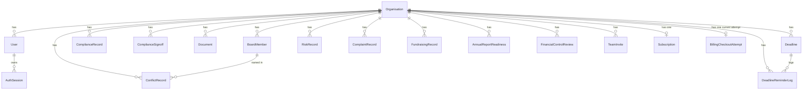
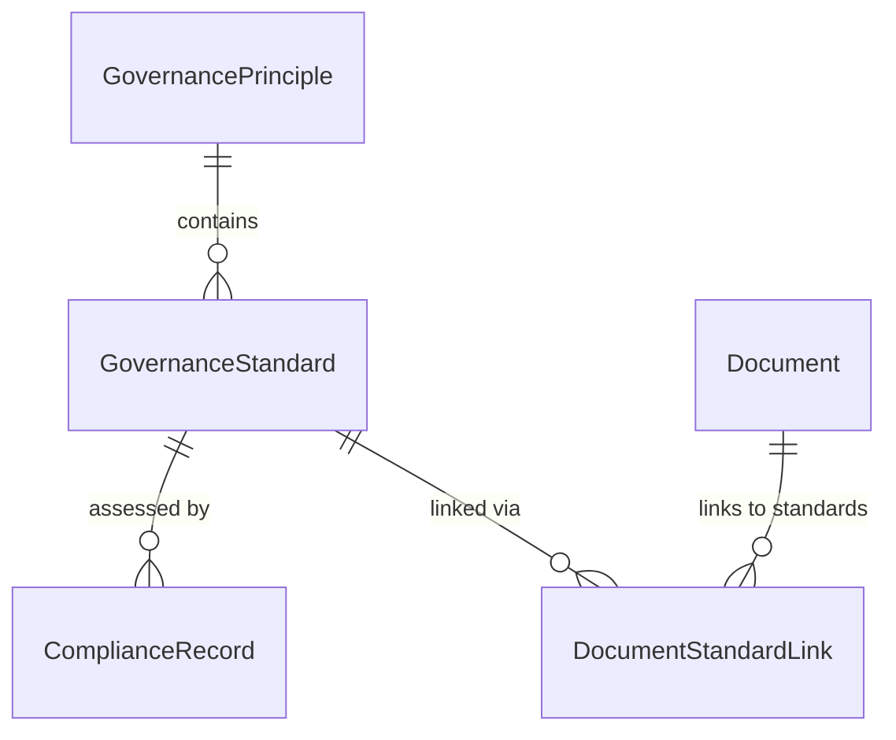

# Data Model Reference

CharityPilot persists its domain in PostgreSQL via Prisma. The schema (`apps/api/prisma/schema.prisma`) defines 23 models and 15 enums. The data model is multi-tenant: almost every business table carries an `organisationId` foreign key back to `Organisation`, which acts as the tenant root. This reference documents each model, its fields and relations, the enum set, the tenant-isolation pattern, every composite unique constraint and `@@index`, and the `onDelete` cascade behaviours.

## Migration history

The schema was built up across thirteen migrations under `apps/api/prisma/migrations/`, listed here for context (chronological by timestamp prefix):

| Migration directory | Purpose (inferred from name) |
| --- | --- |
| `20260402114212_init` | Initial schema |
| `20260403120000_add_auth_tokens` | Password reset / email verification tokens on `User` |
| `20260507162000_add_compliance_signoffs` | `ComplianceSignoff` model |
| `20260507173000_add_governance_registers` | Conflict / risk / complaint / fundraising / financial registers |
| `20260507190000_add_team_invites_and_reminder_logs` | `TeamInvite` and `DeadlineReminderLog` |
| `20260507203000_add_auth_sessions` | `AuthSession` refresh-token model |
| `20260606193000_add_stripe_webhook_events` | `StripeWebhookEvent` idempotency table |
| `20260607120000_add_document_storage_deletions` | `DocumentStorageDeletion` deletion queue |
| `20260607173000_add_document_storage_deletion_claims` | Claim columns/indexes for deletion worker |
| `20260608053000_add_active_team_invite_unique_index` | Partial unique index for active invites |
| `20260608072000_seed_governance_reference_data` | Seed governance principles/standards |
| `20260703214500_add_conditional_obligation_profile` | Conditional-obligation profile on `Organisation` |
| `20260710064500_add_billing_checkout_attempts` | Stripe subscription facts and one active Checkout-attempt lease per organisation |

A `seed.ts` script also lives at `apps/api/prisma/seed.ts`.

## Enums

All enums are declared at the top of the schema (`apps/api/prisma/schema.prisma:10-116`).

| Enum | Values | Used by |
| --- | --- | --- |
| `OrganisationComplexity` | `SIMPLE`, `COMPLEX` | `Organisation.complexity` |
| `LegalForm` | `CLG`, `TRUST`, `UNINCORPORATED_ASSOCIATION`, `OTHER` | `Organisation.legalForm` |
| `CharitablePurpose` | `POVERTY_RELIEF`, `EDUCATION`, `RELIGION`, `COMMUNITY_BENEFIT` | `Organisation.charitablePurpose` (array) |
| `ComplianceStatus` | `COMPLIANT`, `WORKING_TOWARDS`, `NOT_STARTED`, `NOT_APPLICABLE`, `EXPLAIN` | `ComplianceRecord.status` |
| `ComplianceSignoffStatus` | `DRAFT`, `BOARD_REVIEW`, `APPROVED` | `ComplianceSignoff.status` |
| `SubscriptionPlan` | `ESSENTIALS`, `COMPLETE` | `Subscription.plan` |
| `SubscriptionStatus` | `TRIALING`, `ACTIVE`, `PAST_DUE`, `CANCELLED`, `EXPIRED` | `Subscription.status` |
| `BillingCheckoutAttemptStatus` | `PENDING`, `SESSION_CREATED`, `COMPLETED` | `BillingCheckoutAttempt.status` |
| `DocumentCategory` | `CONSTITUTION`, `POLICY`, `BOARD_MINUTES`, `FINANCIAL_STATEMENT`, `INSURANCE`, `ANNUAL_REPORT`, `RISK_REGISTER`, `CODE_OF_CONDUCT`, `STRATEGIC_PLAN`, `OTHER` | `Document.category` |
| `RegisterStatus` | `OPEN`, `MONITORING`, `CLOSED` | `RiskRecord`, `ComplaintRecord`, `FundraisingRecord` |
| `ConflictStatus` | `DECLARED`, `MANAGED`, `CLOSED` | `ConflictRecord.status` |
| `RiskCategory` | `GOVERNANCE`, `FINANCIAL`, `OPERATIONAL`, `LEGAL`, `SAFEGUARDING`, `REPUTATIONAL`, `FUNDRAISING`, `DATA_PROTECTION`, `OTHER` | `RiskRecord.category` |
| `AnnualReportFilingStatus` | `NOT_STARTED`, `IN_PROGRESS`, `BOARD_APPROVED`, `FILED` | `AnnualReportReadiness.filingStatus` |
| `UserRole` | `OWNER`, `ADMIN`, `MEMBER` | `User.role`, `TeamInvite.role` |
| `DeadlineReminderStatus` | `SENT`, `SKIPPED`, `FAILED` | `DeadlineReminderLog.status` |

## Tenant-isolation pattern

`Organisation` (`apps/api/prisma/schema.prisma:118-156`) is the tenant root. Records are partitioned into three categories by how they relate to a tenant:

| Category | Models | Isolation key |
| --- | --- | --- |
| **Org-scoped** (carry `organisationId` FK to `Organisation`) | `User`, `ComplianceRecord`, `ComplianceSignoff`, `BoardMember`, `Document`, `DocumentStorageDeletion`, `ConflictRecord`, `RiskRecord`, `ComplaintRecord`, `FundraisingRecord`, `AnnualReportReadiness`, `FinancialControlReview`, `Deadline`, `TeamInvite`, `DeadlineReminderLog`, `Subscription`, `BillingCheckoutAttempt` | `organisationId` |
| **Global reference data** (shared across all tenants, no `organisationId`) | `GovernancePrinciple`, `GovernanceStandard` | none — read-only catalogue |
| **Keyed differently** | `AuthSession` (by `userId`), `DocumentStandardLink` (by `documentId`/`standardId`), `StripeWebhookEvent` (global, by Stripe event `id`) | see notes |

Notes on the differently-keyed models:

- **`AuthSession`** (`apps/api/prisma/schema.prisma:178-191`) belongs to a `User`, not directly to an `Organisation`; tenancy is reached transitively through `User.organisationId`.
- **`DocumentStandardLink`** (`apps/api/prisma/schema.prisma:315-323`) is a join table between an (org-scoped) `Document` and a (global) `GovernanceStandard`; it inherits tenancy from its `Document`.
- **`DocumentStorageDeletion`** (`apps/api/prisma/schema.prisma:325-339`) stores `organisationId` as a plain string column with no relation back to `Organisation` — it is a background deletion queue keyed by `storagePath`, so the row can outlive the parent organisation row.
- **`StripeWebhookEvent`** (`apps/api/prisma/schema.prisma:581-588`) is entirely global; its `id` is the Stripe event ID and the row exists purely for webhook idempotency.

## Models

### Organisation
`apps/api/prisma/schema.prisma:118-156` — the tenant root.

| Field | Type | Notes |
| --- | --- | --- |
| `id` | `String` | `@id @default(cuid())` |
| `name` | `String` | |
| `rcnNumber`, `croNumber` | `String?` | Registered Charity Number / Companies Registration Office number |
| `legalForm` | `LegalForm` | `@default(CLG)` |
| `complexity` | `OrganisationComplexity` | `@default(SIMPLE)` |
| `charitablePurpose` | `CharitablePurpose[]` | enum array |
| `financialYearEnd`, `dateRegistered`, `lastAgmDate` | `DateTime?` | |
| `registeredAddress`, `contactEmail`, `contactPhone`, `website` | `String?` | |
| `stripeCustomerId` | `String? @unique` | links to the organisation's metadata-verified Stripe customer |
| `createdAt` / `updatedAt` | `DateTime` | |

Has-many relations to nearly every org-scoped model, plus one-to-one optional
`subscription` (`Subscription?`) and `billingCheckoutAttempt`
(`BillingCheckoutAttempt?`) relations. Deleting an organisation cascades its
Checkout-attempt lease; the subscription relation retains Prisma's default
referential action.

### User
`apps/api/prisma/schema.prisma:150-176`

| Field | Type | Notes |
| --- | --- | --- |
| `id` | `String` | `@id @default(cuid())` |
| `email` | `String @unique` | |
| `name`, `passwordHash` | `String` | |
| `role` | `UserRole` | `@default(MEMBER)` |
| `organisationId` | `String` | FK → `Organisation` (no explicit `onDelete`, defaults to restrict) |
| `emailVerified` | `Boolean` | `@default(false)` |
| `resetToken`, `verifyToken` | `String? @unique` | password reset / email verification tokens |
| `resetTokenExpiry`, `verifyTokenExpiry` | `DateTime?` | |

Relations: named back-relations `complianceUpdates`, `signoffUpdates`, `documentUploads`, `sentInvites`, plus `reminderLogs` and `authSessions`. Index `@@index([organisationId])` (`apps/api/prisma/schema.prisma:175`) supports tenant-scoped user lookups.

### AuthSession
`apps/api/prisma/schema.prisma:178-191` — refresh-token store for rotating JWT sessions.

| Field | Type | Notes |
| --- | --- | --- |
| `id` | `String` | `@id @default(cuid())` |
| `userId` | `String` | FK → `User`, `onDelete: Cascade` |
| `refreshTokenHash` | `String @unique` | hashed refresh token |
| `expiresAt` | `DateTime` | |
| `revokedAt` | `DateTime?` | |

Indexes: `@@index([userId])` and `@@index([expiresAt])` (`apps/api/prisma/schema.prisma:189-190`) — the latter supports purging expired sessions. Deleting a `User` cascades its sessions.

### GovernancePrinciple
`apps/api/prisma/schema.prisma:193-201` — global reference data (the governance code's principles).

| Field | Type | Notes |
| --- | --- | --- |
| `id` | `String` | `@id @default(cuid())` |
| `number` | `Int @unique` | principle number |
| `title`, `description` | `String` | |
| `sortOrder` | `Int` | display ordering |

Has-many `standards` (`GovernanceStandard[]`).

### GovernanceStandard
`apps/api/prisma/schema.prisma:203-217` — global reference data; the individual standards under each principle.

| Field | Type | Notes |
| --- | --- | --- |
| `id` | `String` | `@id @default(cuid())` |
| `principleId` | `String` | FK → `GovernancePrinciple` |
| `code` | `String @unique` | standard code |
| `title` | `String` | |
| `isCore`, `isAdditional` | `Boolean` | classification flags |
| `sortOrder` | `Int` | |

Relations: `complianceRecords`, `documentLinks`. Index `@@index([principleId])` (`apps/api/prisma/schema.prisma:216`).

### ComplianceRecord
`apps/api/prisma/schema.prisma:219-241` — one organisation's status against one standard for one reporting year.

| Field | Type | Notes |
| --- | --- | --- |
| `id` | `String` | `@id @default(cuid())` |
| `organisationId` | `String` | FK → `Organisation` |
| `standardId` | `String` | FK → `GovernanceStandard` |
| `reportingYear` | `Int` | |
| `status` | `ComplianceStatus` | `@default(NOT_STARTED)` |
| `actionTaken`, `evidence`, `notes`, `explanationIfNA` | `String?` | |
| `updatedById` | `String?` | FK → `User` (`UpdatedBy` relation) |

Constraint `@@unique([organisationId, standardId, reportingYear])` (`apps/api/prisma/schema.prisma:239`) enforces a single record per (tenant, standard, year). Index `@@index([organisationId, reportingYear])` (`apps/api/prisma/schema.prisma:240`) supports per-year compliance dashboards.

### ComplianceSignoff
`apps/api/prisma/schema.prisma:243-264` — board sign-off of a reporting year's compliance.

| Field | Type | Notes |
| --- | --- | --- |
| `id` | `String` | `@id @default(cuid())` |
| `organisationId` | `String` | FK → `Organisation` |
| `reportingYear` | `Int` | |
| `status` | `ComplianceSignoffStatus` | `@default(DRAFT)` |
| `boardMeetingDate`, `approvedAt` | `DateTime?` | |
| `minuteReference`, `approvedByName`, `approvedByRole`, `approvalNotes` | `String?` | |
| `updatedById` | `String?` | FK → `User` (`SignoffUpdatedBy` relation) |

Constraint `@@unique([organisationId, reportingYear])` (`apps/api/prisma/schema.prisma:262`) — one sign-off per tenant per year. Index `@@index([organisationId, reportingYear])` (`apps/api/prisma/schema.prisma:263`).

### BoardMember
`apps/api/prisma/schema.prisma:266-286`

| Field | Type | Notes |
| --- | --- | --- |
| `id` | `String` | `@id @default(cuid())` |
| `organisationId` | `String` | FK → `Organisation` |
| `name`, `role` | `String` | |
| `email` | `String?` | |
| `appointedDate` | `DateTime` | |
| `termEndDate` | `DateTime?` | |
| `isActive` | `Boolean` | `@default(true)` |
| `conductSigned`, `inductionCompleted` | `Boolean` | `@default(false)` |
| `conductSignedDate`, `inductionDate` | `DateTime?` | |

Has-many `conflictRecords`. Index `@@index([organisationId])` (`apps/api/prisma/schema.prisma:285`).

### Document
`apps/api/prisma/schema.prisma:288-313`

| Field | Type | Notes |
| --- | --- | --- |
| `id` | `String` | `@id @default(cuid())` |
| `organisationId` | `String` | FK → `Organisation` |
| `name` | `String` | |
| `description` | `String?` | |
| `category` | `DocumentCategory` | |
| `fileUrl`, `mimeType` | `String` | |
| `fileSize` | `Int` | |
| `version` | `Int` | `@default(1)` |
| `owner`, `boardMinuteReference` | `String?` | |
| `approvedDate`, `nextReviewDate` | `DateTime?` | |
| `uploadedById` | `String?` | FK → `User` (`UploadedBy` relation) |

Has-many `standardLinks`. Index `@@index([organisationId])` (`apps/api/prisma/schema.prisma:312`).

### DocumentStandardLink
`apps/api/prisma/schema.prisma:315-323` — many-to-many join between `Document` and `GovernanceStandard`.

| Field | Type | Notes |
| --- | --- | --- |
| `id` | `String` | `@id @default(cuid())` |
| `documentId` | `String` | FK → `Document`, `onDelete: Cascade` |
| `standardId` | `String` | FK → `GovernanceStandard` |

Constraint `@@unique([documentId, standardId])` (`apps/api/prisma/schema.prisma:322`) prevents duplicate links. Deleting a `Document` cascades its links.

### DocumentStorageDeletion
`apps/api/prisma/schema.prisma:325-339` — background queue for deleting orphaned storage objects.

| Field | Type | Notes |
| --- | --- | --- |
| `id` | `String` | `@id @default(cuid())` |
| `organisationId` | `String` | plain column (no relation) |
| `storagePath` | `String` | object key to delete |
| `attempts` | `Int` | `@default(0)` |
| `lastError` | `String?` | |
| `claimedAt`, `processedAt` | `DateTime?` | worker claim / completion markers |

Indexes: `@@index([organisationId])`, `@@index([processedAt, createdAt])`, `@@index([processedAt, claimedAt, createdAt])` (`apps/api/prisma/schema.prisma:336-338`). The composite indexes support the deletion worker scanning for unprocessed / unclaimed jobs in order.

### ConflictRecord
`apps/api/prisma/schema.prisma:341-363` — conflict-of-interest register.

| Field | Type | Notes |
| --- | --- | --- |
| `id` | `String` | `@id @default(cuid())` |
| `organisationId` | `String` | FK → `Organisation` |
| `boardMemberId` | `String?` | FK → `BoardMember`, `onDelete: SetNull` |
| `trusteeName`, `matter`, `nature`, `actionTaken` | `String` | |
| `dateDeclared` | `DateTime` | |
| `meetingDate`, `nextReviewDate` | `DateTime?` | |
| `decision`, `minuteReference` | `String?` | |
| `status` | `ConflictStatus` | `@default(DECLARED)` |

Indexes: `@@index([organisationId])`, `@@index([boardMemberId])` (`apps/api/prisma/schema.prisma:361-362`). When a `BoardMember` is deleted the `boardMemberId` is nulled (`onDelete: SetNull`), preserving the conflict record (the `trusteeName` string retains identity).

### RiskRecord
`apps/api/prisma/schema.prisma:365-384` — risk register.

| Field | Type | Notes |
| --- | --- | --- |
| `id` | `String` | `@id @default(cuid())` |
| `organisationId` | `String` | FK → `Organisation` |
| `title`, `description`, `mitigation` | `String` | |
| `category` | `RiskCategory` | |
| `likelihood`, `impact` | `Int` | scoring inputs |
| `owner`, `boardMinuteReference` | `String?` | |
| `reviewDate` | `DateTime?` | |
| `status` | `RegisterStatus` | `@default(OPEN)` |

Index `@@index([organisationId])` (`apps/api/prisma/schema.prisma:383`).

### ComplaintRecord
`apps/api/prisma/schema.prisma:386-403` — complaints register.

| Field | Type | Notes |
| --- | --- | --- |
| `id` | `String` | `@id @default(cuid())` |
| `organisationId` | `String` | FK → `Organisation` |
| `receivedDate` | `DateTime` | |
| `source`, `actionTaken`, `outcome`, `boardMinuteReference` | `String?` | |
| `summary` | `String` | |
| `status` | `RegisterStatus` | `@default(OPEN)` |
| `reviewedByBoard` | `Boolean` | `@default(false)` |

Index `@@index([organisationId])` (`apps/api/prisma/schema.prisma:402`).

### FundraisingRecord
`apps/api/prisma/schema.prisma:405-425` — fundraising activity register.

| Field | Type | Notes |
| --- | --- | --- |
| `id` | `String` | `@id @default(cuid())` |
| `organisationId` | `String` | FK → `Organisation` |
| `name`, `activityType` | `String` | |
| `startDate`, `endDate` | `DateTime?` | |
| `publicFacing` | `Boolean` | `@default(true)` |
| `thirdPartyFundraiser`, `controls`, `reviewOutcome`, `boardMinuteReference` | `String?` | |
| `complaintsReceived` | `Boolean` | `@default(false)` |
| `status` | `RegisterStatus` | `@default(OPEN)` |

Index `@@index([organisationId])` (`apps/api/prisma/schema.prisma:424`).

### AnnualReportReadiness
`apps/api/prisma/schema.prisma:427-450` — annual report preparation checklist per reporting year.

| Field | Type | Notes |
| --- | --- | --- |
| `id` | `String` | `@id @default(cuid())` |
| `organisationId` | `String` | FK → `Organisation` |
| `reportingYear` | `Int` | |
| `activitiesNarrative`, `publicBenefitStatement`, `beneficiariesSummary`, `notes` | `String?` | |
| `financialStatementsApproved`, `annualReportUploaded`, `trusteeDetailsReviewed`, `fundraisingReviewed`, `complaintsReviewed` | `Boolean` | `@default(false)` |
| `boardApprovalDate`, `filedDate` | `DateTime?` | |
| `filingStatus` | `AnnualReportFilingStatus` | `@default(NOT_STARTED)` |

Constraint `@@unique([organisationId, reportingYear])` (`apps/api/prisma/schema.prisma:448`) — one readiness record per tenant per year. Index `@@index([organisationId, reportingYear])` (`apps/api/prisma/schema.prisma:449`).

### FinancialControlReview
`apps/api/prisma/schema.prisma:452-476` — annual financial-controls self-assessment.

| Field | Type | Notes |
| --- | --- | --- |
| `id` | `String` | `@id @default(cuid())` |
| `organisationId` | `String` | FK → `Organisation` |
| `reportingYear` | `Int` | |
| `bankReconciliationsReviewed`, `dualAuthorisation`, `budgetApproved`, `managementAccountsReviewed`, `reservesReviewed`, `restrictedFundsReviewed`, `assetsInsuranceReviewed`, `payrollControlsReviewed`, `fundraisingControlsReviewed` | `Boolean` | `@default(false)` |
| `reviewedBy`, `minuteReference`, `actions` | `String?` | |
| `reviewDate` | `DateTime?` | |

Constraint `@@unique([organisationId, reportingYear])` (`apps/api/prisma/schema.prisma:474`) — one review per tenant per year. Index `@@index([organisationId, reportingYear])` (`apps/api/prisma/schema.prisma:475`).

### Deadline
`apps/api/prisma/schema.prisma:478-495`

| Field | Type | Notes |
| --- | --- | --- |
| `id` | `String` | `@id @default(cuid())` |
| `organisationId` | `String` | FK → `Organisation` |
| `title` | `String` | |
| `description` | `String?` | |
| `dueDate` | `DateTime` | |
| `isAutoGenerated`, `isComplete` | `Boolean` | `@default(false)` |
| `completedDate` | `DateTime?` | |
| `reminderDays` | `Int[]` | `@default([30, 14, 7])` — days-before-due to send reminders |

Has-many `reminderLogs`. Index `@@index([organisationId])` (`apps/api/prisma/schema.prisma:494`).

### TeamInvite
`apps/api/prisma/schema.prisma:497-515`

| Field | Type | Notes |
| --- | --- | --- |
| `id` | `String` | `@id @default(cuid())` |
| `organisationId` | `String` | FK → `Organisation`, `onDelete: Cascade` |
| `email` | `String` | |
| `role` | `UserRole` | `@default(MEMBER)` |
| `token` | `String @unique` | invite acceptance token |
| `invitedById` | `String?` | FK → `User` (`InvitedBy`), `onDelete: SetNull` |
| `acceptedAt`, `revokedAt` | `DateTime?` | |
| `expiresAt` | `DateTime` | |

Indexes: `@@index([organisationId])`, `@@index([email])` (`apps/api/prisma/schema.prisma:513-514`). Deleting an `Organisation` cascades its invites; deleting the inviting `User` nulls `invitedById`. (Migration `20260608053000_add_active_team_invite_unique_index` adds a partial unique index enforcing one active invite per email per organisation at the database level, beyond what the schema annotations express.)

### DeadlineReminderLog
`apps/api/prisma/schema.prisma:517-534` — record of reminder emails sent for a deadline.

| Field | Type | Notes |
| --- | --- | --- |
| `id` | `String` | `@id @default(cuid())` |
| `organisationId` | `String` | FK → `Organisation`, `onDelete: Cascade` |
| `deadlineId` | `String` | FK → `Deadline`, `onDelete: Cascade` |
| `userId` | `String?` | FK → `User`, `onDelete: SetNull` |
| `email` | `String` | recipient |
| `reminderDays` | `Int` | which reminder offset this log covers |
| `status` | `DeadlineReminderStatus` | `SENT` / `SKIPPED` / `FAILED` |
| `error` | `String?` | |
| `sentAt` | `DateTime` | `@default(now())` |

Constraint `@@unique([deadlineId, email, reminderDays])` (`apps/api/prisma/schema.prisma:531`) guarantees a given reminder offset is only ever logged once per (deadline, recipient) — the idempotency guard preventing duplicate reminder emails. Indexes: `@@index([organisationId])`, `@@index([userId])` (`apps/api/prisma/schema.prisma:532-533`). Deleting the `Organisation` or `Deadline` cascades the logs; deleting the `User` nulls `userId`.

### Subscription
One-to-one current billing projection per organisation. Stripe webhooks are the
authority for every Stripe-backed field.

| Field | Type | Notes |
| --- | --- | --- |
| `id` | `String` | `@id @default(cuid())` |
| `organisationId` | `String @unique` | FK → `Organisation` (one-to-one) |
| `stripeSubscriptionId` | `String? @unique` | links to Stripe subscription |
| `stripeStatus` | `String?` | last authoritative raw Stripe subscription status |
| `plan` | `SubscriptionPlan` | |
| `status` | `SubscriptionStatus` | `@default(TRIALING)` |
| `billingInterval` | `String?` | configured `monthly` / `yearly` cadence derived from the exact Stripe price |
| `cancelAtPeriodEnd` | `Boolean` | `@default(false)`; last authoritative Stripe cancellation schedule |
| `trialEndsAt`, `currentPeriodStart`, `currentPeriodEnd`, `cancelledAt` | `DateTime?` | |
| `createdAt`, `updatedAt` | `DateTime` | creation and last local projection update |

The `organisationId @unique` constraint makes the relation one-to-one: each
organisation has at most one local current subscription projection. The
separate unique `stripeSubscriptionId` prevents one provider subscription from
being attached to multiple local organisations. A nullable
`stripeSubscriptionId` supports the local trial created at registration.

### BillingCheckoutAttempt

One-to-one current Checkout lease per organisation. It prevents concurrent or
replayed plan selections from creating multiple Stripe subscription sessions.

| Field | Type | Notes |
| --- | --- | --- |
| `id` | `String` | application-generated UUID primary key; also scopes Stripe idempotency and metadata |
| `organisationId` | `String @unique` | FK → `Organisation`, `onDelete: Cascade` |
| `requestedPlan` | `SubscriptionPlan` | plan selected when the lease was claimed |
| `interval` | `String` | `monthly` or `yearly`; the migration adds a database `CHECK` constraint |
| `status` | `BillingCheckoutAttemptStatus` | `@default(PENDING)` |
| `stripeCheckoutSessionId` | `String? @unique` | bound Stripe Checkout session, once created |
| `checkoutUrl` | `String?` | short-lived URL returned only while the attempt is open; cleared on completion |
| `expectedPreviousStripeSubscriptionId` | `String?` | snapshot used to reject a stale webhook overwrite; deliberately not a local FK |
| `expiresAt` | `DateTime` | shared local/Stripe lease expiry |
| `createdAt`, `updatedAt` | `DateTime` | claim creation and last lifecycle transition |

`organisationId @unique` permits one current attempt row per organisation;
`stripeCheckoutSessionId @unique` prevents one Stripe session from being bound
to two attempts; and `@@index([expiresAt])` supports expired-attempt operations.
The row moves from `PENDING` to `SESSION_CREATED` to `COMPLETED`. A safely
expired attempt can be deleted and replaced only after the API reconciles the
old session with Stripe.

### StripeWebhookEvent
`apps/api/prisma/schema.prisma:581-588` — global webhook idempotency ledger (no tenant key).

| Field | Type | Notes |
| --- | --- | --- |
| `id` | `String` | `@id` — the Stripe event ID (not a cuid) |
| `type` | `String` | Stripe event type |
| `processedAt`, `createdAt` | `DateTime` | `@default(now())` |

Index `@@index([processedAt])` (`apps/api/prisma/schema.prisma:587`). Recording the Stripe event ID as the primary key means a re-delivered webhook can be detected and skipped.

## onDelete behaviour summary

The schema declares explicit referential actions only where deletion semantics matter; all other FKs use Prisma's default (restrict). 

| Relation | `onDelete` | Effect |
| --- | --- | --- |
| `AuthSession.user` → `User` | `Cascade` | sessions deleted with the user |
| `DocumentStandardLink.document` → `Document` | `Cascade` | links deleted with the document |
| `TeamInvite.organisation` → `Organisation` | `Cascade` | invites deleted with the organisation |
| `DeadlineReminderLog.organisation` → `Organisation` | `Cascade` | logs deleted with the organisation |
| `DeadlineReminderLog.deadline` → `Deadline` | `Cascade` | logs deleted with the deadline |
| `ConflictRecord.boardMember` → `BoardMember` | `SetNull` | conflict retained, `boardMemberId` nulled |
| `TeamInvite.invitedBy` → `User` | `SetNull` | invite retained, `invitedById` nulled |
| `DeadlineReminderLog.user` → `User` | `SetNull` | log retained, `userId` nulled |
| `BillingCheckoutAttempt.organisation` → `Organisation` | `Cascade` | short-lived Checkout lease deleted with the organisation |

## Entity-relationship diagram — tenant root

The diagram below shows `Organisation` as the tenant root and its one-to-many (and one-to-one) relations to org-scoped models. Reference/auxiliary models are summarised separately below to keep this readable.

## Entity-relationship diagram — reference and join models

Global reference data and the document/standard join table sit outside the tenant tree. `Document` is org-scoped but links to global `GovernanceStandard` records; `ComplianceRecord` is org-scoped but references a global `GovernanceStandard`. `StripeWebhookEvent` is fully standalone (not shown — it has no foreign keys).

## Cross-references

- [Module & Dependency Graph](02-module-dependency-graph.md) — which services read and write each model.
- [Governance Domain Model](08-governance-domain.md) — the semantics of the governance and register models.
- [Billing & Subscription Flow](05-billing.md) — the Subscription,
  BillingCheckoutAttempt, and StripeWebhookEvent models in context.
- [Request Lifecycle, Middleware & Auth](04-request-lifecycle.md) — the AuthSession model and how it is used.
- [System Overview](01-system-overview.md) — where PostgreSQL/Prisma sits in the topology.
