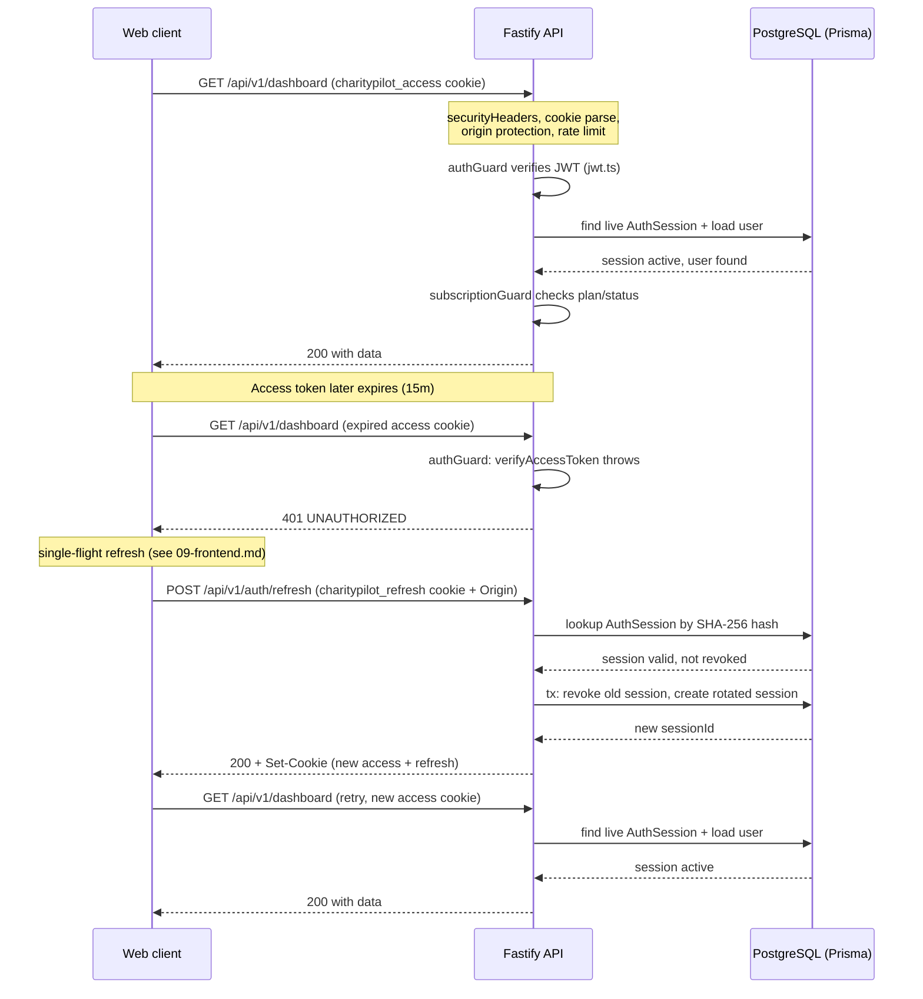

# Request Lifecycle, Middleware & Auth

This document traces a single HTTP request through the CharityPilot API (`apps/api`, Fastify 5, TypeScript ESM) from the moment Fastify accepts the connection to the route handler, then documents the auth/session model that backs authenticated requests. The API uses cookie-based JWT access tokens with hashed, rotating refresh sessions persisted in PostgreSQL.

## The plugin & middleware pipeline

Fastify executes plugins and hooks in **registration order**. The application registers them in `apps/api/src/server.ts:51-66`, before any routes (`apps/api/src/server.ts:70-81`). Because most of these are global hooks (`onSend`, `preHandler`, `onRequest`) or decorators, the effective order a request observes is governed by both registration order and Fastify's hook phases.

Registration order in `server.ts`:

| # | Plugin / hook | File | Registered at | Phase / effect |
|---|---------------|------|---------------|----------------|
| 1 | Error handler + not-found handler | `apps/api/src/plugins/error-handler.ts` | `apps/api/src/server.ts:51` | `setErrorHandler` / `setNotFoundHandler` |
| 2 | Security headers | `apps/api/src/plugins/security-headers.ts` | `apps/api/src/server.ts:52` | `onSend` hook (response phase) |
| 3 | Cookie parsing | `@fastify/cookie` | `apps/api/src/server.ts:53` | decorates `request.cookies` |
| 4 | Browser-origin protection + CORS | `apps/api/src/plugins/browser-origin-protection.ts` | `apps/api/src/server.ts:55` | `preHandler` hook + `@fastify/cors` |
| 5 | Rate limit | `@fastify/rate-limit` | `apps/api/src/server.ts:57-60` | global `onRequest` limiter |
| 6 | Multipart parsing | `@fastify/multipart` | `apps/api/src/server.ts:62-64` | content-type parser for uploads |
| 7 | Prisma | `apps/api/src/plugins/prisma.ts` | `apps/api/src/server.ts:66` | decorates `app.prisma` |
| 8 | Route guards (per-route) | `apps/api/src/middleware/*` | route modules | `onRequest` / `preHandler` |

The Fastify instance itself is configured with `trustProxy` set only when `TRUSTED_PROXY_ADDRESSES` is provided (`apps/api/src/server.ts:46`), so client IPs used by the rate limiter are taken from `X-Forwarded-For` only behind explicitly trusted proxies.

### 1. Error handler

`errorHandlerPlugin` is a `fastify-plugin`-wrapped plugin registered first (`apps/api/src/server.ts:51`) so its custom handlers are in force for every downstream failure. `setErrorHandler` logs a sanitised error (`apps/api/src/plugins/error-handler.ts:10-13`), then branches:

- Fastify schema **validation** errors return `400` with code `VALIDATION_ERROR` and the validation detail (`apps/api/src/plugins/error-handler.ts:16-22`).
- Rate-limit errors (`statusCode === 429`) return code `RATE_LIMITED` (`apps/api/src/plugins/error-handler.ts:25-30`).
- Otherwise it computes `exposeMessage = statusCode < 500 || !isProduction` so internal `5xx` messages are hidden in production, optionally fires an error-alert webhook, and replies with code `INTERNAL_ERROR` (`apps/api/src/plugins/error-handler.ts:32-43`).

A `setNotFoundHandler` returns a uniform `404` with code `NOT_FOUND` (`apps/api/src/plugins/error-handler.ts:46-51`).

Route handlers may also throw `AppError` (`apps/api/src/utils/errors.ts:4-14`) and call `handleError`/`sendError` (`apps/api/src/utils/errors.ts:29-62`), which apply the same `exposeMessage` rule (`apps/api/src/utils/errors.ts:32`) and webhook alerting for `5xx`.

### 2. Security headers

`securityHeadersPlugin` adds an `onSend` hook (`apps/api/src/plugins/security-headers.ts:7`) that stamps every response with hardening headers: `X-Content-Type-Options: nosniff`, `X-Frame-Options: DENY`, `Referrer-Policy: strict-origin-when-cross-origin`, and a restrictive `Permissions-Policy` (`apps/api/src/plugins/security-headers.ts:8-11`). If the handler did not set `Cache-Control`, it defaults to `no-store` (`apps/api/src/plugins/security-headers.ts:12-16`). If no CSP was set, it applies a deny-all API CSP `default-src 'none'; frame-ancestors 'none'; base-uri 'none'` (`apps/api/src/plugins/security-headers.ts:17-19`). In production only, HSTS is added with a two-year `max-age`, `includeSubDomains` and `preload` (`apps/api/src/plugins/security-headers.ts:20-22`).

### 3. Cookie parsing

`@fastify/cookie` is registered at `apps/api/src/server.ts:53`, populating `request.cookies` so downstream code can read the access and refresh cookies (`apps/api/src/utils/auth-cookies.ts:35-41`).

### 4. Browser-origin protection + CORS

`registerBrowserOriginProtection` (`apps/api/src/server.ts:55`) does two things. First it installs a `preHandler` hook that runs `validateUnsafeRequestOrigin` and short-circuits with the returned status/payload when origin validation fails (`apps/api/src/plugins/browser-origin-protection.ts:9-14`). Then it registers `@fastify/cors` with a per-origin allow callback, `credentials: true`, and a fixed method/header allow-list (`apps/api/src/plugins/browser-origin-protection.ts:16-28`).

The allowed-origin set is built in `server.ts` from `FRONTEND_URL` (comma-separated), falling back to `http://localhost:3003` and `http://localhost:3000`, each normalised via `normaliseOrigin` (`apps/api/src/server.ts:29-36`).

`validateUnsafeRequestOrigin` (`apps/api/src/utils/request-origin.ts:57-93`) implements CSRF-style protection for cookie-authenticated browsers:

- **Safe methods** (`GET`, `HEAD`, `OPTIONS`) are always allowed (`apps/api/src/utils/request-origin.ts:15`, `:61-63`).
- If an `Origin` header is present, it must match the allow-list or the request is rejected `403 INVALID_ORIGIN` (`apps/api/src/utils/request-origin.ts:65-79`).
- If `Origin` is **absent**, the request is rejected `403 MISSING_ORIGIN` when it targets an auth-cookie-setting path (`/auth/login`, `/auth/refresh`, `/team/accept-invite` — `apps/api/src/utils/request-origin.ts:16-20`, `:52-55`) **or** when it carries an auth cookie without a `Bearer` header (`apps/api/src/utils/request-origin.ts:81-90`). Pure `Bearer`-token API clients with no cookie are therefore not blocked for a missing origin.

`normaliseOrigin` canonicalises origins by parsing the URL origin, stripping trailing slashes on failure (`apps/api/src/utils/request-origin.ts:27-33`). `getPrimaryFrontendOrigin` (`apps/api/src/utils/frontend-origin.ts:1-8`) returns the first configured `FRONTEND_URL` origin (default `http://localhost:3000`) and is used where the API needs to construct links back to the web app.

### 5. Rate limiting

`@fastify/rate-limit` is registered globally with `max: 100` per `1 minute` window (`apps/api/src/server.ts:57-60`). Breaches surface as `429` and are mapped to code `RATE_LIMITED` by the error handler (`apps/api/src/plugins/error-handler.ts:25-30`). Individual routes can tighten this via per-route `config.rateLimit` — the token-refresh endpoint, for example, caps at `5` requests per minute (`apps/api/src/routes/auth/index.ts:76`).

### 6. Multipart

`@fastify/multipart` is registered with `DOCUMENT_UPLOAD_MULTIPART_LIMITS` (`apps/api/src/server.ts:62-64`), defined in the documents route module: a `10 MB` per-file cap, at most `1` file, and tight bounds on fields/parts/header pairs (`apps/api/src/routes/documents/index.ts:24-33`). This bounds resource use for the document-upload endpoints.

### 7. Prisma

`prismaPlugin` connects a singleton `PrismaClient` and decorates it onto the instance as `app.prisma` (`apps/api/src/plugins/prisma.ts:5`, `:13-16`), with an `onClose` hook that disconnects on shutdown (`apps/api/src/plugins/prisma.ts:18-20`). All route handlers and guards read the database through `request.server.prisma`.

### 8. Per-route guards

Routes are registered under `/api/v1/*` prefixes (`apps/api/src/server.ts:70-81`). Within a route module, guards are attached as hooks so they run before the handler. A representative composition (`apps/api/src/routes/board-members/index.ts:14-15`, `:30`):

```
app.addHook('onRequest', authGuard);          // authenticate
app.addHook('onRequest', subscriptionGuard);  // require active subscription
app.post('/', { preHandler: [requireAdmin] }, handler);  // require OWNER/ADMIN
```

`onRequest` hooks (`authGuard`, then `subscriptionGuard`) run in registration order before any `preHandler` route guard such as `requireAdmin`.

| Guard | File | Failure code(s) |
|-------|------|-----------------|
| `authGuard` / `authIdentityGuard` | `apps/api/src/middleware/auth.ts:75-81` | `401 UNAUTHORIZED`, `403 EMAIL_NOT_VERIFIED` |
| `requireRole` / `requireAdmin` / `requireOwner` | `apps/api/src/middleware/roles.ts:6-18` | `403 FORBIDDEN` |
| `subscriptionGuard` | `apps/api/src/middleware/subscription.ts:8-51` | `403 NO_SUBSCRIPTION` / `TRIAL_EXPIRED` / `PAST_DUE_GRACE_EXPIRED` / `SUBSCRIPTION_INACTIVE` |
| `requireCompletePlan` | `apps/api/src/middleware/plan.ts:4-19` | `403 PLAN_FEATURE_UNAVAILABLE` |

**`authGuard`** extracts a token preferring an `Authorization: Bearer` header, falling back to the access cookie (`apps/api/src/middleware/auth.ts:16-18`). It verifies the JWT (`apps/api/src/middleware/auth.ts:27`), then concurrently confirms the referenced `AuthSession` is live (not revoked, not expired) and loads the user (`apps/api/src/middleware/auth.ts:33-52`). Unless `allowUnverified` is set, an unverified email yields `403 EMAIL_NOT_VERIFIED` (`apps/api/src/middleware/auth.ts:59-65`). On success it attaches the canonical identity — `userId`, `organisationId`, `role`, `sessionId` — to `request.user` (`apps/api/src/middleware/auth.ts:67-72`). `authIdentityGuard` is the `allowUnverified: true` variant for endpoints reachable before verification (`apps/api/src/middleware/auth.ts:79-81`).

**`requireRole`** checks `request.user.role` against an allow-list, replying `403 FORBIDDEN` otherwise; `requireAdmin = requireRole('OWNER','ADMIN')` and `requireOwner = requireRole('OWNER')` (`apps/api/src/middleware/roles.ts:6-18`).

**`subscriptionGuard`** loads the organisation's `Subscription` and grants access via `hasSubscriptionAccess`, which allows `ACTIVE`, in-window `TRIALING`, and `PAST_DUE` within the configurable grace window (`apps/api/src/utils/subscription-access.ts:21-37`); otherwise it returns the most specific `403` for the subscription state (`apps/api/src/middleware/subscription.ts:25-50`).

**`requireCompletePlan`** gates premium features by requiring `subscription.plan === COMPLETE`, else `403 PLAN_FEATURE_UNAVAILABLE` (`apps/api/src/middleware/plan.ts:11-18`).

Successful handlers reply through the standard wrappers `sendSuccess` / `sendCreated` / `sendNoContent` (`apps/api/src/utils/response.ts:8-18`).

## Auth & session model

CharityPilot uses a two-token model: a short-lived **access token** (a stateless JWT, transported as an HttpOnly cookie) and a long-lived **refresh token** (an opaque random string whose SHA-256 hash is persisted as an `AuthSession` row). The refresh token rotates on every use.

### Access token (JWT)

| Property | Value | Citation |
|----------|-------|----------|
| Algorithm | `HS256` | `apps/api/src/utils/jwt.ts:13` |
| Issuer / Audience | `charitypilot-api` / `charitypilot-web` | `apps/api/src/utils/jwt.ts:14-15` |
| Expiry | `JWT_EXPIRY` env, default `15m` | `apps/api/src/utils/jwt.ts:12` |
| Secret | `JWT_SECRET` (required; server refuses to start without it) | `apps/api/src/utils/jwt.ts:3-11` |
| Claims | `userId`, `organisationId`, `role`, `sessionId` | `apps/api/src/utils/jwt.ts:17-22` |

`signAccessToken` signs the payload with the issuer/audience/expiry options (`apps/api/src/utils/jwt.ts:24-31`). `verifyAccessToken` verifies signature, algorithm, issuer and audience, then defensively re-validates each claim's type and that `role` is one of `OWNER`/`ADMIN`/`MEMBER` before returning a typed payload (`apps/api/src/utils/jwt.ts:33-60`). Note the `sessionId` claim links each access token to a specific refresh session, which `authGuard` re-checks against the database on every request (`apps/api/src/middleware/auth.ts:34-42`), so revoking the session immediately invalidates the access token's usefulness even before it expires.

### Auth cookies

Cookie names are centralised in `apps/api/src/utils/auth-cookie-names.ts:1-2`: `charitypilot_access` and `charitypilot_refresh`. `setAuthCookies` writes the access cookie with a `15 * 60` second max-age and the refresh cookie with `refreshTokenMaxAgeSeconds()` (`apps/api/src/utils/auth-cookies.ts:24-27`). Both use the shared options: `path: '/'`, `httpOnly: true`, `secure` only in production, `sameSite: 'lax'`, and an optional `AUTH_COOKIE_DOMAIN` (`apps/api/src/utils/auth-cookies.ts:12-22`). `clearAuthCookies` clears both with max-age `0` (`apps/api/src/utils/auth-cookies.ts:29-33`). Token extraction helpers read the cookies on inbound requests (`apps/api/src/utils/auth-cookies.ts:35-41`).

### Refresh sessions (hashed, rotating)

Refresh tokens are managed in `apps/api/src/services/session-tokens.ts` and persisted in the `AuthSession` model (`apps/api/prisma/schema.prisma:178-191`): `id`, `userId`, a **unique** `refreshTokenHash`, `expiresAt`, nullable `revokedAt`, and timestamps, indexed on `userId` and `expiresAt`.

- **Generation & hashing.** A refresh token is `48` random bytes (`REFRESH_TOKEN_BYTES`) encoded as `base64url` (`apps/api/src/services/session-tokens.ts:19`, `:65`). Only its SHA-256 hash (`hashOpaqueToken`) is stored — the plaintext never touches the database (`apps/api/src/services/session-tokens.ts:38-40`, `:66`).
- **Expiry.** TTL is `REFRESH_TOKEN_TTL_DAYS` (default `7`, clamped to a maximum of `30`), driving both the row's `expiresAt` and the cookie max-age (`apps/api/src/services/session-tokens.ts:20-36`).
- **Issuance.** `issueSessionTokens` creates the `AuthSession` row and mints a matching access token bound to the new `sessionId` (`apps/api/src/services/session-tokens.ts:64-72`, `:42-62`).
- **Rotation.** `rotateSessionTokens` looks up the session by hash (`apps/api/src/services/session-tokens.ts:74-82`). It then atomically, inside a transaction, marks the old session `revokedAt = now` via a conditional `updateMany` (still un-revoked and unexpired) and inserts a fresh session with a new hash (`apps/api/src/services/session-tokens.ts:110-136`). The conditional update count must equal `1`, which serialises concurrent rotations and prevents double-spend (`apps/api/src/services/session-tokens.ts:123-125`). It returns a new access + refresh token pair (`apps/api/src/services/session-tokens.ts:138-141`).
- **Reuse detection.** If a presented refresh token maps to a session that is **already revoked**, all of that user's sessions are revoked and the request fails `401 INVALID_REFRESH_TOKEN` (`apps/api/src/services/session-tokens.ts:88-91`), defending against stolen/replayed tokens. Expired sessions likewise fail `401` (`apps/api/src/services/session-tokens.ts:93-95`).
- **Revocation.** `revokeSessionToken` revokes a single session by hash (used on logout — `apps/api/src/services/session-tokens.ts:144-151`); `revokeUserSessions` revokes every live session for a user (`apps/api/src/services/session-tokens.ts:153-160`).

### The refresh endpoint

`POST /api/v1/auth/refresh` is rate-limited to `5/minute` (`apps/api/src/routes/auth/index.ts:74-76`). It accepts the refresh token from the body or the `charitypilot_refresh` cookie (`apps/api/src/routes/auth/index.ts:79-84`), calls the auth service's `refresh` (which rotates the session), and writes the new cookies via `setAuthCookies` (`apps/api/src/routes/auth/index.ts:86-89`). On any failure it clears the auth cookies (`apps/api/src/routes/auth/index.ts:91`). Because `/auth/refresh` is an auth-cookie-setting path, the browser-origin protection requires a valid `Origin` header on this `POST` (`apps/api/src/utils/request-origin.ts:16-20`, `:52-55`).

### Web client refresh behaviour

The Next.js web client performs **single-flight refresh** — concurrent `401`s coalesce into one refresh call and then retry — so the API never sees a refresh stampede. The API side simply guarantees rotation is atomic and reuse is detected (above); the client-side queue/de-duplication is documented in [09-frontend.md](09-frontend.md) and is intentionally not detailed here.

## Sequence: authenticated request with token refresh



## Cross-references

- [System Overview](01-system-overview.md) — the overall topology and boot sequence.
- [Module & Dependency Graph](02-module-dependency-graph.md) — which guards apply to each route group.
- [Billing & Subscription Flow](05-billing.md) — the subscription and plan guards in detail.
- [Frontend Architecture](09-frontend.md) — the web client's single-flight token refresh.
- [Data Model Reference](03-data-model.md) — the AuthSession model backing refresh sessions.
