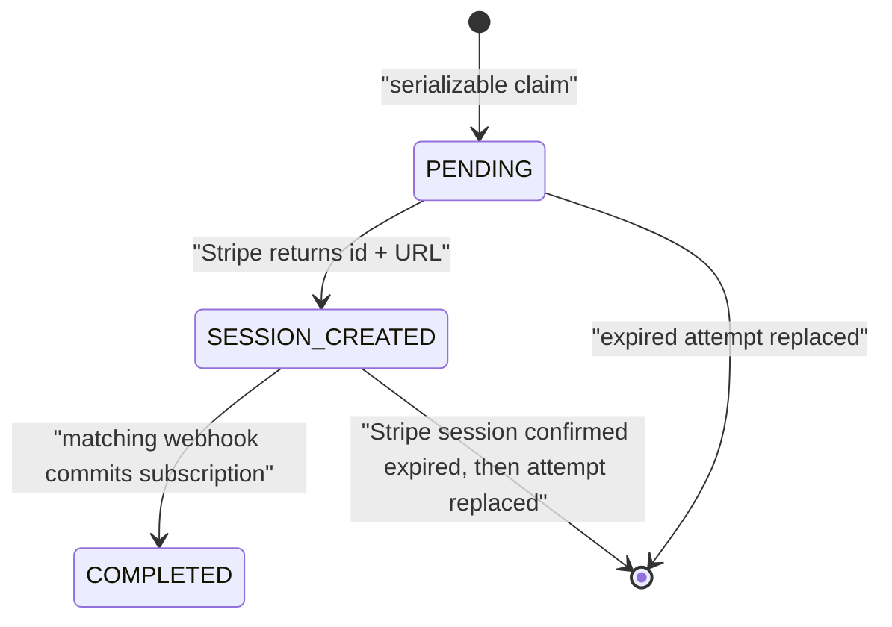

# Billing and Subscription Flow

CharityPilot bills organisations through Stripe. PostgreSQL stores one current
`Subscription` projection per organisation, one current `BillingCheckoutAttempt`
lease per organisation, and an idempotency ledger of processed Stripe events.
Stripe remains the authority for customer ownership, subscription existence,
price/interval state, cancellation scheduling, and raw subscription status.

The API exposes authenticated status, Checkout, and customer-portal routes plus
a signature-verified public webhook route. Checkout is only a first-subscription
or provider-confirmed restart path. An existing Stripe-managed subscription is
changed or cancelled through a pinned Stripe Billing Portal configuration.

## Billing configuration

`BillingService.isConfigured()` fails closed unless all of the following are
non-placeholder values:

- `STRIPE_SECRET_KEY`;
- `STRIPE_WEBHOOK_SECRET`;
- `STRIPE_BILLING_PORTAL_CONFIGURATION_ID`;
- `STRIPE_ESSENTIALS_MONTHLY_PRICE_ID`;
- `STRIPE_ESSENTIALS_YEARLY_PRICE_ID`;
- `STRIPE_COMPLETE_MONTHLY_PRICE_ID`;
- `STRIPE_COMPLETE_YEARLY_PRICE_ID`.

The four price IDs must also be distinct. Production validation requires the
expected `sk_live_`, `whsec_`, `bpc_`, and `price_` prefixes. Missing, duplicate,
or placeholder configuration disables both Checkout and portal capabilities and
causes mutation routes to return `503 BILLING_NOT_CONFIGURED` before making a
Stripe mutation.

### Plans and approved prices

The Prisma and shared TypeScript plan enum has two values: `ESSENTIALS` and
`COMPLETE`. Each plan has a monthly and yearly configured price:

| Plan | API interval | Stripe cadence | Approved amount | Environment variable |
| --- | --- | --- | --- | --- |
| Essentials | `monthly` | month x 1 | EUR 19.00 | `STRIPE_ESSENTIALS_MONTHLY_PRICE_ID` |
| Essentials | `yearly` | year x 1 | EUR 190.00 | `STRIPE_ESSENTIALS_YEARLY_PRICE_ID` |
| Complete | `monthly` | month x 1 | EUR 39.00 | `STRIPE_COMPLETE_MONTHLY_PRICE_ID` |
| Complete | `yearly` | year x 1 | EUR 390.00 | `STRIPE_COMPLETE_YEARLY_PRICE_ID` |

The live-provider checker requires monthly and yearly prices for the same plan
to share one Stripe product and requires Essentials and Complete to use
different products. Each price must be active, live-mode, recurring, EUR, use
an interval count of one, and have the exact approved amount.

At runtime, `getConfiguredSubscriptionPrice()` accepts a Stripe subscription
only when it has exactly one item, that item has `quantity === 1`, and its price
ID matches exactly one of the four configured IDs. The match determines both
the local plan and billing interval. A Checkout completion must additionally
match its attempt-bound `plan` and `interval` metadata. Webhooks with an extra
item, a different quantity, an unknown price, or inconsistent metadata fail
with `STRIPE_WEBHOOK_MISMATCH` and do not update the local subscription.

## Routes and authorization

Billing is mounted below `/api/v1/billing`:

| Route | Method | Guards | Purpose |
| --- | --- | --- | --- |
| `/webhooks` | POST | Stripe signature | Receive raw Stripe events |
| `/checkout`, `/create-checkout` | POST | `authGuard` + `requireOwner` | Create or reuse one safe Checkout session |
| `/portal`, `/create-portal` | POST | `authGuard` + `requireOwner` | Open the pinned customer portal |
| `/status` | GET | `authGuard` | Return local access state and server-owned billing capabilities |

The organisation ID always comes from the authenticated user context, never
from the request body. Members and admins cannot create Checkout or portal
sessions. The webhook scope uses a raw `Buffer` JSON parser because Stripe
signature verification must receive the unparsed request body.

## Status contract and Checkout eligibility

`GET /status` returns the local plan/status projection together with:

- `stripeStatus`: the last authoritative raw Stripe status, or `null` for a
  local-only trial;
- `billingInterval`: `monthly`, `yearly`, or `null`;
- `cancelAtPeriodEnd`: the last authoritative Stripe cancellation schedule;
- `trialEndsAt` and `currentPeriodEnd`;
- `hasAccess`, evaluated by `hasSubscriptionAccess`;
- `billingConfigured`;
- `canStartCheckout` and `canOpenPortal`.

The web UI treats `canStartCheckout` and `canOpenPortal` as server-owned
capabilities. It does not infer that switching plans through Checkout is safe.
These values are presentation hints; `POST /checkout` always repeats the
customer and subscription checks against Stripe immediately before claiming an
attempt.

| Current local state | Checkout status hint | Portal status hint | Mutation-time result |
| --- | --- | --- | --- |
| Billing unconfigured | No | No | `503 BILLING_NOT_CONFIGURED` |
| No `Subscription` row | Yes | Only if a stored customer exists | Checkout proceeds only if Stripe finds no non-terminal subscription |
| Local-only `TRIALING`, `CANCELLED`, or `EXPIRED` row | Yes | Only if a stored customer exists | Checkout proceeds only after customer-wide Stripe reconciliation |
| Local-only `ACTIVE` or `PAST_DUE` row | No | Only if a stored customer exists | Fail closed for operator review |
| Stripe-backed row with raw `canceled` or `incomplete_expired` | Yes | Yes | Restart allowed only when Stripe confirms the saved ID is terminal and no non-terminal subscription exists |
| Stripe-backed row with any other or missing raw status | No | Yes | Existing subscription is managed in the portal; Checkout is rejected |
| Provider ambiguity discovered at mutation time | May have appeared eligible from local facts | May have appeared eligible from local facts | `409 BILLING_ACCOUNT_REVIEW_REQUIRED` |

For new-Checkout eligibility, the only provider-confirmed terminal Stripe
statuses are `canceled` and `incomplete_expired`. Every other status, including
`active`, `trialing`, `past_due`, `incomplete`, `unpaid`, `paused`, and an
unknown future status, is treated as non-terminal. A subscription with
`cancel_at_period_end: true` remains non-terminal until Stripe reports a final
terminal status; scheduling cancellation never makes a second Checkout safe.

## Customer and subscription reconciliation

Checkout and portal creation reconcile billing ownership before returning a
provider URL:

1. A stored `Organisation.stripeCustomerId`, when present, is retrieved and
   accepted only when its Stripe metadata contains the same `organisationId`.
2. Stripe customer search is also performed for that metadata value. More than
   one result, or a paginated result, is considered ambiguous and fails closed.
3. When a local `stripeSubscriptionId` exists, that subscription is retrieved.
   Its customer must carry the same organisation metadata and must agree with
   the reconciled customer. A missing or mismatched saved subscription requires
   human review rather than automatic replacement.
4. Checkout creates a new customer only when no stored, searched, or
   subscription-derived customer can be verified. Customer creation uses the
   organisation-scoped idempotency key `charitypilot-customer-{organisationId}`
   and persists the resulting customer ID.
5. Portal creation never invents a customer. It returns `NO_STRIPE_CUSTOMER`
   when no customer can be verified.

Before Checkout, the API lists up to 100 subscriptions for the reconciled
customer with `status=all`. Pagination, any non-terminal subscription, or a
saved local subscription ID absent from the provider-confirmed terminal set
blocks Checkout. The same uniqueness check is repeated against the newly
created subscription before a Checkout-completion webhook may persist it.

## Billing authority grants and restricted release

Provider-hosted Checkout and Portal URLs are bearer capabilities. Before a
provider operation, the API persists an actor-, session-, membership-version-,
and organisation-bound `BillingAuthorityGrant`; an organisation can have only
one unresolved grant. Its state advances from `CLAIMED` through
`PROVIDER_STARTED` to `CAPABILITY_ISSUED`, then to `RELEASED`. Provider start,
resource, capability, and safe-release facts become immutable once recorded.
`safeReleaseAfter` is forbidden before a Checkout capability is issued, and an
elapsed release is valid only with the matching issued-capability and provider-
resource evidence. Portal grants never carry a safe-release timestamp.

After provider I/O, the API records the capability and then re-locks the
organisation, grant, exact owner membership version, and exact authenticated
session before returning the bearer URL. A concurrent logout, administrative
session revocation, demotion, or ownership change therefore withholds the URL
and leaves the durable grant for restricted reconciliation. Billing status
offers Checkout resumption only to that same owner and session; a replacement
login cannot inherit another session's unresolved capability.
Capability preflight runs while the grant is still `CLAIMED`; immediately
before the capability-issuing provider call, exactly one request must win the
`CLAIMED` to `PROVIDER_STARTED` compare-and-set. Concurrent losers never call
the provider. A definite pre-create failure may release only a still-`CLAIMED`
grant. Once any request reaches `PROVIDER_STARTED`, request-local absence of a
URL is never treated as proof that the provider issued nothing.

An unresolved grant interlocks owner membership and organisation lifecycle
changes in both the service layer and PostgreSQL. Checkout may be automatically
released only after its explicitly persisted safe-release time. Portal is never
time-released. Exceptional release uses the restricted offline
`jobs:reconcile-billing-authority` command, with an exact grant and expected
state, operator/case/provider evidence, explicit authority confirmation, a
target-bound phrase that includes the exact release reason, serializable
organisation-then-grant locking, and an exact compare-and-set. Checkout cannot
use the generic restricted-operator attestation reason; it needs concrete
not-issued, revoked, terminal, or elapsed-safe-time evidence. The job is not
mounted as a route.

Releasing `CLAIMED` or `PROVIDER_STARTED` also requires a documented maintenance
window and explicit proof that all billing mutations are paused and provider
I/O has drained. A transaction lock alone cannot prove that an external create
call is not already in flight. The quiescence controls remain active through
the dependent ownership/lifecycle change. See
[Restricted Billing Authority Reconciliation](../billing-authority-reconciliation.md)
for the reason matrix and operator procedure.

## `BillingCheckoutAttempt` lifecycle

`BillingCheckoutAttempt` is a one-to-one, organisation-scoped lease that binds
one user request, one Stripe Checkout session, and one eventual webhook update.
Its states are:

The lifecycle has these invariants:

- `organisationId` is unique, so an organisation can have only one current
  attempt row.
- Claims run in a serializable Prisma transaction and retry bounded `P2002` or
  serialization conflicts.
- A live attempt for the same plan/interval is reused. A different request
  returns `409 CHECKOUT_ALREADY_PENDING`.
- The row captures the requested plan/interval and the exact previous local
  Stripe subscription ID observed when the claim was made.
- The lease lasts one hour. Stripe receives the same expiry timestamp, attempt
  ID in Checkout/subscription metadata, and the idempotency key
  `charitypilot-checkout-{attemptId}`.
- A session is persisted as `SESSION_CREATED` only after Stripe returns both a
  session ID and URL. Concurrent finalization must agree on the same session.
- Before replacing an expired attempt, the API retrieves its Stripe session.
  A completed session blocks replacement pending reconciliation; an open
  session is explicitly expired; only a confirmed expired session is replaced.
- Checkout completion must match the current attempt ID, plan, interval,
  session ID, customer, subscription, configured price, and prior-subscription
  snapshot. A superseded attempt or a subscription changed by a concurrent
  webhook cannot overwrite the current row.
- Completion sets `COMPLETED` and clears the stored Checkout URL.

This prevents CharityPilot's current UI or concurrent API requests from
creating two non-terminal subscriptions. It does not retroactively invalidate
open Checkout sessions created by older code, which is why the production
legacy-session preflight remains mandatory.

## Pinned customer portal

`createPortalSession()` passes
`STRIPE_BILLING_PORTAL_CONFIGURATION_ID` explicitly to Stripe; it never relies
on whichever portal configuration happens to be the dashboard default. The
live provider checker requires that configuration to be active and live-mode
with:

- subscription updates enabled;
- price changes allowed and quantity changes forbidden;
- the exact two-product/four-price allow-list described above;
- an explicit recognised Stripe proration behavior;
- cancellation enabled in `at_period_end` mode with an explicit recognised
  proration behavior.

Product copy deliberately does not promise a specific proration outcome. The
operator-selected portal policy must be reviewed and proven in live Stripe.
Existing Stripe-managed subscriptions use this portal for approved price/
interval and cancellation changes; anything outside the pinned configuration
requires support/operator review.

## Authoritative webhook handling

`constructWebhookEvent()` rejects a missing signature, requires the configured
webhook secret, and normalises Stripe signature failures to
`INVALID_STRIPE_SIGNATURE`. After signature verification, handled subscription
objects are fetched from Stripe by ID rather than trusting mutable fields in the
event payload:

| Event | Authoritative read | Local effect |
| --- | --- | --- |
| `checkout.session.completed` | Retrieve session's subscription, then list that customer's subscriptions | Validate the active attempt and safely create/update the one local projection |
| `customer.subscription.updated` | Re-retrieve the subscription by event object ID | Update known local subscription only |
| `customer.subscription.deleted` | Re-retrieve the subscription by event object ID | Mark known local subscription `CANCELLED` |

Unknown update/delete subscription IDs do not attach themselves to an
organisation. Each processed event ID is inserted into `StripeWebhookEvent`
inside the same database transaction as the subscription change. A duplicate
event returns without repeating side effects; a handler failure rolls back the
event insert so Stripe can retry.

For Checkout completion, the API also proves that no *other* non-terminal
subscription exists for the customer before the transaction. Inside the
transaction it validates the current attempt and prior-subscription snapshot,
then writes the subscription and completes the attempt atomically.

## Local status projection and access

Every authoritative webhook persists both a conservative local access status
and Stripe facts needed for billing decisions:

| Stripe status | Local `SubscriptionStatus` |
| --- | --- |
| `active` | `ACTIVE` |
| `trialing` | `TRIALING` |
| `past_due` | `PAST_DUE` |
| `canceled` | `CANCELLED` |
| `incomplete`, `incomplete_expired`, `paused`, `unpaid`, unknown | `EXPIRED` |

The raw value is retained in `Subscription.stripeStatus`, the configured
cadence in `billingInterval`, and Stripe's schedule in `cancelAtPeriodEnd`.
Period/trial/cancellation timestamps are converted from Stripe Unix seconds.
The delete event always sets local `CANCELLED` after the same customer and
price-shape checks.

`subscriptionGuard` grants access for `ACTIVE`, an unexpired `TRIALING` row, or
`PAST_DUE` within the configured grace window. `CANCELLED` and `EXPIRED` do not
grant access. `requireCompletePlan` is layered on top for governance-register
routes. Cancellation scheduled at period end is visible to the UI but does not
prematurely revoke access; the subsequent authoritative webhook drives the
state transition.

## Production proof that remains external

Repository tests cover race handling, stale/duplicate customers, terminal and
non-terminal subscription states, attempt expiry, webhook ordering, exact
price/interval/quantity checks, capability-driven UI, and provider-checker
contracts. Those controlled tests are not evidence that a live Stripe account
is configured correctly or that historical provider state is clean.

Before enabling production billing, an operator must:

1. run the redacted live provider checker;
2. inspect every CharityPilot Stripe customer and reconcile it to one
   organisation;
3. confirm there is at most one non-terminal subscription per customer;
4. expire every still-open legacy subscription-mode Checkout session created
   before the attempt-bound release, and reconcile any completed session before
   deployment;
5. prove the pinned portal's exact allow-list, cancellation mode, and chosen
   proration policy;
6. exercise first purchase, supported portal change, scheduled cancellation,
   cancellation completion, terminal restart, webhook retry/order, and
   duplicate-click behavior against live/test provider state as appropriate;
7. record redacted evidence outside Git and bind final production proof to the
   promoted release SHA.

Do not infer any of this evidence from mocks, local test counts, or a provider
configuration object that was not read from the live account.

## Cross-references

- [Data Model Reference](03-data-model.md) - `Subscription`,
  `BillingCheckoutAttempt`, and `StripeWebhookEvent`.
- [Request Lifecycle, Middleware and Auth](04-request-lifecycle.md) - auth,
  owner, subscription, and plan guards.
- [Frontend Architecture](09-frontend.md) - capability-driven billing UI.
- [Configuration and Environment](10-config-and-env.md) - billing environment
  validation and the repository/external gate split.
- [Stripe and Resend Production Setup](../billing-and-email-setup.md) - live
  provider configuration and proof.
- [Restricted Billing Authority Reconciliation](../billing-authority-reconciliation.md) -
  exceptional offline grant release, evidence, and provider-I/O quiescence.
