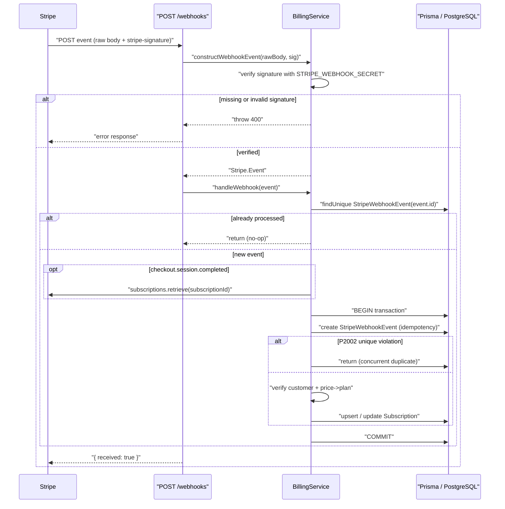
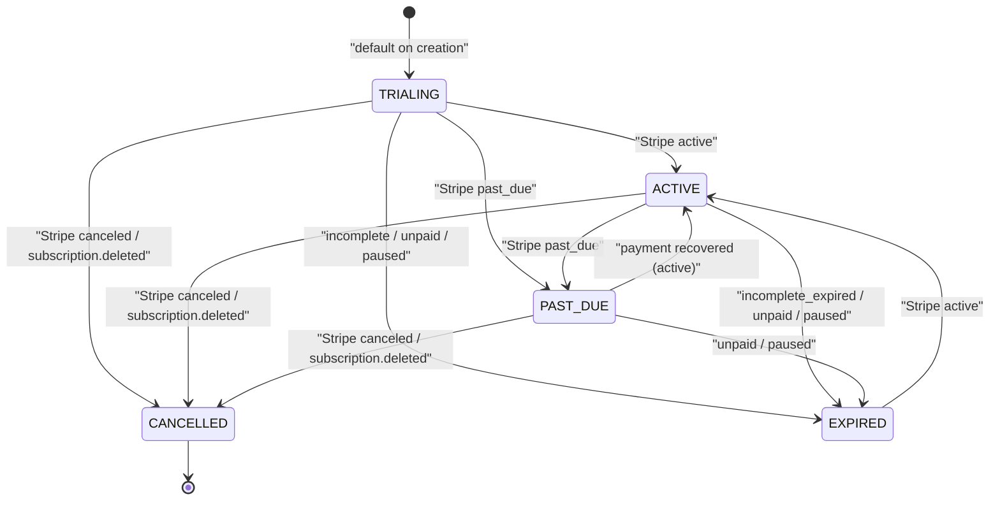

# Billing & Subscription Flow

CharityPilot bills organisations through Stripe Checkout subscriptions, persisting the local view of each subscription in a `Subscription` row keyed to the organisation. The API exposes authenticated checkout/portal/status routes and a public Stripe webhook endpoint that drives all subscription-state changes, while two middlewares (`subscriptionGuard` and `requireCompletePlan`) plus the `hasSubscriptionAccess` helper enforce access and feature gating across the platform.

## Plans and price IDs

Two plans exist, modelled identically in the database enum, the shared TypeScript enum, and the checkout request schema:

| Source | Definition |
| --- | --- |
| Prisma enum `SubscriptionPlan` | `ESSENTIALS`, `COMPLETE` — `apps/api/prisma/schema.prisma:43-46` |
| Shared enum `SubscriptionPlan` | `ESSENTIALS = 'ESSENTIALS'`, `COMPLETE = 'COMPLETE'` — `packages/shared/src/types/enums.ts:34-37` |
| Checkout request `plan` values | `['ESSENTIALS', 'COMPLETE']` — `packages/shared/src/schemas/billing.ts:3` |

Each plan is sold at a monthly or yearly interval, mapped onto four Stripe price IDs read from environment variables in `getPriceConfig()` (`apps/api/src/services/billing.service.ts:14-25`):

| Plan | Interval | Environment variable |
| --- | --- | --- |
| ESSENTIALS | monthly | `STRIPE_ESSENTIALS_MONTHLY_PRICE_ID` |
| ESSENTIALS | yearly | `STRIPE_ESSENTIALS_YEARLY_PRICE_ID` |
| COMPLETE | monthly | `STRIPE_COMPLETE_MONTHLY_PRICE_ID` |
| COMPLETE | yearly | `STRIPE_COMPLETE_YEARLY_PRICE_ID` |

All four price-ID variables, plus `STRIPE_SECRET_KEY` and `STRIPE_WEBHOOK_SECRET`, are declared in `turbo.json:11-16` so Turborepo treats them as part of the task environment. In production they are additionally validated by `validateProductionEnv()`: the secret key must start with `sk_live_`, the webhook secret with `whsec_`, and every price ID with `price_` (`apps/api/src/utils/env.ts:439-444`).

### Plan ↔ price-ID resolution

The mapping is resolved in two directions, both against the single `getPriceConfig()` table:

- **Plan + interval → price ID** when starting a checkout. `getPriceId()` finds the config row matching both the plan and interval and returns its `priceId`, throwing `503 BILLING_NOT_CONFIGURED` if that price is missing or still a placeholder (`apps/api/src/services/billing.service.ts:100-112`).
- **Stripe price → plan** when processing a webhook. `getPlanForSubscriptionPrice()` reads the price ID off the first subscription line item (`sub.items.data[0].price`), finds the matching configured row, and returns its `plan`; an unmatched price throws `400 STRIPE_WEBHOOK_MISMATCH` (`apps/api/src/services/billing.service.ts:114-127`).

"Configured" is decided by `isConfiguredSecret()`, which rejects empty strings and a set of known placeholder fragments such as `price_...`, `whsec_...`, and `your_` (`apps/api/src/utils/secrets.ts:1-18`). `BillingService.isConfigured()` reports billing as ready only when the secret key, webhook secret, and all four price IDs pass this check (`apps/api/src/services/billing.service.ts:82-88`).

## Routes

Billing is mounted as two encapsulated Fastify scopes (`apps/api/src/routes/billing/index.ts`):

| Route | Method | Guards | Purpose |
| --- | --- | --- | --- |
| `/webhooks` | POST | none (signature-verified) | Receive Stripe events; raw `Buffer` body parser registered for `application/json` (`apps/api/src/routes/billing/index.ts:15-43`) |
| `/checkout`, `/create-checkout` | POST | `authGuard` + `requireOwner` | Create a Stripe Checkout session (`apps/api/src/routes/billing/index.ts:74-75`) |
| `/portal`, `/create-portal` | POST | `authGuard` + `requireOwner` | Create a Stripe billing-portal session (`apps/api/src/routes/billing/index.ts:76-77`) |
| `/status` | GET | `authGuard` | Return the organisation's plan/status/access summary (`apps/api/src/routes/billing/index.ts:79-85`) |

The authenticated scope applies `authGuard` via an `onRequest` hook (`apps/api/src/routes/billing/index.ts:46-47`); checkout and portal additionally require the `OWNER` role through the `requireOwner` preHandler, which is `requireRole('OWNER')` (`apps/api/src/middleware/roles.ts:18`). Checkout and portal each have two URL aliases pointing at the same handler.

### Checkout session creation

`createCheckoutSession(organisationId, plan, interval)` (`apps/api/src/services/billing.service.ts:322-360`):

1. Loads the organisation (`findUniqueOrThrow`) and obtains the Stripe client via `getStripe()`, which throws `503 BILLING_NOT_CONFIGURED` if `STRIPE_SECRET_KEY` is unset/placeholder (`apps/api/src/services/billing.service.ts:90-98`).
2. Resolves the price ID with `getPriceId(plan, interval)`.
3. Lazily creates a Stripe customer if `organisation.stripeCustomerId` is null — tagging it with `metadata.organisationId`, the organisation name and contact email — then persists the new `stripeCustomerId` on the organisation (`apps/api/src/services/billing.service.ts:336-348`).
4. Creates a `mode: 'subscription'` Checkout session with a single line item, success/cancel URLs under the primary frontend origin (`/billing?success=true` / `/billing?cancelled=true`), and `metadata: { organisationId, plan }`. The metadata is later re-checked by the webhook handler. Returns `{ url }`.

The frontend origin comes from `getPrimaryFrontendOrigin()`, which takes the first comma-separated entry of `FRONTEND_URL` (defaulting to `http://localhost:3000`) with trailing slashes stripped (`apps/api/src/utils/frontend-origin.ts:1-8`).

The billing-portal session (`createPortalSession`) requires an existing `stripeCustomerId`, otherwise it throws `400 NO_STRIPE_CUSTOMER`, and returns a portal URL with `return_url` set to `/billing` (`apps/api/src/services/billing.service.ts:362-377`).

## Webhook handling

The webhook endpoint is deliberately isolated in its own Fastify scope so it can install a raw-`Buffer` content-type parser for `application/json` — Stripe signature verification requires the unparsed body (`apps/api/src/routes/billing/index.ts:15-23`). The handler reads the `stripe-signature` header and raw body, verifies the event, processes it, and replies `{ received: true }` (`apps/api/src/routes/billing/index.ts:25-42`). Client errors (`AppError` with status < 500) are logged at warn level; everything else at error level.

### Signature verification

`constructWebhookEvent(rawBody, signature)` (`apps/api/src/services/billing.service.ts:296-320`):

- Throws `400 MISSING_STRIPE_SIGNATURE` when the signature header is absent.
- Throws `503 BILLING_NOT_CONFIGURED` when `STRIPE_WEBHOOK_SECRET` is unset/placeholder.
- Calls `stripe.webhooks.constructEvent(rawBody, signature, webhookSecret)`; a Stripe signature-verification error is normalised to `400 INVALID_STRIPE_SIGNATURE`, any other error re-thrown.

### Idempotency

Replay protection uses the `StripeWebhookEvent` table, whose primary key is the Stripe event `id` (`apps/api/prisma/schema.prisma:552-559`). `handleWebhook(event)` first calls `hasProcessedWebhookEvent(event.id)` and returns early if a row already exists (`apps/api/src/services/billing.service.ts:408-411`, `:163-169`). Inside the transaction it then attempts to `create` the event row; a unique-constraint violation (`P2002`) is caught and the transaction returns without side effects, closing the race between concurrent deliveries of the same event (`apps/api/src/services/billing.service.ts:420-430`, `:48-50`). The table also indexes `processedAt` for housekeeping.

### Handled event types and persistence

For `checkout.session.completed`, the subscription is retrieved from Stripe **before** the transaction opens (`resolveCheckoutSubscription`), so the network call does not hold the DB transaction open (`apps/api/src/services/billing.service.ts:413-416`, `:155-161`). Within the transaction, a `switch` dispatches on `event.type`:

| Event type | Handler | Effect |
| --- | --- | --- |
| `checkout.session.completed` | `handleCheckoutCompleted` | Upserts the `Subscription` row for the organisation |
| `customer.subscription.updated` | `handleSubscriptionUpdated` | Updates an existing `Subscription` by `stripeSubscriptionId` |
| `customer.subscription.deleted` | `handleSubscriptionDeleted` | Marks the subscription `CANCELLED` |

Any other event type creates the idempotency row but performs no state change (`apps/api/src/services/billing.service.ts:432-447`).

**`handleCheckoutCompleted`** (`apps/api/src/services/billing.service.ts:171-231`) reads `organisationId`, `plan`, and the subscription ID from the session metadata via `getCheckoutSubscriptionContext`, which throws `400 STRIPE_WEBHOOK_MISMATCH` if metadata is incomplete or the plan is not a recognised value (`:135-153`). It then verifies the organisation exists locally and that both the session customer and the subscription customer match `organisation.stripeCustomerId` (`assertStripeIdMatches`, `:129-133`). It re-derives the plan from the subscription's price and asserts it equals the metadata plan, rejecting tampering. Finally it upserts the `Subscription` row keyed on `organisationId`, writing `stripeSubscriptionId`, `plan`, mapped `status`, and the period/trial dates.

**`handleSubscriptionUpdated`** (`apps/api/src/services/billing.service.ts:246-271`) looks the subscription up by `stripeSubscriptionId`, returning silently if none exists, re-verifies the customer match and price→plan, then updates `plan`, `status`, `currentPeriodStart`, `currentPeriodEnd`, `trialEndsAt`, and `cancelledAt`.

**`handleSubscriptionDeleted`** (`apps/api/src/services/billing.service.ts:273-294`) verifies the existing record, then forces `status = 'CANCELLED'` and sets `cancelledAt` to `sub.canceled_at` or the current time.

### Status mapping

Stripe subscription statuses are mapped to the local `SubscriptionStatus` enum by `mapStripeSubscriptionStatus()` (`apps/api/src/services/billing.service.ts:60-77`):

| Stripe status | Local `SubscriptionStatus` |
| --- | --- |
| `active` | `ACTIVE` |
| `trialing` | `TRIALING` |
| `past_due` | `PAST_DUE` |
| `canceled` | `CANCELLED` |
| `incomplete`, `incomplete_expired`, `paused`, `unpaid`, anything else | `EXPIRED` |

Dates are converted from Stripe's Unix-seconds timestamps via `getDateFromUnixSeconds` (`apps/api/src/services/billing.service.ts:40-42`).

### Webhook → subscription update sequence

## SubscriptionStatus lifecycle

The `Subscription` model defaults `status` to `TRIALING` (`apps/api/prisma/schema.prisma:536-550`). Thereafter every transition is driven by mapped Stripe statuses arriving on webhooks; there is no internal scheduler that mutates `status` (expiry of a trial or grace window is evaluated at read time by `hasSubscriptionAccess`, not by changing the stored status). `customer.subscription.deleted` is the only path that hard-sets `CANCELLED` independent of the Stripe status field.

Note: `ACTIVE`, `PAST_DUE`, `EXPIRED`, and `TRIALING` are all whatever the latest mapped Stripe status dictates, so transitions between non-terminal states can occur in any direction a Stripe update implies; the diagram shows the transitions reachable through the documented mappings.

## Feature gating and access control

Two layers of gating sit in front of feature routes, both reading the single `Subscription` row by `organisationId`.

### Active-subscription gate — `subscriptionGuard`

`subscriptionGuard` (`apps/api/src/middleware/subscription.ts:8-51`) runs after `authGuard` and is attached as an `onRequest` hook on protected route groups including dashboard, deadlines, board-members, team, compliance, export, documents, organisations, and governance-registers (`apps/api/src/routes/*/index.ts`). It:

1. Returns `403 NO_SUBSCRIPTION` when no row exists.
2. Returns early (granting access) when `hasSubscriptionAccess(subscription, now)` is true.
3. Otherwise returns a specific `403`: `TRIAL_EXPIRED` for a lapsed trial, `PAST_DUE_GRACE_EXPIRED` after the grace window, or the fallback `SUBSCRIPTION_INACTIVE`.

The access predicate `hasSubscriptionAccess` (`apps/api/src/utils/subscription-access.ts:21-37`) decides:

| Status | Access granted when |
| --- | --- |
| `ACTIVE` | always |
| `TRIALING` | `trialEndsAt` is null **or** still in the future |
| `PAST_DUE` | `currentPeriodEnd` is later than the past-due grace cutoff |
| `CANCELLED`, `EXPIRED`, other | never |

The grace window is `PAST_DUE_GRACE_DAYS` days (default 7, clamped to 0–30, falling back to 7 on invalid input), measured back from "now" (`apps/api/src/utils/subscription-access.ts:1-19`). `getStatus()` reuses the same predicate to populate the `hasAccess` field returned to the frontend (`apps/api/src/services/billing.service.ts:379-406`).

### Plan-tier gate — `requireCompletePlan`

`requireCompletePlan` (`apps/api/src/middleware/plan.ts:4-19`) is a `preHandler` that loads only the `plan` field and grants access only when it equals `SubscriptionPlan.COMPLETE`; otherwise it returns `403 PLAN_FEATURE_UNAVAILABLE` ("This feature requires the Complete plan."). It does not itself check subscription validity, so it is layered after `subscriptionGuard`.

### What ESSENTIALS vs COMPLETE unlocks

The only route group in the codebase that adds `requireCompletePlan` on top of `subscriptionGuard` is **governance registers** (`apps/api/src/routes/governance-registers/index.ts:41-43`). Therefore, with an active subscription:

| Capability | ESSENTIALS | COMPLETE |
| --- | --- | --- |
| Dashboard, deadlines, board members, team, compliance, export, documents, organisations | Yes (gated by `subscriptionGuard` only) | Yes |
| Governance registers | No (`PLAN_FEATURE_UNAVAILABLE`) | Yes |

In other words, COMPLETE is distinguished from ESSENTIALS solely by access to the governance-registers feature; all other subscription-gated features are available to both plans.

## Cross-references

- [Module & Dependency Graph](02-module-dependency-graph.md) — where BillingService sits in the module graph.
- [Data Model Reference](03-data-model.md) — the Subscription and StripeWebhookEvent models.
- [Request Lifecycle, Middleware & Auth](04-request-lifecycle.md) — the subscriptionGuard and plan guards.
- [Frontend Architecture](09-frontend.md) — client-side plan/feature gating that mirrors the API.
- [Configuration, Environment & the Two-Gate Model](10-config-and-env.md) — the Stripe environment surface.
