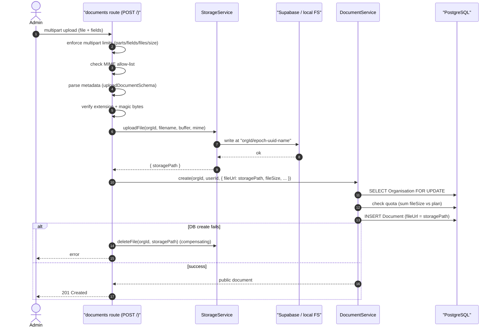
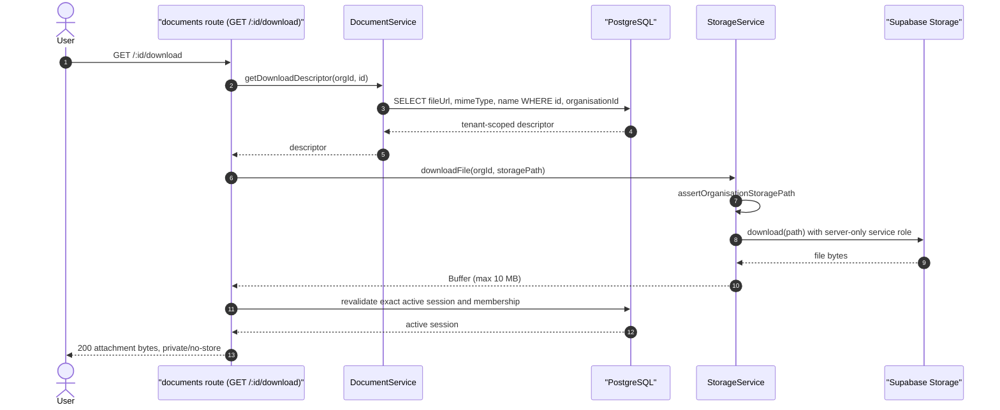
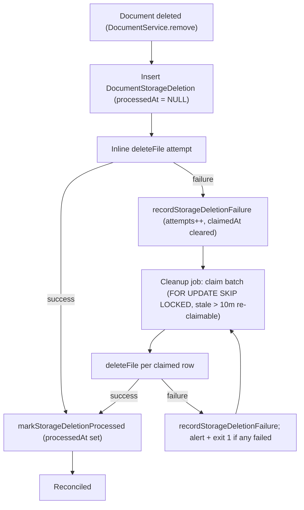

# Document Storage Flow

CharityPilot stores governance documents (policies, minutes, certificates) as opaque binary objects in an external object store, keeping only metadata and a storage key in PostgreSQL. The storage layer is abstracted behind a single `StorageService` that switches between a Supabase Storage private bucket (default) and a local filesystem driver (dev/Docker) selected by `DOCUMENT_STORAGE_DRIVER`. Deletion is decoupled from the request that triggers it via a durable reconciliation record (`DocumentStorageDeletion`) reconciled by a scheduled cleanup job.

## Storage drivers

`StorageService` resolves its driver at call time from environment variables; there is no persistent client. The driver is "local" only when `DOCUMENT_STORAGE_DRIVER === 'local'`, otherwise Supabase is used (`apps/api/src/services/storage.service.ts:17-19`).

| Concern | Supabase driver (default) | Local driver (`DOCUMENT_STORAGE_DRIVER=local`) |
| --- | --- | --- |
| Backing store | Supabase Storage private bucket | Local filesystem directory |
| Bucket / root | `SUPABASE_STORAGE_BUCKET` (default `documents`) `apps/api/src/services/storage.service.ts:13-15` | `LOCAL_FILE_STORAGE_DIR` (default `.charitypilot-local-storage/documents`) `apps/api/src/services/storage.service.ts:21-23` |
| Client / credentials | `createClient(SUPABASE_URL, SUPABASE_SERVICE_ROLE_KEY)` `apps/api/src/services/storage.service.ts:54-63` | `node:fs/promises` (`mkdir`/`writeFile`/`readFile`/`unlink`) |
| Download mechanism | Authenticated API proxy reads with the server-only service role and streams bytes | The same authenticated API proxy reads from the guarded local path and streams bytes |
| `isConfigured()` | Requires URL, service-role key and bucket all set `apps/api/src/services/storage.service.ts:109-113` | Always `true` `apps/api/src/services/storage.service.ts:107` |
| `verifyBucket()` | Bucket exists and is `public === false`, with a readiness timeout `apps/api/src/services/storage.service.ts:128-136` | `mkdir` the root recursively `apps/api/src/services/storage.service.ts:117-124` |

The local driver is wired in the Docker dev compose file, which sets `DOCUMENT_STORAGE_DRIVER: local` and `LOCAL_FILE_STORAGE_DIR: /app/.charitypilot-local-storage/documents` (`compose.local.yml:61-62`). For Supabase, `verifyBucket()` wraps the `getBucket` call in `withReadinessTimeout` (default 3000 ms via `STORAGE_READINESS_TIMEOUT_MS`) so a slow provider cannot block readiness checks (`apps/api/src/services/storage.service.ts:36-52`, `apps/api/src/services/storage.service.ts:128-133`).

When the Supabase credentials are not configured, `getSupabaseClient()` raises a `503 STORAGE_NOT_CONFIGURED` `AppError` rather than constructing a half-configured client (`apps/api/src/services/storage.service.ts:58-60`).

### Path keying and traversal guards

Every storage object is keyed by organisation. On upload the path is built as `<organisationId>/<epoch-ms>-<uuid>-<sanitised-filename>`, so same-millisecond uploads with the same original filename still produce distinct object keys (`apps/api/src/services/storage.service.ts`). `sanitiseFilename` lower-cases, replaces any character outside `[a-z0-9.\-_]` with `-`, collapses repeats and trims leading/trailing dashes.

Read/delete operations re-validate ownership through `assertOrganisationStoragePath`, which rejects (with `403 STORAGE_PATH_FORBIDDEN`) backslash-normalised input, empty or exact `.`/`..` path segments, any path that does not begin with `<organisationId>/`, or one with no remainder after the prefix. Consecutive dots inside a valid filename remain allowed. The local driver additionally resolves the absolute path and confirms it stays under the storage root before touching the filesystem.

## Upload

### Multipart limits

The documents route exports `DOCUMENT_UPLOAD_MULTIPART_LIMITS`, a frozen object enforced manually while streaming parts (`apps/api/src/routes/documents/index.ts:25-33`). The per-file ceiling `DOCUMENT_UPLOAD_MAX_FILE_SIZE` is 10 MB (`apps/api/src/routes/documents/index.ts:24`).

| Limit | Value | Meaning |
| --- | --- | --- |
| `fileSize` | 10 MB | Maximum bytes per file |
| `files` | 1 | At most one file part |
| `fields` | 7 | Maximum non-file form fields |
| `parts` | 8 | Maximum total multipart parts |
| `fieldNameSize` | 64 | Maximum field-name bytes |
| `fieldSize` | 4096 | Maximum field-value bytes |
| `headerPairs` | 50 | Maximum header pairs |

The handler counts parts, fields and files as it iterates `request.parts()`; exceeding any count, or encountering a truncated field name/value, returns `413 MULTIPART_LIMIT_EXCEEDED` (`apps/api/src/routes/documents/index.ts:160-198`). Buffered file size over 10 MB returns `413 FILE_TOO_LARGE` (`apps/api/src/routes/documents/index.ts:208-213`). Underlying Fastify multipart errors are mapped back to the same `413` codes (`apps/api/src/routes/documents/index.ts:79-90`, `apps/api/src/routes/documents/index.ts:221-235`).

### Validation

Upload is admin-only (`preHandler: [requireAdmin]`) and sits behind the route-level `authGuard` and `subscriptionGuard` hooks (`apps/api/src/routes/documents/index.ts:96-97`, `apps/api/src/routes/documents/index.ts:151`). The file passes three validation gates:

1. **Declared MIME allow-list** — the part's `mimetype` must be in `ALLOWED_MIME_TYPES` (PDF, DOCX, XLSX, PPTX, plain text, CSV, JPEG, PNG); otherwise `400 INVALID_MIME_TYPE` (`apps/api/src/routes/documents/index.ts:13-22`, `apps/api/src/routes/documents/index.ts:200-205`).
2. **Metadata schema** — the collected form fields are parsed with `uploadDocumentSchema` from `@charitypilot/shared`; a `ZodError` yields `400 VALIDATION_ERROR` (`apps/api/src/routes/documents/index.ts:241-249`, `apps/api/src/routes/documents/index.ts:293-294`).
3. **Magic-byte / extension match** — `hasAllowedExtension` (filename suffix vs. `MIME_EXTENSIONS`) and `hasValidSignature` (content sniffing) must both pass, else `400 INVALID_FILE_SIGNATURE` (`apps/api/src/routes/documents/index.ts:251-256`).

Signature checks: PDF requires the `%PDF-` prefix; Office formats require the ZIP local-file-header `50 4B 03 04`; JPEG requires `FF D8 FF`; PNG requires the 8-byte PNG signature; text/CSV must contain no NUL byte (`apps/api/src/routes/documents/index.ts:46-72`).

### Storage write and DB row creation

Only after validation does the handler call `storageService.uploadFile`, which derives the org-scoped storage path and writes the bytes (local `writeFile` after `mkdir`, or Supabase `upload` with `upsert: false`); a Supabase error becomes `500 STORAGE_UPLOAD_FAILED` (`apps/api/src/services/storage.service.ts:139-166`). The returned `storagePath` is then persisted as the `Document.fileUrl` column via `DocumentService.create` (`apps/api/src/routes/documents/index.ts:258-278`).

`DocumentService.create` runs inside a transaction. It first asserts the storage quota, then inserts the `Document` row (`apps/api/src/services/document.service.ts:298-342`). `assertStorageQuota` locks the `Organisation` row (`SELECT ... FOR UPDATE`), reads the subscription plan, sums existing `Document.fileSize` for the org, and rejects with `403 DOCUMENT_STORAGE_QUOTA_EXCEEDED` if the new file would push usage past the plan quota (`apps/api/src/services/document.service.ts:178-216`). Quotas are 2 GiB for ESSENTIALS and 10 GiB for COMPLETE (`apps/api/src/services/document.service.ts:13-18`); a missing subscription is `403 NO_SUBSCRIPTION` (`apps/api/src/services/document.service.ts:193-195`).

If the DB create fails after the bytes were stored, the route compensates by deleting the just-written object (best-effort, logged on failure) and re-throws (`apps/api/src/routes/documents/index.ts:279-289`). On success the handler responds `201` with the public document shape (`apps/api/src/routes/documents/index.ts:291`).



## Download

`GET /api/v1/documents/:id/download` is an authenticated byte proxy. `DocumentService.getDownloadDescriptor` loads `fileUrl`, MIME type, and display name with the document id and caller organisation in the same predicate; a foreign or missing row returns `404 DOCUMENT_NOT_FOUND` (`apps/api/src/services/document.service.ts:285-304`). No object path, provider URL, signed query token, or storage capability is returned to the browser.

`StorageService.downloadFile` re-applies `assertOrganisationStoragePath` and then reads the bytes through the selected server-side driver (`apps/api/src/services/storage.service.ts:183-207`):

- **Supabase**: the API uses its server-only service role to call `download(path)` on the private bucket. A 10-second default `STORAGE_DOWNLOAD_TIMEOUT_MS` bound (configurable from 100 to 60000 ms) applies an abort signal to the underlying fetch and bounds both provider download and response-body conversion. Provider errors and timeouts map to the generic `500 STORAGE_DOWNLOAD_FAILED`; the response never exposes the provider payload or credential.
- **Local**: `readLocalFile` verifies that the local driver is enabled, resolves the path beneath the configured root, rejects files over 10 MB, maps a missing object to `404 STORAGE_FILE_NOT_FOUND`, and returns a `Buffer` (`apps/api/src/services/storage.service.ts:164-181`). There is no query-string `_local-download` endpoint.

The route revalidates the caller's exact session and active user/organisation membership after storage I/O, so a concurrent suspension, removal, ownership transfer, or session revocation wins before bytes are sent. Successful responses use `Cache-Control: private, no-store, max-age=0`, `Pragma: no-cache`, an allow-listed MIME type (or `application/octet-stream`), and a sanitised attachment filename (`apps/api/src/routes/documents/index.ts:64-108`). The web client fetches this API route through the authenticated Axios refresh path, creates a same-page object URL only after the response arrives, clicks a temporary download anchor, and revokes the object URL after a bounded 30-second WebKit-safe grace window. It never navigates to provider storage.



## Delete and the deletion-reconciliation model

Hard-deleting a document must remove both the DB row and the stored object, but those live in two systems that can fail independently. CharityPilot records the intended object removal in a durable outbox table (`DocumentStorageDeletion`) inside the same transaction that deletes the `Document`, then attempts the object removal immediately and falls back to a retry job.

`DocumentService.remove` runs a transaction that loads the document (org-scoped, `404` if missing), creates a `DocumentStorageDeletion` row carrying the org id and `storagePath` (the document's `fileUrl`), deletes the `Document`, and returns both the storage path and the new deletion-record id (`apps/api/src/services/document.service.ts:344-365`). Deleting the `Document` cascades to `DocumentStandardLink` rows (`onDelete: Cascade`, `apps/api/prisma/schema.prisma:318`).

The route then performs the inline ("happy path") removal: it calls `storageService.deleteFile` and, on success, immediately marks the deletion record processed via `markStorageDeletionProcessed`. If the object removal throws, it records the failure on the same record via `recordStorageDeletionFailure` (itself wrapped so an outbox-write failure is only logged), and the request still returns `204` (`apps/api/src/routes/documents/index.ts:300-324`). The pending record left behind is what the cleanup job reconciles.

### Historical deletion-worker summary (superseded)

> The historical summary through the following diagram describes the original unbounded worker. It is retained only as change context. The authoritative bounded lifecycle and operator procedure are in the next section.

| Column | Type | Role |
| --- | --- | --- |
| `id` | cuid | Primary key; returned by `remove` for inline marking |
| `organisationId` | String | Passed to `deleteFile` so the org-path guard passes |
| `storagePath` | String | The object key to remove (was `Document.fileUrl`) |
| `attempts` | Int (default 0) | Incremented on each failed removal attempt |
| `lastError` | String? | Formatted provider error from the last failure; cleared on success |
| `claimedAt` | DateTime? | Claim marker — set when a worker takes the row, cleared on success/failure |
| `processedAt` | DateTime? | Set when the object is confirmed removed; `NULL` means still pending |
| `createdAt` / `updatedAt` | DateTime | Ordering and bookkeeping |

Source: `apps/api/prisma/schema.prisma:325-339`. The model carries three indexes supporting the claim query: `@@index([organisationId])`, `@@index([processedAt, createdAt])` (pending rows ordered by age) and `@@index([processedAt, claimedAt, createdAt])` (pending, unclaimed/stale rows ordered by age) (`apps/api/prisma/schema.prisma:336-338`).

### Claim-then-delete reconciliation

`retryPendingStorageDeletions` claims a batch, then iterates: on success it marks the row processed, on failure it records the failure; it returns `{ processed, failed }` (`apps/api/src/services/document.service.ts:389-410`).

Claiming uses `claimPendingStorageDeletions`. When `$transaction` and `$queryRaw` are available it runs a single atomic `UPDATE ... RETURNING` that sets `claimedAt = now()` on rows where `processedAt IS NULL` and (`claimedAt IS NULL` or `claimedAt` older than `STORAGE_DELETION_CLAIM_STALE_AFTER_MS` = 10 minutes), ordered by `createdAt ASC`, limited to the batch size, with `FOR UPDATE SKIP LOCKED` so concurrent workers never contend for the same rows (`apps/api/src/services/document.service.ts:218-253`, `apps/api/src/services/document.service.ts:12`). The stale-claim window lets a row abandoned by a crashed worker be re-claimed. Where raw SQL is unavailable it degrades to a plain `findMany` of unprocessed rows (`apps/api/src/services/document.service.ts:248-252`).

- `markStorageDeletionProcessed` sets `processedAt = now()`, clears `lastError` and `claimedAt` (`apps/api/src/services/document.service.ts:367-376`).
- `recordStorageDeletionFailure` increments `attempts`, stores the formatted error in `lastError`, and clears `claimedAt` so the row is eligible for the next run (`apps/api/src/services/document.service.ts:378-387`).

### The cleanup job

`apps/api/src/jobs/cleanup-document-storage.ts` is the standalone reconciler. It defaults `NODE_ENV` to `production`, calls `validateDocumentStorageCleanupEnv()` (in production this requires `DATABASE_URL`, `SUPABASE_URL` over HTTPS, `SUPABASE_SERVICE_ROLE_KEY`, `SUPABASE_STORAGE_BUCKET` and `ERROR_ALERT_WEBHOOK_URL`, else throws `DOCUMENT_STORAGE_CLEANUP_ENV_INVALID`) (`apps/api/src/jobs/cleanup-document-storage.ts:7-8`, `apps/api/src/utils/env.ts:367-383`), then invokes `retryPendingStorageDeletions` passing `storageService.deleteFile` as the remover, with a batch limit from `DOCUMENT_STORAGE_CLEANUP_LIMIT` (default 25) (`apps/api/src/jobs/cleanup-document-storage.ts:12-23`). If any deletion failed, or the job throws, it emits a job-failure alert and sets `process.exitCode = 1`; it always disconnects Prisma in `finally` (`apps/api/src/jobs/cleanup-document-storage.ts:25-48`).



### Current bounded claim, retry, and dead-letter lifecycle

`DocumentStorageDeletion.state` is one of `PENDING`, `DEAD_LETTER`, or `PROCESSED`. Pending rows carry the bounded attempt count, sanitized last error, last-attempt time, next-attempt time, and claim time. Five failed attempts terminally dead-letter a row; a path rejected by the organisation path guard dead-letters on its first attempt with `PERMANENT_STORAGE_PATH_REJECTED`. Retry delay is deterministic exponential backoff.

Claiming is one atomic `UPDATE ... RETURNING` over due pending rows selected with `FOR UPDATE SKIP LOCKED`. Finalization and failure recording compare the exact `claimedAt` ownership value, so a stale worker cannot change a row after another worker reclaims it. The ten-minute claim lease, ten-second maximum per-attempt outer bound, and 60-second safety margin derive a maximum sequential claim batch of 54: `floor((600000 - 60000) / 10000)`. A configured cleanup limit above that value is clamped.

Supabase deletion uses a timed fetch whose `AbortSignal` closes the underlying provider request, plus a bounded outer timeout. `STORAGE_DELETE_TIMEOUT_MS` defaults to 5000 and accepts only 100 through 8000 milliseconds. The service-level ten-second outer bound remains authoritative even if a callback ignores cancellation; a promise that resolves after timeout cannot finalize the row.

Dead letters are claimed separately for alert delivery. Alert acknowledgement and release compare a random claim token. Failed delivery releases the token for a later run; successful delivery sets `alertedAt`. Alerts include an affected count and action but never object keys.

### Audited recovery and disposition

Every recovery writes an append-only `DocumentStorageDeletionRecovery` event and updates the deletion row in the same transaction. The event has a random recovery nonce; its `transactionId` is overwritten by the database with `txid_current()`. The deletion's `lastRecoveryId`, nonce, disposition, and timestamp must exactly bind that event. The trigger checks the same transaction ID, tenant, previous attempt count, terminal reason, and previous path. Recovery first locks the dead-letter row with `FOR UPDATE`; timestamp comparison is not used as authorization.

There are three explicit dispositions:

- `REQUEUE_UNCHANGED` resets the bounded retry lifecycle. Active, entitled tenant owners and administrators may perform only this disposition through the authenticated route. A permanently rejected path cannot be requeued unchanged.
- `REQUEUE_CORRECTED_PATH` records both old and corrected keys and permits the otherwise-immutable key to change only to the audited, tenant-scoped corrected key.
- `COMPLETE_EXTERNALLY_REMEDIATED` records that an operator independently completed and evidenced removal, then transitions terminally to `PROCESSED`; it does not fabricate a provider delete.

Corrected-path and external completion dispositions are reserved for the one-shot platform-operator CLI. There is no unauthenticated HTTP bypass. The CLI requires a safe named operator, substantive reason, exact tenant/deletion IDs, reviewed attempt count and terminal reason, explicit production-database authority, and a target-bound execute confirmation. Its database URL must use `sslmode=verify-full`, explicitly target a read-write server, contain no routing options or private/reserved hosts, and exactly match `DOCUMENT_STORAGE_RECOVERY_DATABASE_HOST_ALLOWLIST`. Prisma uses its default CA trust when `sslrootcert` is omitted; when supplied, `sslrootcert` must be a safe absolute `.crt`/`.pem` path, never the libpq-only `system` sentinel.

Run a dry-run first from the published API image environment using the exact
deployed `DATABASE_URL` from the production environment file; do not put
credentials in the command line or substitute a second DSN. The recovery CLI
requires that canonical DSN to identify the allowlisted managed host, use
`sslmode=verify-full`, and explicitly set `target_session_attrs=read-write`.
Use the same exact environment-file bytes for dry-run and execute:

```powershell
docker compose --env-file .env.production -f compose.production.yml run --rm production-scheduler node dist/jobs/recover-document-storage-deletion.js --dry-run --confirm-production-database-authority --organisation-id ORG_ID --deletion-id DELETION_ID --operator "NAMED OPERATOR" --reason "CASE-BOUND REASON" --disposition REQUEUE_CORRECTED_PATH --corrected-storage-path "ORG_ID/CORRECTED_OBJECT_KEY"
```

Review the returned attempts, terminal reason, `databaseAuthoritySha256`,
`correctedStoragePathSha256`, and exact `requiredExecutionConfirmation`. Repeat
the same command with `--execute`, `--expected-attempts`,
`--expected-terminal-reason`, `--expected-database-authority-sha256`,
`--expected-corrected-storage-path-sha256`, and `--confirm-execute` populated
exactly from that dry-run. The execute path recomputes both digests and refuses
a DSN or corrected-key change. For externally verified removal use
`COMPLETE_EXTERNALLY_REMEDIATED`, omit the corrected-path input and digest, and
retain the database-authority binding. Output never includes object keys,
provider payloads, database URLs, or secrets.

The always-on scheduler and the `jobs`-profile cleanup entrypoint both call the same bounded reconciler. Transient retries remain durable without alert noise; newly dead-lettered or previously unalerted rows produce the actionable dead-letter alert.

## Cross-references

- [Module & Dependency Graph](02-module-dependency-graph.md) — the documents route group and DocumentService/StorageService.
- [Data Model Reference](03-data-model.md) — the Document and DocumentStorageDeletion models.
- [Reminder Scheduler & Jobs](07-reminder-scheduler.md) — how the storage-cleanup job is scheduled.
- [Configuration, Environment & the Two-Gate Model](10-config-and-env.md) — the Supabase/local storage environment surface.
