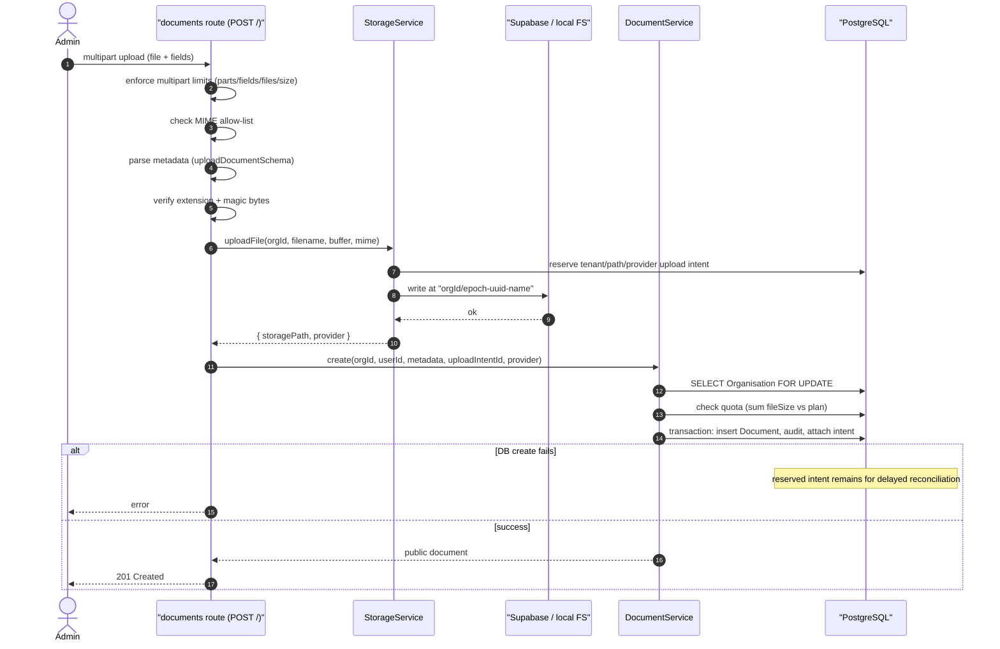
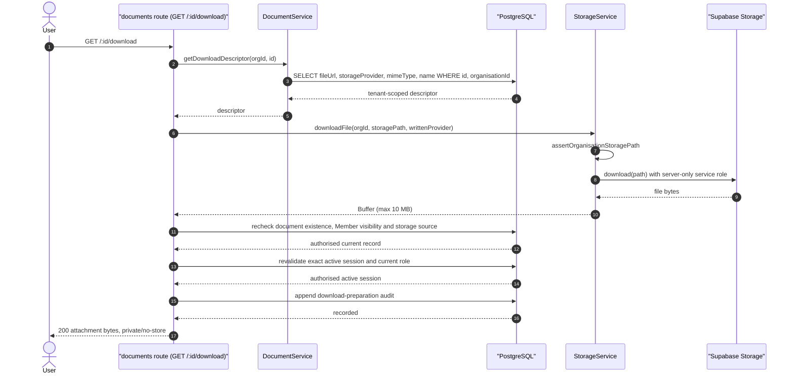
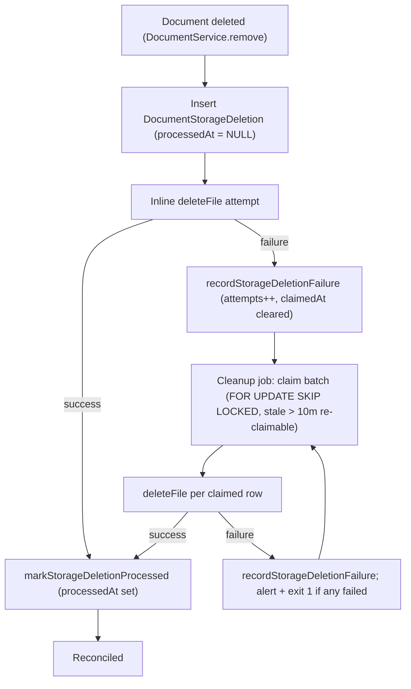

# Document Storage Flow

Admin Integrations also has a separate read-only inventory of current
`ConfluenceReference` rows: charity-managed cited pages and the version
recorded when cited. This is distinct from `DocumentPublication` and its
erasure flow. The relation to `Document` has a cascade, but ordinary deletion
and migration `20260929420000_document_linked_evidence_delete_guard` refuse
deletion while a current citation or standard link exists. A reviewer must
dispose of the link separately before a draft can be removed. The current
inventory does not preserve historical citations after that separate unlink;
the control audit records the citation ID but not the complete page/version
snapshot.

Migration `20260929430000_document_content_access_class` adds an explicit
full-file Member access assessment. Every existing document receives
`UNASSESSED`, including legacy `MEMBER_VISIBLE` rows. The Member API withholds
those rows in list, detail, search, activity and download; download rechecks
after reading storage. A `NOT VALID` check preserves legacy rows for review
while refusing new or updated Member-visible rows unless the assessment is
`MEMBER_SUITABLE`. Owner/Admin can record a reasoned assessment and visibility
change together, or mark restricted content sensitive. This does not classify
actual tenant files or control the audience of a separate Confluence copy.
An edit to a Member-suitable document's card withdraws that assessment and
Member visibility in the same transaction; the history records the reset and
any visibility withdrawal. A database trigger refuses metadata edits that
leave the former Member-suitable class in place, including direct SQL updates.
The stored bytes remain immutable through this edit endpoint. A reviewer must
inspect the revised card before releasing it to Members again.

The Admin copy lists now display retained site, space and page IDs. For
non-retired copies, a tenant-bound document lookup compares its saved
publication approval site/space with the page's recorded site/space; a match
is only a local record comparison, not an active connection or external
audience check. The retired request form is unavailable when the saved site
or page ID is missing, and the server validates the target again when asked.

The Admin Integrations screen now pages recorded Confluence pages in two
groups: non-retired publication rows with a page ID for audience review, and
retired rows eligible for the separate confirmed erasure request. The
non-retired read joins current document lifecycle and publication approval
within the same charity; it flags missing or non-CURRENT/unapproved documents.
These are local recorded references and last observations, not a live provider
scan. Pages never recorded by CharityPilot, current external permissions and
provider purge remain outside this evidence.

Confluence publication approval is destination-specific. Migration
`20260929370000_document_publication_approval_destination` adds the selected
site/space IDs to an approved `Document`, resets legacy unbound approvals with
a system control event, and requires a bound pair for any true approval. A
reasoned Owner/Admin decision records destination changes in
`DocumentControlAudit`; queue, retry and worker paths check the current
binding. A publication with a recorded page in another site or space is held
for copy disposition rather than reused at the new destination. This gate
does not inspect the external space audience or delete an existing page.
The Vault control dialog separately fetches the current site and space for
review and sends both IDs with an approval request. The API refuses missing
IDs or a selected target that differs when the transaction reads it. A later
target change leaves the saved binding stale and the worker refuses to publish.
The Admin mirror compares a recorded page's stored site and space to the
selected target without claiming that the remote page still occupies that
space. The approval dialog withholds the action on a recorded mismatch.


Migration 38 fixes each queued deletion job's ID, provider, JSON target,
request reason and requesting actor at insertion. Retry status may change,
and the separately audited corrected-path dead-letter recovery retains its
existing rule. The worker also compares a Confluence job's target with the
linked retired publication before provider I/O, so an inconsistent
publication enters retry and operator review without a remote call.

Before a queued Confluence erasure reaches the provider, the cleanup worker
parses its target and compares the cloud, page and attachment IDs with the
uniquely linked, same-charity `RETIRED` publication. A mismatch records a retry
for operator review without calling the provider. A disposable populated
PostgreSQL 16 rehearsal through migration 37 exercised a changed queued page
ID and subsequent restored target with a fake provider; it is not evidence
that Atlassian deleted an object or purged versions or backups.

For explicit Confluence erasure, the request reserves a deletion ID and stamps
the retired publication before inserting the deletion job, all in one
transaction with the actor audit. Migration 37 allows the job's source
document ID only when that same-charity publication already matches the job ID
and retired storage path. Ordinary local/Supabase deletion keeps the earlier
live-document/path source guard. A failed job insert rolls the stamp and audit
back; a successful insert still requires the worker's later source and live
document recheck before any provider call.

New explicit Confluence erasure jobs retain the source document ID. The cleanup
worker follows the queued deletion ID back to exactly one `RETIRED` publication in the
same charity, checks that a populated source ID agrees, and checks that the
local document is absent before calling Confluence. An older job without a
source ID still needs the publication link. A failed recheck leaves the
provider untouched and routes the job through retry and operator review; it
is not evidence of remote erasure.

An explicit Confluence erasure request requires a `RETIRED` publication and
checks that the charity's document is absent before queuing provider deletion.
A stale or inconsistent `RETIRED` label cannot erase a still-live local
document. This guard does not provide a withdrawal path for a published live
document; the publication row is unique per document/provider and `RETIRED` is
terminal in the current workflow. Retention and hold decisions for that path
remain open.

CharityPilot stores governance documents (policies, minutes, certificates) as opaque binary objects in an external object store, keeping only metadata and a storage key in PostgreSQL. The storage layer is abstracted behind a single `StorageService` that switches between a Supabase Storage private bucket and a local filesystem driver (dev/Docker). Which one is used is resolved **per organisation**, not per process: the organisation's recorded preference wins, and `DOCUMENT_STORAGE_DRIVER` is the deployment default it falls back to. Deletion is decoupled from the request that triggers it via a durable reconciliation record (`DocumentStorageDeletion`) reconciled by a scheduled cleanup job.

## Storage drivers

`StorageService` resolves the provider at upload time, per organisation; there is no persistent client. Upload returns the provider actually used, and the document and upload reservation retain it. Later authenticated downloads and ordinary draft deletion use the document's written provider so a tenant preference change cannot redirect a read or produce a false absence receipt. Migration `20260929320000_document_written_storage_provider` backfills only exact attached-reservation matches. Older documents without that evidence keep a null provider: ordinary deletion stops with `DOCUMENT_STORAGE_PROVIDER_UNVERIFIED` until custody is reviewed. Owner/Admin legacy download still resolves the current preference until its original provider is established, so it is not provider-migration proof.

For a null legacy provider, Owner/Admin can open the Vault's **Verify storage** control. `POST /documents/:id/verify-storage-provider` checks the exact tenant-scoped key in both supported active stores, requires both checks to succeed, exactly one key to exist, and its byte size to match `Document.fileSize`. A successful check sets the provider once and writes an actor-bound `DocumentControlAudit` event in the same revision-checked transaction; migration `20260929330000_document_storage_provider_audit_kind` permits that event. The UI shows unverified custody and blocks its ordinary Delete control until verified. A missing store configuration or failed check is not evidence of absence; duplicate keys, size mismatch and stale document revision also refuse the update. In particular a local-only installation without access to Supabase cannot use this automated check. It checks one active object at a point in time, not original upload provenance, byte identity, version history or backups. Provider verification is not deleted-item recovery, final erasure or retention authority.

Member reads exclude legacy files without a verified written provider. A file
cannot be assessed as `MEMBER_SUITABLE` or released to Members before this
custody check. Migration `20260929460000_member_visible_provider_guard` also
rejects new or updated Member-visible rows without a known provider, leaving
older violations for individual review. Migration 47 makes the recorded path,
provider, size, MIME type and version part of assessment freshness. Neither
guard detects bytes changed in place at the same provider and path. Migration
`20260929470000_member_reviewed_byte_hash` adds a nullable SHA-256 digest and
a `NOT VALID` check requiring a valid digest for new or updated Member-visible
rows. Owner/Admin `MEMBER_SUITABLE` assessment downloads the current object,
checks its recorded size and stores the server-computed digest in the same
reasoned decision. Member query paths hide legacy rows without a digest, and
the download route compares current bytes to the stored digest before its
preparation audit or response. The Vault offers same-class re-review for old
approvals without a fingerprint. This protects Member delivery against a
same-path overwrite. It does not prove that the reviewer viewed those exact
bytes, authenticate historical provider versions or classify real content.
Migrations `20260929480000_document_download_review_receipt` and
`20260929490000_document_download_review_lookup` add optional SHA-256 and
document-revision fields to the existing append-only download-preparation
ledger, with a concurrent lookup index. Only an Owner/Admin preparation with a
known written provider, matching recorded size and unchanged record revision
receives those review fields. Before recording a `MEMBER_SUITABLE` assessment,
the service requires a prior row for the same charity, document, actor,
revision and current server-read SHA-256. Older preparation rows and Member
downloads do not serve as review receipts. This proves preparation for HTTP
delivery; it cannot prove receipt by the browser or human inspection.

Resolution is two layers, neither of which lives in `StorageService`:

- **The registry** (`apps/api/src/services/document-storage-provider.ts`) is the single source of truth for which provider ids exist and what **stage** each is at — `ga` or `alpha`. It is a pure factory with no I/O and no environment access. Phase 0 ships `supabase` (ga) and `local` (ga). A provider id is deliberately a `string`, not a union type, so the registry list stays the only place the set is written down.
- **Resolution** (`apps/api/src/services/document-storage-resolution.ts`) turns an organisation id into a provider id. `Organisation.documentStorageProvider` (nullable) holds the preference; `null` means "no preference recorded", which falls back to the deployment default. The deployment default is `envDefaultProviderId()`: `DOCUMENT_STORAGE_DRIVER === 'local'` means local, and **every other value — unset, empty, or misspelled — means Supabase**, exactly as before per-tenant storage existed.

The **alpha gate** is what keeps in-progress integrations off tenants who have not asked for them. An `alpha`-stage provider may be selected only by an organisation whose `Organisation.documentStorageAlphaOptIn` is explicitly `true` (`400 STORAGE_PROVIDER_ALPHA_NOT_ENABLED` otherwise), and may **never** be the deployment default (`500 STORAGE_PROVIDER_ALPHA_NOT_DEFAULTABLE`, raised at boot by production env validation, not per request). An unknown provider id is refused by both gates with `STORAGE_PROVIDER_UNKNOWN`. Resolution additionally refuses a per-organisation `local` preference on a production deployment whose own driver is not local (`500 STORAGE_PROVIDER_NOT_PERMITTED_IN_PRODUCTION`), because such a deployment forbids local storage and never validated `LOCAL_FILE_STORAGE_DIR`.

A resolver failure that is not one of those deliberate refusals (a database error reading the preference, say) surfaces as `500 STORAGE_PROVIDER_RESOLUTION_FAILED` rather than leaking the underlying error.

Call sites that act for a tenant — the documents route, the storage-cleanup job, the production scheduler, and the personal-server document inventory — construct `new StorageService(createPrismaOrganisationStorageResolver(prisma))`. The zero-argument `new StorageService()` still means "deployment default for every organisation" and is what the global health probe uses; `isConfigured()`, `verifyBucket()`, `assertLocalStorageEnabled()` and `readLocalFile()` are deployment-scoped for the same reason and must not be used on a per-tenant path.

| Concern | Supabase provider (deployment default) | Local provider (`DOCUMENT_STORAGE_DRIVER=local`, or `Organisation.documentStorageProvider = 'local'`) |
| --- | --- | --- |
| Backing store | Supabase Storage private bucket | Local filesystem directory |
| Bucket / root | `SUPABASE_STORAGE_BUCKET` (default `documents`) `apps/api/src/services/storage.service.ts:13-15` | `LOCAL_FILE_STORAGE_DIR` (default `.charitypilot-local-storage/documents`) `apps/api/src/services/storage.service.ts:21-23` |
| Client / credentials | `createClient(SUPABASE_URL, SUPABASE_SERVICE_ROLE_KEY)` `apps/api/src/services/storage.service.ts:54-63` | `node:fs/promises` (`mkdir`/`writeFile`/`readFile`/`unlink`) |
| Download mechanism | Authenticated API proxy reads with the server-only service role and streams bytes | The same authenticated API proxy reads from the guarded local path and streams bytes |
| `isConfigured()` | Requires URL, service-role key and bucket all set `apps/api/src/services/storage.service.ts:109-113` | Always `true` `apps/api/src/services/storage.service.ts:107` |
| `verifyBucket()` | Bucket exists and is `public === false`, with a readiness timeout `apps/api/src/services/storage.service.ts:128-136` | `mkdir` the root recursively `apps/api/src/services/storage.service.ts:117-124` |

The local driver is wired in the Docker dev compose file, which sets `DOCUMENT_STORAGE_DRIVER: local` and `LOCAL_FILE_STORAGE_DIR: /app/.charitypilot-local-storage/documents` (`compose.local.yml:61-62`). For Supabase, `verifyBucket()` wraps the `getBucket` call in `withReadinessTimeout` (default 3000 ms via `STORAGE_READINESS_TIMEOUT_MS`) so a slow provider cannot block readiness checks (`apps/api/src/services/storage.service.ts:36-52`, `apps/api/src/services/storage.service.ts:128-133`).

When the Supabase credentials are not configured, `getSupabaseClient()` raises a `503 STORAGE_NOT_CONFIGURED` `AppError` rather than constructing a half-configured client (`apps/api/src/services/storage.service.ts:58-60`).

### Path keying and traversal guards

Every storage object is keyed by organisation. On upload the path is built as `<organisationId>/<epoch-ms>-<uuid>-<sanitised-filename>`, so same-millisecond uploads with the same original filename still produce distinct object keys (`apps/api/src/services/storage.service.ts`). `sanitiseFilename` lower-cases, replaces any character outside `[a-z0-9.\-_]` with `-`, collapses repeats and trims leading/trailing dashes.

Read/delete operations re-validate ownership through `assertOrganisationStoragePath`, which rejects (with `403 STORAGE_PATH_FORBIDDEN`) backslash-normalised input, empty or exact `.`/`..` path segments, any path that does not begin with `<organisationId>/`, or one with no remainder after the prefix. Consecutive dots inside a valid filename remain allowed. The local driver additionally resolves the absolute path and confirms it stays under the storage root before touching the filesystem.

## Upload

### Multipart limits

The documents route exports `DOCUMENT_UPLOAD_MULTIPART_LIMITS`, a frozen object enforced manually while streaming parts (`apps/api/src/routes/documents/index.ts:25-33`). The per-file ceiling `DOCUMENT_UPLOAD_MAX_FILE_SIZE` is 10 MB (`apps/api/src/routes/documents/index.ts:24`).

| Limit | Value | Meaning |
| --- | --- | --- |
| `fileSize` | 10 MB | Maximum bytes per file |
| `files` | 1 | At most one file part |
| `fields` | 7 | Maximum non-file form fields |
| `parts` | 8 | Maximum total multipart parts |
| `fieldNameSize` | 64 | Maximum field-name bytes |
| `fieldSize` | 4096 | Maximum field-value bytes |
| `headerPairs` | 50 | Maximum header pairs |

The handler counts parts, fields and files as it iterates `request.parts()`; exceeding any count, or encountering a truncated field name/value, returns `413 MULTIPART_LIMIT_EXCEEDED` (`apps/api/src/routes/documents/index.ts:160-198`). Buffered file size over 10 MB returns `413 FILE_TOO_LARGE` (`apps/api/src/routes/documents/index.ts:208-213`). Underlying Fastify multipart errors are mapped back to the same `413` codes (`apps/api/src/routes/documents/index.ts:79-90`, `apps/api/src/routes/documents/index.ts:221-235`).

### Validation

Upload is admin-only (`preHandler: [requireAdmin]`) and sits behind the route-level `authGuard` and `subscriptionGuard` hooks (`apps/api/src/routes/documents/index.ts:96-97`, `apps/api/src/routes/documents/index.ts:151`). The file passes three validation gates:

1. **Declared MIME allow-list** — the part's `mimetype` must be in `ALLOWED_MIME_TYPES` (PDF, DOCX, XLSX, PPTX, plain text, CSV, JPEG, PNG); otherwise `400 INVALID_MIME_TYPE` (`apps/api/src/routes/documents/index.ts:13-22`, `apps/api/src/routes/documents/index.ts:200-205`).
2. **Metadata schema** — the collected form fields are parsed with `uploadDocumentSchema` from `@charitypilot/shared`; a `ZodError` yields `400 VALIDATION_ERROR` (`apps/api/src/routes/documents/index.ts:241-249`, `apps/api/src/routes/documents/index.ts:293-294`).
3. **Magic-byte / extension match** — `hasAllowedExtension` (filename suffix vs. `MIME_EXTENSIONS`) and `hasValidSignature` (content sniffing) must both pass, else `400 INVALID_FILE_SIGNATURE` (`apps/api/src/routes/documents/index.ts:251-256`).

Signature checks: PDF requires the `%PDF-` prefix; Office formats require the ZIP local-file-header `50 4B 03 04`; JPEG requires `FF D8 FF`; PNG requires the 8-byte PNG signature; text/CSV must contain no NUL byte (`apps/api/src/routes/documents/index.ts:46-72`).

### Storage write and DB row creation

Only after validation does the handler call `storageService.uploadFile`, which derives the org-scoped storage path and resolves its provider. Before either local `writeFile` or Supabase `upload` writes bytes, the handler persists a `DocumentUploadIntent` reservation with the exact tenant, path and provider. A failed reservation prevents the byte write. Local and Supabase provider writes have an abortable five-minute default bound (`STORAGE_UPLOAD_TIMEOUT_MS`, accepted range 100-1800000 ms); the Supabase fetch itself is cancelled on timeout. The configured maximum is below the one-hour orphan-reservation threshold. A Supabase upload error becomes `500 STORAGE_UPLOAD_FAILED`. Document creation stores that written provider; the actor audit and the same-provider reservation transition to `ATTACHED` share one database transaction. If creation fails or the process stops after upload, the reservation remains `RESERVED` rather than attempting an immediate delete when the database commit result may be uncertain. Both cleanup entry points scan reservations older than one hour: a live same-tenant document moves the intent to `ATTACHED`; otherwise the worker creates a provider-pinned `DocumentStorageDeletion` and moves the intent to `CLEANUP_PENDING` in one transaction. A failed queue transaction leaves the reservation for retry and reports a count-only operational alert. The deletion worker separately checks for a live document reference before deleting that path. This is eventual orphan cleanup, not a deleted-item recovery window or proof of backup and object-version purge. Stale-reservation cleanup records `lastReconcileAttemptAt` before each settlement attempt and checks unattempted or less recently attempted reservations first. A failed settlement stays `RESERVED` for retry without indefinitely hiding later orphaned objects.

`DocumentService.create` runs inside a transaction. It first asserts the storage quota, then inserts the `Document` row (`apps/api/src/services/document.service.ts:298-342`). `assertStorageQuota` locks the `Organisation` row (`SELECT ... FOR UPDATE`), reads the subscription plan, sums existing `Document.fileSize` for the org, and rejects with `403 DOCUMENT_STORAGE_QUOTA_EXCEEDED` if the new file would push usage past the plan quota (`apps/api/src/services/document.service.ts:178-216`). Quotas are 2 GiB for ESSENTIALS and 10 GiB for COMPLETE (`apps/api/src/services/document.service.ts:13-18`); a missing subscription is `403 NO_SUBSCRIPTION` (`apps/api/src/services/document.service.ts:193-195`).

If the database create fails after the bytes were stored, the reservation remains for reconciliation; the route does not immediately erase a path whose commit result may be uncertain. On success the handler responds `201` with the public document shape.


```mermaid
sequenceDiagram
    autonumber
    actor Admin
    participant Route as "documents route (POST /)"
    participant Storage as StorageService
    participant Store as "Supabase / local FS"
    participant Doc as DocumentService
    participant DB as "PostgreSQL"

    Admin->>Route: multipart upload (file + fields)
    Route->>Route: enforce multipart limits (parts/fields/files/size)
    Route->>Route: check MIME allow-list
    Route->>Route: parse metadata (uploadDocumentSchema)
    Route->>Route: verify extension + magic bytes
    Route->>Storage: uploadFile(orgId, filename, buffer, mime)
    Storage->>DB: reserve tenant/path/provider upload intent
    Storage->>Store: write at "orgId/epoch-uuid-name"
    Store-->>Storage: ok
    Storage-->>Route: { storagePath, provider }
    Route->>Doc: create(orgId, userId, metadata, uploadIntentId, provider)
    Doc->>DB: SELECT Organisation FOR UPDATE
    Doc->>DB: check quota (sum fileSize vs plan)
    Doc->>DB: transaction: insert Document, audit, attach intent
    alt DB create fails
        Note over DB: reserved intent remains for delayed reconciliation
        Route-->>Admin: error
    else success
        Doc-->>Route: public document
        Route-->>Admin: 201 Created
    end
```

## Download

`GET /api/v1/documents/:id/download` is an authenticated byte proxy. `DocumentService.getDownloadDescriptor` loads `fileUrl`, MIME type, and display name with the document id and caller organisation in the same predicate; a foreign or missing row returns `404 DOCUMENT_NOT_FOUND` (`apps/api/src/services/document.service.ts:285-304`). No object path, provider URL, signed query token, or storage capability is returned to the browser.

`StorageService.downloadFile` re-applies `assertOrganisationStoragePath` and then reads the bytes through the selected server-side driver (`apps/api/src/services/storage.service.ts:183-207`):

- **Supabase**: the API uses its server-only service role to call `download(path)` on the private bucket. A 10-second default `STORAGE_DOWNLOAD_TIMEOUT_MS` bound (configurable from 100 to 60000 ms) applies an abort signal to the underlying fetch and bounds both provider download and response-body conversion. Provider errors and timeouts map to the generic `500 STORAGE_DOWNLOAD_FAILED`; the response never exposes the provider payload or credential.
- **Local**: the read resolves the path beneath the configured root, rejects files over 10 MB, maps a missing object to `404 STORAGE_FILE_NOT_FOUND`, and returns a `Buffer` (`apps/api/src/services/storage.service.ts:164-181`). It does not re-ask whether the *deployment* driver is local — the organisation's resolved provider already decided that. (The deployment-scoped `readLocalFile` wrapper, which does ask, is retained for the tenant-isolation tests and must not be used on a per-tenant path.) There is no query-string `_local-download` endpoint.

After storage I/O, the route checks that the document still exists in the tenant and reads its current visibility, lifecycle, storage path, written provider and revision. A different path/provider or revision returns 409 without delivering the stale bytes or claiming a prepared download; this matters when an unverified legacy provider is pinned during the read. It then revalidates the exact session, active user/organisation and current Owner/Admin role when that visibility is restricted. A removed draft, withdrawn Member visibility or simultaneous Admin demotion and restriction therefore withholds the fetched bytes. Before sending, it appends a `DocumentDownloadPreparationAudit` row with tenant, document ID, actor, current visibility and time. For a successful Owner/Admin download of a known written provider whose byte size matches the recorded size, the restricted row also records the server-computed SHA-256 and document revision. That pair can support a later Member-suitability decision by the same reviewer for the same bytes and revision; Member rows have neither field. An audit-write failure withholds the bytes. The row means the server prepared an authorised HTTP response; it does not prove client receipt or human inspection. Owner/Admin can page through a metadata-only projection of these events in Governance Audit; the digest and revision are excluded there. File bytes, name, storage path and session token are absent from the audit row. Successful responses use `Cache-Control: private, no-store, max-age=0`, `Pragma: no-cache`, an allow-listed MIME type (or `application/octet-stream`), and a sanitised attachment filename. The web client fetches this API route through the authenticated Axios refresh path, creates a same-page object URL only after the response arrives, clicks a temporary download anchor, and revokes the object URL after a bounded 30-second WebKit-safe grace window. It never navigates to provider storage.


```mermaid
sequenceDiagram
    autonumber
    actor User
    participant Route as "documents route (GET /:id/download)"
    participant Doc as DocumentService
    participant DB as "PostgreSQL"
    participant Storage as StorageService
    participant Supa as "Supabase Storage"

    User->>Route: GET /:id/download
    Route->>Doc: getDownloadDescriptor(orgId, id)
    Doc->>DB: SELECT fileUrl, storageProvider, mimeType, name WHERE id, organisationId
    DB-->>Doc: tenant-scoped descriptor
    Doc-->>Route: descriptor
    Route->>Storage: downloadFile(orgId, storagePath, writtenProvider)
    Storage->>Storage: assertOrganisationStoragePath
    Storage->>Supa: download(path) with server-only service role
    Supa-->>Storage: file bytes
    Storage-->>Route: Buffer (max 10 MB)
    Route->>DB: recheck document existence, Member visibility and storage source
    DB-->>Route: authorised current record
    Route->>DB: revalidate exact active session and current role
    DB-->>Route: authorised active session
    Route->>DB: append download-preparation audit
    DB-->>Route: recorded
    Route-->>User: 200 attachment bytes, private/no-store
```

## Delete and the deletion-reconciliation model

Current source (30 September 2026): ordinary Vault removal retains the Document
and its exact bytes in Deleted Items under an approved policy. It accepts only
eligible, unheld drafts, records the actor/reason and recovery deadline, and
withdraws sharing approval. No storage job is created by removal. The route
returns 200 with the retained-removal result. This newer workflow is locally
implemented; deployment and live acceptance remain open.

Permanent primary disposal requires a separate Owner authorization and atomic
claim after both deadlines, with current policy, revision, holds and links
rechecked. The claim commits one provider-pinned cleanup job and retained audit
before removing the recoverable Document. Only a later worker observation can
establish primary-object absence. Versions, Confluence, exports and backups
remain separate disposition targets. See [recovery and purge contract](document-recovery-and-purge.md)
for the current implementation checkpoints and remaining acceptance gates.

Working drafts cannot be released to Members. A reasoned visibility decision may expose a classified lifecycle state, but new `DRAFT`/`MEMBER_VISIBLE` writes are rejected by the API and migration `20260929340000_draft_member_visibility_guard`'s `NOT VALID` CHECK. Member queries and the post-storage download check also withhold a legacy row in that combination. Existing violating rows are not automatically changed or validated; their contents and audience need review.

A newly uploaded restricted draft can move directly to `HISTORICAL` with an actor-bound lifecycle reason when the file is dated evidence that was never a current policy. This does not grant Member access or external-publication approval; those remain separate controls with their own review gates.

The obsolete `DocumentService.remove` immediate-delete path has been removed.
`DocumentRecoveryService` handles retained removal and restoration;
`DocumentPurgeService` handles reviewed authority and claim. Unknown legacy
providers still require reconciliation; the charity's current storage preference
alone does not establish where existing bytes were written.

Both the recurring production scheduler and standalone cleanup job register pinned `supabase` and `local` erasers. Before either erases a primary path, the worker queries for a live `Document` with the same tenant and storage key. A match blocks erasure and remains in retry/dead-letter review; it is not evidence that the live document was deleted. This guard is especially important for failed-upload cleanup when a database create response was ambiguous. Confluence erasure remains a separate provider and decision path.

An explicit Confluence copy-erasure request currently requires a `RETIRED` publication after the CharityPilot document has been deleted. It records the reason, requester and request ID, and commits the Confluence deletion job, publication stamp and `CONFLUENCE_ERASURE_REQUESTED` event in one transaction; an audit-write failure rolls back the request. Ordinary Vault deletion is DRAFT-only, so a formerly published live document needs a separate reviewed removal or withdrawal path before its copy can reach this request. Neither the request event nor a provider job proves the page, versions or backups were purged.

The Owner/Admin Integrations page lists these retained retired-copy references in tenant-scoped, 50-row cursor pages and exposes the separately confirmed request. A reference is not a live provider check, and the returned job ID is not an erasure receipt. Non-retired recorded copies and copies never recorded in CharityPilot require separate inventory and disposition.

### Historical deletion-worker summary (superseded)

> The historical summary through the following diagram describes the original unbounded worker. It is retained only as change context. The authoritative bounded lifecycle and operator procedure are in the next section.

| Column | Type | Role |
| --- | --- | --- |
| `id` | cuid | Primary key; returned by `remove` for inline marking |
| `organisationId` | String | Passed to `deleteFile` so the org-path guard passes |
| `storagePath` | String | The object key to remove (was `Document.fileUrl`) |
| `attempts` | Int (default 0) | Incremented on each failed removal attempt |
| `lastError` | String? | Formatted provider error from the last failure; cleared on success |
| `claimedAt` | DateTime? | Claim marker — set when a worker takes the row, cleared on success/failure |
| `processedAt` | DateTime? | Set when the object is confirmed removed; `NULL` means still pending |
| `createdAt` / `updatedAt` | DateTime | Ordering and bookkeeping |

Source: `apps/api/prisma/schema.prisma:325-339`. The model carries three indexes supporting the claim query: `@@index([organisationId])`, `@@index([processedAt, createdAt])` (pending rows ordered by age) and `@@index([processedAt, claimedAt, createdAt])` (pending, unclaimed/stale rows ordered by age) (`apps/api/prisma/schema.prisma:336-338`).

### Claim-then-delete reconciliation

`retryPendingStorageDeletions` claims a batch, then iterates: on success it marks the row processed, on failure it records the failure; it returns `{ processed, failed }` (`apps/api/src/services/document.service.ts:389-410`).

Claiming uses `claimPendingStorageDeletions`. When `$transaction` and `$queryRaw` are available it runs a single atomic `UPDATE ... RETURNING` that sets `claimedAt = now()` on rows where `processedAt IS NULL` and (`claimedAt IS NULL` or `claimedAt` older than `STORAGE_DELETION_CLAIM_STALE_AFTER_MS` = 10 minutes), ordered by `createdAt ASC`, limited to the batch size, with `FOR UPDATE SKIP LOCKED` so concurrent workers never contend for the same rows (`apps/api/src/services/document.service.ts:218-253`, `apps/api/src/services/document.service.ts:12`). The stale-claim window lets a row abandoned by a crashed worker be re-claimed. Where raw SQL is unavailable it degrades to a plain `findMany` of unprocessed rows (`apps/api/src/services/document.service.ts:248-252`).

- `markStorageDeletionProcessed` sets `processedAt = now()`, clears `lastError` and `claimedAt` (`apps/api/src/services/document.service.ts:367-376`).
- `recordStorageDeletionFailure` increments `attempts`, stores the formatted error in `lastError`, and clears `claimedAt` so the row is eligible for the next run (`apps/api/src/services/document.service.ts:378-387`).

### The cleanup job

`apps/api/src/jobs/cleanup-document-storage.ts` is the standalone reconciler. It defaults `NODE_ENV` to `production`, calls `validateDocumentStorageCleanupEnv()` (in production this requires `DATABASE_URL`, `SUPABASE_URL` over HTTPS, `SUPABASE_SERVICE_ROLE_KEY`, `SUPABASE_STORAGE_BUCKET` and `ERROR_ALERT_WEBHOOK_URL`, else throws `DOCUMENT_STORAGE_CLEANUP_ENV_INVALID`) (`apps/api/src/jobs/cleanup-document-storage.ts:7-8`, `apps/api/src/utils/env.ts:367-383`), then invokes `retryPendingStorageDeletions` passing `storageService.deleteFile` as the remover, with a batch limit from `DOCUMENT_STORAGE_CLEANUP_LIMIT` (default 25) (`apps/api/src/jobs/cleanup-document-storage.ts:12-23`). If any deletion failed, or the job throws, it emits a job-failure alert and sets `process.exitCode = 1`; it always disconnects Prisma in `finally` (`apps/api/src/jobs/cleanup-document-storage.ts:25-48`).


```mermaid
flowchart TD
    A["Document deleted (DocumentService.remove)"] --> B["Insert DocumentStorageDeletion (processedAt = NULL)"]
    B --> C["Inline deleteFile attempt"]
    C -->|success| D["markStorageDeletionProcessed (processedAt set)"]
    C -->|failure| E["recordStorageDeletionFailure (attempts++, claimedAt cleared)"]
    E --> F["Cleanup job: claim batch (FOR UPDATE SKIP LOCKED, stale > 10m re-claimable)"]
    F --> G["deleteFile per claimed row"]
    G -->|success| D
    G -->|failure| H["recordStorageDeletionFailure; alert + exit 1 if any failed"]
    H --> F
    D --> I["Reconciled"]
```

### Current bounded claim, retry, and dead-letter lifecycle

`DocumentStorageDeletion.state` is one of `PENDING`, `DEAD_LETTER`, or `PROCESSED`. Pending rows carry the bounded attempt count, sanitized last error, last-attempt time, next-attempt time, and claim time. Five failed attempts terminally dead-letter a row; a path rejected by the organisation path guard dead-letters on its first attempt with `PERMANENT_STORAGE_PATH_REJECTED`. Retry delay is deterministic exponential backoff.

Claiming is one atomic `UPDATE ... RETURNING` over due pending rows selected with `FOR UPDATE SKIP LOCKED`. Finalization and failure recording compare the exact `claimedAt` ownership value, so a stale worker cannot change a row after another worker reclaims it. The ten-minute claim lease, ten-second maximum per-attempt outer bound, and 60-second safety margin derive a maximum sequential claim batch of 54: `floor((600000 - 60000) / 10000)`. A configured cleanup limit above that value is clamped.

Supabase deletion uses a timed fetch whose `AbortSignal` closes the underlying provider request, plus a bounded outer timeout. `STORAGE_DELETE_TIMEOUT_MS` defaults to 5000 and accepts only 100 through 8000 milliseconds. The service-level ten-second outer bound remains authoritative even if a callback ignores cancellation; a promise that resolves after timeout cannot finalize the row.

Dead letters are claimed separately for alert delivery. Alert acknowledgement and release compare a random claim token. Failed delivery releases the token for a later run; successful delivery sets `alertedAt`. Alerts include an affected count and action but never object keys.

### Audited recovery and disposition

Every recovery writes an append-only `DocumentStorageDeletionRecovery` event and updates the deletion row in the same transaction. The event has a random recovery nonce; its `transactionId` is overwritten by the database with `txid_current()`. The deletion's `lastRecoveryId`, nonce, disposition, and timestamp must exactly bind that event. The trigger checks the same transaction ID, tenant, previous attempt count, terminal reason, and previous path. Recovery first locks the dead-letter row with `FOR UPDATE`; timestamp comparison is not used as authorization.

Owner/Admin can page through these retained recovery decisions in Governance Audit. The overview includes the deletion reference, disposition, actor type/user, prior attempt count, terminal reason and decision time; it omits the free-text reason, operator identity, nonce and storage paths. The adjacent storage-deletion feed shows each queue row's current state and cumulative attempt count. Starting with migration 24, a separate append-only attempt feed records pending-deletion retries, dead-letter outcomes and completions in the same database transaction as the queue transition. It does not backfill earlier attempts or record an in-flight provider call that never commits a queue transition. It omits storage paths and provider error narratives. These feeds alone do not prove byte restoration or purge of versions and backups.

There are three explicit dispositions:

- `REQUEUE_UNCHANGED` resets the bounded retry lifecycle. Active, entitled tenant owners and administrators may perform only this disposition through the authenticated route. A permanently rejected path cannot be requeued unchanged.
- `REQUEUE_CORRECTED_PATH` records both old and corrected keys and permits the otherwise-immutable key to change only to the audited, tenant-scoped corrected key.
- `COMPLETE_EXTERNALLY_REMEDIATED` records that an operator independently completed and evidenced removal, then transitions terminally to `PROCESSED`; it does not fabricate a provider delete.

Corrected-path and external completion dispositions are reserved for the one-shot platform-operator CLI. There is no unauthenticated HTTP bypass. The CLI requires a safe named operator, substantive reason, exact tenant/deletion IDs, reviewed attempt count and terminal reason, explicit production-database authority, and a target-bound execute confirmation. Its database URL must use `sslmode=verify-full`, explicitly target a read-write server, contain no routing options or private/reserved hosts, and exactly match `DOCUMENT_STORAGE_RECOVERY_DATABASE_HOST_ALLOWLIST`. Prisma uses its default CA trust when `sslrootcert` is omitted; when supplied, `sslrootcert` must be a safe absolute `.crt`/`.pem` path, never the libpq-only `system` sentinel.

Run a dry-run first from the published API image environment using the exact
deployed `DATABASE_URL` from the production environment file; do not put
credentials in the command line or substitute a second DSN. The recovery CLI
requires that canonical DSN to identify the allowlisted managed host, use
`sslmode=verify-full`, and explicitly set `target_session_attrs=read-write`.
Use the same exact environment-file bytes for dry-run and execute:

```powershell
docker compose --env-file .env.production -f compose.production.yml run --rm production-scheduler node dist/jobs/recover-document-storage-deletion.js --dry-run --confirm-production-database-authority --organisation-id ORG_ID --deletion-id DELETION_ID --operator "NAMED OPERATOR" --reason "CASE-BOUND REASON" --disposition REQUEUE_CORRECTED_PATH --corrected-storage-path "ORG_ID/CORRECTED_OBJECT_KEY"
```

Review the returned attempts, terminal reason, `databaseAuthoritySha256`,
`correctedStoragePathSha256`, and exact `requiredExecutionConfirmation`. Repeat
the same command with `--execute`, `--expected-attempts`,
`--expected-terminal-reason`, `--expected-database-authority-sha256`,
`--expected-corrected-storage-path-sha256`, and `--confirm-execute` populated
exactly from that dry-run. The execute path recomputes both digests and refuses
a DSN or corrected-key change. For externally verified removal use
`COMPLETE_EXTERNALLY_REMEDIATED`, omit the corrected-path input and digest, and
retain the database-authority binding. Output never includes object keys,
provider payloads, database URLs, or secrets.

The always-on scheduler and the `jobs`-profile cleanup entrypoint both call the same bounded reconciler. Transient retries remain durable without alert noise; newly dead-lettered or previously unalerted rows produce the actionable dead-letter alert.

## Cross-references

- [Module & Dependency Graph](02-module-dependency-graph.md) — the documents route group and DocumentService/StorageService.
- [Data Model Reference](03-data-model.md) — the Document, DocumentUploadIntent and DocumentStorageDeletion models.
- [Reminder Scheduler & Jobs](07-reminder-scheduler.md) — how the storage-cleanup job is scheduled.
- [Configuration, Environment & the Two-Gate Model](10-config-and-env.md) — the Supabase/local storage environment surface.
