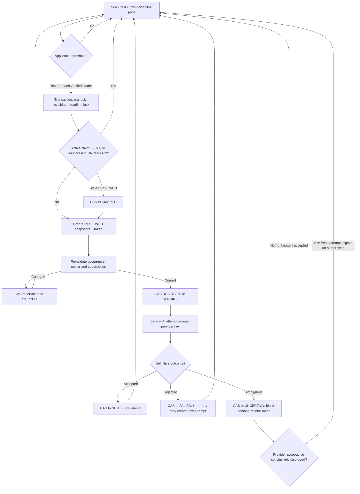

# Reminder Scheduler & Jobs

CharityPilot sends governance-deadline reminders to every verified organisation
owner and reclaims orphaned document storage through scheduled background work.
Development can use an in-process timer; production uses dedicated one-shot or
looping job entrypoints. The P0-06 reminder design is occurrence-aware,
concurrency-safe and auditable: it scans only current deadline schedules,
reserves before provider delivery, marks provider I/O before it begins, preserves
terminal attempt history, and blocks every ambiguous outcome unless restricted,
immutable reconciliation later proves the provider never accepted/created it.

## Execution surfaces

| Surface | Entry point | Behaviour |
| --- | --- | --- |
| In-process timer | `startCronJobs` in `apps/api/src/utils/cron.ts`, called after the API starts listening | Runs reminders every 24 hours. In production it is disabled unless `ENABLE_IN_PROCESS_JOBS === 'true'`; the first run is one interval after boot. |
| Standalone reminder job | `apps/api/src/jobs/send-deadline-reminders.ts` / `npm run jobs:deadline-reminders` | Validates the production reminder environment, runs `sendDueReminders()` once, alerts on failure, disconnects Prisma and exits non-zero on failure. |
| Standalone storage cleanup | `apps/api/src/jobs/cleanup-document-storage.ts` / `npm run jobs:document-storage-cleanup` | Retries pending storage deletions once. |
| Production scheduler | `apps/api/src/jobs/production-scheduler.ts` / `npm run jobs:production-scheduler` | Runs both jobs in recurring mode, or once when `PRODUCTION_SCHEDULER_RUN_ONCE=true`. |

The looping production scheduler self-reschedules each job with `setTimeout`
after the previous invocation finishes, so one process does not overlap its own
run. On `SIGINT`/`SIGTERM` it stops future timers and waits up to 45 seconds for
active runs before disconnecting Prisma. Production Compose grants 60 seconds,
so the application deadline expires first. A forced/timeout exit remains safe:
the maintenance cutover preparation releases residual pre-I/O `RESERVED` rows,
quarantines residual `SENDING` rows as `UNCERTAIN`, and refuses runtime start
until every ambiguity is reconciled. Multiple processes remain safe because the
database claim and reconciliation predicates are the final concurrency boundary.

| Configuration | Environment variable | Default |
| --- | --- | --- |
| Reminder interval | `DEADLINE_REMINDERS_INTERVAL_MS` | 86,400,000 ms (24 hours) |
| Storage-cleanup interval | `DOCUMENT_STORAGE_CLEANUP_INTERVAL_MS` | 3,600,000 ms (1 hour) |
| Storage-cleanup batch | `DOCUMENT_STORAGE_CLEANUP_LIMIT` | 25 |
| Graceful shutdown bound | `PRODUCTION_SCHEDULER_SHUTDOWN_TIMEOUT_MS` | 45,000 ms |
| Reminder provider-I/O bound | Fixed application safety bound | 30,000 ms |
| Run once | `PRODUCTION_SCHEDULER_RUN_ONCE` | `false` |

The run-once production path executes reminders, then storage cleanup, and
reports failure if either job fails. This is also the container smoke-test
surface. Job helpers route exceptions through operational alerting; reminder
delivery failures use a count-only error so recipient/provider detail is not
leaked into scheduler alerts.

## Reminder data model

### Deadline schedule occurrence

Relevant `Deadline` fields are:

| Field | Meaning |
| --- | --- |
| `dueDate DateTime @db.Date` | Exact civil due date, represented at the API boundary as `YYYY-MM-DD`. |
| `scheduleVersion Int` | Starts at 1. A manual reschedule or reopen increments it, creating a new logical reminder occurrence. |
| `isComplete` | Completed rows are not candidates. |
| `supersededAt`, `archivedAt` | Only rows with both null are current candidates. |
| `reminderDays Int[]` | Configured thresholds, defaulting to `[30, 14, 7]`. |

A title-only edit does not change `scheduleVersion`; a due-date change or reopen
does. Generated occurrences use their own immutable row/version lifecycle and
are never reopened or rescheduled in place.

### DeadlineReminderLog attempt

Each log row is one reservation/delivery attempt, not a mutable projection of
the live deadline:

| Field | Meaning |
| --- | --- |
| `organisationId`, `deadlineId` | Tenant-safe composite relation to the deadline. |
| `deadlineScheduleVersion` | Schedule identity frozen when the claim is created. |
| `deadlineTitle`, `deadlineDueDate` | Exact reservation snapshots only when `deadlineSnapshotKnown=true`; otherwise migration-time context, never a claim about the legacy email. |
| `deadlineSnapshotKnown`, `deliveryTimingKnown` | Provenance discriminators. Both are false for every pre-P0-06 row. |
| `legacyDeliveryStatus`, `legacyRecordedAt` | Original legacy status and timestamp with explicitly unverified semantics. All legacy statuses migrate to `UNCERTAIN`. |
| `userId`, `email` | Recipient identity and address at reservation time; the composite tenant FK restricts user deletion while referenced history exists. |
| `reminderDays` | The configured threshold claimed by this attempt. |
| `reservationToken` | Unique random compare-and-set token owned by the claiming worker. |
| `providerIdempotencyKey` | Unique attempt-scoped Resend key. It is retained for operator correlation but never returned by the tenant API. |
| `providerRequestStartedAt`, `providerMessageId` | Provider-I/O boundary and unique accepted Resend id for post-cutover attempts; both are unavailable for legacy rows. |
| `reservedAt`, `attemptedAt`, `sentAt` | Separate claim, provider-attempt and provider-acceptance times. |
| `status`, `error` | `RESERVED`, `SENDING`, `SENT`, `SKIPPED`, `FAILED`, or `UNCERTAIN`, plus a bounded operational explanation. |
| `reconciliationOutcome`, `reconciledAt`, `reconciledBy`, `reconciliationReference` | All-or-none immutable operator evidence. Actor/reference remain restricted and are not returned by the tenant API. |

The migration-level `DeadlineReminderLog_active_delivery_key` is a **partial**
unique index on
`(deadlineId, email, reminderDays, deadlineScheduleVersion)` only for
`RESERVED`, `SENDING`, `SENT`, and `UNCERTAIN` rows, except an `UNCERTAIN` row
immutably reconciled as `NOT_ACCEPTED_CONFIRMED`. There is no full unique constraint
across all attempts. Consequently:

- at most one claim, in-flight/ambiguous provider request, or successful send
  exists for a recipient/window and schedule version;
- a `SENT` row permanently deduplicates that logical delivery;
- unresolved `UNCERTAIN`, `ACCEPTED_CONFIRMED`, and `UNKNOWN_ACKNOWLEDGED` rows suppress
  retry;
- only `NOT_ACCEPTED_CONFIRMED` reconciliation releases that old attempt's suppression,
  so the scheduler may create one fresh attempt with a new token/key;
- a `FAILED` or `SKIPPED` row remains as history while a retry creates a new
  attempt.

For post-cutover rows, database checks require `SENT` to have a substantive,
unique provider message id and provider-start/attempt/send times;
`SENDING`/`FAILED`/`UNCERTAIN` to have provider-start and attempt times but no
send time; and `RESERVED`/`SKIPPED` to have none. Legacy rows use a separate
truthful branch: no provider-start, attempt, send, provider key, or provider id
is inferred. Tokens/provider evidence must be bounded and non-whitespace.
Reconciliation tuples are complete, bounded, status-limited, and immutable by
trigger once recorded.

## Candidate scan and civil-date rules

`DeadlineRemindersService.sendDueReminders(now)` derives `today` in the
`Europe/Dublin` time zone with the shared civil-calendar helpers. It queries
deadlines whose exact `DATE` value is between today and today + 365 calendar
days and which are all of:

- incomplete;
- not superseded;
- not archived;
- owned by an organisation with an eligible subscription.

Candidates are ordered and cursor-paged by immutable id in batches of 100 until
a short page is returned. A deadline may be rescheduled while an earlier page is
processing; using mutable `dueDate` as the pagination key could otherwise skip a
later row. Partial active-id/due-date and due-date/id indexes support this scan.
The scheduler therefore does not silently stop after the first hundred rows.
The organisation include selects **all** verified `OWNER`
users in deterministic id order, and the service attempts the applicable
reminder separately for every one of them.

Subscription eligibility is filtered in the query and checked again before
claim/provider work:

- `ACTIVE` is eligible;
- `TRIALING` is eligible while its trial has not expired;
- `PAST_DUE` is eligible only inside the configured grace calculation based on
  `currentPeriodEnd`.

The due distance is `differenceInCivilDays(dueDate, today)`. No instant
normalisation, millisecond division or local JavaScript date arithmetic is used
for legal calendar days. The raw claim query compares a bound civil date as a
PostgreSQL `date`, including under non-UTC database time zones.

### Threshold catch-up

The applicable threshold is the smallest configured window for which
`daysUntilDue <= window`. This is the most urgent window that has actually been
reached:

```ts
const applicableWindow = reminderDays
  .filter((windowDays) => daysUntilDue <= windowDays)
  .sort((left, right) => left - right)[0];
```

This permits catch-up after a missed scheduler day. For example, a run at 12
days before due selects the 14-day threshold; at 6 days it selects the 7-day
threshold. A date outside all thresholds is too early and is skipped. Past-due
dates are excluded by the candidate range, with a defensive negative-distance
check retained in the loop.

## Reservation, delivery and concurrency

### 1. Transactional reservation

`reserveReminderLog()` runs in a database transaction and follows the same
organisation-then-deadline lock order as calendar reconciliation:

1. Take `FOR KEY SHARE` on the organisation row. Missing organisations stop the
   claim.
2. Re-check that the exact recipient is still a verified `OWNER` in the same
   organisation and that the current subscription is eligible.
3. Lock the exact deadline row `FOR UPDATE`, requiring the scanned id,
   organisation, incomplete/current lifecycle, `scheduleVersion`, due date and
   reminder threshold still to match. A reschedule, completion, supersession,
   archive or reminder-window change therefore invalidates the scan result.
4. Look for an active `RESERVED`, `SENDING`, `SENT`, unresolved `UNCERTAIN`,
   `ACCEPTED_CONFIRMED`, or `UNKNOWN_ACKNOWLEDGED` row with the same deadline,
   email, threshold and schedule version. `NOT_ACCEPTED_CONFIRMED` is excluded;
   every other match except a stale `RESERVED` stops this worker.
5. If a reservation is older than 15 minutes, expire it to `SKIPPED` with a
   guarded `updateMany` that repeats id, status, token and stale-time predicates.
   Only one concurrent worker can win this compare-and-set.
6. Create a new `RESERVED` row with a random token, an attempt-scoped provider
   key, and frozen schedule/title/due snapshots. The partial unique index is the
   final race backstop.

Failed rows are never rewritten into a new attempt. Stale reservations retain
their snapshots and become terminal `SKIPPED` history before a new row is
created.

### 2. Pre-provider revalidation

After reservation and before email delivery, the worker re-reads the exact
current occurrence, recipient, subscription and organisation. If any changed,
it compare-and-sets its own `RESERVED` row to `SKIPPED` using the reservation
token; no provider request is made. This narrows the gap between the reservation
transaction and external I/O, but it cannot make a database state change and an
external provider request atomic. A lifecycle, recipient or subscription change
can still commit after this final reread and race the first provider request.
Holding database locks across provider I/O would trade that narrow residual race
for prolonged mutation blocking and failure coupling, so the implementation
does not claim that guarantee.

### 3. Provider-I/O boundary and idempotency

Immediately before provider I/O, compare-and-set changes the owned row from
`RESERVED` to `SENDING` and writes `attemptedAt` and
`providerRequestStartedAt`. No other worker may send that delivery after this
point. A global run-start cleanup changes `SENDING` rows older than 15 minutes
to terminal `UNCERTAIN`, independently of whether their deadlines are still in
the current candidate scan.

The provider request receives a SHA-256 idempotency key derived from:

`organisationId + deadlineId + email + reminderDays + scheduleVersion + reservationToken`.

The key is stable for exactly one provider attempt. A definite provider
rejection permits a later immutable attempt with a new token/key. An ambiguous
response blocks retry unless restricted reconciliation conclusively proves that
Resend never accepted or created the original message, so safety does not depend
on Resend's 24-hour idempotency retention. A queued, sent, delivered, delayed, or
bounced provider event all prove acceptance and must continue to suppress a
duplicate. A due-date change or reopen increments `scheduleVersion`, deliberately
creating a new logical delivery.

### 4. Compare-and-set finalisation

Provider acceptance finalises the owned row as `SENT`, records `sentAt` and the
provider message id. The application passes an `AbortSignal` through Resend to
the underlying fetch and aborts provider I/O after 30 seconds, well before the
15-minute stale-attempt boundary. Missing configuration or a definite,
non-timeout 4xx rejection finalises as `FAILED`. An aborted, thrown/malformed,
timeout, 409, 5xx, or otherwise unclassified outcome finalises as `UNCERTAIN`.
The final
`updateMany` requires the exact row, reservation token, and null reconciliation
outcome, and accepts `SENDING` or cleanup-produced `UNCERTAIN`. A still-running
original worker can therefore record a later definitive result, but it cannot
overwrite an operator decision that won the compare-and-set race.

`FAILED` remains retryable because it is outside the partial active index. An
unreconciled `UNCERTAIN` row is counted on every scheduler run and raises a
count-only alert. `ACCEPTED_CONFIRMED` and `UNKNOWN_ACKNOWLEDGED` stop recurring
alerts but remain dedupe suppressors. `NOT_ACCEPTED_CONFIRMED` stops the alert and
releases only that old row from active uniqueness, allowing the next run to
create a fresh token/key; the ambiguous row is never rewritten or deleted.

## Status semantics

| Status | Meaning | Terminal? | Future behaviour |
| --- | --- | --- | --- |
| `RESERVED` | A worker owns a claim; no provider attempt has occurred. | No | Another worker skips it while live; after 15 minutes it may be CAS-expired to `SKIPPED`. |
| `SENDING` | Provider I/O may be in progress; provider-start and attempt times are recorded. | No | No other worker sends it. If stale for 15 minutes, global cleanup moves it to `UNCERTAIN`. |
| `SENT` | Provider acceptance is proved by a unique provider message id; this does not claim inbox delivery. | Yes | Partial active index permanently blocks the same logical delivery. |
| `FAILED` | Delivery was definitely rejected or local provider configuration was absent. | Yes for this row | A later run may create a new attempt with a new attempt-scoped provider key. |
| `UNCERTAIN` | Provider acceptance cannot be proved or disproved safely. | Terminal for this attempt | Unreconciled, acceptance-confirmed, and unknown-acknowledged rows suppress a new send. Only immutable `NOT_ACCEPTED_CONFIRMED` proof permits a fresh attempt. |
| `SKIPPED` | A stale claim expired or the occurrence/recipient/subscription changed before provider I/O. | Yes | It is audit history, never an active reservation marker. |

## Reminder-history API

`GET /deadlines/reminder-history` requires `OWNER` or `ADMIN`, accepts bounded
pagination (default 50, maximum 100), and can filter by `deadlineId` and status.
Results are newest internal record first. Post-cutover rows return exact frozen
title/due/schedule and timing evidence with `deadlineContextKind` set to
`RECORDED_AT_RESERVATION`. Legacy rows set it to `MIGRATION_TIME_CONTEXT`, set
snapshot/timing flags false, return `reservedAt=null`, and expose only
`legacyRecordedAt` as a timestamp whose original meaning is unknown. The API
returns reconciliation outcome/time but never provider keys, provider message
ids, operator identity/reference, or payloads.

## UNCERTAIN operator reconciliation

Never edit an `UNCERTAIN` row to `FAILED` and never update reconciliation fields
with ad-hoc SQL. The supported command uses a one-time compare-and-set; a database
trigger makes the recorded tuple immutable. The procedure is:

1. Quiesce every reminder scheduler/job instance. The production deploy path
   already takes the whole runtime down and then runs `--prepare-quiesced-cutover`,
   which safely changes residual `RESERVED` rows to `SKIPPED`, changes residual
   `SENDING` rows to `UNCERTAIN`, and refuses startup while any unresolved
   ambiguity remains.
2. From a restricted terminal, list blockers using the exact digest-pinned API
   image and production env:

   ```text
   docker compose --env-file <production-env> -f compose.production.yml run --rm --no-deps api node dist/jobs/reconcile-deadline-reminder.js --list
   ```

   This output contains recipient/provider correlation data; keep it out of
   shared logs and tickets.
3. For a post-cutover row, use the stored recipient, deadline-title/due context,
   and provider-start window in Resend List/Retrieve results. Retain
   `providerIdempotencyKey` for restricted Resend support/request-log correlation;
   the public List/Retrieve response does not expose that request key. Any
   provider message id or queued/sent/delivered/delayed/bounced event means
   `ACCEPTED_CONFIRMED`. Absence from a list result is never proof of
   non-acceptance.
4. Legacy rows have no provider key/start/id and no exact email snapshot. Use
   only recipient plus `legacyRecordedAt` as limited evidence. If provider
   acceptance or non-acceptance cannot be proved, choose
   `UNKNOWN_ACKNOWLEDGED`; do not manufacture certainty.
5. Record exactly one outcome while schedulers remain stopped:

   ```text
   docker compose --env-file <production-env> -f compose.production.yml run --rm --no-deps api node dist/jobs/reconcile-deadline-reminder.js --id <row-id> --outcome <ACCEPTED_CONFIRMED|NOT_ACCEPTED_CONFIRMED|UNKNOWN_ACKNOWLEDGED> --operator <operator-id> --reference <restricted-incident-id> --confirm-schedulers-quiesced
   ```

   `NOT_ACCEPTED_CONFIRMED` is valid only with explicit provider/support evidence
   that no message was accepted/created. A missing search result, bounce, delay,
   or delivery failure does not qualify. This outcome permits a later fresh
   scheduler attempt; it never reuses or deletes the ambiguous row.
6. Run `--assert-clear` or rerun the deployment. Runtime startup remains blocked
   until no `RESERVED`, `SENDING`, or unreconciled `UNCERTAIN` row remains.

Resend's [List Sent Emails](https://resend.com/docs/api-reference/emails/list-emails)
and [Retrieve Sent Email](https://resend.com/docs/api-reference/emails/retrieve-email)
APIs expose sent-email metadata and event state, while its
[idempotency-key documentation](https://resend.com/docs/dashboard/emails/idempotency-keys)
states that keys expire after 24 hours. The application therefore does not
treat provider idempotency as a durable reconciliation ledger.

The scheduler itself processes only current, incomplete deadline occurrences.
The general deadline list is separately paginated and current-lifecycle only;
generated completion/supersession history is exposed through
`GET /deadlines/history`.

## Run flow



## Environment validation

Production reminder entrypoints call `validateDeadlineRemindersEnv()`. They
require `DATABASE_URL`, the canonical HTTPS frontend URL, a Resend API key, an
approved sender and an HTTPS operational-alert webhook. Storage cleanup has its
own database/Supabase/alert validation. The combined production scheduler
validates both job environments before it starts.

## Cross-references

- [System Overview](01-system-overview.md) — in-process and dedicated-job topology.
- [Data Model Reference](03-data-model.md) — deadline and attempt storage constraints.
- [Document Storage Flow](06-document-storage.md) — the companion cleanup job.
- [Governance Domain Model](08-governance-domain.md) — confirmed facts, generated rules and lifecycle.
- [Configuration, Environment & the Two-Gate Model](10-config-and-env.md) — production job configuration.
