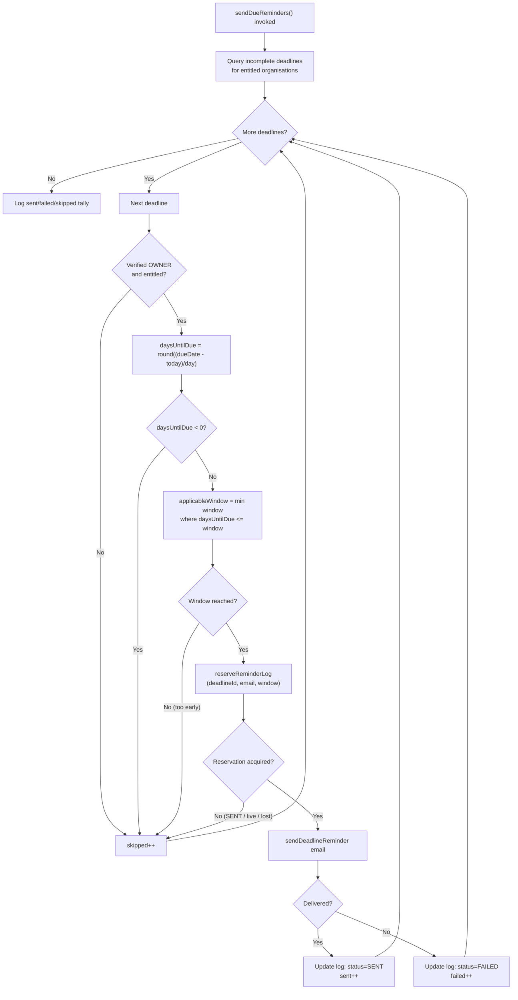
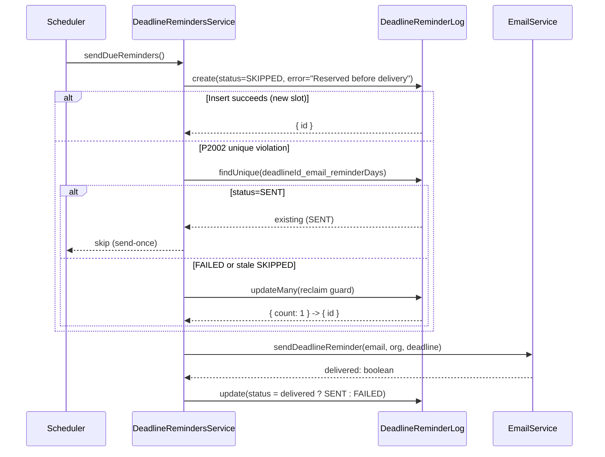

# Reminder Scheduler & Jobs

CharityPilot emails organisation owners ahead of governance deadlines and reclaims orphaned document storage. Both run as scheduled background work: an in-process timer inside the Fastify API for development, and standalone job entrypoints (the dedicated reminder job, the storage-cleanup job, and a combined production scheduler) for production. This document describes how the schedulers start, how the deadline-reminder logic decides what to send, how missed runs are caught up, and how the `DeadlineReminderLog` provides send-once de-duplication.

## Execution surfaces

There are two ways the reminder work can be driven, plus a third combined scheduler that also drives storage cleanup.

| Surface | Entry point | Trigger | Notes |
| --- | --- | --- | --- |
| In-process timer | `startCronJobs` in `apps/api/src/utils/cron.ts:3`, called from `apps/api/src/server.ts:96` after `app.listen` | `setInterval` every 24h (`apps/api/src/utils/cron.ts:9-16`) | Disabled in production unless `ENABLE_IN_PROCESS_JOBS === 'true'` (`apps/api/src/utils/cron.ts:4-7`) |
| Standalone reminder job | `apps/api/src/jobs/send-deadline-reminders.ts` | `npm run jobs:deadline-reminders` → `node dist/jobs/send-deadline-reminders.js` (`apps/api/package.json:18`) | One-shot: runs `sendDueReminders()` once, then `prisma.$disconnect()` |
| Standalone storage-cleanup job | `apps/api/src/jobs/cleanup-document-storage.ts` | `npm run jobs:document-storage-cleanup` → `node dist/jobs/cleanup-document-storage.js` (`apps/api/package.json:19`) | One-shot: retries pending storage deletions once |
| Production scheduler | `apps/api/src/jobs/production-scheduler.ts` (`main` at `apps/api/src/jobs/production-scheduler.ts:219`) | `npm run jobs:production-scheduler` → `node dist/jobs/production-scheduler.js` (`apps/api/package.json:17`) | Runs both jobs; either looping or run-once |

### In-process timer (development)

`startCronJobs` first checks the guard at `apps/api/src/utils/cron.ts:4-7`: when `NODE_ENV === 'production'` and `ENABLE_IN_PROCESS_JOBS` is not exactly `'true'`, it logs that in-process jobs are disabled and returns without scheduling anything — production is expected to use a dedicated entrypoint instead. Otherwise it registers a `setInterval` with `INTERVAL_MS = 24 * 60 * 60 * 1000` (24h) that calls `deadlineService.sendDueReminders()`, catching and logging any error so a failed run does not crash the timer (`apps/api/src/utils/cron.ts:9-17`). The service is constructed in `apps/api/src/server.ts:95` and passed in. Note the interval first fires 24h after boot — there is no immediate run on start.

### Standalone reminder job

`apps/api/src/jobs/send-deadline-reminders.ts` defaults `NODE_ENV` to `'production'` (`:6`), validates the reminder environment via `validateDeadlineRemindersEnv()` (`:7`), constructs its own `PrismaClient` and `DeadlineRemindersService`, and awaits a single `sendDueReminders()` call (`:11-14`). On failure it logs via `logSchedulerError`, fires an operational alert through `sendJobFailureAlert({ job: 'deadline-reminders', code: 'DEADLINE_REMINDERS_FAILED' })`, and sets `process.exitCode = 1` (`:15-23`); `prisma.$disconnect()` always runs in `finally` (`:24-26`).

### Production scheduler and run-once

`production-scheduler.ts` is both a library of run helpers and a CLI. Its `main` (`apps/api/src/jobs/production-scheduler.ts:219`) runs only when the module is the process entrypoint (`apps/api/src/jobs/production-scheduler.ts:282-284`). It validates both job environments (`:221-222`), builds config from env (`:224`), and constructs the `DeadlineRemindersService`, `DocumentService`, and `StorageService`.

Behaviour branches on `config.runOnce`, derived from `PRODUCTION_SCHEDULER_RUN_ONCE === 'true'` (`apps/api/src/jobs/production-scheduler.ts:68`):

- **Run-once** (`apps/api/src/jobs/production-scheduler.ts:231-246`): runs `runProductionSchedulerOnce` (reminders then cleanup), disconnects Prisma, and exits non-zero if either reported a failure; otherwise logs `Production scheduler run-once completed successfully.` This is the mode exercised by CI — the job-smoke step runs the image with `PRODUCTION_SCHEDULER_RUN_ONCE=true` and greps for that exact success line (`.github/workflows/ci.yml:295-298`).
- **Looping** (`apps/api/src/jobs/production-scheduler.ts:248-279`): schedules each job with `startRecurringJob`, which self-reschedules via `setTimeout` after each completion (`apps/api/src/jobs/production-scheduler.ts:188-217`), and installs `SIGINT`/`SIGTERM` handlers that stop the timers, disconnect Prisma, and exit cleanly.

Intervals and the cleanup batch limit come from env with safe fallbacks via `positiveIntegerEnv` (`apps/api/src/jobs/production-scheduler.ts:54-75`):

| Config field | Env var | Default |
| --- | --- | --- |
| `deadlineRemindersIntervalMs` | `DEADLINE_REMINDERS_INTERVAL_MS` | 86 400 000 ms (24h) (`:14`) |
| `documentStorageCleanupIntervalMs` | `DOCUMENT_STORAGE_CLEANUP_INTERVAL_MS` | 3 600 000 ms (1h) (`:15`) |
| `documentStorageCleanupLimit` | `DOCUMENT_STORAGE_CLEANUP_LIMIT` | 25 (`:16`) |
| `runOnce` | `PRODUCTION_SCHEDULER_RUN_ONCE` | `false` |

`runDeadlineReminders` (`apps/api/src/jobs/production-scheduler.ts:81-101`) and `runDocumentStorageCleanup` (`:103-141`) each return a boolean "failed" flag and route errors to `sendJobFailureAlert` (`:167-186`), which builds an operational alert payload and posts it through `sendErrorAlert` (overridable for tests). The cleanup helper additionally raises an alert when `result.failed > 0` even without a thrown error (`:118-129`).

The document storage cleanup itself delegates to `DocumentService.retryPendingStorageDeletions`, passing `StorageService.deleteFile` as the deletion callback and the configured batch limit (`apps/api/src/jobs/production-scheduler.ts:111-114`, `apps/api/src/jobs/cleanup-document-storage.ts:20-23`). The reminder logic is the focus below.

## Data model

The reminder logic operates over two Prisma models in `apps/api/prisma/schema.prisma`.

### Deadline (`apps/api/prisma/schema.prisma:478-495`)

| Field | Type | Meaning |
| --- | --- | --- |
| `dueDate` | `DateTime` | When the obligation is due |
| `isComplete` | `Boolean` (default `false`) | Completed deadlines are excluded from reminders |
| `reminderDays` | `Int[]` (default `[30, 14, 7]`) | Days-before-due windows at which to remind (`:488`) |
| `isAutoGenerated` | `Boolean` | Whether the deadline was generated by the system |
| `reminderLogs` | relation | Back-reference to `DeadlineReminderLog` rows |

### DeadlineReminderLog (`apps/api/prisma/schema.prisma:517-534`)

| Field | Type | Meaning |
| --- | --- | --- |
| `deadlineId` | `String` | The deadline reminded about |
| `email` | `String` | Recipient address at time of send |
| `reminderDays` | `Int` | The single window this log row represents |
| `status` | `DeadlineReminderStatus` | `SENT`, `SKIPPED`, or `FAILED` (`apps/api/prisma/schema.prisma:106-110`) |
| `error` | `String?` | Failure / reservation note |
| `sentAt` | `DateTime` (default `now()`) | Reservation or delivery timestamp |
| `userId` | `String?` | Recipient user (set null on user delete) |

The dedup key is `@@unique([deadlineId, email, reminderDays])` (`apps/api/prisma/schema.prisma:531`). One row per (deadline, recipient, window) is what gives the scheduler its **send-once** guarantee.

## Reminder logic — `sendDueReminders`

Implemented in `DeadlineRemindersService.sendDueReminders` (`apps/api/src/services/deadline-reminders.service.ts:124-242`).

### Scope: which deadlines are considered

The query at `apps/api/src/services/deadline-reminders.service.ts:130-156` fetches deadlines where `isComplete === false` **and** the owning organisation has an entitled subscription. Entitlement is expressed both in the SQL filter (`:135-142`) and re-checked in code via `hasReminderEntitlement` → `hasSubscriptionAccess` (`apps/api/src/services/deadline-reminders.service.ts:12-17`, `apps/api/src/utils/subscription-access.ts:21-35`):

- `ACTIVE` — always entitled
- `TRIALING` — entitled while `trialEndsAt` is null or in the future
- `PAST_DUE` — entitled only while `currentPeriodEnd` is after `pastDueGraceCutoff(now)` (`apps/api/src/utils/subscription-access.ts:17-19`)

The include pulls the subscription plus the single verified `OWNER` user (`role: 'OWNER', emailVerified: true`, `take: 1`) — reminders go to that owner only (`apps/api/src/services/deadline-reminders.service.ts:148-153`).

### Per-deadline skip conditions

For each deadline the run increments `sent` / `failed` / `skipped` counters and `continue`s on any skip:

| Condition | Reference |
| --- | --- |
| No verified owner found | `apps/api/src/services/deadline-reminders.service.ts:163-168` |
| Subscription not entitled (defensive re-check) | `:170-173` |
| `daysUntilDue < 0` (deadline already passed) | `:181-185` |
| No configured window reached yet (too early) | `:198-202` |
| Reservation lost to another worker / already sent | `:212-215` |

### Computing the due window

Dates are normalised to UTC midnight so day arithmetic is stable: `today` at `apps/api/src/services/deadline-reminders.service.ts:126-128` and the deadline's `dueDate` at `:175-176`. Days remaining is `Math.round((dueDate - today) / msPerDay)` (`:178-179`).

The applicable window is the **smallest configured window whose threshold has been reached**, computed by filtering `reminderDays` to those `>= daysUntilDue` and taking the minimum (`apps/api/src/services/deadline-reminders.service.ts:194-196`):

```ts
const applicableWindow = (deadline.reminderDays as number[])
  .filter((windowDays) => daysUntilDue <= windowDays)
  .sort((a, b) => a - b)[0];
```

### Catch-up on a missed run

The `<=` comparison (rather than exact equality `daysUntilDue === windowDays`) is what makes the scheduler resilient to a missed or delayed daily run — a deploy, crash, restart, or interval drift (`apps/api/src/services/deadline-reminders.service.ts:187-196`, and the method doc-comment at `:112-122`). With default windows `[30, 14, 7]`:

- If the run that should have fired on the "14 days out" day is skipped and the next run sees `daysUntilDue === 12`, the filter still keeps `{14, 30}` and selects `14` — so the 14-day reminder is sent late rather than lost.
- Once the 7-day window is reached, `7` becomes the smallest matching window. Because the per-window dedup log is keyed on the **window number**, not the live day count, a more-urgent window being sent does not retroactively block or re-send the earlier ones; the log records each window independently.

## De-duplication and at-least-once / send-once semantics

The unique constraint `@@unique([deadlineId, email, reminderDays])` plus a reserve-then-deliver pattern give send-once-per-window delivery while tolerating retries.

### Reservation (`reserveReminderLog`, `apps/api/src/services/deadline-reminders.service.ts:29-110`)

1. Insert a log row with `status: 'SKIPPED'` and `error: 'Reserved before delivery'` (`REMINDER_RESERVATION_ERROR`), stamping `sentAt = now` (`:38-50`). This claims the (deadline, email, window) slot before any email is sent.
2. If the insert hits a unique-constraint violation (Prisma `P2002`, detected by `isUniqueConstraintError`, `apps/api/src/services/deadline-reminders.service.ts:8-10`), it fetches the existing row (`:56-65`) and decides whether it can reclaim it:
   - `status === 'SENT'` → return `null`; never re-send (`:67-69`).
   - `status === 'FAILED'` → reclaimable (`:73`).
   - `status === 'SKIPPED'` with the reservation marker **and** `sentAt` older than `REMINDER_RESERVATION_STALE_MS` (15 minutes, `:6`) → treated as a stale/abandoned reservation and reclaimable (`:74-78`).
3. Reclaim is a guarded `updateMany` whose `where` repeats the FAILED-or-stale condition, so two concurrent workers cannot both win; only the worker whose `updateMany` affects exactly one row proceeds (`:84-106`). Any other case returns `null`.

A `null` reservation causes the caller to count the deadline as skipped and move on (`apps/api/src/services/deadline-reminders.service.ts:212-215`).

### Delivery and final status (`apps/api/src/services/deadline-reminders.service.ts:217-237`)

With a reservation held, the service calls `EmailService.sendDeadlineReminder(owner.email, orgName, { title, dueDate, daysUntilDue })` (`:217-221`, signature at `apps/api/src/services/email.service.ts:191-195`). It then updates the same log row by id:

- delivered → `status: 'SENT'`, `error: null` (`apps/api/src/services/deadline-reminders.service.ts:223-230`)
- not delivered (provider unconfigured or rejected) → `status: 'FAILED'` with an explanatory `error` (`:226-227`)

A `FAILED` row is reclaimable on the next run (step 2 above), so a transient email failure is retried on the following scheduler pass — at-least-once attempt semantics — while a `SENT` row is permanently terminal, giving send-once delivery. The run finishes by logging the `sent` / `failed` / `skipped` tally (`:239-241`).

### Status meanings summary

| Status | Set when | Re-attempted later? |
| --- | --- | --- |
| `SKIPPED` (reservation marker) | Slot reserved before send | Only if stale (>15 min) |
| `SENT` | Email delivered | No — terminal |
| `FAILED` | Email provider unconfigured / rejected | Yes — reclaimable next run |

## Scheduler run flowchart



## Reservation sequence



## Environment validation

Both standalone reminder paths call `validateDeadlineRemindersEnv()` (`apps/api/src/utils/env.ts:385-399`), which is a no-op outside production (`:386`) and otherwise requires `DATABASE_URL`, an HTTPS approved-host `FRONTEND_URL`, a `RESEND_API_KEY` prefixed `re_`, an approved `EMAIL_FROM`, and an HTTPS `ERROR_ALERT_WEBHOOK_URL`. The cleanup path calls `validateDocumentStorageCleanupEnv()` (`apps/api/src/utils/env.ts:367-382`), requiring `DATABASE_URL`, Supabase storage settings, and the alert webhook. The production scheduler validates both before scheduling (`apps/api/src/jobs/production-scheduler.ts:221-222`).

## Cross-references

- [System Overview](01-system-overview.md) — the in-process cron vs standalone job topology.
- [Data Model Reference](03-data-model.md) — the Deadline and DeadlineReminderLog models.
- [Document Storage Flow](06-document-storage.md) — the companion storage-cleanup job run by the same scheduler.
- [Governance Domain Model](08-governance-domain.md) — how deadlines fit the governance domain.
- [Configuration, Environment & the Two-Gate Model](10-config-and-env.md) — the jobs/scheduler environment surface.
