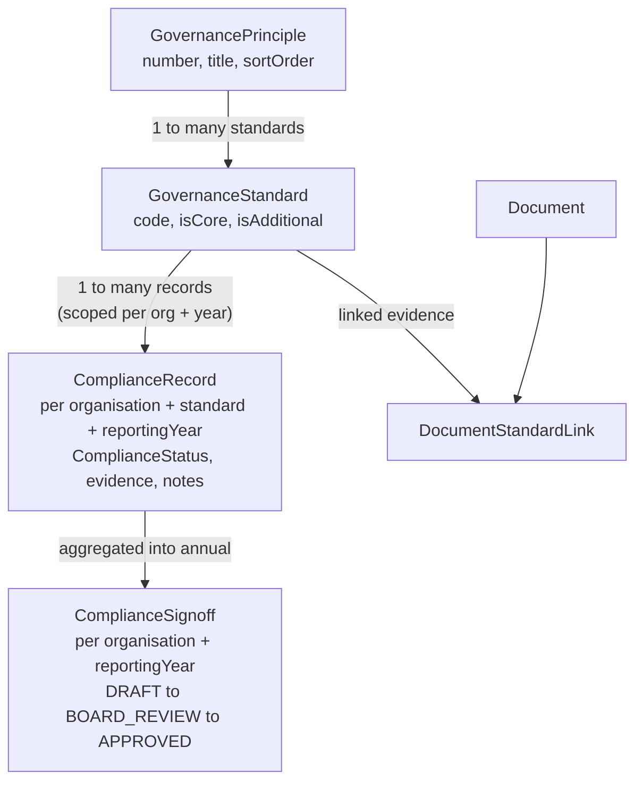
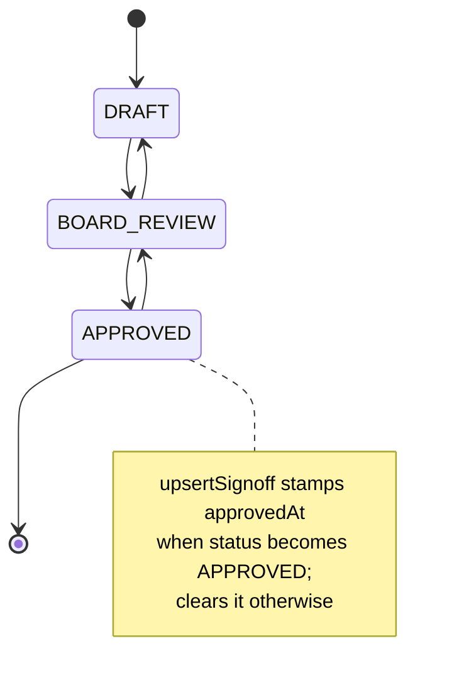
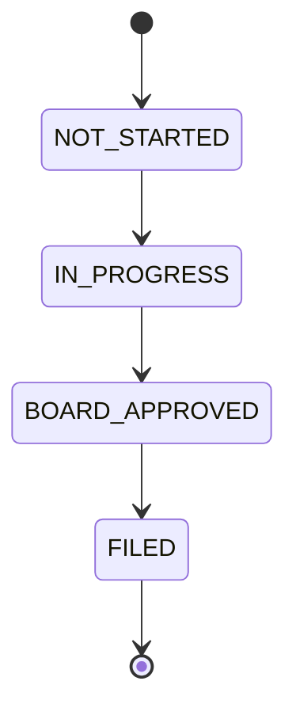

# Governance Domain Model

The governance domain is the substantive core of CharityPilot: it models the Charities Regulator (CRA) *Charities Governance Code* as structured data and lets an organisation record, evidence, score and board-approve its compliance position for a given reporting year. This document describes the compliance chain — `GovernancePrinciple` → `GovernanceStandard` → `ComplianceRecord` → `ComplianceSignoff` — the reference data that seeds it, the supporting governance registers, and the board-member and deadline records that surround them.

## Reference data: the Governance Code

The Code itself is fixed reference data, shared by every organisation and stored in two read-only catalogue tables.

| Model | Key fields | Notes |
| --- | --- | --- |
| `GovernancePrinciple` | `number` (unique), `title`, `description`, `sortOrder` | Six principles. Defined in `apps/api/prisma/schema.prisma:193-201`. |
| `GovernanceStandard` | `code` (unique), `title`, `isCore`, `isAdditional`, `sortOrder`, `principleId` | Each standard belongs to one principle. Defined in `apps/api/prisma/schema.prisma:203-217`. |

The canonical content lives in `packages/shared/src/constants/governance-code.ts`, whose header documents the scope: *"All 6 principles, 32 core standards, 17 additional standards = 49 total"* (`packages/shared/src/constants/governance-code.ts:1-5`). The shape is `GovernancePrincipleData` / `GovernanceStandardData` (`packages/shared/src/constants/governance-code.ts:7-19`).

The six principles are:

| # | Title |
| --- | --- |
| 1 | Advancing Charitable Purpose |
| 2 | Behaving with Integrity |
| 3 | Leading People |
| 4 | Exercising Control |
| 5 | Working Effectively |
| 6 | Being Accountable and Transparent |

(Source: `packages/shared/src/constants/governance-code.ts:23-351`.)

### How reference data is loaded

There are two paths that populate the catalogue, kept in lockstep:

1. **Seed script** — `seedGovernanceCode()` iterates `GOVERNANCE_PRINCIPLES`, upserting each principle by `number` and each standard by `code`, assigning a monotonically increasing global `sortOrder` across all standards (`apps/api/prisma/seed.ts:13-60`). It reports the counts seeded (`apps/api/prisma/seed.ts:603-605`).
2. **SQL migration** — `20260608072000_seed_governance_reference_data/migration.sql` inserts the same principles and standards with stable deterministic ids (e.g. `governance-principle-1`, `governance-standard-1-1`) using `INSERT … ON CONFLICT … DO UPDATE`, so a migration-only production deploy stays *"aligned with the app governance catalogue"* (migration header, `apps/api/prisma/migrations/20260608072000_seed_governance_reference_data/migration.sql:1-30`).

### Core vs additional standards and plan/complexity scoping

Each standard carries two booleans, `isCore` and `isAdditional` (`apps/api/prisma/schema.prisma:209-210`). The set of standards an organisation sees is scoped by its plan and complexity:

- The scope is computed from the organisation's `complexity` and the subscription `plan` (`apps/api/src/services/compliance.service.ts:29-46`). A missing subscription raises `403 NO_SUBSCRIPTION` (`apps/api/src/services/compliance.service.ts:41-43`).
- `includesAdditionalStandards()` returns `true` only when `complexity === 'COMPLEX'` **and** `plan === SubscriptionPlan.COMPLETE` (`apps/api/src/services/compliance.service.ts:18-20`).
- `standardsWhere()` therefore filters to `{ isCore: true }` unless additional standards are included, in which case the filter is `undefined` (all standards) (`apps/api/src/services/compliance.service.ts:22-24`).

`ComplianceService.getPrinciples()` applies a simpler variant — `complexity === 'SIMPLE'` shows only core standards (`apps/api/src/services/compliance.service.ts:70-82`) — while the organisation-scoped reads (`getPrinciplesForOrganisation`, `getPrincipleForOrganisation`) use `standardsWhere(scope)` (`apps/api/src/services/compliance.service.ts:84-110`).

When a record for a non-core standard is read or written, `ensureStandardIncludedInPlan()` re-checks the scope and raises `403 COMPLIANCE_STANDARD_NOT_INCLUDED_IN_PLAN` if the standard is additional and the organisation is not on the qualifying profile (`apps/api/src/services/compliance.service.ts:48-68`). An unknown standard id raises `404 STANDARD_NOT_FOUND` (`apps/api/src/services/compliance.service.ts:57-59`).

### Irish compliance matrix

`packages/shared/src/constants/irish-compliance-matrix.ts` adds a source-cited Irish compliance matrix over the canonical Governance Code catalogue. The matrix is domain reference data, not runtime UI or API behaviour: each entry links one or more Governance Code standards to a product feature area, user task, expected evidence, board-approval treatment, source references, an `applicabilityNote` and professional-review flags. The matrix covers all 49 canonical standards from `GOVERNANCE_PRINCIPLES` / `GOVERNANCE_TOTALS` and is exported from `packages/shared/src/constants/index.ts`.

Every source reference stores a source name, owner, HTTPS URL, concise note and `lastChecked` date so the matrix is review-ready and can be audited back to official or specialist guidance. Governance Code entries include the Charities Regulator Code and Compliance Record Form sources; statutory prompts use the Law Reform Commission revised Charities Act 2009 source plus Irish Statute Book commencement/effects context for the Charities (Amendment) Act 2024 where relevant. Specialist topics also cite relevant Irish sources such as annual reporting guidance, financial controls, fundraising, data protection, health and safety, safeguarding and protected disclosures.

`commencementStatus` describes the matrix prompt or obligation bundle, not a legal conclusion that every cited source applies universally. `applicabilityNote` is the companion field that explains whether a prompt is broadly relevant to all charities, aimed at complex charities, or conditional on facts such as paid staff, public fundraising, child-facing services, personal-data processing, insurance risks or employer thresholds.

The professional-review flags are deliberately conservative prompts for human review: `solicitor`, `accountant`, `data_protection`, `employment`, `equality`, `health_and_safety`, `safeguarding`, `protected_disclosures` and `governance_expert`. They do not decide whether an obligation applies to a charity. Conditional entries use `conditional` or `guidance` commencement status where applicability depends on the organisation profile. The matrix is not legal advice and must not be presented as a substitute for professional advice.

## The compliance chain



### ComplianceRecord

A `ComplianceRecord` is the per-organisation, per-standard, per-year compliance position. Its uniqueness — and the way a reporting year scopes records — comes from the composite key `@@unique([organisationId, standardId, reportingYear])` (`apps/api/prisma/schema.prisma:239`), indexed by `[organisationId, reportingYear]` (`apps/api/prisma/schema.prisma:240`).

| Field | Type | Purpose |
| --- | --- | --- |
| `status` | `ComplianceStatus` (default `NOT_STARTED`) | Current position against the standard. |
| `actionTaken` | `String?` | What the organisation has done. |
| `evidence` | `String?` | Evidence narrative / reference. |
| `notes` | `String?` | Free notes. |
| `explanationIfNA` | `String?` | Explanation when the standard does not apply. |
| `updatedById` | `String?` → `User` | Last editor (relation `"UpdatedBy"`). |

(Source: `apps/api/prisma/schema.prisma:219-241`.)

`ComplianceStatus` values are `COMPLIANT`, `WORKING_TOWARDS`, `NOT_STARTED`, `NOT_APPLICABLE`, `EXPLAIN` (`apps/api/prisma/schema.prisma:29-35`).

Records are read for a year via `getRecords()`, which joins each record's `standard` (and its `principle`) and applies the plan scope to the joined standard (`apps/api/src/services/compliance.service.ts:121-139`). A single record is read by composite key in `getRecord()` (`apps/api/src/services/compliance.service.ts:141-157`). Writes go through `upsertRecord()`, an upsert keyed on `organisationId_standardId_reportingYear` that defaults missing status to `NOT_STARTED` on create and stamps `updatedById` (`apps/api/src/services/compliance.service.ts:159-201`).

### Reporting-year scoping and the summary score

A reporting year (`reportingYear: number`) partitions all of an organisation's records, signoff, annual-report readiness and financial-control review. The HTTP layer accepts it as the `year` query parameter parsed by `complianceQuerySchema` (e.g. `apps/api/src/routes/compliance/index.ts:51-54, 99`).

`getSummary()` builds a per-year scorecard: it loads the in-scope standards and that year's records, maps records by `standardId`, then tallies counts by status and a per-principle breakdown (`apps/api/src/services/compliance.service.ts:299-380`). `NOT_APPLICABLE` standards are excluded from the applicable total; `percentComplete` is `compliant / totalApplicable` rounded, defaulting to 100 when nothing is applicable (`apps/api/src/services/compliance.service.ts:363-378`). The per-principle summary carries `principleNumber`, `principleTitle`, `totalApplicable`, `compliant` and `percentComplete`, sorted by principle number (`apps/api/src/services/compliance.service.ts:343-366, 378`).

### ComplianceSignoff

The annual board approval is a single `ComplianceSignoff` per organisation per year, keyed `@@unique([organisationId, reportingYear])` (`apps/api/prisma/schema.prisma:262`).

| Field | Type | Purpose |
| --- | --- | --- |
| `status` | `ComplianceSignoffStatus` (default `DRAFT`) | Workflow state. |
| `boardMeetingDate` | `DateTime?` | Meeting at which compliance was considered. |
| `minuteReference` | `String?` | Board minute reference. |
| `approvedByName` | `String?` | Name of approver. |
| `approvedByRole` | `String?` | Role of approver (e.g. Chair). |
| `approvalNotes` | `String?` | Notes. |
| `approvedAt` | `DateTime?` | Timestamp set when status is `APPROVED`. |
| `updatedById` | `String?` → `User` | Last editor (relation `"SignoffUpdatedBy"`). |

(Source: `apps/api/prisma/schema.prisma:243-264`.)

`getSignoff()` returns a synthetic default object with `status: DRAFT` and null fields when no row exists yet, so the client always has a shape to render (`apps/api/src/services/compliance.service.ts`). `getApprovalReadiness()` evaluates the in-scope standards for a reporting year and returns missing standard records, missing action/evidence fields, missing comply-or-explain explanations, missing conditional obligation profile facts, conditional review prompts, matrix review metadata and the matrix last-checked date. `upsertSignoff()` checks that readiness only when `data.status === 'APPROVED'`: incomplete readiness raises `400 COMPLIANCE_APPROVAL_INCOMPLETE` before writing; otherwise it writes the row and stamps `approvedAt` for `APPROVED`, clearing it for non-approved states.

`ComplianceSignoffStatus` has three states (`apps/api/prisma/schema.prisma:37-41`):



> Note: the transition arrows above reflect the meaning of the three enum states. The service does not enforce a specific transition order. `DRAFT` and `BOARD_REVIEW` remain flexible; `APPROVED` is the only state with the approval-readiness gate and `approvedAt` derivation.

### Approval-readiness enforcement

Approval readiness is a service-level check, not a schema-only validation rule, because it depends on the organisation's records, in-scope standards and profile facts for a reporting year. The HTTP route `GET /approval-readiness?year=` calls `getApprovalReadiness()` for authenticated subscribed users and returns the full readiness shape:

```json
{
  "data": {
    "ready": false,
    "missingRecords": [],
    "missingEvidence": [],
    "missingExplanations": [],
    "profileIssues": [],
    "conditionalReviewItems": [],
    "matrixReviewItems": [],
    "matrixLastChecked": "2026-07-05"
  }
}
```

`missingRecords` lists in-scope standards with no captured Compliance Record status. `missingEvidence` lists `COMPLIANT` and `WORKING_TOWARDS` records missing action/evidence fields. `missingExplanations` lists `NOT_APPLICABLE` and `EXPLAIN` records with blank `explanationIfNA`. `profileIssues` currently flags a missing conditional obligation profile before board approval. `conditionalReviewItems` are generated from selected organisation profile facts such as paid staff, fundraising, safeguarding, personal-data processing and data processors. `matrixReviewItems` and `matrixLastChecked` carry source metadata, commencement status, board-approval prompts and professional-review flags from the Irish compliance matrix.

Draft editing remains deliberately flexible: admins can autosave records without complete evidence and can move the annual signoff to `BOARD_REVIEW`. The hard gate is limited to `APPROVED`, where `upsertSignoff()` raises `COMPLIANCE_APPROVAL_INCOMPLETE` before the database upsert if readiness is incomplete. Conditional review prompts and matrix review metadata are professional-review prompts, not legal certification and not automatic blockers unless they also create a missing profile/record/evidence/explanation issue.

### Linking standards to evidence documents

A `GovernanceStandard` can be tied to evidence documents through the join table `DocumentStandardLink`, with a unique `[documentId, standardId]` pair and `onDelete: Cascade` from the document (`apps/api/prisma/schema.prisma:315-323`). Both sides expose the relation: `GovernanceStandard.documentLinks` (`apps/api/prisma/schema.prisma:214`) and `Document.standardLinks` (`apps/api/prisma/schema.prisma:307`). This lets a single uploaded document (constitution, policy, minutes, etc.) serve as evidence for one or more Code standards.

### HTTP surface and access control

All compliance routes register `authGuard` then `subscriptionGuard` as `onRequest` hooks (`apps/api/src/routes/compliance/index.ts:20-21`). Mutating routes additionally require an admin via the `requireAdmin` preHandler.

| Method & path | Handler | Guard |
| --- | --- | --- |
| `GET /principles` | `getPrinciplesForOrganisation` | auth + subscription |
| `GET /principles/:principleId` | `getPrincipleForOrganisation` (404 if missing) | auth + subscription |
| `GET /records?year=` | `getRecords` | auth + subscription |
| `GET /records/:standardId?year=` | `getRecord` (falls back to `{ status: 'NOT_STARTED' }`) | auth + subscription |
| `PUT /records/:standardId` | `upsertRecord` (auto-save) | `requireAdmin` |
| `GET /summary?year=` | `getSummary` | auth + subscription |
| `GET /signoff?year=` | `getSignoff` | auth + subscription |
| `GET /approval-readiness?year=` | `getApprovalReadiness` | auth + subscription |
| `PUT /signoff` | `upsertSignoff` | `requireAdmin` |

(Source: `apps/api/src/routes/compliance/index.ts:24-145`.)

## Governance registers

The registers are five record types plus two annual review records, all served under one route module that gates the **entire** feature behind the Complete plan via the `requireCompletePlan` preHandler (`apps/api/src/routes/governance-registers/index.ts:41-43`), which returns `403 PLAN_FEATURE_UNAVAILABLE` for non-Complete subscriptions (`apps/api/src/middleware/plan.ts:4-19`). The service is `GovernanceRegisterService`.

`GovernanceRegisterService.summary()` returns headline counts — open conflicts/risks/complaints and active fundraising activities (each counted as `status != CLOSED`) plus two readiness percentages (`apps/api/src/services/governance-register.service.ts:23-41`).

Two enums govern the register status fields:

- `RegisterStatus`: `OPEN`, `MONITORING`, `CLOSED` (`apps/api/prisma/schema.prisma:69-73`) — used by risks, complaints and fundraising.
- `ConflictStatus`: `DECLARED`, `MANAGED`, `CLOSED` (`apps/api/prisma/schema.prisma:75-79`) — used by conflicts only.

### ConflictRecord (register of interests / conflicts)

Tracks declared conflicts of interest. A conflict may optionally link to a `BoardMember` (`boardMemberId`, `onDelete: SetNull`) but always stores a denormalised `trusteeName` (`apps/api/prisma/schema.prisma:341-363`).

| Field | Type | Purpose |
| --- | --- | --- |
| `boardMemberId` | `String?` → `BoardMember` | Optional link to the declaring trustee. |
| `trusteeName` | `String` | Name of the trustee declaring. |
| `matter`, `nature` | `String` | What the conflict is and its nature. |
| `dateDeclared` | `DateTime` | When declared. |
| `meetingDate` | `DateTime?` | Meeting at which considered. |
| `actionTaken` | `String` | Action taken (required). |
| `decision` | `String?` | Board decision. |
| `status` | `ConflictStatus` (default `DECLARED`) | Lifecycle. |
| `minuteReference` | `String?` | Minute reference. |
| `nextReviewDate` | `DateTime?` | Next review. |

On create, `createConflict()` validates the optional board member via `ensureBoardMember()` and defaults status to `DECLARED` (`apps/api/src/services/governance-register.service.ts:50-69`). `ensureBoardMember()` confirms the member belongs to the organisation, raising `404 BOARD_MEMBER_NOT_FOUND` otherwise (`apps/api/src/services/governance-register.service.ts:442-455`). Listing orders by `status` then `dateDeclared` descending (`apps/api/src/services/governance-register.service.ts:43-48`).

### RiskRecord (risk register)

Tracks risks with a likelihood/impact scoring pair. `likelihood` and `impact` are plain integers (`Int`), not enums (`apps/api/prisma/schema.prisma:365-384`).

| Field | Type | Purpose |
| --- | --- | --- |
| `title`, `description`, `mitigation` | `String` | Risk narrative and mitigation. |
| `category` | `RiskCategory` | Classification. |
| `likelihood` | `Int` | Likelihood score. |
| `impact` | `Int` | Impact score. |
| `owner` | `String?` | Risk owner. |
| `reviewDate` | `DateTime?` | Next review. |
| `status` | `RegisterStatus` (default `OPEN`) | Lifecycle. |
| `boardMinuteReference` | `String?` | Minute reference. |

`RiskCategory` has nine values: `GOVERNANCE`, `FINANCIAL`, `OPERATIONAL`, `LEGAL`, `SAFEGUARDING`, `REPUTATIONAL`, `FUNDRAISING`, `DATA_PROTECTION`, `OTHER` (`apps/api/prisma/schema.prisma:81-91`). Creation defaults status to `OPEN` (`apps/api/src/services/governance-register.service.ts:107-123`); listing orders by `status`, then `reviewDate`, then `updatedAt` (`apps/api/src/services/governance-register.service.ts:100-105`).

### ComplaintRecord (complaints register)

Tracks complaints received and their handling (`apps/api/prisma/schema.prisma:386-403`).

| Field | Type | Purpose |
| --- | --- | --- |
| `receivedDate` | `DateTime` | When received. |
| `source` | `String?` | Where it came from. |
| `summary` | `String` | What the complaint was. |
| `actionTaken`, `outcome` | `String?` | Handling and result. |
| `status` | `RegisterStatus` (default `OPEN`) | Lifecycle. |
| `reviewedByBoard` | `Boolean` (default `false`) | Whether the board reviewed it. |
| `boardMinuteReference` | `String?` | Minute reference. |

Create defaults `status` to `OPEN` and `reviewedByBoard` to `false` (`apps/api/src/services/governance-register.service.ts:156-170`).

### FundraisingRecord (fundraising activities register)

Tracks fundraising activities and their controls (`apps/api/prisma/schema.prisma:405-425`).

| Field | Type | Purpose |
| --- | --- | --- |
| `name`, `activityType` | `String` | Activity identity. |
| `startDate`, `endDate` | `DateTime?` | Active window. |
| `publicFacing` | `Boolean` (default `true`) | Whether public-facing. |
| `thirdPartyFundraiser` | `String?` | Third-party fundraiser detail. |
| `controls` | `String?` | Controls in place. |
| `complaintsReceived` | `Boolean` (default `false`) | Whether complaints arose. |
| `reviewOutcome` | `String?` | Board review outcome. |
| `status` | `RegisterStatus` (default `OPEN`) | Lifecycle. |
| `boardMinuteReference` | `String?` | Minute reference. |

Create defaults `publicFacing` to `true`, `complaintsReceived` to `false` and `status` to `OPEN` (`apps/api/src/services/governance-register.service.ts:201-218`).

### AnnualReportReadiness

A single per-organisation, per-year readiness checklist for the CRA Annual Report, keyed `@@unique([organisationId, reportingYear])` (`apps/api/prisma/schema.prisma:448`).

| Field | Type | Purpose |
| --- | --- | --- |
| `activitiesNarrative`, `publicBenefitStatement`, `beneficiariesSummary` | `String?` | Narrative content. |
| `financialStatementsApproved` | `Boolean` | Checklist flag. |
| `annualReportUploaded` | `Boolean` | Checklist flag. |
| `trusteeDetailsReviewed` | `Boolean` | Checklist flag. |
| `fundraisingReviewed` | `Boolean` | Checklist flag. |
| `complaintsReviewed` | `Boolean` | Checklist flag. |
| `boardApprovalDate` | `DateTime?` | Board approval date. |
| `filingStatus` | `AnnualReportFilingStatus` (default `NOT_STARTED`) | Filing workflow. |
| `filedDate` | `DateTime?` | When filed. |
| `notes` | `String?` | Notes. |

(Source: `apps/api/prisma/schema.prisma:427-450`; all booleans default `false`.)

`getAnnualReportReadiness()` returns a synthetic all-default response when no row exists (`apps/api/src/services/governance-register.service.ts:245-290`); `upsertAnnualReportReadiness()` writes by composite key and re-reads (`apps/api/src/services/governance-register.service.ts:292-330`). The readiness percentage in the summary is computed from ten checks — the three narrative fields being non-empty, the five boolean flags, a board approval date being present, and `filingStatus === FILED` — as the rounded fraction true (`apps/api/src/services/governance-register.service.ts:458-472`).

`AnnualReportFilingStatus` has four states: `NOT_STARTED`, `IN_PROGRESS`, `BOARD_APPROVED`, `FILED` (`apps/api/prisma/schema.prisma:93-98`).



> As with the signoff status, the service stores whatever validated `filingStatus` is supplied rather than enforcing this ordering; the diagram reflects the intended progression of the four enum values.

### FinancialControlReview

A single per-organisation, per-year financial-controls checklist, keyed `@@unique([organisationId, reportingYear])` (`apps/api/prisma/schema.prisma:474`).

| Field | Type | Purpose |
| --- | --- | --- |
| `bankReconciliationsReviewed` | `Boolean` | Control flag. |
| `dualAuthorisation` | `Boolean` | Control flag. |
| `budgetApproved` | `Boolean` | Control flag. |
| `managementAccountsReviewed` | `Boolean` | Control flag. |
| `reservesReviewed` | `Boolean` | Control flag. |
| `restrictedFundsReviewed` | `Boolean` | Control flag. |
| `assetsInsuranceReviewed` | `Boolean` | Control flag. |
| `payrollControlsReviewed` | `Boolean` | Control flag. |
| `fundraisingControlsReviewed` | `Boolean` | Control flag. |
| `reviewedBy` | `String?` | Who reviewed. |
| `reviewDate` | `DateTime?` | When reviewed. |
| `minuteReference` | `String?` | Minute reference. |
| `actions` | `String?` | Follow-up actions. |

(Source: `apps/api/prisma/schema.prisma:452-476`; all booleans default `false`.)

Read/write follow the same default-object and upsert-then-reread pattern (`apps/api/src/services/governance-register.service.ts:332-421`). The controls percentage is computed from eleven checks — the nine boolean flags plus a review date and a minute reference being present (`apps/api/src/services/governance-register.service.ts:474-489`).

### Register HTTP surface

All under the Complete-plan-gated router; reads are admin-optional, writes use `requireAdmin` (`apps/api/src/routes/governance-registers/index.ts:45-241`).

| Resource | GET (list/read) | POST/PUT | PATCH | DELETE |
| --- | --- | --- | --- | --- |
| `/summary` | `summary` | — | — | — |
| `/conflicts` | `listConflicts` | `createConflict` | `updateConflict` | `removeConflict` |
| `/risks` | `listRisks` | `createRisk` | `updateRisk` | `removeRisk` |
| `/complaints` | `listComplaints` | `createComplaint` | `updateComplaint` | `removeComplaint` |
| `/fundraising` | `listFundraising` | `createFundraising` | `updateFundraising` | `removeFundraising` |
| `/annual-report` | `getAnnualReportReadiness` | `PUT upsertAnnualReportReadiness` | — | — |
| `/financial-controls` | `getFinancialControlReview` | `PUT upsertFinancialControlReview` | — | — |

For the four CRUD registers, updates and deletes first call `ensureRecord()`, which checks the row exists and belongs to the organisation, raising a record-specific `404` code (e.g. `RISK_NOT_FOUND`) otherwise (`apps/api/src/services/governance-register.service.ts:423-440`).

## Board members

`BoardMember` records the trustee roster used by the conflicts register and the readiness checks (`apps/api/prisma/schema.prisma:266-286`).

| Field | Type | Purpose |
| --- | --- | --- |
| `name`, `role` | `String` | Identity and board role. |
| `email` | `String?` | Contact. |
| `appointedDate` | `DateTime` | Appointment date. |
| `termEndDate` | `DateTime?` | Term end. |
| `isActive` | `Boolean` (default `true`) | Active flag. |
| `conductSigned` + `conductSignedDate` | `Boolean` / `DateTime?` | Code of conduct signed. |
| `inductionCompleted` + `inductionDate` | `Boolean` / `DateTime?` | Induction status. |

`BoardMemberService.list()` is paginated (default page size 50, capped at 100 in the route) and ordered by `isActive` desc then `appointedDate` desc (`apps/api/src/services/board-member.service.ts:8-20`, `apps/api/src/routes/board-members/index.ts:17-28`). `update()` and `remove()` first verify the member belongs to the organisation, raising `404 BOARD_MEMBER_NOT_FOUND` otherwise (`apps/api/src/services/board-member.service.ts:39-70`). Date fields use the convention "undefined leaves unchanged, empty clears to null" on update (`apps/api/src/services/board-member.service.ts:52-55`). Mutating routes require `requireAdmin` (`apps/api/src/routes/board-members/index.ts:30-62`).

## Deadlines

`Deadline` records governance deadlines, optionally auto-generated (`apps/api/prisma/schema.prisma:478-495`).

| Field | Type | Purpose |
| --- | --- | --- |
| `title`, `description` | `String` / `String?` | Deadline detail. |
| `dueDate` | `DateTime` | Due date. |
| `isAutoGenerated` | `Boolean` (default `false`) | Generated by the system. |
| `isComplete` + `completedDate` | `Boolean` / `DateTime?` | Completion. |
| `reminderDays` | `Int[]` (default `[30, 14, 7]`) | Days-before reminder offsets. |

`DeadlineService` provides paginated listing ordered by `dueDate` ascending and standard CRUD with organisation-scoped `404 DEADLINE_NOT_FOUND` checks (`apps/api/src/services/deadline.service.ts:8-66`). Marking complete sets `completedDate` to now; marking incomplete clears it (`apps/api/src/services/deadline.service.ts:50`).

`generateAutoDeadlines()` derives two statutory deadlines from the organisation profile (`apps/api/src/services/deadline.service.ts:68-145`):

- **Annual Report filing** — financial year end + 10 months, described as the *"Charities Regulator Annual Report filing deadline"* (`apps/api/src/services/deadline.service.ts:76-85`).
- **AGM due date** — last AGM + 15 months (`apps/api/src/services/deadline.service.ts:90-99`).

If a source date is missing, the corresponding stale auto-generated, incomplete deadline is deleted (`apps/api/src/services/deadline.service.ts:86-113`); existing auto deadlines are updated in place, otherwise created with `isAutoGenerated: true` and reminders `[30, 14, 7]` (`apps/api/src/services/deadline.service.ts:115-144`).

## Cross-references

- [Data Model Reference](03-data-model.md) — the governance, compliance and register models.
- [Module & Dependency Graph](02-module-dependency-graph.md) — ComplianceService and GovernanceRegisterService wiring.
- [Document Storage Flow](06-document-storage.md) — DocumentStandardLink ties documents to standards.
- [Reminder Scheduler & Jobs](07-reminder-scheduler.md) — governance deadlines and their reminders.
