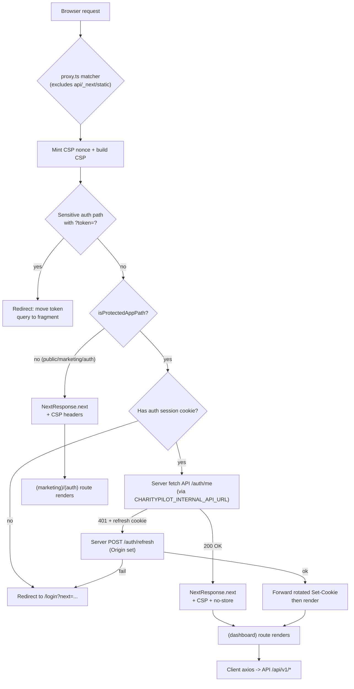
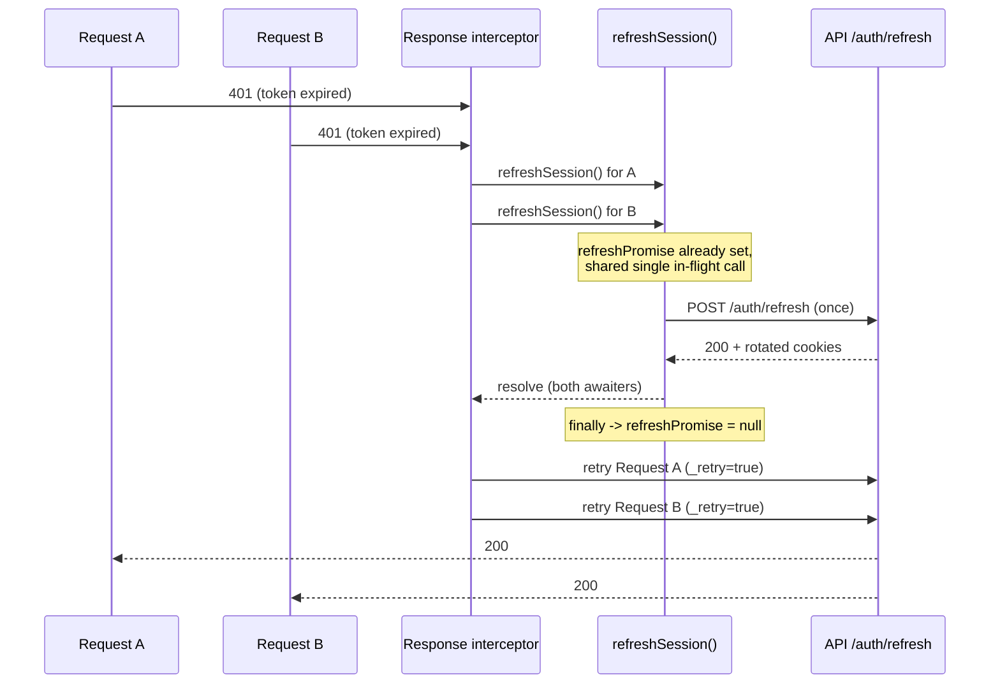

# Frontend Architecture

The CharityPilot web client is a Next.js 16 app-router application (`apps/web`, React 19 + HeroUI v2, served by a small custom Node server in `apps/web/server.mjs`). Routes are organised into three app-router route groups — `(auth)`, `(dashboard)`, `(marketing)` — gated at the edge by a single proxy/middleware (`apps/web/src/proxy.ts`) and at the client by an `AuthProvider` context. All API traffic flows through a shared axios instance with a single-flight refresh interceptor, and several small security helpers harden redirects, sensitive query tokens, and download URLs.

## Route Groups

The app router lives under `apps/web/src/app/`. Three parenthesised route groups give each surface its own layout without contributing path segments.

| Route group | Layout | Theme | Auth status | Layout source |
|---|---|---|---|---|
| `(auth)` | minimal header + footer, dark-capable | light/dark per `localStorage.theme` or system preference | public | `apps/web/src/app/(auth)/layout.tsx:4-49` |
| `(dashboard)` | sidebar nav + top bar, dark-capable | light/dark per `localStorage.theme` or system preference | protected | `apps/web/src/app/(dashboard)/layout.tsx:124-310` |
| `(marketing)` | public site header + footer, dark-capable | light/dark per `localStorage.theme` or system preference | public | `apps/web/src/app/(marketing)/layout.tsx:7-126` |

The root layout (`apps/web/src/app/layout.tsx:40-58`) wraps everything in `<Providers>` and injects a pre-paint inline script. The pre-paint inline script applies the user's light/dark preference across public and protected route groups, honours `localStorage.theme`, falls back to the system preference, and toggles `.dark` on the document element before paint (`apps/web/src/app/layout.tsx:50-52`). The CSP nonce minted by the proxy is read from the `x-nonce` request header and applied to that inline script (`apps/web/src/app/layout.tsx:39`).

### Routes by group

| Group | Routes (page files) |
|---|---|
| `(auth)` | `/login`, `/register`, `/verify-email`, `/forgot-password`, `/reset-password`, `/accept-invite` |
| `(dashboard)` | `/dashboard`, `/compliance` (+ `/compliance/[principleId]`), `/board`, `/documents`, `/deadlines`, `/billing`, `/team`, `/registers`, `/regulator`, `/organisation`, `/export` |
| `(marketing)` | `/` (home), `/pricing`, `/features`, `/blog` (+ `/blog/[slug]`), `/privacy`, `/terms` |

Auth routes are confirmed at `apps/web/src/app/(auth)/` (`login`, `register`, `verify-email`, `forgot-password`, `reset-password`, `accept-invite` each contain a `page.tsx`). Dashboard routes are confirmed at `apps/web/src/app/(dashboard)/`, including the dynamic `compliance/[principleId]/page.tsx`. Marketing routes are confirmed at `apps/web/src/app/(marketing)/`, including the dynamic `blog/[slug]/page.tsx`.

### Provider tree

`Providers` is a client component composing the global context tree (`apps/web/src/app/providers.tsx:16-30`):

- `ChunkLoadReloadGuard` (recovers from stale chunk loads),
- `HeroUIProvider` wired to `router.push` for client navigation (`apps/web/src/app/providers.tsx:22`),
- `AuthProvider` (session state),
- `ToastProvider`,
- a dynamically-imported, client-only `CookieConsent` (`ssr: false`, `apps/web/src/app/providers.tsx:11-14`).

## Protected vs Public Routes

The single source of truth for "what is a protected app path" is `apps/web/src/lib/protected-routes.ts`. `PROTECTED_APP_PREFIXES` enumerates the dashboard prefixes (`apps/web/src/lib/protected-routes.ts:1-13`):

```
/dashboard /compliance /regulator /documents /board
/registers /deadlines /organisation /team /billing /export
```

`isProtectedAppPath(pathnameOrUrl)` first normalises the path — strips query/hash, `decodeURIComponent`s it, and replaces backslashes with forward slashes (`apps/web/src/lib/protected-routes.ts:15-23`) — then matches a path that equals a prefix or starts with `<prefix>/` (`apps/web/src/lib/protected-routes.ts:25-31`). This helper is shared by the proxy, the axios client, and `safeNextPath`, so server and client agree on the protected set.

Everything not under a protected prefix (marketing pages, auth pages, the home page) is treated as public.

## Edge Proxy and Middleware (`proxy.ts`)

In Next.js 16 the middleware entry is `apps/web/src/proxy.ts`, exporting `proxy(request)` plus a `config.matcher` (`apps/web/src/proxy.ts:176-211`). The matcher runs on every request except `api`, `_next`, `favicon.ico`, `robots.txt`, and `sitemap.xml` (`apps/web/src/proxy.ts:208-210`).

### Per-request work

For each matched request `proxy` (`apps/web/src/proxy.ts:176-205`):

1. Mints a per-request CSP nonce (`btoa(crypto.randomUUID())`, `apps/web/src/proxy.ts:115-117`) and builds a Content-Security-Policy via `createContentSecurityPolicy` (`apps/web/src/lib/content-security-policy.ts:36-63`).
2. If the path is a sensitive auth path (`/reset-password`, `/verify-email`, `/accept-invite`) and carries a `?token=` query param, it issues a redirect that moves the token out of the query string and into the URL fragment, then attaches `Referrer-Policy: no-referrer` and no-cache headers (`apps/web/src/proxy.ts:147-163`, `apps/web/src/proxy.ts:9`). This keeps single-use tokens out of server logs and the `Referer` header.
3. For public paths it sets the CSP request/response headers (and the extra sensitive-auth headers where applicable) and continues (`apps/web/src/proxy.ts:183-188`).
4. For protected paths it enforces authentication before rendering.

### Server-side session validation for protected routes

When the path is protected, the proxy gates rendering (`apps/web/src/proxy.ts:190-204`):

- If neither `charitypilot_access` nor `charitypilot_refresh` cookie is present, it redirects straight to `/login?next=<path+search>` (`apps/web/src/proxy.ts:11-13`, `apps/web/src/proxy.ts:165-174`).
- Otherwise it calls `validateProtectedAuthSession` (`apps/web/src/proxy.ts:41-90`): it forwards the auth cookies to the API `GET /api/v1/auth/me`. On `200` the session is valid. On failure, if a refresh cookie exists, it tries `POST /api/v1/auth/refresh` (sending the deployed web `Origin` so the API's origin guard passes — `apps/web/src/proxy.ts:70-81`) and, on success, captures the rotated `Set-Cookie` headers to forward back to the browser (`apps/web/src/proxy.ts:83-89`, `apps/web/src/proxy.ts:140-145`).
- If still unauthenticated, it redirects to `/login` preserving `next`.

The upstream API base URL for these server-to-server calls is resolved by `getServerApiBaseUrl`, which prefers `CHARITYPILOT_INTERNAL_API_URL` — the same-origin/internal API address — falling back to the public `getApiBaseUrl` (`apps/web/src/lib/api-config.ts:30-40`, used at `apps/web/src/proxy.ts:25-31`).

Protected responses always get `Cache-Control: no-store, no-cache, must-revalidate` and `Pragma: no-cache` (`apps/web/src/proxy.ts:8`, `apps/web/src/proxy.ts:92-96`).

### Web request / proxy / auth flow



## API Client (`api.ts` + `api-config.ts`)

### Base URL resolution

`getApiBaseUrl` (`apps/web/src/lib/api-config.ts:10-28`) resolves the browser-facing API origin:

- prefers `NEXT_PUBLIC_API_URL` (trimmed, trailing slashes stripped);
- in production it validates the URL via `validateProductionApiUrl` — must be `https:`, origin-only, and on `charitypilot.ie` or a subdomain (`apps/web/src/lib/api-config.ts:42-63`);
- in production with no value set it throws; otherwise it falls back to `http://localhost:3002` (`apps/web/src/lib/api-config.ts:1`, `apps/web/src/lib/api-config.ts:23-27`).

`getServerApiBaseUrl` (`apps/web/src/lib/api-config.ts:30-40`) is the server-side counterpart used by the proxy: it prefers `CHARITYPILOT_INTERNAL_API_URL` (validated by `validateServerApiUrl`, which in dev allows `http://`/`https://` origin-only URLs and in production applies the strict production rules — `apps/web/src/lib/api-config.ts:65-85`), falling back to `getApiBaseUrl`.

### The axios instance

`api` is an axios instance with `baseURL = ${API_URL}/api/v1`, JSON content type, and `withCredentials: true` so the HTTP-only auth cookies travel with every request (`apps/web/src/lib/api.ts:19`, `apps/web/src/lib/api.ts:51-55`). Custom per-request flags are declared on the axios types (`apps/web/src/lib/api.ts:5-17`):

| Flag | Effect |
|---|---|
| `_retry` | internal marker — set after the interceptor has attempted one refresh-and-retry |
| `skipAuthRefresh` | do not attempt a token refresh on `401` (used by login/register) |
| `skipAuthRedirect` | do not redirect to `/login` on terminal `401` (used by `/auth/me`, login/register) |

A response interceptor also unwraps the API's `{ data: ... }` envelope for non-paginated responses, leaving paginated payloads (those with `total`/`page`) intact (`apps/web/src/lib/api.ts:57-69`).

## Auth / Session Handling

### `AuthProvider`

`AuthProvider` (`apps/web/src/lib/auth-context.tsx:18-72`) holds `user` and `isLoading` and exposes `login`, `register`, `logout`, `refreshUser`. On mount it calls `refreshUser`, which hits `GET /auth/me` with `skipAuthRedirect: true` so an unauthenticated visit silently resolves to `user = null` rather than bouncing to login (`apps/web/src/lib/auth-context.tsx:22-35`). `login` and `register` post with both `skipAuthRefresh` and `skipAuthRedirect` so a bad credential `401` surfaces as a form error instead of triggering a refresh attempt or redirect (`apps/web/src/lib/auth-context.tsx:37-57`). `useAuth` throws if used outside the provider (`apps/web/src/lib/auth-context.tsx:74-78`).

The `(dashboard)` layout consumes `useAuth` and performs a second, client-side guard: while `isLoading` it shows a spinner, and once resolved it redirects to `/login?next=<path+search>` when there is no user, or to `/verify-email` when the user's email is unverified (`apps/web/src/app/(dashboard)/layout.tsx:124-181`). This complements (does not replace) the server-side proxy gate.

### Single-flight refresh

When an access token expires mid-page, several in-flight requests can `401` simultaneously. Because the backend rotates the single-use refresh token and detects reuse, firing one refresh per `401` would present the same rotated token repeatedly and get the whole session revoked. The client therefore shares **one** in-flight refresh across all concurrent `401`s (`apps/web/src/lib/api.ts:31-49`):

- A module-level `refreshPromise` is created lazily on the first refresh and cleared in `.finally()` so a later expiry starts a fresh one (`apps/web/src/lib/api.ts:37-48`).
- The response interceptor, on a `401` that has not yet been retried and is not `skipAuthRefresh`, marks `_retry = true`, `await`s `refreshSession()`, then replays the original request (`apps/web/src/lib/api.ts:70-90`).
- If the refresh fails it rejects, and unless `skipAuthRedirect` is set it calls `redirectToLoginOnProtectedRoute` — which only redirects when the current `window.location.pathname` is a protected path, appending `?next=` (`apps/web/src/lib/api.ts:21-29`, `apps/web/src/lib/api.ts:84-88`).
- A retried request that still `401`s (refreshed session no longer valid) also redirects to login on a protected route (`apps/web/src/lib/api.ts:92-96`).



### Session timeout

`SessionTimeout` (`apps/web/src/components/session-timeout.tsx:10-109`), mounted inside the `(dashboard)` layout (`apps/web/src/app/(dashboard)/layout.tsx:306`), tracks user activity to pre-empt token expiry. The access token lasts ~15 minutes; the component arms an inactivity timer of `SESSION_TIMEOUT - WARNING_BEFORE` (14 min minus 2 min) and, on fire, shows a non-dismissable warning modal with a 120-second countdown (`apps/web/src/components/session-timeout.tsx:7-8`, `apps/web/src/components/session-timeout.tsx:20-44`). User activity (`mousedown`, `keydown`, `scroll`, `touchstart`) resets the timer unless the warning is already showing (`apps/web/src/components/session-timeout.tsx:46-60`). "Stay signed in" calls `POST /auth/refresh` and resets the timer; if the countdown reaches zero it posts `/auth/logout` and hard-navigates to `/login` (`apps/web/src/components/session-timeout.tsx:31-43`, `apps/web/src/components/session-timeout.tsx:62-71`). A `showWarningRef` mirrors the warning state so the activity listener can read it without re-running the timer effect (`apps/web/src/components/session-timeout.tsx:16-18`).

## Client-side Plan / Feature Gating

The API is authoritative on plan entitlements; the client mirrors only the *interpretation of API error codes* so it can render the right empty/upsell state instead of a generic failure. `plan-feature.ts` provides two predicates over an axios-error shape (`apps/web/src/lib/plan-feature.ts`):

| Predicate | True when | Source |
|---|---|---|
| `isPlanFeatureUnavailable(error)` | response `403` with `data.code === 'PLAN_FEATURE_UNAVAILABLE'` | `apps/web/src/lib/plan-feature.ts:10-15` |
| `isSubscriptionLapseError(error)` | response `403` with `data.code` in `{TRIAL_EXPIRED, NO_SUBSCRIPTION, PAST_DUE_GRACE_EXPIRED, SUBSCRIPTION_INACTIVE}` | `apps/web/src/lib/plan-feature.ts:17-37` |

These are consumed where a feature may be plan-gated: the dashboard suppresses a register-feature error when it is merely plan-unavailable and surfaces a "subscription lapsed — manage billing" state on lapse codes (`apps/web/src/app/(dashboard)/dashboard/page.tsx:125-131`), and the registers page degrades gracefully when `isPlanFeatureUnavailable` (`apps/web/src/app/(dashboard)/registers/page.tsx:154`).

## Safe Redirect and URL Security

### `safe-next-path.ts`

`safeNextPath` sanitises the post-login `next` redirect target (`apps/web/src/lib/safe-next-path.ts:9-26`). It rejects anything that does not start with `/`, resolves the candidate against the current origin and rejects cross-origin destinations, and finally only returns the path if it is a protected app path — otherwise it falls back to `/dashboard` (`apps/web/src/lib/safe-next-path.ts:3`, `apps/web/src/lib/safe-next-path.ts:9-25`). The login page uses it to compute the destination, sending unverified users to `/verify-email` instead (`apps/web/src/app/(auth)/login/page.tsx:10-13`).

### `url-security.ts`

`url-security.ts` provides allow-list helpers for untrusted URLs and a token scrubber (`apps/web/src/lib/url-security.ts`):

| Function | Purpose | Source |
|---|---|---|
| `getSensitiveUrlToken(rawUrl, paramName)` | reads a token from the URL fragment first, then the query string | `apps/web/src/lib/url-security.ts:108-117` |
| `removeSensitiveSearchParams(rawUrl, names)` | strips named params from both query and fragment, preserving relative vs absolute form | `apps/web/src/lib/url-security.ts:84-106` |
| `getTrustedStripeRedirectUrl(value)` | only returns `https:` URLs on `checkout.stripe.com` / `billing.stripe.com` | `apps/web/src/lib/url-security.ts:1-4`, `apps/web/src/lib/url-security.ts:119-126` |
| `getTrustedDocumentDownloadUrl(value, opts)` | only returns `https:` URLs on allow-listed download origins (env + API + Supabase signed-object) or, in dev, a loopback local-download path | `apps/web/src/lib/url-security.ts:128-150` |

### `use-sensitive-query-token.ts`

`useSensitiveQueryToken(paramName = 'token')` is the client hook that captures a one-shot token from the URL and immediately scrubs it from the address bar (`apps/web/src/lib/use-sensitive-query-token.ts:7-31`). On first effect run it captures via `getSensitiveUrlToken` (fragment-first) or `searchParams`, marks itself ready, and — when a token was found — replaces history state with the scrubbed URL via `removeSensitiveSearchParams` so the token is not left in `window.location` (`apps/web/src/lib/use-sensitive-query-token.ts:13-28`). It is used by `verify-email`, `reset-password`, and `accept-invite` pages (`apps/web/src/app/(auth)/verify-email/page.tsx:13`, `apps/web/src/app/(auth)/reset-password/page.tsx:10`, `apps/web/src/app/(auth)/accept-invite/page.tsx:14`). This pairs with the proxy's query-to-fragment redirect to keep single-use tokens off the server and out of history.

## Content Security Policy

`createContentSecurityPolicy` builds the per-request CSP string used by the proxy (`apps/web/src/lib/content-security-policy.ts:36-63`). It pins `default-src 'self'`, `frame-ancestors 'none'`, `object-src 'none'`, a nonce-based `script-src` with `'strict-dynamic'` (and `'unsafe-eval'` in development only), and a `connect-src` that in production is `'self'` plus the validated API origin (`productionApiConnectSource`, restricted to `charitypilot.ie` hosts) and in development whitelists the local API and dev-server websocket (`apps/web/src/lib/content-security-policy.ts:41-43`, `apps/web/src/lib/content-security-policy.ts:15-34`). Static security headers (`X-Content-Type-Options`, `X-Frame-Options: DENY`, `Referrer-Policy`, `Permissions-Policy`, and HSTS in production) are added globally in `next.config.ts` (`apps/web/next.config.ts:24-48`).

## Cross-references

- [Request Lifecycle, Middleware & Auth](04-request-lifecycle.md) — the API-side auth/session model the client refreshes against.
- [Billing & Subscription Flow](05-billing.md) — the API plan/feature gating mirrored client-side.
- [Module & Dependency Graph](02-module-dependency-graph.md) — the API surface the client consumes.
- [System Overview](01-system-overview.md) — where the web app and its proxy sit in the topology.
- [Configuration, Environment & the Two-Gate Model](10-config-and-env.md) — the NEXT_PUBLIC_* environment surface.
