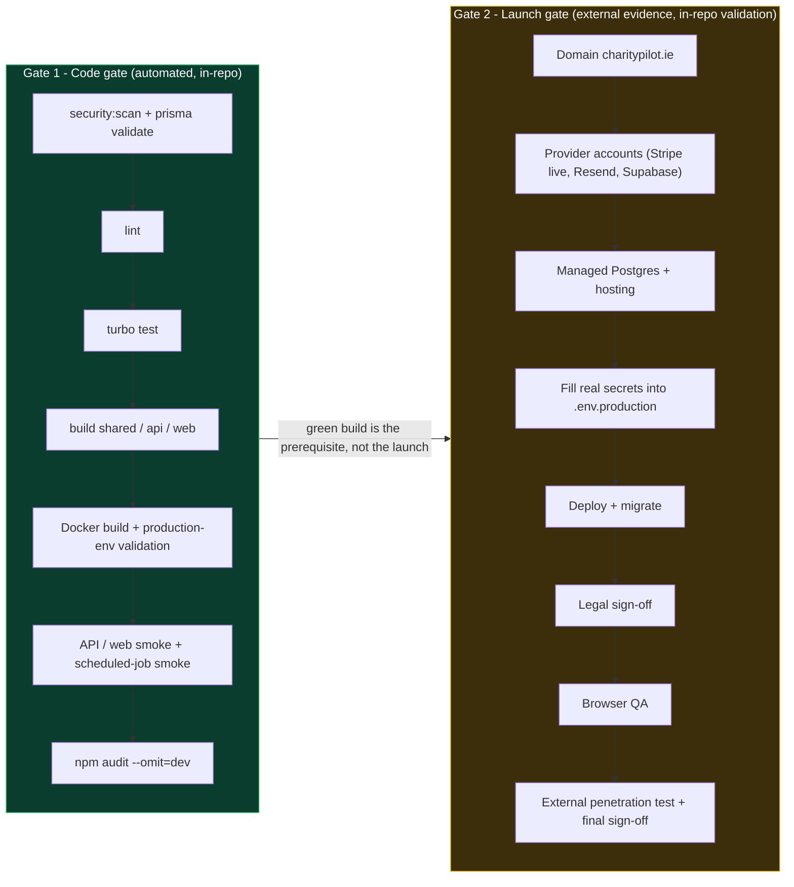

# Configuration, Environment & the Two-Gate Model

CharityPilot reads all runtime configuration from environment variables. In development the app is designed to run with **no external accounts** — local filesystem storage and an optionally seeded local admin let a developer boot the whole stack against a single PostgreSQL instance. In production, `validateProductionEnv` fails startup when required values are missing, placeholder-like, or structurally unsafe. It performs no provider, DNS, TLS-handshake, bucket, webhook, or application-reachability probe; the separate `check:production:*` commands perform those live checks. This document maps the full environment surface and explains the project's **two-gate model**: an automated *code gate* that must remain green, plus an external-evidence *launch gate* that repository tooling validates but cannot manufacture.

The strict public-production statement above applies to every normal production
mode. The exact `personal-server` marker selects the separate private-appliance
validator documented below; unknown and lookalike markers cannot select it.

## Environment-variable surface

The tables below group every documented variable by concern. "Required in production?" covers the complete supported deployment contract: API/job startup validation, mandatory production preflight, Compose interpolation, and restricted operator tools. A row states explicitly when a value is preflight/operator-only rather than enforced by `apps/api/src/utils/env.ts`.

### Core / server

| Var | Used by | Purpose | Required in production? |
| --- | --- | --- | --- |
| `NODE_ENV` | API + web | Switches on the production validator and hardening; the validator no-ops unless this is `production` (`apps/api/src/utils/env.ts:409`) | Yes (`.env.production.example:8`) |
| `PORT` | API | Listen port; parsed via `parsePort` with default `3002` (`apps/api/src/utils/env.ts:414-418`) | Yes — must be present and a valid 1–65535 port |
| `HOST` | API | Bind address (e.g. `0.0.0.0`) (`.env.example:13`) | No (not validated) |
| `TRUSTED_PROXY_ADDRESSES` | API | Comma-separated reverse-proxy IPs/CIDRs so rate limits trust forwarded client IPs; rejects `true`/`false`/`*`/`0.0.0.0/0`/`::/0` and non-IP values (`apps/api/src/utils/env.ts:281-314`) | Yes — must list explicit IPs or CIDRs |
| `READINESS_API_KEY` | API | Auth key for the readiness endpoint dependency detail; minimum 32 chars (`apps/api/src/utils/env.ts:421`) | Yes — min length 32 |

### Database

| Var | Used by | Purpose | Required in production? |
| --- | --- | --- | --- |
| `DATABASE_URL` | API (Prisma), migrations, jobs | PostgreSQL connection string. Real production API/job startup and mandatory preflight both require exact lowercase `sslmode=verify-full` and one `target_session_attrs=read-write`; only the explicit GitHub Actions local-database smoke exception bypasses those two query requirements. Preflight and the one-shot recovery authority add the username, one non-root database path segment, fragment, canonical public DNS hostname, connection-option allowlist, and optional normalized absolute `.crt`/`.pem` `sslrootcert` checks. The libpq-only `system` CA sentinel is never accepted by the recovery authority. | Yes |

A narrow CI escape hatch relaxes the localhost/TLS rules: when `CHARITYPILOT_ALLOW_LOCAL_DATABASE_FOR_CI_SMOKE=true` **and** `CI=true` **and** `GITHUB_ACTIONS=true`, a local database is accepted (`apps/api/src/utils/env.ts:13-19`, `apps/api/src/utils/env.ts:222-227`). This is used only by the Docker smoke steps in CI.

### Auth / JWT

| Var | Used by | Purpose | Required in production? |
| --- | --- | --- | --- |
| `JWT_SECRET` | API | Signing secret for access tokens; minimum 32 chars (`apps/api/src/utils/env.ts:423`) | Yes — min length 32 |
| `JWT_EXPIRY` | API | Access-token lifetime as a `15m`/`1h`/`3600s` duration; capped at 1h in production (`apps/api/src/utils/env.ts:248-264`) | No, but validated if set; default `15m` (`.env.example:19`) |
| `REFRESH_TOKEN_TTL_DAYS` | API | Refresh-token TTL; integer 1–30 (`apps/api/src/utils/env.ts:266-279`) | No, but validated if set; default `7` (`.env.example:20`) |
| `JWT_REFRESH_SECRET` | API | Listed in Turbo's `globalEnv` for cache keying (`turbo.json:10`) | Not enforced by `validateProductionEnv` |
| `AUTH_COOKIE_DOMAIN` | API | Cookie scope for the canonical split-host deployment; production should use `.charitypilot.ie`, must not be a URL, must be an approved CharityPilot host, and must cover both `FRONTEND_URL` and `NEXT_PUBLIC_API_URL` (`apps/api/src/utils/env.ts`) | Yes for the canonical production deployment |

### Public origins / frontend

| Var | Used by | Purpose | Required in production? |
| --- | --- | --- | --- |
| `FRONTEND_URL` | API (CORS, CSRF origin checks, email links, Stripe redirects) | Canonical production web origin: `https://app.charitypilot.ie`; HTTPS and origin-only (no path/query/hash) (`apps/api/src/utils/env.ts`) | Yes |
| `API_URL` | API/dev | Self-reference for local links (`.env.example:24`); also in Turbo `globalEnv` (`turbo.json:8`) | Not enforced by `validateProductionEnv` |
| `NEXT_PUBLIC_API_URL` | web (browser) + API validation | Canonical production API origin baked into the web build: `https://api.charitypilot.ie`; HTTPS and origin-only (`apps/api/src/utils/env.ts`) | Yes |
| `NEXT_PUBLIC_STRIPE_PUBLISHABLE_KEY` | web | Stripe.js publishable key (`.env.example:31`, `turbo.json:23`) | Not enforced by the API validator (browser-side) |
| `CHARITYPILOT_WEB_NEXT_PUBLIC_API_URL` | Docker Compose | Maps the canonical API origin into the web runtime; it must be `https://api.charitypilot.ie` and match `NEXT_PUBLIC_API_URL` | Compose-time, deployment-specific |
| `CHARITYPILOT_WEB_BUILD_NEXT_PUBLIC_API_URL` | deploy preflight | Proves the published web image was built for the promoted public API origin | Deployment-specific |

### Stripe (billing)

`validateProductionEnv` requires each Stripe value to be present and carry the correct prefix (`apps/api/src/utils/env.ts:439-444`).

| Var | Purpose | Required prefix in production |
| --- | --- | --- |
| `STRIPE_SECRET_KEY` | Server-side Stripe key | `sk_live_` |
| `STRIPE_WEBHOOK_SECRET` | Webhook signature verification | `whsec_` |
| `STRIPE_ESSENTIALS_MONTHLY_PRICE_ID` | Essentials monthly checkout price | `price_` |
| `STRIPE_ESSENTIALS_YEARLY_PRICE_ID` | Essentials yearly checkout price | `price_` |
| `STRIPE_COMPLETE_MONTHLY_PRICE_ID` | Complete monthly checkout price | `price_` |
| `STRIPE_COMPLETE_YEARLY_PRICE_ID` | Complete yearly checkout price | `price_` |
| `STRIPE_BILLING_PORTAL_CONFIGURATION_ID` | Pinned customer-portal configuration used for existing subscriptions | `bpc_` |

### Resend (email)

| Var | Purpose | Required in production? |
| --- | --- | --- |
| `RESEND_API_KEY` | Resend API key; prefix `re_` (`apps/api/src/utils/env.ts:446`) | Yes |
| `EMAIL_FROM` | Sender address; must parse as a valid address and use an approved `charitypilot.ie` sender domain (`apps/api/src/utils/env.ts:447`, `apps/api/src/utils/env.ts:159-191`) | Yes |

### Supabase / document storage

| Var | Purpose | Required in production? |
| --- | --- | --- |
| `SUPABASE_URL` | Supabase project URL; HTTPS and a public (non-local) host (`apps/api/src/utils/env.ts:449`) | Yes |
| `SUPABASE_SERVICE_ROLE_KEY` | Server-only key for private-bucket upload, authenticated proxy download, deletion, and readiness checks | Yes |
| `SUPABASE_STORAGE_BUCKET` | Private bucket name; defaults to `documents` at read time (`apps/api/src/utils/env.ts:451`, `apps/api/src/services/storage.service.ts:13-15`) | Yes |
| `DOCUMENT_STORAGE_DRIVER` | Selects storage backend; `local` switches to filesystem storage (`apps/api/src/services/storage.service.ts:17-19`) | No — production uses the Supabase driver |
| `LOCAL_FILE_STORAGE_DIR` | Filesystem root for the local driver; defaults to `.charitypilot-local-storage/documents` (`apps/api/src/services/storage.service.ts:21-23`) | No (dev only) |
| `STORAGE_DOWNLOAD_TIMEOUT_MS` | Bounds authenticated Supabase byte-proxy downloads, including response-body reads; defaults to 10000 ms and accepts 100-60000 ms | No |
| `STORAGE_DELETE_TIMEOUT_MS` | Bounds each provider object-deletion request; defaults to 5000 ms. When set, the production preflight accepts only canonical integers from 100 through 8000 ms. | No (default `5000`) |
| `DOCUMENT_STORAGE_RECOVERY_DATABASE_HOST_ALLOWLIST` | Exact comma-separated managed PostgreSQL hostnames authorized for the one-shot document-deletion recovery CLI. Entries must be unique syntactically public DNS names in canonical ASCII/IDNA form, lowercase and without wildcards or trailing dots, and the list must include the `DATABASE_URL` hostname. This is required by production preflight and the recovery operator environment; the API runtime does not consume it. | Yes for the supported production deploy/recovery path |

The database hostname checks are intentionally deterministic and perform no DNS
lookup. "Syntactically public" means that the configured text is a canonical DNS
name rather than an IP, local/private/reserved name, wildcard, or invalid IDNA
label. It does **not** prove that every future A/AAAA answer is public or is the
intended managed database. Production DNS, egress/network policy, provider
configuration, and authenticated `verify-full` TLS remain responsible for
preventing private, loopback, or attacker-controlled resolution.

`SUPABASE_URL`, `SUPABASE_SERVICE_ROLE_KEY`, and `SUPABASE_STORAGE_BUCKET` are
server-only. They are supplied to API and storage-cleanup/scheduler runtimes,
never the web image or browser. Document bytes cross the browser boundary only
through the authenticated CharityPilot API download route.

### Observability / readiness / scheduler

| Var | Used by | Purpose | Required in production? |
| --- | --- | --- | --- |
| `ERROR_ALERT_WEBHOOK_URL` | API + jobs | Webhook for production 5xx alerts; HTTPS, public host (`apps/api/src/utils/env.ts:452`) | Yes |
| `READINESS_DEPENDENCY_TIMEOUT_MS` / `STORAGE_READINESS_TIMEOUT_MS` | readiness route (`apps/api/src/routes/health/index.ts`) | Bound dependency-probe latency in the readiness check | No |
| `ENABLE_IN_PROCESS_JOBS` | API | Whether reminders run in-process; kept `false` when a dedicated scheduler runs them (`.env.production.example:82-83`) | No |
| `DEADLINE_REMINDERS_INTERVAL_MS` / `DOCUMENT_STORAGE_CLEANUP_INTERVAL_MS` / `DOCUMENT_STORAGE_CLEANUP_LIMIT` | scheduler container | Production scheduler intervals and batch size (`.env.production.example:84-91`) | No (have defaults) |
| `PRODUCTION_SCHEDULER_SHUTDOWN_TIMEOUT_MS` | scheduler container | Bounded active-run shutdown wait; defaults to 45,000 ms and rejects values above the 55,000 ms safety ceiling so Compose's 60-second grace remains larger | No |
| `PRODUCTION_SCHEDULER_RUN_ONCE` | scheduler job (`apps/api/src/jobs/production-scheduler.ts`) | Run the scheduler once and exit (used by CI smoke) | No |
| `CHARITYPILOT_API_IMAGE` / `CHARITYPILOT_WEB_IMAGE` / `CHARITYPILOT_MIGRATION_IMAGE` | Compose | Digest-pinned release image refs (`.env.production.example:65-69`) | Deployment-specific |
| `CHARITYPILOT_DATABASE_COMPATIBILITY` | release manifest + rollback guard | Declares the reviewed application/database compatibility line. Current releases use `p109-governance-integrity-v1` because P1-09's database checks and restrictive composite conflict relation are not compatible with older application images. Same-line image rollback still requires a fresh exact-manifest-hash-bound operator attestation and live migration-history probe; the marker is never sufficient by itself. | Deployment-specific |
| `CADDY_ACME_EMAIL` / `CHARITYPILOT_WEB_DOMAIN` / `CHARITYPILOT_API_DOMAIN` | default TLS proxy | Caddy automatic Let's Encrypt config (`.env.production.example:74-79`) | Required for the default repo deploy path; use `--no-tls-proxy` only when managed platform TLS replaces Caddy |

Two additional validator entry points enforce subsets of the surface for the standalone job containers: `validateDeadlineRemindersEnv` requires `DATABASE_URL`, `FRONTEND_URL`, `RESEND_API_KEY`, `EMAIL_FROM`, and `ERROR_ALERT_WEBHOOK_URL` (`apps/api/src/utils/env.ts:385-406`); `validateDocumentStorageCleanupEnv` requires `DATABASE_URL`, the three Supabase vars, and `ERROR_ALERT_WEBHOOK_URL` (`apps/api/src/utils/env.ts:367-383`).

### Turbo `globalEnv`

`turbo.json` lists the environment variables that participate in Turbo's task-cache hashing, so that changing any of them invalidates cached `build`/`lint`/`test` outputs. The list covers `DATABASE_URL`, server, JWT, all six Stripe vars, Resend, the three Supabase vars, and the `NEXT_PUBLIC_*` build values, including the deployment-mode marker. Note `JWT_REFRESH_SECRET` and `API_URL` appear here for cache correctness even though they are not enforced by `validateProductionEnv`.

## How secret strength and placeholders are checked

All "is this value real?" checks funnel through `isConfiguredSecret` in `apps/api/src/utils/secrets.ts`. A value is considered configured only if it is non-empty after trimming **and** contains none of the placeholder patterns (`apps/api/src/utils/secrets.ts:15-18`). The placeholder list (`apps/api/src/utils/secrets.ts:1-13`) includes the literals scattered through the templates: `REPLACE_ME`, `change-me`, `your_`, `your-`, the `..._...` stub keys (`sk_test_...`, `whsec_...`, `re_...`, `eyJ...`, etc.), and `https://your-project.supabase.co`. This means a `.env.production.example` copied verbatim fails validation on every required field, by design.

On top of presence, the validator applies structural rules:

| Check | Helper | What it enforces |
| --- | --- | --- |
| Minimum length | `requireMinLength` | `READINESS_API_KEY` and `JWT_SECRET` ≥ 32 chars (`apps/api/src/utils/env.ts:241-246`) |
| Prefix | `requirePrefix` | Stripe (`sk_live_`/`whsec_`/`price_`) and Resend (`re_`) prefixes (`apps/api/src/utils/env.ts:234-239`) |
| URL shape | `requireUrl` / `validateUrlValue` | HTTPS, no localhost, origin-only, approved/public host (`apps/api/src/utils/env.ts:37-93`) |
| Canonical web/API origins | `validateUrlValue` | Production web/API origins must be `https://app.charitypilot.ie` and `https://api.charitypilot.ie`; approved-host checks alone are not sufficient for launch (`apps/api/src/utils/env.ts`) |
| DB connection | `requireDatabaseUrl` | PostgreSQL protocol, username, one non-root database path segment, no fragment, and a syntactically public canonical ASCII/IDNA hostname. The repository production preflight mirrors the recovery CLI's query-option allowlist and value constraints, requires exact lowercase `sslmode=verify-full` and `target_session_attrs=read-write`, and permits `sslrootcert` only as a normalized absolute `.crt`/`.pem` CA path. |
| Recovery DB authority | `requireDocumentStorageRecoveryDatabaseHostAllowlist` | Unique syntactically public DNS names in canonical lowercase ASCII/IDNA form only; rejects wildcards, IP/local/private/reserved names and requires an exact match for the `DATABASE_URL` hostname. This is a textual authority check, not a DNS-resolution attestation (`scripts/check-production.mjs`). |
| Storage deletion timeout | `requireOptionalCanonicalIntegerRange` | When set, `STORAGE_DELETE_TIMEOUT_MS` is a canonical integer from 100 through 8000 (`scripts/check-production.mjs`). |
| Email sender | `requireApprovedEmailSender` | Valid address on an approved sender domain (`apps/api/src/utils/env.ts:178-191`) |
| Proxy list | `requireTrustedProxyAddresses` | Explicit IPs/CIDRs only, no wildcards (`apps/api/src/utils/env.ts:303-314`) |

Every failure is collected into an `issues` array and, if non-empty, thrown together as a single `AppError` (`apps/api/src/utils/env.ts:356-365`) — so an operator sees all configuration problems at once rather than one per restart.

## Personal-server production environment

The `personal-server` path deliberately runs with `NODE_ENV=production` while
using a narrower validator selected by
`CHARITYPILOT_DEPLOYMENT_MODE=personal-server`. This is not a bypass of the
public validator: any other marker continues through the strict canonical
public-production checks.

The profile is configured by `.env.personal-server`, which is ignored by Git;
only `.env.personal-server.example` is committed. Its durable values are:

| Variable | Personal-server contract |
| --- | --- |
| `CHARITYPILOT_PERSONAL_SERVER_ORIGIN` | One exact HTTPS DNS origin, or exact loopback HTTP for local-only use; becomes both `FRONTEND_URL` and `NEXT_PUBLIC_API_URL` |
| `CHARITYPILOT_PERSONAL_SERVER_PORT` | Caddy's loopback-published host port; default `8080` |
| `POSTGRES_DB`, `POSTGRES_USER`, `POSTGRES_PASSWORD` | Credentials for only the internal PostgreSQL container; the generated password is URL-safe |
| `JWT_SECRET`, `READINESS_API_KEY` | Distinct random secrets of at least 32 characters |
| `PERSONAL_SERVER_OWNER_EMAIL`, `PERSONAL_SERVER_OWNER_NAME`, `PERSONAL_SERVER_ORGANISATION_NAME` | Non-secret inputs used only by the empty-database initializer |

`PERSONAL_SERVER_OWNER_PASSWORD`, reset tokens and emergency account passwords
are transient child-process values. They must not be written to the env file.
The normal API environment fixes local document storage, disables in-process
jobs and public registration, trusts only Caddy's exact internal address, and
does not contain Stripe, Resend, Supabase or alert-webhook variables. HTTPS uses
host-only `Secure`, `HttpOnly`, `SameSite=Lax` cookies. Exact loopback HTTP is
the only personal-server exception to the `Secure` attribute; non-loopback
plain HTTP is rejected.

The fixed `172.30.250.0/24` bridge uses `172.30.250.1` as the private-tunnel
gateway hop and `172.30.250.10` for Caddy. Caddy applies strict trusted-proxy
parsing only to the exact gateway/loopback sources; the API's
`TRUSTED_PROXY_ADDRESSES` contains only Caddy. The exact configured public origin
is used directly for server-side refresh requests, CSP and redirects so TLS
termination outside Caddy cannot cause an HTTPS-to-HTTP downgrade.

`CHARITYPILOT_INTERNAL_API_URL=http://api:3002` is server-only. Browser requests
stay on the configured public origin and Caddy routes `/api/v1/*` internally,
so CORS and shared-domain cookies are unnecessary. The public origin is built
into the Next.js image; changing a Tailscale hostname requires a rebuild.

The complete variable template, initialization rules, lifecycle commands and
secret-handling procedure are in
[Personal Server Deployment on Windows](../personal-server-deployment.md).

## Local / development defaults — running with no external accounts

The dev template (`.env.example`) is deliberately self-contained:

- **Filesystem storage.** `DOCUMENT_STORAGE_DRIVER=local` with `LOCAL_FILE_STORAGE_DIR=.charitypilot-local-storage/documents` routes document upload/download through the local disk driver instead of Supabase (`.env.example:42-44`, `apps/api/src/services/storage.service.ts:17-23`). No Supabase project is needed to test documents locally.
- **Seeded local admin.** `SEED_LOCAL_ADMIN=true` seeds a ready-to-use owner account (`admin@charitypilot.local` / `LocalAdmin123!`) on the COMPLETE plan (`.env.example:55-59`, `apps/api/src/services/local-admin-seed.ts:17-47`). When the flag is off, seeding is skipped entirely (`apps/api/src/services/local-admin-seed.ts:21-23`); when it is on, `LOCAL_ADMIN_PASSWORD` must be set or seeding throws (`apps/api/src/services/local-admin-seed.ts:25-30`). A legacy `SEED_DEMO_WORKSPACE`/`DEMO_PASSWORD` path remains for the old demo account.
- **Local Stripe/Resend stubs.** The dev template ships `sk_test_...`, `re_...`, etc. — values that `isConfiguredSecret` treats as placeholders, so checkout and email stay disabled until real keys are supplied.

Because `validateProductionEnv` no-ops unless `NODE_ENV=production` (`apps/api/src/utils/env.ts:409`), none of these dev defaults block local startup; they only ever fail the build when someone tries to run them as production.

### Isolated destructive E2E configuration

Destructive Playwright is deliberately separate from both development and
production configuration. `npm run test:e2e` delegates to
`scripts/run-isolated-e2e.mjs`, which generates a fresh UUID and bootstrap,
runner, JWT, and readiness credentials; copies only an explicit source
allow-list into the build context; rejects Docker/Buildx endpoint overrides;
proves and pins a local socket and integrated builder; and renders an exact
private snapshot of `compose.e2e.yml` before building or starting anything. The
source is read once; config, build, startup, logs, and cleanup cannot re-read a
mutable repository path. That
pre-start model pins the migration/seed DSN to the isolated `db` service and
rejects host routing, secondary env/config files, mounts, secrets, unapproved
network aliases, alternate commands, extra build inputs, and pull policies. It
requires one unique `*.charitypilot-e2e.invalid` alias for each internal service
and absolute trailing-dot gateway routes, plus exact healthcheck, tmpfs, and
stop-grace contracts. Runtime database/document writes use tmpfs; the web
service serves a baked optimized build from its read-only image with only
`/tmp` writable. Compose declares no persistent volume or host mount. Database,
API, and web have no published ports and attach only to the internal bridge.
The sole publisher is a dedicated non-root,
read-only TCP gateway with no environment, secret, mount, dynamic destination,
or package dependency; only that gateway also joins the project-scoped,
non-attachable edge bridge. API alone builds the shared app image and web reuses
that exact tag, preventing concurrent same-tag image exports. Before Playwright
can reset the database, runtime inspection binds the three random image tags to
immutable IDs and proves exactly four healthy project-labelled containers with
the expected images, networks, loopback publications, mounts/tmpfs, users, and
security controls. `npm run test:e2e` also runs the pure isolation contract as a
pre-Docker lifecycle gate.

Local mode fixes the web, API, and PostgreSQL endpoints to
`127.0.0.1:3303`, `127.0.0.1:3302`, and `127.0.0.1:55434` respectively. It
accepts no ambient database URL, instance ID, reset confirmation, generated
credential, Docker context, or remote builder. Direct database identity, the
protected UUID marker/restricted role, exact table inventory, and a keyed API
binding canary must all pass before reset. The locked reset cannot cascade,
follow inheritance descendants, restart sequences, fire a user `ON TRUNCATE`
trigger, or publish a logical truncate. Final cleanup is attempted in all normal
pass/fail/timeout paths, every daemon operation stays pinned to the proven
endpoint, and exact-project residue makes the gate red while preserving the
private recovery inputs.

The exceptional `remote-disposable` mode is manual-only. It additionally
requires the long destructive override, `sslmode=verify-full`, an exact
connected-server IP, high-entropy database/JWT/readiness credentials, a narrow
`E2E_AUTH_COOKIE_DOMAIN` covering only the QA web/API origins, the protected
database comment and UUID marker, a non-owning `NOINHERIT` runner with no role
memberships, and a keyed API-to-database binding proof. A single physical
connection holds a suite-wide advisory lease; remote destructive authority is
granted only after the initial API canary. Each worker database seam proves the
lease is active, and the reset primitive proves its own physical session owns
the lease before opening a transaction. After the Playwright process group is
proven absent, an outer-runner janitor opens a fresh connection, re-proves
identity, reacquires the lease, rechecks API binding, resets, verifies binding
again, releases, and disconnects. An unproven process tree skips the janitor and
fails red with manual-recovery guidance. The endpoint must be direct or
session-affine; transaction/statement poolers are unsupported because they do
not preserve PostgreSQL session advisory-lock ownership. Direct remote
`resetDb()` is rejected.
Native Windows remote-destructive execution is rejected until a Job
Object-backed process-tree lifetime primitive exists; operators must use Linux
or WSL. This restriction does not affect native-Windows local-disposable E2E or
non-destructive deployed QA.
The local bootstrap owner is made `NOLOGIN`; a remote provider's distinct owner
need not share that local implementation detail. CI, deployed browser QA, and
`release:ready` cannot select remote mode. The retired boolean reset flag is
rejected and grants no authority. See [`e2e/README.md`](../../e2e/README.md) for
the complete operator contract.

## The two-gate model

CharityPilot separates "is the code correct and shippable?" from "is the business ready to launch?" into two distinct gates. Gate 1 contains self-contained repository proof. Gate 2 depends on real infrastructure, providers, deployment, people, and professional review. Repository commands automate Gate 2 preflight, probing, evidence-shape validation, and deployment, but successful output is valid only when it is backed by the genuine external system and promoted release under review.

### Gate 1 — the code gate

Gate 1 is the CI pipeline in `.github/workflows/ci.yml` and the equivalent local "release gate" command sequence in the README (`README.md:129-139`). It is fully self-contained: it provisions its own PostgreSQL, generates the Prisma client, runs lint and the full `turbo test` suite, builds all three packages, builds the API/web/migration Docker images, and proves production configuration without any real provider account. Key Gate 1 stages:

| Stage | CI step | Notes |
| --- | --- | --- |
| Security scan | `npm run security:scan` (`.github/workflows/ci.yml:32-33`) | Static secret/security scan |
| Schema + migrations | Prisma generate/validate/deploy/status (`.github/workflows/ci.yml:35-49`) | Against an ephemeral CI Postgres |
| Backup/restore proof | `postgres-backup.mjs source-identity` plus `prove-restore` round trip (`.github/workflows/ci.yml`) | Uses one read-only exported snapshot, one code-allowlisted tools-image digest, bounded source/dump workload, and exact source/isolated-restore fingerprints for the declared `public` schema/data scope. The report carries explicit non-public, extension-membership, comments/security-label, database-level-object, ownership/ACL, and sequence-runtime exclusions; large objects and sequence-backed identities fail closed. The seeded sentinel is a local CI fixture only. |
| Lint / test | `npm run lint`, `npm run test` (`.github/workflows/ci.yml:69-73`) | |
| Local Docker smoke | `test:local-docker:smoke` (`.github/workflows/ci.yml:75-76`) | Boots the real containerised stack |
| Builds | shared → API → web (`.github/workflows/ci.yml:78-88`) | Web build is fed dummy `charitypilot.ie` public URLs |
| Production-env validation | runs `validateProductionEnv()` inside the API image with synthetic-but-valid secrets (`.github/workflows/ci.yml:93-119`) | Proves the validator passes when configured correctly |
| Image dependency hygiene | asserts dev deps and source are absent from the images (`.github/workflows/ci.yml:121-123`, `.github/workflows/ci.yml:307-309`) | |
| API/web/job smoke | health, security headers, CORS rejection, readiness 401/503, register flow, scheduled jobs (`.github/workflows/ci.yml:125-298`) | Uses the CI-smoke local-DB escape hatch |
| Dependency audit | `npm audit --omit=dev --audit-level=moderate` (`.github/workflows/ci.yml:342-343`) | |

Crucially, the synthetic secrets the CI feeds to `validateProductionEnv` (e.g. `sk_live_ci_configured_secret`, `https://app.charitypilot.ie`, `https://api.charitypilot.ie`) are constructed to *pass* every prefix/host/length rule — so Gate 1 proves the validator behaves correctly, but never holds a real production secret.

### Gate 2 — the launch gate

Gate 2 is everything `validateProductionEnv` *cannot* manufacture: a registered `charitypilot.ie` domain, live Stripe / Resend / Supabase accounts, a managed TLS-enabled PostgreSQL, a hosting target, the real secret values, legal document approval, deployed browser QA, and an external penetration test. These steps are sequenced in `docs/LAUNCH-GUIDE.md` (Steps 1–10) and operationalised in `docs/production-runbook.md`; outstanding items are tracked in `PRODUCTION_TODO.md`. The repository automates safe checks and strict evidence validation for Gate 2, but it never substitutes synthetic values, local fixtures, or self-authored attestations for real provider, operator, professional, or deployed-release evidence. `npm run setup:production-env` only scaffolds `.env.production` and auto-fills the random secrets, leaving provider/operator values for the approved secret source (`README.md:122-123`).

The relationship between the gates is one-directional: a green Gate 1 build is the **prerequisite** for attempting Gate 2, not the launch itself. `validateProductionEnv` is one fail-closed startup guard; production preflight, live provider/hosting checks, release binding, evidence validation, and final signoff are additional independent launch controls.

## Cross-references

- [System Overview](01-system-overview.md) — the runtime topology these variables configure.
- [Request Lifecycle, Middleware & Auth](04-request-lifecycle.md) — env validation on boot and the auth secrets.
- [Billing & Subscription Flow](05-billing.md) — the Stripe environment surface.
- [Document Storage Flow](06-document-storage.md) — the storage environment surface.
- [Reminder Scheduler & Jobs](07-reminder-scheduler.md) — the jobs/scheduler environment surface.

**Launch gate (external) — handled by the existing operator docs, not duplicated here:**

- [LAUNCH-GUIDE.md](../LAUNCH-GUIDE.md) — the step-by-step launch path (domains, providers, hosting, secrets, legal, QA, pentest).
- [production-runbook.md](../production-runbook.md) — the operator command runbook.
