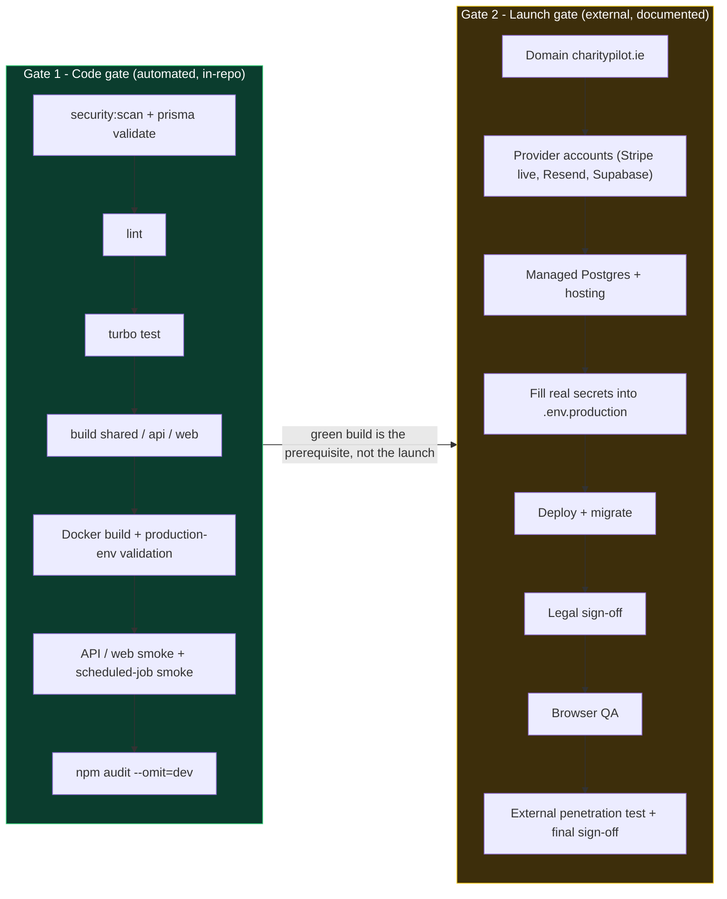

# Configuration, Environment & the Two-Gate Model

CharityPilot reads all runtime configuration from environment variables. In development the app is designed to run with **no external accounts** — local filesystem storage and an optionally seeded local admin let a developer boot the whole stack against a single PostgreSQL instance. In production a strict validator (`validateProductionEnv`) refuses to start unless every secret is real, every public URL is HTTPS on an approved hostname, and every dependency is reachable. This document maps the full environment surface and explains the project's **two-gate model**: an automated *code gate* that this repository keeps fully green, and an external *launch gate* that lives in the launch documentation.

## Environment-variable surface

The tables below group every documented variable by concern. "Required in production?" reflects what `apps/api/src/utils/env.ts` actually enforces when `NODE_ENV=production` (`apps/api/src/utils/env.ts:408-455`), not merely what appears in the template `.env.production.example`.

### Core / server

| Var | Used by | Purpose | Required in production? |
| --- | --- | --- | --- |
| `NODE_ENV` | API + web | Switches on the production validator and hardening; the validator no-ops unless this is `production` (`apps/api/src/utils/env.ts:409`) | Yes (`.env.production.example:8`) |
| `PORT` | API | Listen port; parsed via `parsePort` with default `3002` (`apps/api/src/utils/env.ts:414-418`) | Yes — must be present and a valid 1–65535 port |
| `HOST` | API | Bind address (e.g. `0.0.0.0`) (`.env.example:13`) | No (not validated) |
| `TRUSTED_PROXY_ADDRESSES` | API | Comma-separated reverse-proxy IPs/CIDRs so rate limits trust forwarded client IPs; rejects `true`/`false`/`*`/`0.0.0.0/0`/`::/0` and non-IP values (`apps/api/src/utils/env.ts:281-314`) | Yes — must list explicit IPs or CIDRs |
| `READINESS_API_KEY` | API | Auth key for the readiness endpoint dependency detail; minimum 32 chars (`apps/api/src/utils/env.ts:421`) | Yes — min length 32 |

### Database

| Var | Used by | Purpose | Required in production? |
| --- | --- | --- | --- |
| `DATABASE_URL` | API (Prisma), migrations, jobs | PostgreSQL connection string; must use `postgresql:`/`postgres:` protocol, must not point at localhost, and must request TLS via `sslmode=require`, `verify-ca`, or `verify-full` (`apps/api/src/utils/env.ts:211-232`) | Yes |

A narrow CI escape hatch relaxes the localhost/TLS rules: when `CHARITYPILOT_ALLOW_LOCAL_DATABASE_FOR_CI_SMOKE=true` **and** `CI=true` **and** `GITHUB_ACTIONS=true`, a local database is accepted (`apps/api/src/utils/env.ts:13-19`, `apps/api/src/utils/env.ts:222-227`). This is used only by the Docker smoke steps in CI.

### Auth / JWT

| Var | Used by | Purpose | Required in production? |
| --- | --- | --- | --- |
| `JWT_SECRET` | API | Signing secret for access tokens; minimum 32 chars (`apps/api/src/utils/env.ts:423`) | Yes — min length 32 |
| `JWT_EXPIRY` | API | Access-token lifetime as a `15m`/`1h`/`3600s` duration; capped at 1h in production (`apps/api/src/utils/env.ts:248-264`) | No, but validated if set; default `15m` (`.env.example:19`) |
| `REFRESH_TOKEN_TTL_DAYS` | API | Refresh-token TTL; integer 1–30 (`apps/api/src/utils/env.ts:266-279`) | No, but validated if set; default `7` (`.env.example:20`) |
| `JWT_REFRESH_SECRET` | API | Listed in Turbo's `globalEnv` for cache keying (`turbo.json:10`) | Not enforced by `validateProductionEnv` |
| `AUTH_COOKIE_DOMAIN` | API | Cookie scope for the canonical split-host deployment; production should use `.charitypilot.ie`, must not be a URL, must be an approved CharityPilot host, and must cover both `FRONTEND_URL` and `NEXT_PUBLIC_API_URL` (`apps/api/src/utils/env.ts`) | Yes for the canonical production deployment |

### Public origins / frontend

| Var | Used by | Purpose | Required in production? |
| --- | --- | --- | --- |
| `FRONTEND_URL` | API (CORS, CSRF origin checks, email links, Stripe redirects) | Canonical production web origin: `https://app.charitypilot.ie`; HTTPS and origin-only (no path/query/hash) (`apps/api/src/utils/env.ts`) | Yes |
| `API_URL` | API/dev | Self-reference for local links (`.env.example:24`); also in Turbo `globalEnv` (`turbo.json:8`) | Not enforced by `validateProductionEnv` |
| `NEXT_PUBLIC_API_URL` | web (browser) + API validation | Canonical production API origin baked into the web build: `https://api.charitypilot.ie`; HTTPS and origin-only (`apps/api/src/utils/env.ts`) | Yes |
| `NEXT_PUBLIC_STRIPE_PUBLISHABLE_KEY` | web | Stripe.js publishable key (`.env.example:31`, `turbo.json:23`) | Not enforced by the API validator (browser-side) |
| `NEXT_PUBLIC_SUPABASE_URL` | web | Public Supabase project URL for the browser (`.env.production.example:59`) | Not enforced by the API validator |
| `CHARITYPILOT_WEB_NEXT_PUBLIC_API_URL` / `CHARITYPILOT_WEB_NEXT_PUBLIC_SUPABASE_URL` | Docker Compose | Map the public values into the web runtime; API value must be `https://api.charitypilot.ie` and must match the `NEXT_PUBLIC_API_URL` value (`.env.production.example`) | Compose-time, deployment-specific |
| `CHARITYPILOT_WEB_BUILD_NEXT_PUBLIC_API_URL` / `CHARITYPILOT_WEB_BUILD_NEXT_PUBLIC_SUPABASE_URL` | deploy preflight | Prove the published web image was built for the promoted public origins (`.env.production.example:70-72`) | Deployment-specific |

### Stripe (billing)

`validateProductionEnv` requires each Stripe value to be present and carry the correct prefix (`apps/api/src/utils/env.ts:439-444`).

| Var | Purpose | Required prefix in production |
| --- | --- | --- |
| `STRIPE_SECRET_KEY` | Server-side Stripe key | `sk_live_` |
| `STRIPE_WEBHOOK_SECRET` | Webhook signature verification | `whsec_` |
| `STRIPE_ESSENTIALS_MONTHLY_PRICE_ID` | Essentials monthly checkout price | `price_` |
| `STRIPE_ESSENTIALS_YEARLY_PRICE_ID` | Essentials yearly checkout price | `price_` |
| `STRIPE_COMPLETE_MONTHLY_PRICE_ID` | Complete monthly checkout price | `price_` |
| `STRIPE_COMPLETE_YEARLY_PRICE_ID` | Complete yearly checkout price | `price_` |

### Resend (email)

| Var | Purpose | Required in production? |
| --- | --- | --- |
| `RESEND_API_KEY` | Resend API key; prefix `re_` (`apps/api/src/utils/env.ts:446`) | Yes |
| `EMAIL_FROM` | Sender address; must parse as a valid address and use an approved `charitypilot.ie` sender domain (`apps/api/src/utils/env.ts:447`, `apps/api/src/utils/env.ts:159-191`) | Yes |

### Supabase / document storage

| Var | Purpose | Required in production? |
| --- | --- | --- |
| `SUPABASE_URL` | Supabase project URL; HTTPS and a public (non-local) host (`apps/api/src/utils/env.ts:449`) | Yes |
| `SUPABASE_SERVICE_ROLE_KEY` | Server-side key for signed download URLs (`apps/api/src/utils/env.ts:450`) | Yes |
| `SUPABASE_STORAGE_BUCKET` | Private bucket name; defaults to `documents` at read time (`apps/api/src/utils/env.ts:451`, `apps/api/src/services/storage.service.ts:13-15`) | Yes |
| `DOCUMENT_STORAGE_DRIVER` | Selects storage backend; `local` switches to filesystem storage (`apps/api/src/services/storage.service.ts:17-19`) | No — production uses the Supabase driver |
| `LOCAL_FILE_STORAGE_DIR` | Filesystem root for the local driver; defaults to `.charitypilot-local-storage/documents` (`apps/api/src/services/storage.service.ts:21-23`) | No (dev only) |

### Observability / readiness / scheduler

| Var | Used by | Purpose | Required in production? |
| --- | --- | --- | --- |
| `ERROR_ALERT_WEBHOOK_URL` | API + jobs | Webhook for production 5xx alerts; HTTPS, public host (`apps/api/src/utils/env.ts:452`) | Yes |
| `READINESS_DEPENDENCY_TIMEOUT_MS` / `STORAGE_READINESS_TIMEOUT_MS` | readiness route (`apps/api/src/routes/health/index.ts`) | Bound dependency-probe latency in the readiness check | No |
| `ENABLE_IN_PROCESS_JOBS` | API | Whether reminders run in-process; kept `false` when a dedicated scheduler runs them (`.env.production.example:82-83`) | No |
| `DEADLINE_REMINDERS_INTERVAL_MS` / `DOCUMENT_STORAGE_CLEANUP_INTERVAL_MS` / `DOCUMENT_STORAGE_CLEANUP_LIMIT` | scheduler container | Production scheduler intervals and batch size (`.env.production.example:84-87`) | No (have defaults) |
| `PRODUCTION_SCHEDULER_RUN_ONCE` | scheduler job (`apps/api/src/jobs/production-scheduler.ts`) | Run the scheduler once and exit (used by CI smoke) | No |
| `CHARITYPILOT_API_IMAGE` / `CHARITYPILOT_WEB_IMAGE` / `CHARITYPILOT_MIGRATION_IMAGE` | Compose | Digest-pinned release image refs (`.env.production.example:65-69`) | Deployment-specific |
| `CADDY_ACME_EMAIL` / `CHARITYPILOT_WEB_DOMAIN` / `CHARITYPILOT_API_DOMAIN` | default TLS proxy | Caddy automatic Let's Encrypt config (`.env.production.example:74-79`) | Required for the default repo deploy path; use `--no-tls-proxy` only when managed platform TLS replaces Caddy |

Two additional validator entry points enforce subsets of the surface for the standalone job containers: `validateDeadlineRemindersEnv` requires `DATABASE_URL`, `FRONTEND_URL`, `RESEND_API_KEY`, `EMAIL_FROM`, and `ERROR_ALERT_WEBHOOK_URL` (`apps/api/src/utils/env.ts:385-406`); `validateDocumentStorageCleanupEnv` requires `DATABASE_URL`, the three Supabase vars, and `ERROR_ALERT_WEBHOOK_URL` (`apps/api/src/utils/env.ts:367-383`).

### Turbo `globalEnv`

`turbo.json:3-24` lists the environment variables that participate in Turbo's task-cache hashing, so that changing any of them invalidates cached `build`/`lint`/`test` outputs. The list covers `DATABASE_URL`, server, JWT, all six Stripe vars, Resend, the three Supabase vars, and the two `NEXT_PUBLIC_*` values. Note `JWT_REFRESH_SECRET` and `API_URL` appear here for cache correctness even though they are not enforced by `validateProductionEnv`.

## How secret strength and placeholders are checked

All "is this value real?" checks funnel through `isConfiguredSecret` in `apps/api/src/utils/secrets.ts`. A value is considered configured only if it is non-empty after trimming **and** contains none of the placeholder patterns (`apps/api/src/utils/secrets.ts:15-18`). The placeholder list (`apps/api/src/utils/secrets.ts:1-13`) includes the literals scattered through the templates: `REPLACE_ME`, `change-me`, `your_`, `your-`, the `..._...` stub keys (`sk_test_...`, `whsec_...`, `re_...`, `eyJ...`, etc.), and `https://your-project.supabase.co`. This means a `.env.production.example` copied verbatim fails validation on every required field, by design.

On top of presence, the validator applies structural rules:

| Check | Helper | What it enforces |
| --- | --- | --- |
| Minimum length | `requireMinLength` | `READINESS_API_KEY` and `JWT_SECRET` ≥ 32 chars (`apps/api/src/utils/env.ts:241-246`) |
| Prefix | `requirePrefix` | Stripe (`sk_live_`/`whsec_`/`price_`) and Resend (`re_`) prefixes (`apps/api/src/utils/env.ts:234-239`) |
| URL shape | `requireUrl` / `validateUrlValue` | HTTPS, no localhost, origin-only, approved/public host (`apps/api/src/utils/env.ts:37-93`) |
| Canonical web/API origins | `validateUrlValue` | Production web/API origins must be `https://app.charitypilot.ie` and `https://api.charitypilot.ie`; approved-host checks alone are not sufficient for launch (`apps/api/src/utils/env.ts`) |
| DB connection | `requireDatabaseUrl` | PostgreSQL protocol, non-local host, TLS `sslmode` (`apps/api/src/utils/env.ts:211-232`) |
| Email sender | `requireApprovedEmailSender` | Valid address on an approved sender domain (`apps/api/src/utils/env.ts:178-191`) |
| Proxy list | `requireTrustedProxyAddresses` | Explicit IPs/CIDRs only, no wildcards (`apps/api/src/utils/env.ts:303-314`) |

Every failure is collected into an `issues` array and, if non-empty, thrown together as a single `AppError` (`apps/api/src/utils/env.ts:356-365`) — so an operator sees all configuration problems at once rather than one per restart.

## Local / development defaults — running with no external accounts

The dev template (`.env.example`) is deliberately self-contained:

- **Filesystem storage.** `DOCUMENT_STORAGE_DRIVER=local` with `LOCAL_FILE_STORAGE_DIR=.charitypilot-local-storage/documents` routes document upload/download through the local disk driver instead of Supabase (`.env.example:42-44`, `apps/api/src/services/storage.service.ts:17-23`). No Supabase project is needed to test documents locally.
- **Seeded local admin.** `SEED_LOCAL_ADMIN=true` seeds a ready-to-use owner account (`admin@charitypilot.local` / `LocalAdmin123!`) on the COMPLETE plan (`.env.example:55-59`, `apps/api/src/services/local-admin-seed.ts:17-47`). When the flag is off, seeding is skipped entirely (`apps/api/src/services/local-admin-seed.ts:21-23`); when it is on, `LOCAL_ADMIN_PASSWORD` must be set or seeding throws (`apps/api/src/services/local-admin-seed.ts:25-30`). A legacy `SEED_DEMO_WORKSPACE`/`DEMO_PASSWORD` path remains for the old demo account.
- **Local Stripe/Resend stubs.** The dev template ships `sk_test_...`, `re_...`, etc. — values that `isConfiguredSecret` treats as placeholders, so checkout and email stay disabled until real keys are supplied.

Because `validateProductionEnv` no-ops unless `NODE_ENV=production` (`apps/api/src/utils/env.ts:409`), none of these dev defaults block local startup; they only ever fail the build when someone tries to run them as production.

## The two-gate model

CharityPilot separates "is the code correct and shippable?" from "is the business ready to launch?" into two distinct gates. **All of this repository's automated work lives inside Gate 1.** Gate 2 is external — real money, real domains, real legal sign-off — and is documented (not duplicated) in the launch docs.

### Gate 1 — the code gate

Gate 1 is the CI pipeline in `.github/workflows/ci.yml` and the equivalent local "release gate" command sequence in the README (`README.md:129-139`). It is fully self-contained: it provisions its own PostgreSQL, generates the Prisma client, runs lint and the full `turbo test` suite, builds all three packages, builds the API/web/migration Docker images, and proves production configuration without any real provider account. Key Gate 1 stages:

| Stage | CI step | Notes |
| --- | --- | --- |
| Security scan | `npm run security:scan` (`.github/workflows/ci.yml:32-33`) | Static secret/security scan |
| Schema + migrations | Prisma generate/validate/deploy/status (`.github/workflows/ci.yml:35-49`) | Against an ephemeral CI Postgres |
| Backup/restore proof | `postgres-backup.mjs` round trip (`.github/workflows/ci.yml:51-67`) | Verifies restore sentinel |
| Lint / test | `npm run lint`, `npm run test` (`.github/workflows/ci.yml:69-73`) | |
| Local Docker smoke | `test:local-docker:smoke` (`.github/workflows/ci.yml:75-76`) | Boots the real containerised stack |
| Builds | shared → API → web (`.github/workflows/ci.yml:78-88`) | Web build is fed dummy `charitypilot.ie` public URLs |
| Production-env validation | runs `validateProductionEnv()` inside the API image with synthetic-but-valid secrets (`.github/workflows/ci.yml:93-119`) | Proves the validator passes when configured correctly |
| Image dependency hygiene | asserts dev deps and source are absent from the images (`.github/workflows/ci.yml:121-123`, `.github/workflows/ci.yml:307-309`) | |
| API/web/job smoke | health, security headers, CORS rejection, readiness 401/503, register flow, scheduled jobs (`.github/workflows/ci.yml:125-298`) | Uses the CI-smoke local-DB escape hatch |
| Dependency audit | `npm audit --omit=dev --audit-level=moderate` (`.github/workflows/ci.yml:342-343`) | |

Crucially, the synthetic secrets the CI feeds to `validateProductionEnv` (e.g. `sk_live_ci_configured_secret`, `https://app.charitypilot.ie`, `https://api.charitypilot.ie`) are constructed to *pass* every prefix/host/length rule — so Gate 1 proves the validator behaves correctly, but never holds a real production secret.

### Gate 2 — the launch gate

Gate 2 is everything `validateProductionEnv` *cannot* manufacture: a registered `charitypilot.ie` domain, live Stripe / Resend / Supabase accounts, a managed TLS-enabled PostgreSQL, a hosting target, the real secret values, legal document approval, browser QA, and an external penetration test. These steps are sequenced in `docs/LAUNCH-GUIDE.md` (Steps 1–10) and operationalised in `docs/production-runbook.md`; outstanding items are tracked in `PRODUCTION_TODO.md`. This repository deliberately does **not** automate or duplicate Gate 2 — it links out to those documents, and `npm run setup:production-env` only scaffolds `.env.production` and auto-fills the random secrets, leaving the provider-issued values for a human to paste in (`README.md:122-123`).

The relationship between the gates is one-directional: a green Gate 1 build is the **prerequisite** for attempting Gate 2, not the launch itself. `validateProductionEnv` is exactly where the two gates touch — it is the code-side guard that refuses to start until the human-side launch work has actually been completed.

## Cross-references

- [System Overview](01-system-overview.md) — the runtime topology these variables configure.
- [Request Lifecycle, Middleware & Auth](04-request-lifecycle.md) — env validation on boot and the auth secrets.
- [Billing & Subscription Flow](05-billing.md) — the Stripe environment surface.
- [Document Storage Flow](06-document-storage.md) — the storage environment surface.
- [Reminder Scheduler & Jobs](07-reminder-scheduler.md) — the jobs/scheduler environment surface.

**Launch gate (external) — handled by the existing operator docs, not duplicated here:**

- [LAUNCH-GUIDE.md](../LAUNCH-GUIDE.md) — the step-by-step launch path (domains, providers, hosting, secrets, legal, QA, pentest).
- [production-runbook.md](../production-runbook.md) — the operator command runbook.
