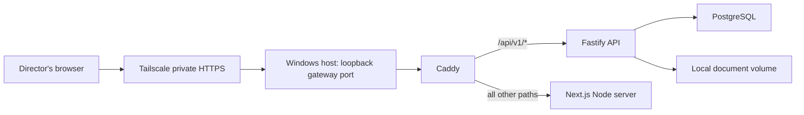

# Personal Server Deployment on Windows

## Purpose and decision

The personal-server profile is intended for one charity whose directors need to
use CharityPilot remotely while the application and its data remain on a trusted
Windows computer. It is a small private deployment, not a public SaaS launch.

The agreed shape is:

- one charity workspace;
- one individually named account per director;
- compiled, production-optimised application processes rather than development
  watchers;
- one private HTTPS address shared only with approved directors;
- PostgreSQL and documents stored on the Windows host through persistent Docker
  volumes;
- no public registration, billing, Stripe, Resend, Supabase, public DNS, router
  port-forwarding, or public Internet listener;
- Tailscale Serve as the recommended private access layer; and
- Cloudflare Tunnel plus Access as an optional, more involved alternative.

This profile does not remove the multi-organisation data model, public-production
validation, provider integrations, release workflow, or VM deployment path. It
adds a narrower way to operate the same application now, so that the existing
work remains available if CharityPilot is later hosted commercially.

## Implementation inventory and evidence

The repository implementation uses:

- `compose.personal-server.yml` for the isolated compiled services, network and
  persistent volumes;
- `caddy/Caddyfile.personal-server` for the single same-origin web front door;
- `.env.personal-server.example` as the non-secret field reference, while the
  real `.env.personal-server` is generated exclusively and ignored by Git;
- `scripts/personal-server.mjs` for `init`, `start`, `status`, `stop`, `backup`,
  `update`, `reset-link` and emergency `reset-password`;
- the compiled API initializer/account jobs for database-bound one-shot work;
  and
- `npm run personal:server:*` as the supported operator interface.

Repository verification on 2026-07-11 passed all 21 personal-server
wrapper/Compose contracts, all three default/init/maintenance Compose config
renders, 726 API tests, 363 web tests, lint, and both the public and
personal-server native optimized web builds. The full public-production tooling
gate also passed 746 checks with 2 Windows-only symbolic-link privilege skips.
Docker exported the personal
migration and API images, but the web-image export did not finish within a
separate 15-minute bound on this heavily loaded Docker Desktop host; it returned
no source/build error, and no container or volume was created. The installer now
builds migration, API and web targets sequentially and permits up to 30 minutes
per target. The profile is not live-certified on this computer until that web
image finishes and the real initialization/health check succeeds.
An additional attempt to validate the Caddyfile with the actual `caddy:2-alpine`
binary could not pull that image from Docker's registry because the blob download
ended with a transient `EOF`. The static Caddy/trusted-proxy contracts passed,
but the real initializer must still complete the image pull and live health
check before this host is certified.

These checks prove the configuration and application contracts; they do not
claim that this computer has completed a real Owner initialization, private
Tailscale access from a second device, an off-host encrypted backup or a full
application-level restore rehearsal. Do not replace the safety wrapper with
improvised destructive Docker or database commands.

The existing command below is separate and already documents the local
development confidence gate:

```powershell
npm run personal:ready
```

See [Personal Local Use Readiness](personal-local-use.md). That gate exercises
the source-mounted development stack. It does not certify the compiled
`compose.personal-server.yml` profile, private HTTPS access, startup automation,
or director access from another device.

## What the server actually is

Windows does not need IIS for this design. CharityPilot already contains its
own application servers; Docker packages and connects them.

| Layer | Responsibility |
| --- | --- |
| Windows | Physical host, encrypted disk, power management, updates and operator login |
| WSL 2 / Docker Desktop | Runs the Linux containers and their persistent volumes |
| Tailscale | Private network membership, private DNS name and HTTPS termination for approved devices/users |
| Caddy | The one local front door; sends API paths to Fastify and all other paths to Next.js |
| Next.js Node server | Serves the compiled CharityPilot pages and application assets |
| Fastify Node server | Serves authenticated `/api/v1/*` requests and enforces application permissions |
| PostgreSQL | Stores organisations, users, sessions and governance records |
| Local document volume | Stores uploaded governance documents on this computer |

Caddy is the web front door, but it is not exposed directly to the home router
or the public Internet. Next.js and Fastify remain the application servers
behind it. PostgreSQL is not a web server and must never be reachable by a
director's browser.

## Request flow and same-origin routing



Directors use one address, for example:

```text
https://charitypilot.<tailnet-name>.ts.net
```

The browser never needs separate web and API hostnames. Caddy preserves
`/api/v1/*` and forwards it to Fastify; every other path goes to Next.js. This
same-origin arrangement matters because:

- secure session cookies are host-only and do not need a shared parent-domain
  cookie;
- browser requests and API origin checks agree on one exact HTTPS origin;
- CORS is not opened broadly;
- the API, web and database containers do not need public host ports; and
- a later Cloudflare or VM front door can use the same routing contract.

The application should continue using its own session and role checks. Do not
turn Tailscale identity headers into automatic CharityPilot login in the first
version. Tailscale is the outer network gate; the CharityPilot account is the
inner application gate.

## Why the current local Docker stack can be slow

The existing `compose.yml` plus `compose.local.yml` path is a development
environment. It is designed to notice source-code changes immediately, not to
serve directors efficiently all day. Its performance costs include:

- `next dev`, which compiles pages on demand;
- `tsx watch`, which watches and restarts the API source;
- a Windows-to-Linux source bind mount through Docker/WSL;
- forced filesystem polling used to detect changes across that boundary;
- dependency generation and shared-package build work; and
- CPU and RAM competition from other local development containers.

The earlier diagnosis also found an unhealthy development API caused by a stale
shared build and very long first-page development compilation. Those symptoms
do not show that PostgreSQL, organisation scoping, or the governance features
are inherently slow.

The personal-server profile avoids this path. It runs the compiled API and
compiled Next.js server from images, without source bind mounts, TypeScript
watchers, Next development compilation, or filesystem polling. Rebuilding is an
update operation, not part of every page request. Image creation can still be a
long first-install/update operation on a busy Windows/Docker host, so the
operator builds the three application targets sequentially. Routine `start`
uses `--no-build` and cannot trigger that work.

## Windows host expectations

### Suitable use

A normal computer running a currently supported Windows release can host this
profile for a small board. Docker Desktop uses WSL 2 to run the Linux
containers. Tailscale runs on Windows and forwards private HTTPS traffic to the
Caddy loopback port. IIS, Windows Server and a public IP address are not
required. Do not place charity records on an end-of-support Windows release.

### Availability limits

The website is available only while all of these remain true:

- the computer is powered on;
- Windows is not sleeping or hibernating;
- the operator has completed any login required for Docker Desktop to start;
- Docker Desktop and the CharityPilot containers are running;
- Tailscale is connected;
- the home or office Internet connection is working; and
- Windows Update has not left the machine awaiting a restart or login.

Configure Docker Desktop to start when the operator signs in and configure the
personal-server containers with an appropriate restart policy. Configure
Windows not to sleep while plugged in. After Windows updates or power loss, an
operator must confirm the stack rather than assuming it recovered.

Docker Desktop commonly follows a user's Windows sign-in session. This profile
therefore does not promise unattended boot before any user logs in. If true
headless, pre-login operation becomes necessary, a small Linux host or VM is the
cleaner next step.

### CPU, RAM, disk and power

Compiled runtime processes should use materially fewer resources than the
development stack, but Windows, WSL, Docker, PostgreSQL and document storage
still need capacity. Treat these as planning guidance rather than guaranteed
benchmarks:

- 8 GB system RAM is a constrained lower bound for a dedicated light-use host;
- 16 GB is a more comfortable target when Windows runs other applications;
- image builds and updates need more temporary memory and disk than steady-state
  runtime;
- leave substantial free disk space for Docker layers, PostgreSQL, uploaded
  documents and retained backups; and
- a wired network connection and a small UPS improve reliability.

Limit or stop unrelated development stacks. Monitor free disk space; a full
Docker disk can stop PostgreSQL or prevent backups. Never solve disk pressure by
deleting unknown Docker volumes.

## One-charity account and role model

Keep the existing organisation boundary internally. It protects records and
allows a future move to a hosted service without a schema rewrite. The
personal-server profile simply creates one workspace and prevents people from
creating more through public registration.

Each human must have a separate account:

| Role | Intended personal-server use |
| --- | --- |
| Owner | The single accountable operator; manages roles, ownership and high-risk team actions |
| Admin | A director or secretary trusted to edit governance records, documents, deadlines and registers |
| Member | A director who should review records and exports without changing governance data |

There must be exactly one active Owner. A director recorded in the trustee or
board register is not automatically an application user; create a separate user
account if that director needs to sign in.

Do not share the Owner password. Shared credentials make it impossible to know
who changed a governance record and make offboarding unsafe. Every director
should choose a unique password and use a password manager. The outer Tailscale
identity must also be individual, not a shared Tailscale account.

When a director leaves, changes role, or loses a device:

1. suspend or remove the CharityPilot membership and revoke its sessions;
2. revoke the director's Tailscale access or machine share;
3. record who authorised the change; and
4. confirm that the old session can no longer reach the application.

Ownership transfer should use the existing controlled ownership-transfer flow,
not a direct database edit.

## Provider-free feature policy

The personal-server profile must fail closed and present a clean one-charity
experience:

- **Public registration:** disabled at the API as well as hidden in the UI,
  navigation and sitemap. Hiding the button alone is insufficient.
- **Team onboarding:** invitation-only. An authorised Owner or Admin creates a
  short-lived, single-use invitation link and sends it to the intended director
  through a trusted channel.
- **Billing:** disabled and hidden. No Stripe keys, checkout, portal, webhook or
  plan-upgrade action is required. The one workspace can retain Complete access
  internally so governance features and team capacity work without payment.
- **Email:** disabled. No Resend key, welcome email, verification email,
  invitation email, password-reset email or reminder email is assumed.
- **Documents:** stored in the private local document volume. No Supabase key or
  bucket is required.
- **Scheduled provider jobs:** disabled. Deadlines remain visible in the
  application, but this mode does not claim to send email reminders.
- **Observability providers:** optional and off by default. Local logs must still
  avoid secrets and should be protected as potentially sensitive operational
  data.

Manual onboarding must not return or assign a reusable shared password. The
preferred flow is a copy-once invitation URL: the invited director opens it,
chooses a password, and receives their own session.

Because email is disabled, account recovery needs an explicit host-operator
path. The `reset-link` command issues a one-hour, single-use link for one exact
active account. It stores only the token hash, places the plaintext token in the
URL fragment so it is not sent in HTTP requests or Caddy access logs, and lets
the director choose their own password on the existing reset page. Consuming
the link clears it and revokes the account's existing sessions. The operator
must verify the requester's identity outside CharityPilot before generating or
sending the link. An emergency direct-password reset exists for exceptional
recovery, but a reset link is preferred because the operator never learns the
director's chosen password.

## Private remote access

### Recommended: Tailscale Serve

Tailscale Serve is the preferred first deployment for a small number of
directors. It provides a stable tailnet DNS name and HTTPS to a service bound on
the Windows loopback interface. It does not require a public domain, a public IP,
router changes, or public inbound firewall rules.

Each director either joins the intended tailnet under their own identity or is
given an individual share of the CharityPilot host, subject to the chosen
Tailscale access policy. Restrict access to the CharityPilot HTTPS service; do
not give directors general access to the Windows computer or other local
services.

Tailscale plans, user limits, device limits, sharing eligibility and billing can
change. Before relying on this design, confirm that the charity's number and
type of director identities are eligible under the current plan and that any
identity-provider or custom-domain requirements fit the charity. Do not assume
that a free or personal plan permits a particular organisational use merely
because the software installs successfully.

Official references:

- [Tailscale Serve](https://tailscale.com/docs/features/tailscale-serve)
- [Tailscale Serve examples](https://tailscale.com/docs/reference/examples/serve)
- [Sharing a machine](https://tailscale.com/kb/1084/sharing)
- [Tailscale access-control policy syntax](https://tailscale.com/kb/1337/policy-syntax)

The target arrangement is conceptually:

```text
Tailscale Serve HTTPS -> http://127.0.0.1:<Caddy loopback port>
```

With the default Caddy port, the current Tailscale CLI command is:

```powershell
tailscale serve --bg http://127.0.0.1:8080
tailscale serve status
```

`--bg` makes the Serve configuration persistent across a Tailscale or computer
restart. Record the exact `https://<device>.<tailnet>.ts.net` URL printed by
Tailscale. That exact origin must be supplied to the CharityPilot initializer;
do not substitute a short MagicDNS name, IP address, path, trailing slash or
second alias. To remove this device's entire Serve configuration deliberately,
review the current CLI help and use `tailscale serve reset`; do not run reset as
ordinary troubleshooting.

Do not use Tailscale Funnel for this profile. Funnel makes the service public;
Serve keeps it within the authorised tailnet context.

### Alternative: Cloudflare Tunnel plus Access

Use Cloudflare Tunnel plus Cloudflare Access if directors must connect from an
ordinary browser without installing a private-network client. `cloudflared`
runs as a Windows service and makes an outbound connection to Cloudflare. The
home router still has no inbound forwarding. Access allows only named email
addresses or identities before traffic reaches Caddy, and CharityPilot login
remains the second gate.

This alternative adds more moving parts:

- a domain managed or connected to Cloudflare;
- a Cloudflare Zero Trust organisation;
- a public DNS hostname at Cloudflare's edge;
- Access policies and an email one-time PIN or identity provider;
- tunnel credentials and Windows service management; and
- another external service whose configuration and availability must be
  monitored.

The origin computer is not publicly reachable, but the hostname is reachable at
Cloudflare's edge and relies on Access being configured correctly. This is less
private by topology than a tailnet-only address, although it can be convenient
for directors.

Official references:

- [Cloudflare private web application](https://developers.cloudflare.com/cloudflare-one/setup/secure-private-apps/private-web-app/)
- [Cloudflare Tunnel](https://developers.cloudflare.com/cloudflare-one/networks/connectors/cloudflare-tunnel/)
- [Cloudflare Access applications](https://developers.cloudflare.com/cloudflare-one/access-controls/applications/http-apps/)

### Prohibited shortcuts

Do not:

- forward Caddy, Next.js, Fastify or PostgreSQL through the router;
- enable UPnP to create an inbound route;
- publish Docker ports on `0.0.0.0` for LAN or Internet convenience;
- expose port `5432` or the development port `5434`;
- send directors to plain HTTP on a LAN address;
- use a temporary public tunnel with no identity policy; or
- weaken CORS, cookie or origin validation to make a second hostname work.

## Configuration and secret handling

`.env.personal-server` is the operator's private configuration. It must not be
committed, emailed, pasted into support chats, or kept in a broadly shared cloud
folder. Restrict its Windows ACL to the dedicated operator account and keep a
protected recovery copy.

The profile validates:

- one exact private HTTPS origin used consistently by the browser and API;
- a long random JWT secret;
- a separate long random readiness key;
- an internal PostgreSQL connection string;
- local document storage;
- provider-disabled mode;
- public-registration-disabled mode; and
- the exact trusted local proxy path.

Private HTTPS uses host-only `Secure`, `HttpOnly`, `SameSite=Lax` session
cookies. The local-only `http://localhost`/exact loopback bootstrap is the sole
case where `Secure` is omitted; non-loopback HTTP is rejected. A shared cookie
domain is unnecessary because web and API use the same origin. Keep the Windows
clock synchronised; large clock drift can break HTTPS, invitations and sessions.

Initial owner credentials or one-time bootstrap values must not remain in the
Compose file, shell history or logs. The initializer must refuse to overwrite an
existing organisation, Owner, subscription or governance data. A normal start
must never run a demo seed or upsert bootstrap data.

The internal Docker network deliberately uses `172.30.250.0/24`, with its host
gateway at `172.30.250.1` and Caddy at `172.30.250.10`. Caddy trusts forwarded
scheme/client headers only from that exact gateway (plus its own loopback), uses
strict right-to-left client-IP parsing, and then Fastify trusts only Caddy's
exact `.10` address. This preserves the outer HTTPS scheme and client chain when
Tailscale Serve terminates TLS before the loopback HTTP hop. The configured
personal-server origin is also the authoritative origin for server-side session
refreshes, CSP and redirects, so an internal HTTP hop cannot downgrade a private
HTTPS URL.

Confirm that the subnet does not collide with another local Docker/VPN network
before initialization. If it does, change the subnet, Docker gateway trust in
the Caddyfile, Caddy address and `TRUSTED_PROXY_ADDRESSES` together, extend the
infrastructure contract test, and rerun all Compose/profile checks; do not
broaden proxy trust as a shortcut. The published port remains loopback-only:
another process already running as a local Windows operator is inside this
profile's host trust boundary. See Caddy's official
[trusted proxy option](https://caddyserver.com/docs/caddyfile/options#trusted-proxies)
for the forwarding semantics.

## First installation and initialization

Perform initial setup while physically at the Windows computer.

1. Create a dedicated Windows operator account and enable full-disk encryption,
   screen lock, normal antivirus protection and automatic security updates.
2. Install WSL 2, Docker Desktop, the supported Node.js/npm runtime used by the
   operator wrappers, and Tailscale.
3. Configure Docker Desktop to start after operator sign-in, allocate adequate
   memory and disk, and confirm Linux containers run.
4. Clone CharityPilot or check out a reviewed release commit. Do not initialise
   from an arbitrary dirty worktree.
5. Choose and record the exact Tailscale HTTPS origin. The web build and API
   origin checks must use the same value. For local-only use, choose
   `http://localhost:8080` instead.
6. Run the setup helper with the exact charity and Owner details. It creates
   `.env.personal-server` without overwriting an existing file, generates the
   durable secrets, builds the compiled images, applies migrations, and runs the
   one-time empty-database initializer. The initializer creates one organisation,
   one verified Owner and Complete local access, then refuses to run again
   against non-empty data.
7. Copy the generated Owner password from the successful final output directly
   into the Owner's password manager. The password is not written to the env
   file. Treat terminal scrollback as sensitive until it has been cleared.
8. Confirm the stack started by the helper and that Caddy, Next.js, Fastify and
   PostgreSQL are healthy.
9. Configure Tailscale Serve in background mode to proxy only to Caddy's
   loopback port. Confirm no router or public firewall rule was created.
10. Sign in as the named Owner through the private HTTPS URL, use the supported
    reset-link flow if the Owner wants to choose a replacement password, and
    create a backup.
11. Invite one test director under a separate identity, verify the correct role,
    then revoke that test access before inviting the real board.

First inspect the implemented help without changing the host:

```powershell
cd C:\platforms\htdocs\CharityPilot
npm run personal:server:init -- --help
```

For a Tailscale HTTPS installation:

```powershell
$tailnetHost = ((tailscale status --json | ConvertFrom-Json).Self.DNSName).TrimEnd('.')
$origin = "https://$tailnetHost"
npm run personal:server:init -- --owner-email=owner@example.org --owner-name="Owner Name" --organisation-name="Charity Name" --origin=$origin
tailscale serve --bg http://127.0.0.1:8080
npm run personal:server:status
npm run personal:server:backup
```

For a website that is production-optimised but usable only on this computer,
replace the initializer's origin with `http://localhost:8080` and do not
configure a private tunnel. Never run the development seed against a
personal-server database.

### Operator command options

Use only the wrapper's documented options; it rejects unknown or duplicate
flags. Values containing spaces should be quoted in PowerShell.

| Option | Where it applies | Contract |
| --- | --- | --- |
| `--help` | Any wrapper entry point | Prints usage and exits without changing the host. |
| `--dry-run` | `init`, `start`, `status`, `stop`, `backup`, `update`, `reset-link`, `reset-password` | Prints the planned child commands without executing them. `init --dry-run` creates no env file, data or password. |
| `--owner-email`, `--owner-name`, `--organisation-name` | `init` | Required identity values for the one empty workspace; the email must be canonical lowercase. |
| `--origin=<origin>` | `init` | Exact browser origin: private HTTPS DNS origin or exact loopback HTTP origin, with no path or trailing slash. |
| `--port=<port>` | `init` | Caddy's loopback host port, default `8080`. For loopback HTTP it must match the origin's port; a Tailscale HTTPS origin may still proxy to local port 8080. |
| `--output-dir=<path>` | `backup`, `update` | Writes the new timestamped recovery-set directory under this root. The default is `.charitypilot-backups/personal-server`; an absolute protected off-repository root is allowed. Inside the repository, no other root is allowed. |
| `--email=<address>` | `reset-link`, `reset-password` | Required exact canonical lowercase email for one active account. |

`status` reports only completed recovery sets in the default backup root. If
`--output-dir` is used, record and monitor that protected location separately.
Neither status nor directory naming replaces a fresh manifest/hash verification
before restore.

## Daily operator lifecycle

### Start

After a reboot or intentional stop:

1. sign in to the Windows operator account;
2. confirm Docker Desktop and Tailscale are running;
3. start CharityPilot;
4. check service health; and
5. open the private HTTPS URL from a second authorised device.

```powershell
npm run personal:server:start
npm run personal:server:status
```

Starting must reuse compiled images and persistent data. It must not reinstall
dependencies, compile pages, migrate without a reviewed update, or seed data.

### Status

Status reports:

- database, API, web and Caddy container state;
- their Compose health results (the API health check uses readiness without
  printing its key);
- exact configured browser origin;
- newest completed recovery-set name in the default backup root, or that none
  exists.

The wrapper deliberately does not administer Tailscale or Windows. Run
`tailscale serve status` separately, check free disk in Windows/Docker Desktop,
and test the private URL from another approved device.

The following low-level command is a read-only diagnostic, not a replacement
for the wrapper's full readiness contract:

```powershell
docker compose --env-file .env.personal-server -f compose.personal-server.yml ps
```

### Stop

Use a graceful stop before planned Windows maintenance, moving the computer, or
taking a quiesced recovery set.

```powershell
npm run personal:server:stop
```

Stopping containers must preserve PostgreSQL and document volumes. Never append
`-v`, run `docker compose down -v`, delete named volumes, or use Docker Desktop's
factory reset as an ordinary troubleshooting step.

### Update

An update should be a deliberate maintenance window:

1. tell directors the service will be briefly unavailable;
2. create and verify a new database-and-document recovery set;
3. record the current Git commit or image versions;
4. obtain the reviewed update;
5. build or pull all images before stopping the old runtime where possible;
6. stop writers, run the reviewed migration once, then start the new compiled
   runtime;
7. check health, login, a read-only governance page and one document download;
8. retain the pre-update recovery set; and
9. record the result and operator.

```powershell
npm run personal:server:update
```

Do not assume that changing back to an old image reverses a database migration.
If an update crosses an incompatible schema boundary, recover using the exact
pre-update backup and the documented restore path.

This first profile deliberately does not perform an automatic destructive
rollback. If migration or new-runtime health fails, the command exits nonzero
and application writers may remain stopped to avoid writing with an uncertain
schema. Preserve the terminal output and logs, do not rerun `init` or improvise
another migration, and recover the matched database/documents using an
application version recorded as compatible with that recovery set. The v1
manifest does not itself retain old container images or prove which Git checkout
built them. Record the current commit and image IDs before each important update
and rehearse recovery before treating this as an unattended production updater.

## Director onboarding and recovery

The intended onboarding lifecycle is:

1. the Owner decides whether the director needs Admin or Member access;
2. the Owner or permitted Admin creates an invitation for the exact email
   identity;
3. CharityPilot returns a short-lived, single-use link in manual-delivery mode;
4. the operator sends it through a trusted, separate channel;
5. the director opens it over Tailscale, chooses their own password and signs
   in; and
6. the Owner confirms the resulting account, role and audit record.

Only the Owner should grant Admin access. Admins may invite Members under the
existing role model. Do not promote every director to Admin merely because they
sit on the board; use Member where read-only review is sufficient.

Create invitations in **Team & Permissions**. In personal-server mode the page
shows the newly created bearer invitation link once, with a copy control and a
warning. It is not added to the later invite listing because the database stores
only its hash. If no new link is returned because a pending invitation already
exists, revoke that pending invitation before creating a replacement.

For password recovery, inspect help and then target one canonical lowercase
email address. The personal server and its database must be running:

```powershell
npm run personal:server:reset-link -- --help
npm run personal:server:reset-link -- --email=director@example.org
```

The successful command prints the one-hour bearer link only after the database
update succeeds. Send it through a trusted channel. It must not print database
URLs, hashes, session tokens or information about other accounts.

Prefer the reset link. If a director cannot use that flow, the emergency
fallback replaces the password for exactly one active account:

```powershell
npm run personal:server:reset-password -- --help
npm run personal:server:reset-password -- --email=director@example.org
```

The personal database must already be running. On success the transaction
replaces the password hash, clears any outstanding reset token, revokes all of
that user's current sessions, and only then prints the generated replacement
password once. It does not email the password and it does not force a change at
the next login. Transfer it through a trusted separate channel, ask the user to
store or replace it promptly, clear sensitive terminal scrollback, and never
paste it into chat, source control or the env file.

## Backup policy

PostgreSQL and uploaded documents are two parts of one recovery set. A database
dump without its matching document files is incomplete; copied document files
without matching metadata are also incomplete.

For important governance use:

- create a recovery set before and after material board work;
- create one before every update;
- run scheduled daily backups when the host is normally online;
- keep several historical generations rather than one overwritten backup;
- copy backups off the Windows computer to encrypted external or private cloud
  storage; and
- test a restore periodically on a disposable target.

The board should adopt a retention schedule appropriate to its records. A
reasonable starting point is seven daily, four weekly and twelve monthly
recovery sets, adjusted for storage, governance and legal requirements.

For the strongest consistency, briefly stop application writers and capture:

1. a PostgreSQL custom-format dump;
2. the complete local document-storage tree;
3. a manifest containing timestamp, recovery-set identity, configured origin,
   database dump hash, document-archive hash and non-secret project identity;
   and
4. the backup tool's verification result.

```powershell
npm run personal:server:backup
```

Record the checked-out Git commit or release identifier alongside each retained
recovery set; the v1 backup manifest intentionally does not claim that a Git
commit identifies images built from an uncommitted worktree.

The wrapper does not silently schedule, upload, encrypt, rotate or delete
backups. If Windows Task Scheduler is later used, run the same supported npm
command under the dedicated operator account only after Docker Desktop is
available, retain its exit/output record, and alert on failure. Implement
retention as an independently reviewed allowlist; never delete a recovery set
merely because a newer backup command started.

Backups contain charity data and must be encrypted, access-controlled and kept
out of the repository. Sync is not automatically backup: accidental deletion or
corruption can synchronise too. Confirm that at least one historical copy is
not continuously writable from the host.

## Restore and disaster recovery

### Restore rehearsal

Test recovery before depending on the system. A safe rehearsal restores into a
disposable database and document directory, confirms counts and hashes, starts
an isolated application against the restored copy, checks login and document
download, then removes only the disposable target. It must never reset the
personal database or point the broader E2E suite at personal ports.

### Real restore

For actual recovery:

1. stop the personal-server runtime;
2. preserve the damaged current state and logs if disk space permits;
3. identify one complete, verified database-and-document recovery set;
4. verify its manifest and hashes before writing;
5. restore PostgreSQL and documents from that same set;
6. use an application version compatible with the restored schema;
7. start the stack and check health, login, governance record counts and sampled
   document downloads;
8. revoke sessions if credentials or the host may have been exposed; and
9. record the incident, recovery point, data gap and operator.

There is deliberately no one-command destructive restore in this first profile.
The backup command restore-verifies the PostgreSQL dump against a disposable
database and hashes the matching document copy, but a real restore still needs
the deliberate procedure above and a reviewed target-specific command. Never
improvise it against the only copy of the charity's data. Adding a restore
wrapper later requires explicit target identity, manifest verification, a
pre-restore preservation copy and typed confirmation.

### Complete host loss

If the Windows computer or disk is lost:

1. prepare a replacement Windows host or Linux VM;
2. install Docker and the private access connector;
3. check out the recorded compatible CharityPilot version;
4. restore the protected `.env.personal-server` values or deliberately rotate
   them;
5. restore the latest verified database-and-document recovery set;
6. reauthorise the host in Tailscale and reapply the restricted access policy;
7. rebuild the web image if the private HTTPS hostname changed;
8. revoke all old application sessions and the lost Tailscale device; and
9. tell directors the recovered URL and known recovery-point data loss.

The public browser API origin is compiled into the web application. A changed
Tailscale hostname therefore requires a matching rebuild/configuration update;
do not work around it by weakening origin validation.

## Security and data handling

This profile may not contain payment credentials, but governance data is still
confidential. It can include names, contact information, board minutes,
conflicts, complaints, risks and uploaded documents.

Minimum controls are:

- BitLocker or equivalent full-disk encryption;
- a dedicated, password-protected Windows operator account;
- automatic OS, browser, Docker and Tailscale security updates;
- antivirus/endpoint protection and a locked screen;
- individual Tailscale and CharityPilot identities;
- least-privilege Tailscale policy limited to the HTTPS service;
- no inbound router forwarding and no public Docker binds;
- owner-only ACLs on `.env.personal-server` and backup files;
- encrypted off-host backups;
- prompt offboarding and session revocation;
- protected physical access to the computer; and
- periodic review of users, devices, backup success and disk health.

Do not publish screenshots, logs, `.env` files, database dumps or document
volumes in issues or support chats. Redaction in application logs is useful but
does not make the entire log directory public-safe.

## Troubleshooting

### The private URL does not open

Check, in order:

1. the Windows host is powered on, awake and online;
2. the director's Tailscale client is connected under the approved identity;
3. the host/device share and access policy still permit the HTTPS service;
4. `tailscale serve status` shows the expected loopback target;
5. `npm run personal:server:status` reports Caddy, web, API and database healthy;
6. Windows Firewall or endpoint software is not blocking the local connector;
   and
7. the URL uses the exact configured HTTPS hostname.

Do not fix this by opening a router port.

If Docker reports an address-pool overlap before services start, inspect local
Docker networks and resolve the fixed `172.30.250.0/24` collision as one reviewed
configuration change. Do not delete unknown networks or volumes, and do not
change only Caddy's address without changing the API's exact trusted-proxy value.

### The home page opens but application data fails

This usually points to Caddy path routing, API health or origin configuration.
Confirm that `/api/v1/*` is preserved and routed to Fastify, the API can reach
PostgreSQL, and the configured frontend/API origin exactly matches the browser
address. Do not route `/api` to Next.js or strip `/api/v1` unintentionally.

### Login loops, cookies disappear, or unsafe requests return 403

Confirm that the browser uses HTTPS and the exact configured hostname. Check for
an origin mismatch, changed Tailscale hostname, incorrect host clock, stale
cookies from an older hostname, or a proxy that changed `Origin` unexpectedly.
Do not disable secure cookies, CSRF/origin checks or CORS protection.

### It is still slow

Confirm the running project is `compose.personal-server.yml`, not
`compose.local.yml`. There should be no `next dev`, `tsx watch`, source bind
mount, polling environment variables, or page compilation. Check Windows Task
Manager, Docker resource limits, other containers, free disk, WSL memory and
endpoint scanning. First startup after an image update can be slower, but normal
navigation should not behave like development compilation.

### An update fails

Keep the runtime stopped if schema state is uncertain. Preserve logs, the
pre-update recovery set and the exact old/new versions. Follow the update's
documented roll-forward or restore procedure. Do not rerun the initializer,
delete volumes, or repeatedly apply migrations without understanding the
failure.

### An invitation or reset link fails

Confirm the link has not expired or already been used, the exact intended
account is active, the director is using the private HTTPS URL, and capacity or
role rules are satisfied. Generate a new one-time link only after verifying the
person. Never send the Owner password as a workaround.

### Disk space is low

Stop unnecessary containers and identify whether space is used by retained
images, build cache, logs, PostgreSQL, documents or backups. Copy verified
backups off-host before pruning. Never delete the personal-server database or
document volume. Use only an allowlisted cleanup command supplied by the
implementation.

## Moving later to a Linux VM or public service

The personal-server profile is deliberately a deployment adapter, not a fork.
It retains:

- the same PostgreSQL schema and migrations;
- organisation IDs and tenant-scoped queries;
- the Owner/Admin/Member model and audit records;
- provider-capable billing, email and storage code;
- the strict canonical public-production validator;
- production Compose/release/deployment work; and
- the ability to add more organisations in the hosted product.

A future migration can therefore:

1. take a verified quiesced PostgreSQL-and-documents recovery set;
2. provision a Linux VM or the existing managed production dependencies;
3. restore PostgreSQL into the target;
4. copy local documents to protected VM storage or migrate them through a
   verified process to private Supabase Storage;
5. configure the hosted HTTPS origin and provider credentials;
6. switch to the existing public-production profile and its strict validation;
7. run deployed QA, recovery rehearsal and security review; and
8. invite or migrate users without discarding the charity's history.

Do not remove tenant scoping to make the personal profile look simpler. It is
not the performance problem, it provides useful data isolation, and retaining it
is what keeps the future hosted path open.

## Explicit separation from public production readiness

Passing personal-server health, backup and director-access checks proves only
that this private small deployment works for its stated purpose. It does not
prove:

- public production launch readiness;
- high availability, zero downtime or automatic failover;
- live Stripe, Resend, Supabase, DNS or public TLS readiness;
- production monitoring, incident response or support staffing;
- penetration-test completion;
- data-protection, solicitor, accountant or governance approval;
- legal accuracy or fitness for every charity; or
- completion of the production remediation ledger and launch evidence.

The authoritative public-production status remains in the continuation handoff,
remediation audit and production runbooks. Do not mark those items complete
because this profile works privately.

## Operational acceptance checklist

Before directors enter real governance records, confirm and record:

- [ ] the host uses disk encryption, a dedicated operator login and automatic
      security updates;
- [ ] Windows remains awake while plugged in and the post-reboot login/startup
      procedure has been rehearsed;
- [ ] compiled personal-server containers are running with no source mounts or
      development watchers;
- [ ] only Caddy's loopback gateway is published on the host;
- [ ] no router forwarding, UPnP mapping or public Docker bind exists;
- [ ] Tailscale Serve, not Funnel, provides the exact private HTTPS URL;
- [ ] current plan eligibility and director identities have been checked;
- [ ] public registration, billing, email providers and provider jobs fail
      closed;
- [ ] there is one named Owner and every director has an individual least-
      privilege account;
- [ ] invitation, login, role enforcement, logout and offboarding have been
      tested from another authorised device;
- [ ] database and documents are captured together in an encrypted recovery
      set;
- [ ] a disposable restore rehearsal has succeeded without touching personal
      data;
- [ ] an off-host historical backup exists; and
- [ ] the board understands the availability limitations and the distinction
      from public-production approval.
