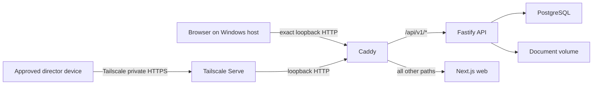

# Personal Server Deployment on Windows

Last reviewed: 2026-07-12

## Current status

The `personal-server` profile is the private, single-charity deployment mode for
CharityPilot. The committed code-contract slice has no known open implementation
defect after the checks recorded below, but it is **not yet a published or
100/100 certified release**. Overall release/live readiness remains 31/100.

At this review point:

- the Windows installer, compiled runtime, protected external state, encrypted
  recovery, guarded update/rollback/restore/decommission and replacement-host
  restore contracts exist;
- the personal-server contract suite passed 156/156 checks; production checks
  passed 830 with two intentional platform skips; lint, compiled builds,
  secret scanning and SAST passed;
- exact commit `c5175eef1ba9ad0c3c9e46371c26165701c4d6a3` has green canonical CI
  and managed E2E runs;
- on Windows Docker Desktop, that commit streamed a real PostgreSQL
  custom-format dump through `docker exec -i pg_restore` into a container with
  a read-only root filesystem and recovered the exact synthetic proof row;
- no `personal-v*` tag or GitHub Release has been published;
- the exact release-workflow Administration-read environment secret has not yet
  been configured;
- this Windows host has no ready personal-server installation or Tailscale
  installation. Its earlier supervised install is preserved, stopped and
  failed from `initialized-backup-pending` after publishing one encrypted
  recovery set; the exact-source rule therefore forbids adopting a later code
  repair or deleting its pointer/resources to force another install; and
- clean-release installation, Windows reboot, real Owner login, second-device
  Tailscale access, off-host recovery, guarded live restore and
  previous-release update/rollback still require final live evidence.

A clean canonical `master` clone is therefore a **supervised test route**, not a
released appliance. Do not store important charity records until every critical
gate in the [readiness scorecard](personal-server-readiness-scorecard.md) is
green.

## Purpose and supported boundary

This profile is for one charity whose directors need CharityPilot while the
application and its data remain on a trusted Windows computer. It is not a
public SaaS launch.

It provides:

- one charity workspace and one individually named account per person;
- compiled, production-optimised application processes rather than development
  watchers;
- exact loopback HTTP for use on the host, or optional private HTTPS through
  Tailscale Serve;
- PostgreSQL and uploaded documents in persistent Docker volumes;
- disabled public registration, billing, Stripe, Resend, Supabase and provider
  jobs; and
- guarded installation, backup, recovery, update and decommission operations.

It does not remove organisation scoping or the future public-production path.
That existing work remains available if CharityPilot is later moved to a Linux
VM or hosted commercially.

Supported access is limited to:

1. exact loopback HTTP, such as `http://localhost:8080`; or
2. this host's exact default-port `.ts.net` HTTPS origin through Tailscale
   Serve.

Tailscale Funnel, Cloudflare Tunnel, router forwarding, UPnP, public firewall
rules, wildcard Docker binds and other tunnels are unsupported.

## What web server is used

Windows does not need IIS or Windows Server. Docker Desktop uses WSL 2 to run
the Linux containers that make up CharityPilot:

| Layer | Responsibility |
| --- | --- |
| Windows | Host, disk encryption, power management, updates and operator login |
| Docker Desktop / WSL 2 | Runs the isolated Linux containers and persistent volumes |
| Caddy | Sole front-door web server and sole host-port publisher |
| Next.js Node server | Serves compiled CharityPilot pages and browser assets |
| Fastify Node server | Serves and authorises `/api/v1/*` requests |
| PostgreSQL | Stores accounts, organisations, sessions and governance records |
| Document volume | Stores uploaded document bytes |
| Tailscale, when selected | Private network membership and HTTPS in front of loopback Caddy |

Docker publishes Caddy's container listener only at the Windows host's exact
`127.0.0.1:<port>` bind. Caddy sends `/api/v1/*` to Fastify and everything else
to Next.js. Next.js, Fastify and PostgreSQL have no host port. Tailscale is an
optional private HTTPS access layer; it is not CharityPilot's web server.

Docker Desktop cannot publish a Windows host port from a container attached
only to an `internal: true` network. Caddy is therefore the sole dual-homed
container: it joins the internal application bridge at fixed
`172.30.250.10` and a dedicated non-internal edge bridge
`172.30.251.0/24`. Only Caddy joins the edge bridge and its port is still bound
explicitly to `127.0.0.1`; API, web and PostgreSQL remain internal-only. The
edge bridge is a Docker transport requirement, not public exposure.

Caddy does not trust incoming `X-Forwarded-*` values. Direct loopback and
Tailscale Serve share the edge gateway, so trusting that hop would allow a local
process to spoof a client address. Caddy replaces those values before proxying;
the exact configured origin, rather than forwarded scheme/host input, controls
personal-server cookies, redirects, CSP and server-side API requests.



The one-origin design keeps host-only cookies, CSRF/origin checks, redirects and
browser API calls aligned. Do not create a second hostname or weaken cookie,
CORS or proxy validation.

## Why this is faster than local development

The development Compose stack runs `next dev`, `tsx watch`, source bind mounts
and Windows-to-Linux file polling. Those features are useful while writing code
but can make page compilation and file watching slow.

The personal-server runtime uses compiled images without source mounts,
watchers, development compilation or polling. Routine `start` uses `--no-build`
and never migrates or seeds. The first build and a deliberate update can still
take time on a busy Windows/Docker host; normal page requests do not rebuild the
application.

## Host requirements and availability

Use:

- Windows 11 24H2 or later (kernel build 26100 or later), with current Windows
  updates applied;
- PowerShell 5.1 or later;
- WSL 2;
- local Windows Docker Desktop running Linux Engine 28 / API 1.48 or later and
  Docker Compose 2.33.1 or later (required for deterministic Caddy edge-bridge
  `gw_priority`); remote Docker contexts and `DOCKER_HOST` overrides are not
  supported;
- Node.js satisfying the root `package.json` engine;
- the exact npm version declared by `packageManager`;
- Git only for the supervised clean-clone route; and
- Tailscale only when private director access is required.

Enable BitLocker or equivalent full-disk encryption, automatic security
updates, endpoint protection and screen locking. Use a dedicated Windows
operator account. Configure Docker Desktop to start after that operator signs
in and prevent sleep while the computer is serving directors.

The preflight requires at least 20 GiB free on every Windows source/state volume
it can inspect. Docker Desktop's managed virtual disk needs additional free
space for images, PostgreSQL, documents and temporary builds.

For local-only use, the computer, Windows login, Docker Desktop and containers
must be running. For director access, Tailscale and the Internet connection must
also be working. This profile does not promise unattended boot before a Windows
user signs in; a small Linux host or VM is a better fit for that requirement.

## Trusted source routes

### Official release route for ordinary users

No personal-server release exists yet. When one is published, use only the
named assets on the canonical
[GitHub Releases page](https://github.com/jasperfordesq-ai/charity-governance/releases):

- `CharityPilot-personal-vX.Y.Z.zip`;
- `CharityPilot-personal-vX.Y.Z.zip.sha256`; and
- `CharityPilot-personal-vX.Y.Z.manifest.json`.

GitHub's repository-level **Code > Download ZIP** archive is not a release and
must never be installed.

Example after an actual release exists:

```powershell
$tag = 'personal-v1.0.0'
$base = "CharityPilot-$tag"
$downloadRoot = Join-Path $HOME "Downloads\$base"
$releaseRoot = "https://github.com/jasperfordesq-ai/charity-governance/releases/download/$tag"

New-Item -ItemType Directory -Path $downloadRoot -ErrorAction Stop | Out-Null
Invoke-WebRequest "$releaseRoot/$base.zip" `
  -OutFile (Join-Path $downloadRoot "$base.zip")
Invoke-WebRequest "$releaseRoot/$base.zip.sha256" `
  -OutFile (Join-Path $downloadRoot "$base.zip.sha256")
Invoke-WebRequest "$releaseRoot/$base.manifest.json" `
  -OutFile (Join-Path $downloadRoot "$base.manifest.json")

$archivePath = Join-Path $downloadRoot "$base.zip"
$checksumPath = Join-Path $downloadRoot "$base.zip.sha256"
$outerManifestPath = Join-Path $downloadRoot "$base.manifest.json"
$outer = Get-Content -LiteralPath $outerManifestPath -Raw | ConvertFrom-Json
$actualArchiveHash = (Get-FileHash -LiteralPath $archivePath -Algorithm SHA256).Hash.ToLowerInvariant()

if ($outer.format -cne 'charitypilot-personal-server-release/v1' -or
    $outer.profile -cne 'personal-server' -or
    $outer.tag -cne $tag -or
    $outer.archive.file -cne "$base.zip" -or
    $outer.archive.sha256 -cne $actualArchiveHash) {
    throw 'Release manifest does not match the downloaded CharityPilot archive.'
}

Expand-Archive -LiteralPath $archivePath -DestinationPath $downloadRoot
Set-Location (Join-Path $downloadRoot $base)

$sourceProof = @(
    '-ArchivePath', $archivePath,
    '-ChecksumPath', $checksumPath
)
```

Retain all three downloaded assets. The installer independently verifies the
ZIP hash, checksum filename, exact archive contents and inner
`personal-server-release.json` identity.

### Clean-clone route for supervised testing

Until a release is published, a fresh clean canonical clone may be used only
for supervised testing with disposable data:

```powershell
Set-Location $HOME
git clone https://github.com/jasperfordesq-ai/charity-governance.git CharityPilot
Set-Location .\CharityPilot
git status --short
$sourceProof = @()
```

`git status --short` must print nothing. The preflight requires canonical
`master`, the canonical credential-free `origin`, a real Git root, no tracked or
untracked changes, and local `HEAD` exactly equal to the already fetched
`origin/master`; it never fetches or mutates source for you. A fork, stale or
diverged checkout, feature branch, detached checkout or development worktree is
unsupported.

## Protected state outside the checkout

The default state root is:

```text
%LOCALAPPDATA%\CharityPilot\personal-server
```

It contains:

- `.env.personal-server`, the generated private configuration;
- `install-state.json`, the non-secret phased operation record;
- `recovery-key.hex`, the recovery encryption/authentication key;
- `pending-auth-recovery-rotation.json`, the ACL-protected count-only incident
  receipt while a rotation is active or retained as its latest completion;
- `pending-auth-recovery-secret.hex`, present only during the fail-closed secret
  replacement window, plus `auth-recovery-rotation-history\` redacted archives;
- `recovery\`, the default encrypted recovery-set root; and
- runtime-health reports.

The installer also creates a protected pointer at:

```text
%LOCALAPPDATA%\CharityPilot\personal-server-location.json
```

and sets the user-level `CHARITYPILOT_PERSONAL_SERVER_ENV_FILE` value. These let
supported commands find a custom `-StateRoot` from a later terminal.

The installer disables inherited ACLs and allows Full Control only to the
installing Windows operator SID and LOCAL SYSTEM on the state root, recovery
root, environment, key, install state, reports and pointer. It rejects reparse
points and fails if the exact ACL cannot be verified.

Do not move, rename, delete, email or commit these files as a troubleshooting
shortcut. Keep an encrypted offline copy of `recovery-key.hex` separately from
off-host recovery sets. Losing it makes those sets unrestorable; compromise
exposes every set protected by it.

## First installation

Perform setup while physically at the Windows host under the intended operator
account. Start Docker Desktop and wait for the Linux engine.

### Mandatory no-write preflight

From the extracted release or clean supervised clone:

```powershell
powershell -NoLogo -NoProfile -ExecutionPolicy Bypass `
  -File .\scripts\Install-CharityPilot.ps1 `
  -PreflightOnly @sourceProof
```

Preflight checks Windows, PowerShell, Node, exact npm, local Docker Desktop,
Engine API, Compose, WSL2, Linux containers, source identity, required files,
the loopback port, both reserved subnets, exact preserved-network identities,
free space, state-root safety, existing resources and—when HTTPS is
selected—Tailscale identity plus Serve/Funnel state. It creates nothing.

Preflight and every live lifecycle/runtime-certification command require the
local Windows Docker Desktop Linux named-pipe endpoint and Engine API 1.48 or
later, then pin every Docker child to that verified named pipe for the rest of
the operation. Remote contexts and daemon/API environment overrides fail closed.
Lifecycle commands also pin the Compose project name and remove ambient
`COMPOSE_*` controls, so a parent shell cannot enable maintenance or initializer
profiles during routine start.

### Preview and install locally

```powershell
$installArguments = @(
    '-OwnerEmail', 'owner@example.org',
    '-OwnerName', 'Owner Name',
    '-OrganisationName', 'Charity Name'
)

powershell -NoLogo -NoProfile -ExecutionPolicy Bypass `
  -File .\scripts\Install-CharityPilot.ps1 `
  -DryRun @installArguments @sourceProof

powershell -NoLogo -NoProfile -ExecutionPolicy Bypass `
  -File .\scripts\Install-CharityPilot.ps1 `
  @installArguments @sourceProof
```

Use `-StateRoot 'E:\CharityPilot\personal-server'` on an encrypted data drive
if the default is unsuitable. The selected directory must be absent or empty
and exclusive to this installation.

The installer:

1. verifies source/archive identity and performs the read-only preflight;
2. creates and ACL-protects state, recovery, pointer and recovery key;
3. generates distinct database, JWT, authentication-recovery and readiness
   secrets;
4. builds pinned compiled images sequentially;
5. migrates one empty database and transactionally creates one workspace and
   one verified Owner;
6. starts PostgreSQL, Fastify, Next.js and Caddy;
7. configures exact Tailscale Serve only when private HTTPS was selected;
8. creates an authenticated-encrypted database/document recovery set;
9. rehearses that set in disposable isolated resources;
10. writes a bounded runtime-health report;
11. verifies final ACLs; and
12. marks protected state `ready` only after all preceding gates pass.

The generated Owner password is printed once and never stored in the environment
or install state. Move it directly into the Owner password manager and clear
sensitive terminal scrollback.

### Private HTTPS installation

Install and sign in to Tailscale first, then derive this host's exact DNS name:

```powershell
$tailnetHost = ((tailscale status --json | ConvertFrom-Json).Self.DNSName).TrimEnd('.')
$origin = "https://$tailnetHost"

powershell -NoLogo -NoProfile -ExecutionPolicy Bypass `
  -File .\scripts\Install-CharityPilot.ps1 `
  -PreflightOnly @sourceProof -Origin $origin

powershell -NoLogo -NoProfile -ExecutionPolicy Bypass `
  -File .\scripts\Install-CharityPilot.ps1 `
  -DryRun @installArguments @sourceProof -Origin $origin

powershell -NoLogo -NoProfile -ExecutionPolicy Bypass `
  -File .\scripts\Install-CharityPilot.ps1 `
  @installArguments @sourceProof -Origin $origin

tailscale serve status
npm run personal:server:status
npm run personal:server:certify
```

The installer accepts an empty Serve configuration or the one exact existing
private proxy. It refuses unrelated, unreadable or Funnel configuration. When
Serve is empty, it creates the equivalent of:

```powershell
tailscale serve --bg --https=443 http://127.0.0.1:8080
```

If a later install step fails, it resets only a Serve proxy that it created.
Do not run `tailscale serve reset` as ordinary troubleshooting.

## Failed-install resume

After initialization begins, failure is preserved as protected phase `failed`;
writers are commanded to stop and volumes are never deleted. Fix the reported
host/configuration cause, then repeat the exact source, archive proof, state
root, origin and port with `-ResumeFailed`:

```powershell
powershell -NoLogo -NoProfile -ExecutionPolicy Bypass `
  -File .\scripts\Install-CharityPilot.ps1 `
  -ResumeFailed `
  -StateRoot $stateRoot `
  -Origin $origin `
  -Port $port `
  @sourceProof
```

Do not pass the Owner name or organisation again. Resume is source-bound and
accepts only an empty database or exactly one matching committed Owner
workspace. It never reruns the initializer over unrelated data.

### Supervised clean-Git repair exception

This exception exists only before an official release, when a supervised clean
Git installation fails from `initializing`, or from
`initialized-backup-pending` before any recovery directory was created, because
the installer/Compose source itself needs a committed repair. It requires zero
published and zero incomplete recovery directories. It is not a general update
route. A release ZIP, replacement-host restore, any other failed phase, or
install that already has a recovery directory must use its exact recorded
source.

Review and publish the repair to canonical `master`, then fast-forward the same
source checkout. Do not edit protected state or delete the preserved volumes:

```powershell
git status --short
git switch master
git pull --ff-only
$repairCommit = (git rev-parse HEAD).Trim()
if ($repairCommit -cne (git rev-parse origin/master).Trim()) {
  throw 'The repair checkout is not exact canonical origin/master.'
}

powershell -NoLogo -NoProfile -ExecutionPolicy Bypass `
  -File .\scripts\Install-CharityPilot.ps1 `
  -PreflightOnly `
  -ResumeFailed `
  -RepairToGitRevision $repairCommit `
  -StateRoot $stateRoot `
  -Origin $origin `
  -Port $port

powershell -NoLogo -NoProfile -ExecutionPolicy Bypass `
  -File .\scripts\Install-CharityPilot.ps1 `
  -ResumeFailed `
  -RepairToGitRevision $repairCommit `
  -StateRoot $stateRoot `
  -Origin $origin `
  -Port $port
```

The installer independently requires the same source directory, a clean
credential-free canonical remote, `master`, `HEAD == origin/master`, an exact
lowercase target SHA, and proof that the failed SHA is an ancestor of the
target. It records a bounded protected source-advance receipt before rebuilding.
Omitting or mistyping the target fails before Docker work. The installer never
fetches or selects the repair commit for you.

For a failed replacement-host restore, repeat the exact replacement command,
including `-RestoreRecoverySet`, `-RecoveryKeyFile`, `-SourceOrigin`, `-Origin`,
`-Confirm`, source proof and `-StateRoot`, and add `-ResumeFailed`.

## Installer parameter reference

| Parameter | Contract |
| --- | --- |
| `-PreflightOnly` | Complete read-only gate. Replacement restore also prints its required confirmation. |
| `-DryRun` | Plans the selected install/restore after preflight without creating state or Docker resources. |
| `-OwnerEmail`, `-OwnerName`, `-OrganisationName` | Required for a fresh install; email must be trimmed canonical lowercase. |
| `-Origin` | Exact loopback HTTP or this host's exact `.ts.net` HTTPS origin, without a path/trailing slash. |
| `-Port` | Caddy loopback port, default `8080`. |
| `-StateRoot` | Absolute absent-or-empty protected directory outside the checkout. |
| `-ResumeFailed` | Resume the exact protected failed install/restore binding. |
| `-RepairToGitRevision` | Explicit target SHA for the narrowly bounded supervised clean-Git repair from `initializing`, or `initialized-backup-pending` with zero recovery directories; valid only with `-ResumeFailed`. Never valid for a release or replacement restore. |
| `-ArchivePath`, `-ChecksumPath` | Retained official release ZIP and checksum sidecar. |
| `-ExpectedArchiveSha256` | Exact canonical SHA-256 alternative/addition to the checksum sidecar. |
| `-RestoreRecoverySet` | One verified encrypted recovery-set directory for an empty replacement host. |
| `-RecoveryKeyFile` | Separate recovery key able to authenticate/decrypt the selected set. |
| `-SourceOrigin` | Exact origin recorded by the selected recovery set. |
| `-Confirm` | Exact replacement confirmation printed by `-PreflightOnly`. |
| `-OwnerEmail`, `-OwnerPasswordFile` during restore | Optional additional real-Owner login/download proof; password remains in the protected file, never argv. |

## Daily operator lifecycle

Open a terminal in the active installed source directory. The protected pointer
and environment locator find external state automatically.

### Start and status

```powershell
npm run personal:server:start
npm run personal:server:status
```

`start` reuses compiled images and persistent volumes. It first starts only
PostgreSQL and runs the compiled migration image's read-only `prisma migrate
status` comparison. Missing, failed, unknown or otherwise divergent migration
history stops startup before Fastify, Next.js or Caddy starts. This check never
deploys or resolves a migration; routine start never builds, migrates, seeds or
initializes. `status` reports only allowlisted health, the configured origin and
the newest completed recovery set in the installed default recovery root.

For private HTTPS also run:

```powershell
tailscale status
tailscale serve status
```

Use the supported lifecycle diagnostics; they pin the verified local Docker
Desktop endpoint, exact Compose project and protected environment:

```powershell
npm run personal:server:status
npm run personal:server:certify -- --local-only
```

Do not substitute a raw `docker compose ps` command. Ambient Docker or Compose
controls can otherwise inspect a different daemon, file or project and produce
misleading evidence.

### Runtime-health attestation

```powershell
npm run personal:server:certify -- --local-only  # loopback HTTP only
npm run personal:server:certify                 # Tailscale private HTTPS
```

This is a bounded runtime-health attestation, not complete readiness
certification. It does not prove release provenance, reboot, off-host recovery,
second-device access, update/rollback or the full 100/100 scorecard.

### Stop

```powershell
npm run personal:server:stop
```

Stop preserves both named data volumes. Never append `-v`, run Compose volume
deletion or use Docker Desktop factory reset as troubleshooting.

## Accounts and password recovery

Every person must use an individual CharityPilot account and, for remote use,
an individual authorised Tailscale identity. There must be exactly one active
Owner. Use Admin only for people trusted to edit governance records; use Member
for lower-privilege access.

Team invitations are short-lived, single-use bearer links shown once for manual
delivery. Send them through a trusted separate channel.

Preferred password recovery:

```powershell
npm run personal:server:reset-link -- --email=director@example.org
```

The successful command prints one one-hour bearer URL only after the database
transaction succeeds. It stores only a hash and puts the plaintext token in the
URL fragment so it is not sent in HTTP requests or Caddy access logs. Up to
three unexpired operator-issued links can coexist, so issuing a replacement does
not silently invalidate a link already delivered. Verify the person's identity
outside CharityPilot before generating or sending any link.

When a link is consumed, CharityPilot terminates every outstanding link for that
account, revokes its existing sessions and appends the same immutable
password-reset event used by the public profile.

The private profile has no email provider, so it cannot deliver the public
registered-address completion notice. After a reset, the host operator must
notify the already-verified requester through a separate trusted channel and
the Owner must review the `PASSWORD_RESET_COMPLETED` entry in **Team &
Permissions**. That documented manual notice is a private-profile exception; it
is not evidence for the public-production email gate.

Prefer the reset link. If a director cannot use that flow, the emergency
fallback replaces the password for exactly one active account:

```powershell
npm run personal:server:reset-password -- --email=director@example.org
```

The personal database must already be running. On success the transaction
replaces the password hash, terminates every outstanding recovery link, retires
any legacy reset slot, revokes all of that user's current sessions, and appends
the same immutable operator-attributed reset evidence before printing the
generated replacement password once. It does not email the password and it does
not force a change at the next login. Transfer it through a trusted separate
channel, ask the user to store or replace it promptly, clear sensitive terminal
scrollback, and never paste it into chat, source control or the env file.

Offboarding requires both application and private-network action: suspend or
remove membership, revoke sessions, revoke Tailscale access/share, record the
authorisation and prove the old access no longer works.

## Encrypted backup policy

PostgreSQL metadata and document bytes are one recovery unit. Use:

```powershell
npm run personal:server:backup
```

An installed backup:

- identifies running services and quiesces application writers;
- creates a PostgreSQL custom-format dump;
- proves dump restore and database content identity;
- archives the complete document volume and validates safe paths/links;
- reconciles document database records with exact stored bytes;
- captures source/release and application-image identities;
- encrypts database and document artifacts with AES-256-GCM;
- authenticates `manifest.json` with HMAC-SHA-256;
- verifies the completed set before atomically publishing it; and
- restores the services that were running unless the parent operation requires
  writers to stay stopped.

If the installed `recovery-key.hex` is missing, backup fails closed rather than
creating plaintext. An incomplete set is not a backup.

Adopt a retention schedule appropriate to the charity. A starting point is
seven daily, four weekly and twelve monthly sets. Keep multiple generations,
copy verified sets off the Windows host to encrypted storage, keep the key
separately and alert on scheduled-backup failure. Synchronisation alone is not
a historical backup.

## Restore rehearsal

Select a completed recovery-set directory, then run:

```powershell
npm run personal:server:rehearse-restore -- `
  "--recovery-set=$recoverySet"
```

The command authenticates/decrypts the set and uses isolated disposable
PostgreSQL, document, network, migration, Fastify, Next.js and Caddy resources.
It proves raw database identity, current-schema migration, routing and exact
database-to-document reconciliation, then removes only its disposable targets.

The disposable PostgreSQL target keeps its root filesystem read-only. The
verified custom-format dump is opened on the host as one non-empty regular file
and streamed through the child process's standard input to
`docker exec -i ... pg_restore`; it is never copied into the container. The
operation pins Docker to the preflight-verified local Desktop Linux named pipe,
closes the descriptor after success or failure and fails closed on an empty
input or non-zero restore exit.

For an additional real-Owner login and sampled document-download proof, supply
a separately ACL-protected one-line password file:

```powershell
npm run personal:server:rehearse-restore -- `
  "--recovery-set=$recoverySet" `
  "--owner-password-file=$ownerPasswordFile"
```

Never place the password in argv or a broadly readable temporary file. Remove
the proof file after the rehearsal.

## Guarded restore on the current host

For the common same-origin case, derive the confirmation from the authenticated
manifest:

```powershell
$manifest = Get-Content (Join-Path $recoverySet 'manifest.json') -Raw |
  ConvertFrom-Json
$confirmation = "RESTORE-CHARITYPILOT-PERSONAL-SERVER:$($manifest.recoverySetId)"

npm run personal:server:restore -- `
  "--recovery-set=$recoverySet" `
  "--confirm=$confirmation" `
  --dry-run

npm run personal:server:restore -- `
  "--recovery-set=$recoverySet" `
  "--confirm=$confirmation"
```

Restore requires protected phase `ready`. It verifies and rehearses the selected
set, creates and verifies a separate encrypted preservation set, records phase
`restoring`, stops writers, restores the selected database, proves its raw
fingerprint before migration, restores matching document bytes, starts the
runtime and reconciles application records.

If automatic recovery cannot prove success, writers remain stopped and
ordinary commands stay blocked. Preserve the output and both recovery sets.

When the selected set records an old origin, add
`--source-origin=<old-origin>`. To obtain its separately bound confirmation
without mutation, first run the same command with `--dry-run` and omit
`--confirm`; it prints the exact required value and performs no executor or
destructive action. Review it, then rerun dry-run and real restore with that
exact confirmation.

## Replacement-host recovery

Use this when the original Windows host is lost or intentionally retired. It
requires:

- an empty supported replacement Windows host;
- the exact compatible official release bundle or exact supervised clean Git
  source recorded in the recovery set;
- one complete encrypted recovery-set directory;
- its separately held recovery key;
- the source origin recorded by that set; and
- an absent/empty new state root, absent pointer and no personal-server Docker
  resources.

Do not run fresh initialization first. The installer never creates a new empty
Owner workspace during replacement recovery.

From the exact compatible extracted source:

```powershell
$replacementArguments = @(
    '-RestoreRecoverySet', $recoverySet,
    '-RecoveryKeyFile', $separateRecoveryKey,
    '-SourceOrigin', $oldOrigin,
    '-Origin', $newOrigin,
    '-StateRoot', $newStateRoot
)

powershell -NoLogo -NoProfile -ExecutionPolicy Bypass `
  -File .\scripts\Install-CharityPilot.ps1 `
  -PreflightOnly @replacementArguments @sourceProof
```

Preflight authenticates the manifest/key, binds the exact source/tag and both
origins, proves the target is empty and prints:

```text
Required confirmation: RESTORE-CHARITYPILOT-PERSONAL-SERVER:...
```

Copy the complete printed value into `$confirmation`, then preview and restore:

```powershell
powershell -NoLogo -NoProfile -ExecutionPolicy Bypass `
  -File .\scripts\Install-CharityPilot.ps1 `
  -DryRun -Confirm $confirmation `
  @replacementArguments @sourceProof

powershell -NoLogo -NoProfile -ExecutionPolicy Bypass `
  -File .\scripts\Install-CharityPilot.ps1 `
  -Confirm $confirmation `
  @replacementArguments @sourceProof
```

The installer copies and protects the recovery key and generates fresh database,
JWT, authentication-recovery and readiness secrets. In both the disposable
full-stack rehearsal and the real blank target it restores and migrates first,
then runs the internal replacement-host-only authentication-recovery rebind
before any API starts. That one serializable transaction retires the restored
active fingerprint when present, invalidates old reset capabilities and keyed
evidence, preserves completion notices, and binds the fresh host secret with
zero postconditions. A count-only dry-run, exact recovery-set/manifest/database
binding and exact execute confirmation fence the transaction; neither secret or
fingerprint is emitted.

The installer then creates the exact production volumes/networks, reconciles
documents, revokes every restored session, starts and reconciles the runtime,
creates a new encrypted backup, rehearses it, certifies runtime health, verifies
ACLs and marks state `ready`. Existing account passwords are not reset; everyone
must sign in again because all restored sessions are revoked. Old reset links
and legacy reset slots are deliberately unusable on the replacement host.

Optionally add `-OwnerEmail` and `-OwnerPasswordFile` for an additional real
Owner acceptance proof. The password must be in a separately protected file,
never the command line.

A decommissioned state root is terminal. Replacement recovery must use a
different empty state root and protected location profile.

## Version-bound update and resume

Updates use a newly extracted official release and the Windows updater. Do not
invoke raw `personal:server:update`; the PowerShell wrapper creates and protects
its exact receipt.

### Password-recovery prerequisite for an older protected installation

Installations created by the current Windows installer already have a distinct
`AUTH_RECOVERY_SECRET`. Some protected installations were
created before the password-recovery integrity upgrade. They may not have that
field in their external environment; add it **before** invoking the updater.
Otherwise the upgraded validator fails closed before backup or migration. If it
already exists, leave it unchanged: do not rotate it as an ordinary update step.

`AUTH_RECOVERY_SECRET` is the authentication-recovery derivation root. It is
not `recovery-key.hex`, and changing it does not re-encrypt recovery sets. From
the newly extracted verified source, the following block adds one independent
48-byte canonical lowercase-hex value to the protected external environment,
then reapplies/verifies its Windows ACL without printing the value:

```powershell
$path = $env:CHARITYPILOT_PERSONAL_SERVER_ENV_FILE
if ([string]::IsNullOrWhiteSpace($path) -or
    -not (Test-Path -LiteralPath $path -PathType Leaf)) {
  throw 'The protected personal-server environment locator is missing; stop rather than guessing its path.'
}

$path = (Resolve-Path -LiteralPath $path).Path
$lines = [IO.File]::ReadAllLines($path)
if ($lines -match '^AUTH_RECOVERY_SECRET=') {
  Write-Host 'AUTH_RECOVERY_SECRET is already configured; leaving it unchanged.'
} else {
  $bytes = New-Object byte[] 48
  $rng = [Security.Cryptography.RandomNumberGenerator]::Create()
  try { $rng.GetBytes($bytes) } finally { $rng.Dispose() }
  $secret = -join ($bytes | ForEach-Object { $_.ToString('x2') })
  $existingSecrets = $lines |
    Where-Object { $_ -match '^(JWT_SECRET|READINESS_API_KEY)=' } |
    ForEach-Object { ($_ -split '=', 2)[1] }
  if ($existingSecrets -contains $secret) {
    throw 'Generated recovery secret was not independent; rerun the block.'
  }

  $updated = [Collections.Generic.List[string]]::new()
  $inserted = $false
  foreach ($line in $lines) {
    $updated.Add($line)
    if (-not $inserted -and $line -match '^JWT_SECRET=') {
      $updated.Add("AUTH_RECOVERY_SECRET=$secret")
      $inserted = $true
    }
  }
  if (-not $inserted) {
    throw 'JWT_SECRET was not found; stop and inspect the protected environment.'
  }

  [IO.File]::WriteAllLines(
    $path,
    $updated,
    [Text.UTF8Encoding]::new($false)
  )
  & .\scripts\personal-server-windows-acl.ps1 -Path $path -Kind File
  Remove-Variable secret, bytes
  Write-Host 'Added and ACL-verified an independent AUTH_RECOVERY_SECRET.'
}
```

Do not print the generated value, paste it into chat, or include the protected
environment or secret value in update evidence.
Record only that the prerequisite was completed. This compatibility step does
not initialize, migrate, seed or modify a database or document volume.

### Security-incident rotation of `AUTH_RECOVERY_SECRET`

If incident response requires rotation, never edit the protected environment
and never use raw Docker Compose. Delivered operator links and legacy reset
slots remain capabilities even though provider email delivery is disabled in
this profile. Use the supported receipt-backed lifecycle command from the exact
installed source directory.

The first call is count-only. It briefly quiesces Caddy, Next.js and Fastify,
inspects the exact database under the operation lock, restores the previous
service availability and writes a protected 30-minute review receipt. Use a
named human, an approved case reference, and exactly
`PLANNED_KEY_ROTATION` or `SUSPECTED_KEY_COMPROMISE`:

```powershell
npm run personal:server:rotate-auth-recovery-secret -- `
  --reason=SUSPECTED_KEY_COMPROMISE `
  "--operator=Named Charity Director" `
  --case-reference=INC-2026-0042
```

No secret, raw operator name or raw case reference is written to the receipt.
Review the count-only summary and the exact comprehensive confirmation printed
by the command. Put that exact value in a PowerShell variable and begin the
same confirmed call before the review expires. Its protected authority-at-start
checkpoint permits a long verified backup to finish after that time; it does
not permit a confirmation first submitted after expiry:

```powershell
$confirmation = 'PASTE THE COMPLETE EXACT CONFIRMATION HERE'

npm run personal:server:rotate-auth-recovery-secret -- `
  --reason SUSPECTED_KEY_COMPROMISE `
  --operator "Named Charity Director" `
  --case-reference "INC-2026-0042" `
  "--confirm=$confirmation"
```

The confirmed command creates and verifies an authenticated-encrypted
credential-bearing recovery set before mutation, repeats the count-only review
under quiescence, and refuses drift. It then terminates every non-suppressed
recovery capability as `KEY_ROTATED`, clears both halves of every legacy `User`
reset slot, deletes keyed rate buckets, one-way redacts retained keyed request
evidence, preserves completion notices and advances the database generation.
It creates a fresh independent secret in protected state, atomically changes
exactly one environment line, applies and verifies the Windows ACL, activates
the replacement only against zero postconditions, starts the runtime, verifies
container health, creates a second authenticated-encrypted recovery set under
the new secret state, and proves that new set with an isolated full-application
restore rehearsal before it marks the rotation complete. It archives only
redacted evidence. Neither secret is placed in an argument, receipt, log or
command output.

If power loss or a child failure interrupts the operation, application writers
remain stopped and installation phase is `auth-recovery-rotating`. Rerun the
same supported command with the same named operator, case reference and exact
confirmation. Its read-only control-status reconciliation distinguishes an
uncommitted invalidation, a blocked database and an activated replacement. Do
not start services manually, edit the environment, generate another key or
restore the pre-invalidation backup into service. That backup contains live
pre-rotation capabilities and remains incident evidence only; it is not an
ordinary recovery source. The completion message names the separately verified
post-rotation recovery-set identity that passed the isolated rehearsal. The
protected post-activation intent also binds the exact recovery and rehearsal
identities, so a retry adopts or removes only their matching incomplete files,
temporary plaintext staging and labelled disposable Docker resources.

Verify login, issue and consume one new manual reset link, and retain the named
operator, reason, protected backup reference, case reference, redacted command
outputs, database/profile/generation binding, restart evidence, and the named
post-rotation recovery-set and rehearsal evidence. Never record tokens,
addresses, request IDs or either secret value.

From the new release directory:

```powershell
$updateProof = @(
    '-ArchivePath', $archivePath,
    '-ChecksumPath', $checksumPath
)

powershell -NoLogo -NoProfile -ExecutionPolicy Bypass `
  -File .\scripts\Update-CharityPilot.ps1 `
  -PreflightOnly @updateProof

powershell -NoLogo -NoProfile -ExecutionPolicy Bypass `
  -File .\scripts\Update-CharityPilot.ps1 `
  @updateProof
```

The target must be newer and extracted to a different real, non-reparse
directory. Keep the old source directory. The updater verifies the target ZIP,
checksum, inner release identity, installed state, current/target binding,
Node/npm/Docker and prior rollback source. It creates protected
`pending-update.json`, builds the target images, creates and verifies a
pre-update encrypted set, migrates once, starts the exact target, verifies
health and archives the completed receipt.

For the one-time move from a supervised clean-Git installation to the first
official release, the updater also requires the original source to remain clean
on canonical `master`, at its recorded revision and remote, and proves that
revision is the target release commit or its strict ancestor. It refuses a
changed, unrelated, forked or dirty local source.

If a pending receipt exists, preserve it. Resume only when the failure output
and recorded phase are `prepared` or `pre-cutover`, using the exact same target
source, ZIP, checksum and state root:

```powershell
powershell -NoLogo -NoProfile -ExecutionPolicy Bypass `
  -File .\scripts\Update-CharityPilot.ps1 `
  -ResumePending @updateProof
```

Ambiguous or later cutover phases fail closed. Do not delete the receipt or run
migrations manually.

## Guarded rollback

Rollback requires the prior source directory, retained exact image IDs and the
authenticated pre-update recovery set recorded by the completed update.

From the active release source, ask the fail-closed command to show the required
confirmation without mutation:

```powershell
npm run personal:server:rollback -- --dry-run
```

The no-confirmation dry run prints the exact
`ROLLBACK-CHARITYPILOT-PERSONAL-SERVER:...` value. Review the current/previous
release identities, copy that value, then run:

```powershell
npm run personal:server:rollback -- `
  "--confirm=$rollbackConfirmation" `
  --dry-run

npm run personal:server:rollback -- `
  "--confirm=$rollbackConfirmation"
```

Rollback first preserves the current state, rehearses the prior release and
recovery set, records the transition, stops writers and restores both the prior
application identity and matched data. Automatic failure recovery restores the
current state only after runtime recovery succeeds.

## Guarded decommission

Decommission is destructive and terminal for the selected state root. It is not
ordinary stop or troubleshooting.

First create a fresh verified recovery set, no more than 24 hours old:

```powershell
npm run personal:server:backup
```

Then derive its confirmation:

```powershell
$manifest = Get-Content (Join-Path $recoverySet 'manifest.json') -Raw |
  ConvertFrom-Json
$confirmation = "DECOMMISSION-CHARITYPILOT-PERSONAL-SERVER:$($manifest.recoverySetId)"

npm run personal:server:decommission -- `
  "--recovery-set=$recoverySet" `
  "--confirm=$confirmation" `
  --dry-run

npm run personal:server:decommission -- `
  "--recovery-set=$recoverySet" `
  "--confirm=$confirmation"
```

The supplied set authorises the operation. The command then creates a separate
final quiesced encrypted recovery set, verifies and full-stack rehearses it,
records `decommissioning`, closes exact Tailscale Serve, removes only the exact
Compose containers, internal/edge networks and two data volumes, proves they are
absent and records `decommissioned`.

Source, `.env.personal-server`, recovery key, install state and all recovery
sets are preserved. If interrupted after the final set is recorded, resume only
with the exact final set path and confirmation shown in protected state/output,
not the original authorisation set.

Ordinary commands cannot recreate empty volumes from a decommissioned state.
To recover elsewhere, use the replacement-host installer with a different empty
state root.

## Security and data handling

Minimum controls are:

- full-disk encryption and a dedicated protected Windows account;
- current Windows, browser, Docker and Tailscale security updates;
- individual CharityPilot and Tailscale identities;
- least-privilege Tailscale policy limited to this HTTPS service;
- no router forwarding, Funnel, Cloudflare Tunnel or public Docker bind;
- protected state and separate recovery-key custody;
- encrypted, historical off-host recovery sets;
- periodic restore rehearsal and post-reboot proof;
- prompt account/session/device offboarding; and
- protected physical access and monitored disk/backup health.

Never publish `.env` files, state records, pointer files, recovery keys, private
hostnames, raw container environments, database dumps, document archives,
passwords, reset/invitation links or charity records in issues or chats.

## Troubleshooting boundaries

Start with:

```powershell
npm run personal:server:status
npm run personal:server -- help
```

- If the private URL fails, check Windows power/login, Docker health, Tailscale
  identity/policy, exact Serve target and exact configured hostname. Never open
  a router port.
- If login loops or unsafe requests return 403, check the exact origin, host
  clock and stale cookies. Never disable secure cookies, CSRF/origin or CORS.
- If it is slow, prove the running stack is `compose.personal-server.yml`, not
  the development stack, and inspect host/Docker CPU, memory and disk.
- The installer waits up to 30 seconds for Docker Desktop's Windows loopback
  forwarding socket after internal container health, using only an
  unauthenticated `/login` readiness request before its one-shot credential
  proof. If that bounded wait still fails, preserve the stopped failed state
  and use the documented installer resume; do not start Compose manually.
- If an update fails, preserve `pending-update.json`, both sources, recovery
  sets and exact output. Do not rerun initialization or migrations.
- If state is `restoring`, keep writers stopped and preserve both selected and
  preservation sets for supervised recovery.
- If state is `decommissioning`, retry only with the exact recorded final set.
- If disk is low, identify build cache, unused non-personal images and logs.
  Never delete the personal database/document volumes or unknown Docker
  resources. No general destructive cleanup command is part of this profile.

Follow [SUPPORT.md](../SUPPORT.md) for sanitized support requests and
[SECURITY.md](../SECURITY.md) for sensitive incidents.

## Separation from public production

Passing this private profile proves only that the single-charity Windows mode
works for its stated purpose. It does not prove public SaaS launch readiness,
high availability, provider readiness, penetration testing, legal accuracy,
professional governance advice or completion of the public-production
remediation ledger.

## Operational acceptance checklist

Before storing important records, record evidence that:

- [ ] the exact source/release identity and ZIP checksum/manifest are retained;
- [ ] the Windows host is supported, encrypted, updated and protected;
- [ ] the installer completed from the supported entry point and state is
      `ready`;
- [ ] the Owner signed in and stored the one-time password safely;
- [ ] only Caddy publishes one exact loopback port;
- [ ] only Caddy joins the non-internal edge bridge; API, web and PostgreSQL
      remain on the internal bridge only;
- [ ] no source mount, watcher, public bind, router forward, Funnel or
      Cloudflare Tunnel exists;
- [ ] the configured origin, cookie and proxy chain are exact;
- [ ] Tailscale Serve and second-device invitation/login/offboarding work when
      director access is required;
- [ ] database and documents are together in an authenticated-encrypted set;
- [ ] the recovery key is separately protected and an off-host set exists;
- [ ] disposable full-stack restore rehearsal and sampled login/download proof
      passed;
- [ ] guarded restore passed without losing the preservation set;
- [ ] supported authentication-recovery rotation survived an interrupted
      activation and post-activation backup boundary, rejected old links,
      issued and consumed a new link, and retained the redacted receipt plus
      rehearsed post-rotation recovery-set evidence;
- [ ] start, health and Owner login passed after a real Windows reboot;
- [ ] a previous-release update and guarded rollback passed;
- [ ] decommission and replacement-host recovery were tested with disposable
      identities/data;
- [ ] exact-SHA CI, E2E, Windows installer, ACL and release workflow evidence is
      green; and
- [ ] the board understands availability limits and the separation from public
      production approval.
